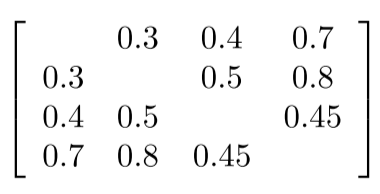
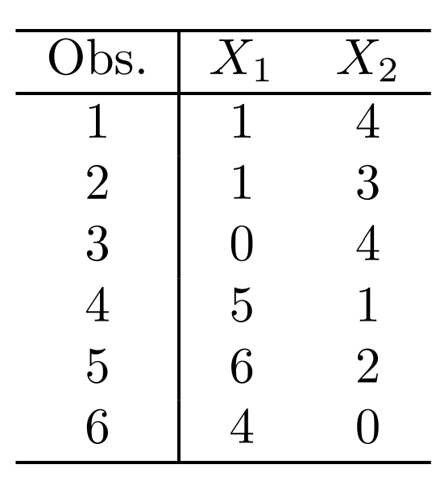

```{r setup, message=FALSE, warning=FALSE}
library(tidyverse)
library(here)
```

## Conceptual

(1) This problem involves the K-means clustering algorithm.

(a) Prove 10.2

Solution found in: https://rpubs.com/evertonjlima/245990
Below is my transcription with some comments (I'm not fully convinced of the correctness of all the steps)


(b) On the basis of this identity, argue that the K-means clustering algorithm (Algorithm 10.1) decreases the objective (10.11) at each iteration.

A: In the first step of each iteration (moving the centroid of each cluster to the vector of the feature means) we're actually minimizing the sum of deviations to the center in each cluster. Then, by relocating the observations to the nearest center, the sum of the deviations can only decrease.

(2) Suppose that we have four observations, for which we compute a dissimilarity matrix, given by:

 

For instance, the dissimilarity between the first and second observations is 0.3, and the dissimilarity between the second and fourth observations is 0.8.

(a) On the basis of this dissimilarity matrix, sketch the dendrogram that results from hierarchically clustering these four observations using complete linkage. Be sure to indicate on the plot the height at which each fusion occurs, as well as the observations corresponding to each leaf in the dendrogram.


(b) Repeat (a), this time using single linkage clustering.

 

(c) Suppose that we cut the dendogram obtained in (a) such that two clusters result. Which observations are in each cluster?

1 and 2 in one cluster and 3 and 4 in the other.

(d) Suppose that we cut the dendogram obtained in (b) such that two clusters result. Which observations are in each cluster?

1, 2 and 3 in one cluster and 4 in the other.

(e) It is mentioned in the chapter that at each fusion in the dendrogram, the position of the two clusters being fused can be swapped without changing the meaning of the dendrogram. Draw a dendrogram that is equivalent to the dendrogram in (a), for which two or more of the leaves are repositioned, but for which the meaning of the dendrogram is the same.


(3) In this problem, you will perform K-means clustering manually, with K = 2, on a small example with n = 6 observations and p=2 features. The observations are as follows.



(a) Plot the observations.
```{r}
df_kmeans <- 
  tibble(
    x1 = c(1, 1, 0, 5, 6, 4),
    x2 = c(4, 3, 4, 1, 2, 0)
  )

qplot(x1, x2, data = df_kmeans)
```

(b) Randomly assign a cluster label to each observation. You can use the `sample()` command in R to do this. Report the cluster labels for each observation.

```{r}
set.seed(1989)

(
  df_kmeans <- df_kmeans %>%
   mutate(cluster = sample(c(1, 2), 6, replace = TRUE))
 )
```

(c) Compute the centroid for each cluster

```{r}
(df_centroids <-
   df_kmeans %>%
   group_by(cluster) %>%
   summarise_all(mean))
```

(d) Assign each observation to the centroid to which it is closest, in terms of Euclidean distance. Report the cluster labels for each observation.

```{r}
# Create a function to get the closest centroid
assign_cluster <- function(x1_input, x2_input) {
  cluster_assigned <-
    df_centroids %>%
    # Get distances to each cluster
    mutate(distance = sqrt((x1_input - x1) ^ 2 + (x2_input - x2) ^ 2)) %>%
    # Pick the cluster with lowest distance
    filter(distance == min(distance)) %>%
    pull(cluster)
}

(
df_kmeans <- df_kmeans %>% 
  mutate(new_cluster = map2_dbl(x1, x2, assign_cluster)) %>% 
  rename(old_cluster = cluster)
)
```

(e) Repeat (c) and (d) until the answers obtained stop changing.
```{r}
assign_cluster_iter <- function(x1_input, x2_input) {
  cluster_assigned <-
    df_centroids %>%
    # Get distances to each cluster
    mutate(distance = sqrt((x1_input - x1) ^ 2 + (x2_input - x2) ^ 2)) %>%
    # Pick the cluster with lowest distance
    filter(distance == min(distance)) %>%
    pull(new_cluster)
}

while (TRUE)
{
  df_centroids <-
   df_kmeans %>%
  select(-old_cluster) %>% 
   group_by(new_cluster) %>%
   summarise_all(mean)
  
  df_kmeans <- 
    df_kmeans %>% 
    mutate(old_cluster = new_cluster,
           new_cluster = map2_dbl(x1, x2, assign_cluster_iter))
  
  if(all(df_kmeans$old_cluster == df_kmeans$new_cluster)) {
    break
  }
  
}

df_kmeans
```

(f) In your plot from (a), color the observations according to the cluster labels obtained.

```{r}
qplot(x1, x2, color = factor(new_cluster), data = df_kmeans) +
  labs(color = "cluster")
```

(4) Suppose that for a particular data set, we perform hierarchical clustering using single linkage and using complete linkage. We obtain two dendrograms.

(a) At a certain point on the single linkage dendrogram, the clusters {1, 2, 3} and {4, 5} fuse. On the complete linkage dendrogram, the clusters {1, 2, 3} and {4, 5} also fuse at a certain point. Which fusion will occur higher on the tree, or will they fuse at the same height, or is there not enough information to tell?

A: Since complete linkage uses the highest intra-cluster distance/dissimilarity and single linkage uses the lowest, in most of the cases the fusion with complete linkage will occur higher on the tree. In some special cases (when the inter-cluster distances are all the same) the fusion will occur at the same height for both linkage methods.

(b) At a certain point on the single linkage dendrogram, the clusters {5} and {6} fuse. On the complete linkage dendrogram, the clusters {5} and {6} also fuse at a certain point. Which fusion will occur higher on the tree, or will they fuse at the same height, or is there not enough information to tell?

A: If both clusters have only one observation, then the linkage method is irrelevant, and both will fuse at the same point.

(5) In words, describe the results that you would expect if you performed K-means clustering of the eight shoppers in Figure 10.14, on the basis of their sock and computer purchases, with K=2. Give three answers, one for each of the variable scalings displayed. Explain.

A:
In 1) a cluster of consumers who bought a lot of socks and another with the ones who bought fewer socks.

In 2) probably the clusters would split based on the number of computers purchased.

In 3) there would be a cluster of consumers who bought 1 computer and another for the customers who didn't buy any computers.

(6) A researcher collects expression measurements for 1,000 genes in 100 tissue samples. The data can be written as a 1, 000 × 100 matrix, which we call X, in which each row represents a gene and each column a tissue sample. Each tissue sample was processed on a different day, and the columns of X are ordered so that the samples that were processed earliest are on the left, and the samples that were processed later are on the right. The tissue samples belong to two groups: control (C) and treatment (T). The C and T samples were processed in a random order across the days. The researcher wishes to determine whether each gene’s expression measurements differ between the treatment and control groups.

(a) Explain what it means that the first principal component “explains 10% of the variation”.

A: The summatory of the squares of the scorings of that component represents a 10% of the total variance of the dataset, which is defined by the summatory of the average squares of the observations in each predictor/column.

(b)


Skipped. Solution found here https://blog.princehonest.com/stat-learning/ch10/6.html says that the researcher should include a new feature in the original datasets that represents the machine in which the sample was processed, and then perform PCA using the aditional column.

(c) Design and run a small simulation experiment to demonstrate the superiority of your idea.

(Answer copied from the same link: https://blog.princehonest.com/stat-learning/ch10/6.html)
```{r}
set.seed(1989)

Control = matrix(rnorm(50*1000), ncol=50)

Treatment = matrix(rnorm(50*1000), ncol=50)

X = cbind(Control, Treatment)

# linear trend in one dimension
X[1,] = seq(-18, 18 - .36, .36) 

pr_out <- prcomp(scale(X))
summary(pr_out)$importance[,1]
```

The proportion of variance explained is aprox. 10%. Now let's try appending a row which represents the machine used: 

```{r}
X = rbind(X, c(rep(10, 50), rep(0, 50)))
pr_out2 = prcomp(scale(X))
summary(pr_out2)$importance[,1]
```

The proportion of variance explained increses to 13.6% percent.

## Applied

In the chapter, we mentioned the use of correlation-based distance and Euclidean distance as dissimilarity measures for hierarchical clustering. It turns out that these two measures are almost equivalent: if each observation has been centered to have mean zero and standard deviation one, and if we let $r_{ij}$ denote the correlation between the $i$th and $j$th observations, then the quantity $1−r_{ij}$ is proportional to the squared Euclidean distance between the ith and jth observations.

On the `USArrests` data, show that this proportionality holds.
```{r}
us_arrests <- USArrests %>% as_tibble() 
us_arrests
```

First: center and scale the variables

```{r}
(
  us_arrests_scaled <- 
    us_arrests %>% 
    mutate_all(~scale(.)[,1])
)
```

```{r}
us_arrests_scaled %>% summary()
```

Then compute the pair-wise euclidean distance between all the points:
```{r}
distance_matrix <- 
  dist(us_arrests_scaled) %>% 
  as.matrix()
```

Now compute the pair-wise correlation, and then get 1 - correlation.
```{r}
cors_transformed <- 
  us_arrests_scaled %>% 
  as.matrix() %>% 
  t() %>% 
  cor() %>% 
  magrittr::multiply_by(-1) %>% 
  magrittr::add(1)
```

Finally we can plot the distances against 1-correlations. The relationship is evident:
```{r}
tibble(
  distances = as.vector(distance_matrix),
  correlations = as.vector(distance_matrix)
) %>% 
  ggplot(aes(distances, correlations)) +
  geom_point()
```

(8) In Section 10.2.3, a formula for calculating PVE was given in Equation 10.8. We also saw that the PVE can be obtained using the `sdev` output of the `prcomp()` function.

On the `USArrests` data, calculate PVE in two ways:

(a) Using the `sdev` output of the `prcomp()` function, as was done in Section 10.2.3.

(b) By applying Equation 10.8 directly. That is, use the `prcomp()` function to compute the principal component loadings. Then, use those loadings in Equation 10.8 to obtain the PVE.

These two approaches should give the same results.

A: I'm going to use scaled and centered data in both cases.

Case (a), using `sdev`
```{r}
pr_out_usarrests <- prcomp(us_arrests_scaled,
                           center = FALSE, scale = FALSE)

pr_out_usarrests$sdev %>% (function(x){ x^2/sum(x^2)} )
```

Case (b), using Equation 10.8
```{r}
# Summation of squares of scorings (numerator in the formula)
variability_components <- 
  pr_out_usarrests$x %>% 
  magrittr::raise_to_power(2) %>% 
  colSums()

# Variability in the data (denominator in the formula)
variability_data <- 
  us_arrests_scaled %>% 
  as.matrix() %>% 
  magrittr::raise_to_power(2) %>% 
  colSums() %>% 
  sum()

variability_components/variability_data
```

(9) Consider the `USArrests` data. We will now perform hierarchical clustering on the states.

(a) Using hierarchical clustering with complete linkage and Euclidean distance, cluster the states.
```{r}
clust_us_arrest1 <- 
  hclust(dist(USArrests), method = "complete")
```

(b) Cut the dendrogram at a height that results in three distinct clusters. Which states belong to which clusters?
```{r}
tibble(
  states = rownames(USArrests),
  clusters = cutree(clust_us_arrest1, 3)
)
```

```{r, fig.width=7, fig.asp=0.6}
factoextra::fviz_dend(clust_us_arrest1, k = 3,
          cex = 0.5,                 # label size
          k_colors = c("#2E9FDF", "#00AFBB", "#E7B800"),
          color_labels_by_k = TRUE,  # color labels by groups
          ggtheme = theme_gray()     # Change theme
          )
```


(c) Hierarchically cluster the states using complete linkage and Euclidean distance, after scaling the variables to have standard de-
viation one.
```{r}
clust_us_arrest2 <- 
  hclust(dist(scale(USArrests)), method = "complete")
```

```{r, fig.width=7, fig.asp=0.6}
factoextra::fviz_dend(clust_us_arrest2, k = 3,                 #
          cex = 0.5,                 # label size
          k_colors = c("#2E9FDF", "#00AFBB", "#E7B800"),
          color_labels_by_k = TRUE,  # color labels by groups
          ggtheme = theme_gray()     # Change theme
          )
```

(d) What effect does scaling the variables have on the hierarchical clustering obtained? In your opinion, should the variables be scaled before the inter-observation dissimilarities are computed? Provide a justification for your answer.

A: Visually, the clusters are now less "balanced", but that is not necesarily a bad thing. As a general rule, variables should be scaled whenever they are in different measurement units, as in this case.

(10) In this problem, you will generate simulated data, and then perform PCA and K-means clustering on the data.

(a) Generate a simulated data set with 20 observations in each of three classes (i.e. 60 observations total), and 50 variables.
```{r}
(
  simulated_data <-
    matrix(c(rnorm(20 * 50, mean = 1),
             rnorm(20 * 50, mean = 5),
             rnorm(20 * 50, mean = 10)), ncol = 50, byrow = TRUE) %>%
    as_tibble(.name_repair = ~ as.character(1:50)) %>%
    mutate(class = rep(1:3, each = 20))
)
```

(b) Perform PCA on the 60 observations and plot the first two principal component score vectors. Use a different color to indicate the observations in each of the three classes. If the three classes appear separated in this plot, then continue on to part (c). If not, then return to part (a) and modify the simulation so that there is greater separation between the three classes. Do not continue to part (c) until the three classes show at least some separation in the first two principal component score vectors.

```{r}
pr_out_simulated <- 
  simulated_data %>% 
  select(-class) %>% 
  prcomp(scale. = TRUE)

pr_out_simulated$x %>% 
  as_tibble() %>% 
  dplyr::select(PC1, PC2) %>% 
  mutate(class = simulated_data$class) %>% 
  ggplot(aes(PC1, PC2, color = factor(class))) +
  geom_point()
```

(c) Perform K-means clustering of the observations with K=3. How well do the clusters that you obtained in K-means clustering compare to the true class labels?

```{r}
set.seed(1989)
k3_sim <- 
  simulated_data %>%
  select(-class) %>% 
  kmeans(centers = 3, nstart = 100)

simulated_data %>% 
  mutate(cluster = factor(k3_sim$cluster)) %>% 
  select(class, cluster) %>% 
  table()
```

The clusters obtained map perfectly to the true class labels (it's not surprising since the classes are well separated).

(d) Perform K-means clustering with K = 2. Describe your results.

```{r}
set.seed(1989)
k2_sim <- 
  simulated_data %>%
  select(-class) %>% 
  kmeans(centers = 2, nstart = 100)

simulated_data %>% 
  mutate(cluster = factor(k2_sim$cluster)) %>% 
  select(class, cluster) %>% 
  table()
```

Two classes are merged into one cluster.

(e) Now performK-means clustering with K = 4, and describe your results.
```{r}
set.seed(1989)
k4_sim <- 
  simulated_data %>%
  select(-class) %>% 
  kmeans(centers = 4, nstart = 100)

simulated_data %>% 
  mutate(cluster = factor(k4_sim$cluster)) %>% 
  select(class, cluster) %>% 
  table()
```

The class number 3 is splited into two clusters.

(f) Now perform K-means clustering with K =3 on the first two principal component score vectors, rather than on the raw data. That is, perform K-means clustering on the 60 × 2 matrix of which the first column is the first principal component score vector, and the second column is the second principal component score vector. Comment on the results.
```{r}
set.seed(1989)
sim_pc1_2 <- 
  pr_out_simulated$x %>% 
  as_tibble() %>% 
  dplyr::select(PC1:PC2)

k3_pca <- 
  kmeans(sim_pc1_2, centers = 3, nstart = 1000)

simulated_data %>% 
  mutate(cluster = factor(k3_pca$cluster)) %>% 
  select(class, cluster) %>% 
  table()
```

As expected, the clusters obtained have a perfect mapping to the original classes.

(g) Using the `scale()` function, perform K-means clustering with K = 3 on the data after scaling each variable to have standard deviation one. How do these results compare to those obtained in (b)? Explain.
```{r}
set.seed(1989)
k3_sim_sca <- 
  simulated_data %>%
  scale(center = FALSE, scale = TRUE) %>% 
  as_tibble() %>% 
  dplyr::select(-class) %>% 
  kmeans(centers = 3, nstart = 100)

simulated_data %>% 
  mutate(cluster = factor(k3_sim_sca$cluster)) %>% 
  select(class, cluster) %>% 
  table()
```

The results are the same. Again, the clusters obtained can be mapped without error onto the original classes.

(11) On the book website, www.StatLearning.com, there is a gene expression data set (Ch10Ex11.csv) that consists of 40 tissue samples with measurements on 1,000 genes. The first 20 samples are from healthy patients, while the second 20 are from a diseased group.

(a) Load the data
```{r}
data_ex11 <- read_csv(here("data", "Ch10Ex11.csv"),
                      col_names = FALSE)
```

(b) Apply hierarchical clustering to the samples using correlation based distance, and plot the dendrogram. Do the genes separate the samples into the two groups? Do your results depend on the type of linkage used?
```{r}
dd = as.dist(1 - cor(data_ex11))

hclust_ex11 <- function(method_hclust) {
  corr_clust <- hclust(dd, method = method_hclust)
  
  factoextra::fviz_dend(
    corr_clust,
    k = 2,
    #
    cex = 0.5,
    # label size
    k_colors = c("#2E9FDF", "#E7B800"),
    color_labels_by_k = TRUE,
    # color labels by groups
    ggtheme = theme_gray()     # Change theme
  )
}
```


```{r}
hclust_ex11("complete")
```

```{r}
hclust_ex11("single")
```


```{r}
hclust_ex11("average")
```

The results depend on the type of linkage chosen. Complete linkage is the one that gives results more close to a 50/50 split.

(c) Your collaborator wants to know which genes differ the most across the two groups. Suggest a way to answer this question, and apply it here.

A: The correct way to look for dissimilarity in the dendrogram is to check at which height the stems of two observations (genes, in this case) get merged. The higher they get together, the more different they are.
