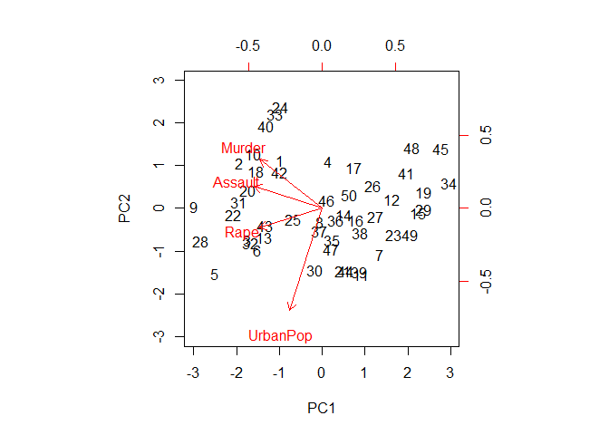
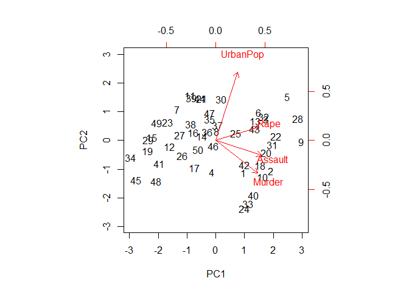
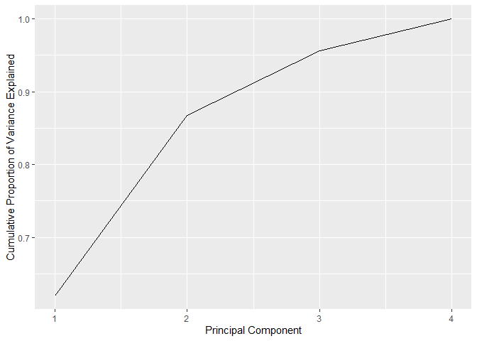
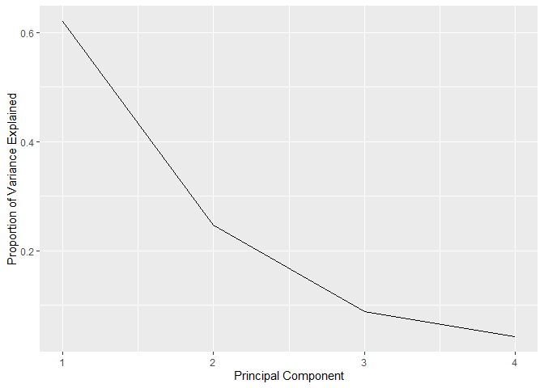

10.4 Lab 1: Principal Components Analysis
================

``` r
library(tidyverse)
```

``` r
(
us_arrests <- 
  USArrests %>% 
  as_tibble(rownames = "states")
)
```

    ## # A tibble: 50 x 5
    ##    states      Murder Assault UrbanPop  Rape
    ##    <chr>        <dbl>   <int>    <int> <dbl>
    ##  1 Alabama       13.2     236       58  21.2
    ##  2 Alaska        10       263       48  44.5
    ##  3 Arizona        8.1     294       80  31  
    ##  4 Arkansas       8.8     190       50  19.5
    ##  5 California     9       276       91  40.6
    ##  6 Colorado       7.9     204       78  38.7
    ##  7 Connecticut    3.3     110       77  11.1
    ##  8 Delaware       5.9     238       72  15.8
    ##  9 Florida       15.4     335       80  31.9
    ## 10 Georgia       17.4     211       60  25.8
    ## # ... with 40 more rows

``` r
us_arrests %>% 
  summarise_if(is.numeric, mean)
```

    ## # A tibble: 1 x 4
    ##   Murder Assault UrbanPop  Rape
    ##    <dbl>   <dbl>    <dbl> <dbl>
    ## 1   7.79    171.     65.5  21.2

``` r
us_arrests %>% 
  summarise_if(is.numeric, var)
```

    ## # A tibble: 1 x 4
    ##   Murder Assault UrbanPop  Rape
    ##    <dbl>   <dbl>    <dbl> <dbl>
    ## 1   19.0   6945.     210.  87.7

Variables have big differences in mean and variance. Because of that, we
scale them while doing PCA to set them all to a mean equal 0 and
standard deviation equal 1.

``` r
pr_out <- prcomp(select_if(us_arrests, is.numeric),
                 scale = TRUE)
```

``` r
names(pr_out)
```

    ## [1] "sdev"     "rotation" "center"   "scale"    "x"

``` r
pr_out$center
```

    ##   Murder  Assault UrbanPop     Rape 
    ##    7.788  170.760   65.540   21.232

``` r
pr_out$scale
```

    ##    Murder   Assault  UrbanPop      Rape 
    ##  4.355510 83.337661 14.474763  9.366385

``` r
pr_out$rotation
```

    ##                 PC1        PC2        PC3         PC4
    ## Murder   -0.5358995  0.4181809 -0.3412327  0.64922780
    ## Assault  -0.5831836  0.1879856 -0.2681484 -0.74340748
    ## UrbanPop -0.2781909 -0.8728062 -0.3780158  0.13387773
    ## Rape     -0.5434321 -0.1673186  0.8177779  0.08902432

``` r
biplot(pr_out, scale = 0)
```

<!-- -->

The biplot show the loadings and scores “inverted” from what appears in
Figure 10.1, this is because when both scorings and loadings have
inverted sign, they still represent the same loadings and scorings.

We can replicate Figure 10.1 by inverting the sign of loadings and
scorings.

``` r
pr_out$rotation <- -pr_out$rotation
pr_out$x <- -pr_out$x
biplot(pr_out, scale = 0)
```

<!-- -->

``` r
pr_out$sdev
```

    ## [1] 1.5748783 0.9948694 0.5971291 0.4164494

Variance explained by each component:

``` r
pr_var <- pr_out$sdev ^2
```

Proportion of variance explained:

``` r
pve <- pr_var/sum(pr_var)
pve
```

    ## [1] 0.62006039 0.24744129 0.08914080 0.04335752

``` r
qplot(x = 1:4, y = cumsum(pve), geom = "line") +
  labs(x = "Principal Component",
       y = "Cumulative Proportion of Variance Explained")
```

<!-- -->

``` r
qplot(x = 1:4, y = pve, geom = "line") +
  labs(x = "Principal Component",
       y = "Proportion of Variance Explained")
```

<!-- -->
