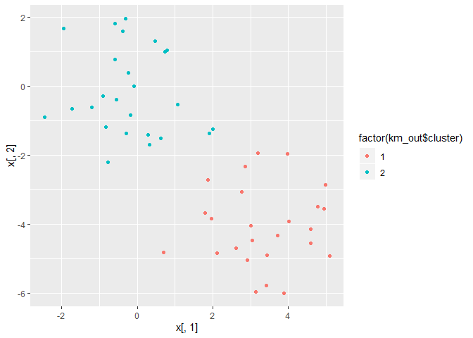
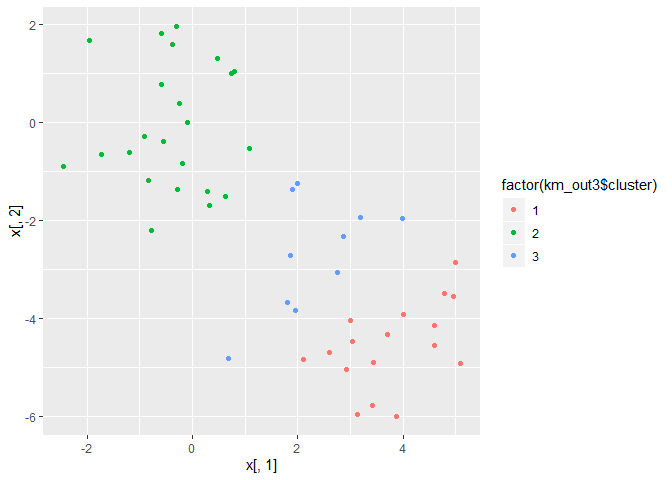
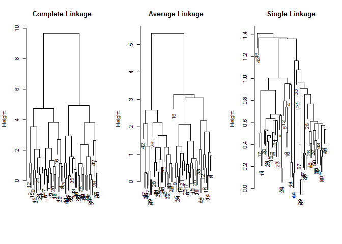
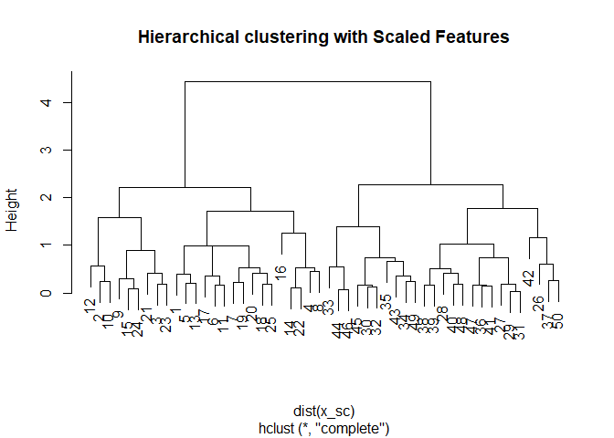
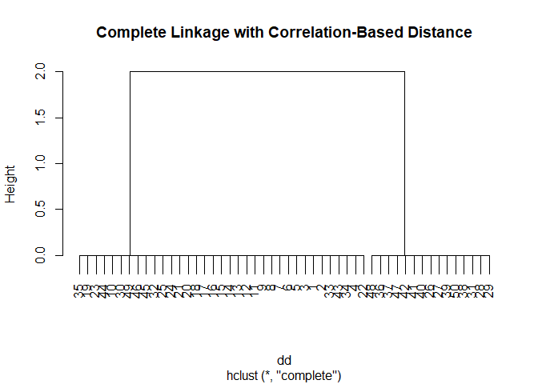

10.5 Lab 2: Clustering
================

``` r
library(tidyverse)
```

## 10.5.1 K-Means Clustering

The function `kmeans()` performs K-means clustering in R.We begin with a
simple simulated example in which there truly are two clusters in the
data: the first 25 observations have a mean shift relative to the next
25 observations.

``` r
set.seed(2)
x <- matrix(rnorm(50*2), ncol = 2)

x[1:25, 1] <- x[1:25, 1] + 3
x[1:25, 2] <- x[1:25, 2] - 4
```

We now perform K-means clustering with K=2.

``` r
km_out <- kmeans(x, 2, nstart = 20)
```

``` r
km_out$cluster
```

    ##  [1] 1 1 1 1 1 1 1 1 1 1 1 1 1 1 1 1 1 1 1 1 1 1 1 1 1 2 2 2 2 2 2 2 2 2 2
    ## [36] 2 2 2 2 2 2 2 2 2 2 2 2 2 2 2

The K-means clustering perfectly separated the observations into two
clusters even though we did not supply any group information to
`kmeans()`.We can plot the data, with each observation colored according
to its cluster assignment.

``` r
qplot(x[, 1], x[, 2], color = factor(km_out$cluster), geom = "point")
```

<!-- -->

In this example, we knew that there really were two clusters because we
generated the data. However, for real data, in general we do not know
the true number of clusters. We could instead have performed K-means
clustering on this example with K=3.

``` r
set.seed(4)
km_out3 <- kmeans(x, 3, nstart = 20)
qplot(x[, 1], x[, 2], color = factor(km_out3$cluster), geom = "point")
```

<!-- -->

To run the `kmeans()` function in R with multiple initial cluster
assignments, we use the `nstart` argument. If a value of `nstart`
greater than one is used, then K-means clustering will be performed
using multiple random assignments in Step 1 of Algorithm 10.1, and the
`kmeans()` function will report only the best results. Here we compare
using `nstart=1` to `nstart=20`.

``` r
set.seed(4)

km_out_ns1 <- kmeans(x, 3, nstart = 1)
km_out_ns1[["tot.withinss"]]
```

    ## [1] 104.3319

``` r
set.seed(4)
km_out_ns20 <- kmeans(x, 3, nstart = 20)
km_out_ns20[["tot.withinss"]]
```

    ## [1] 97.97927

## 10.5.2 Hierarchical Clustering

The `hclust()` function implements hierarchical clustering in R.In the
following example we use the data from Section 10.5.1 to plot the
hierarchical clustering dendrogram using complete, single, and average
linkage clustering, with Euclidean distance as the dissimilarity
measure. We begin by clustering observations using complete linkage. The
`dist()` function is used to compute the 50 × 50 inter-observation
Euclidean distance matrix.

``` r
hc_complete <- hclust(dist(x), method = "complete")
```

We could just as easily perform hierarchical clustering with average or
single linkage instead:

``` r
hc_average <- hclust(dist(x), method = "average")
hc_single <- hclust(dist(x), method = "single")
```

``` r
par(mfrow = c(1, 3))

plot(hc_complete ,main="Complete Linkage ", xlab="", sub ="", cex =.9)
plot(hc_average , main="Average Linkage ", xlab="", sub ="", cex =.9)
plot(hc_single , main=" Single Linkage ", xlab="", sub ="", cex =.9)
```

<!-- -->

To determine the cluster labels for each observation associated with a
given cut of the dendrogram, we can use the `cutree()` function:

``` r
cutree(hc_complete, 2)
```

    ##  [1] 1 1 1 1 1 1 1 1 1 1 1 1 1 1 1 1 1 1 1 1 1 1 1 1 1 2 2 2 2 2 2 2 2 2 2
    ## [36] 2 2 2 2 2 2 2 2 2 2 2 2 2 2 2

``` r
cutree(hc_average, 2)
```

    ##  [1] 1 1 1 1 1 1 1 1 1 1 1 1 1 1 1 1 1 1 1 1 1 1 1 1 1 2 2 2 2 2 2 2 1 2 2
    ## [36] 2 2 2 2 2 2 2 2 1 2 1 2 2 2 2

``` r
cutree(hc_single, 2)
```

    ##  [1] 1 1 1 1 1 1 1 1 1 1 1 1 1 1 1 2 1 1 1 1 1 1 1 1 1 1 1 1 1 1 1 1 1 1 1
    ## [36] 1 1 1 1 1 1 1 1 1 1 1 1 1 1 1

For this data, complete and average linkage generally separate the
observations into their correct groups. However, single linkage
identifies one point as belonging to its own cluster. A more sensible
answer is obtained when four clusters are selected, although there are
still two singletons.

``` r
cutree(hc_single, 4)
```

    ##  [1] 1 1 1 1 1 1 1 1 1 1 1 1 1 1 1 2 1 1 1 1 1 1 1 1 1 3 3 3 3 3 3 3 3 3 3
    ## [36] 3 3 3 3 3 3 4 3 3 3 3 3 3 3 3

To scale the variables before performing hierarchical clustering of the
observations, we use the `scale()` function:

``` r
x_sc <- scale(x)
plot(hclust(dist(x_sc), method = "complete"),
     main = "Hierarchical clustering with Scaled Features")
```

<!-- -->

Correlation-based distance can be computed using the `as.dist()`
function, which converts an arbitrary square symmetric matrix into a
form that the `hclust()` function recognizes as a distance matrix.
However, this only makes sense for data with at least three features
since the absolute correlation between any two observations with
measurements on two features is always 1. Hence, we will cluster a
three-dimensional data set.

``` r
x3 <- matrix(rnorm(30*3), ncol = 3)

# This is how correlation distance is calculed
dd <- as.dist(1 - cor(t(x)))

plot(hclust(dd, method = "complete"), main = "Complete Linkage with Correlation-Based Distance")
```

<!-- -->
