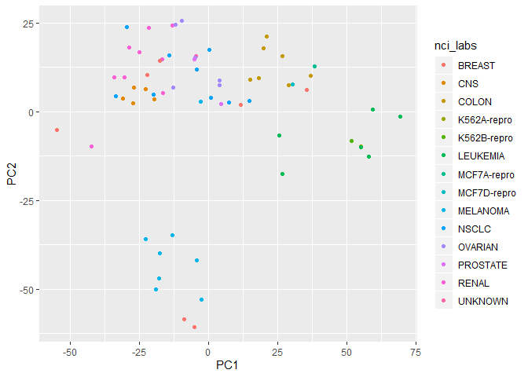
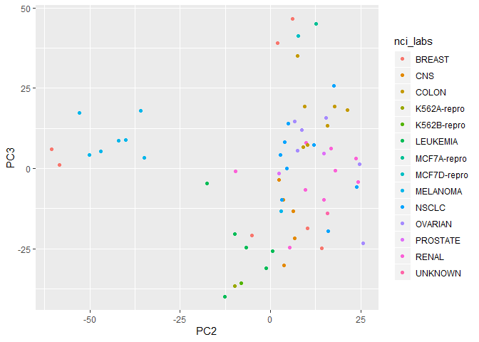
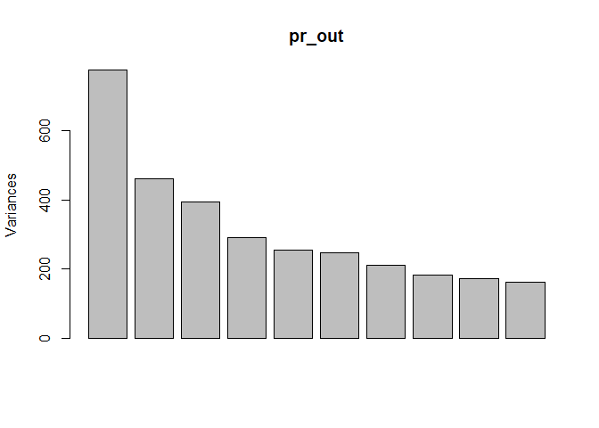
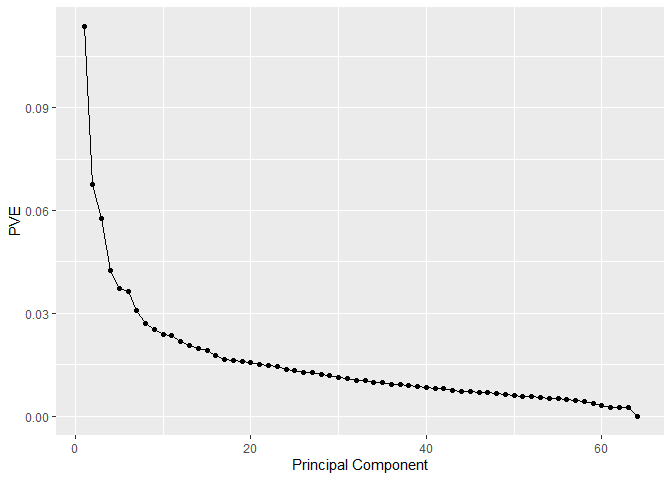
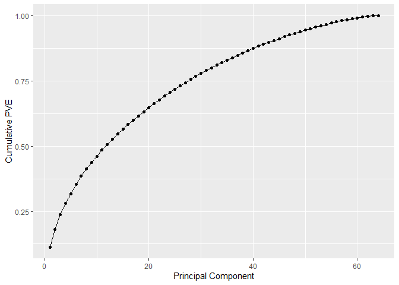
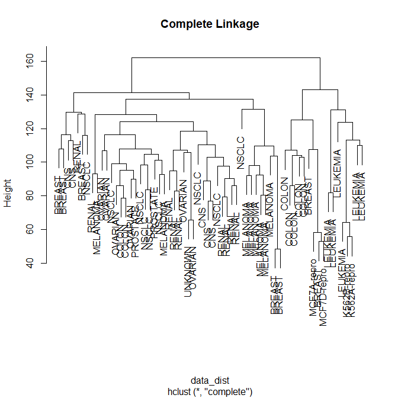
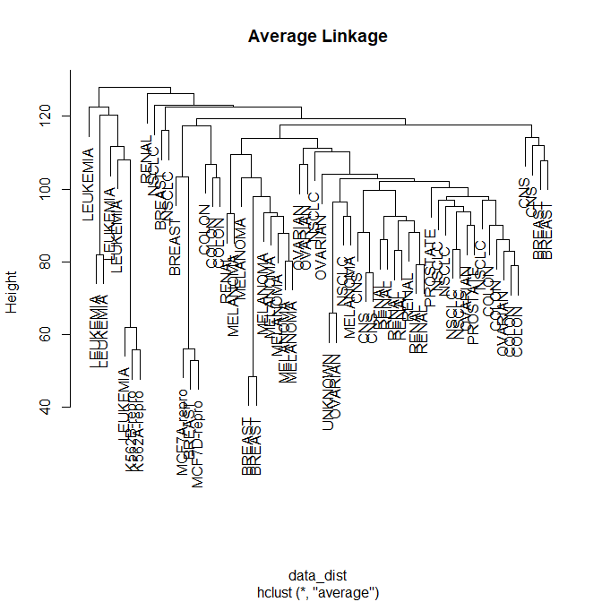
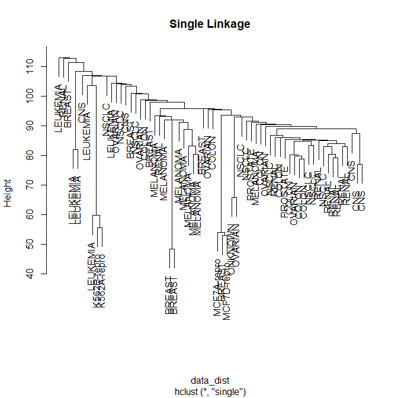
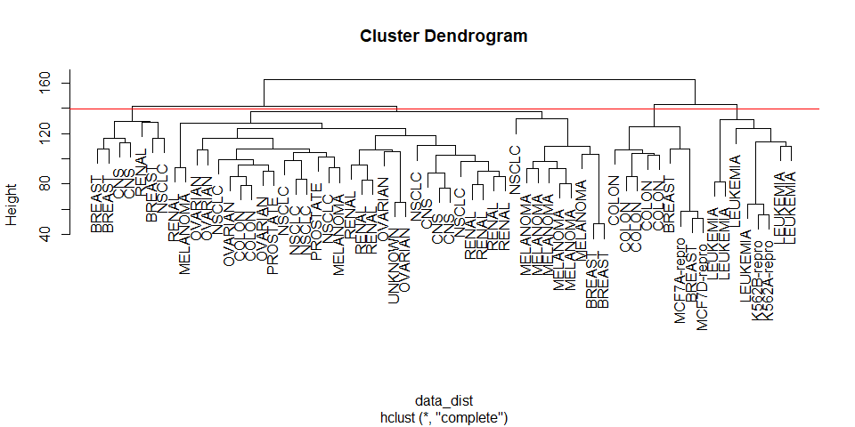
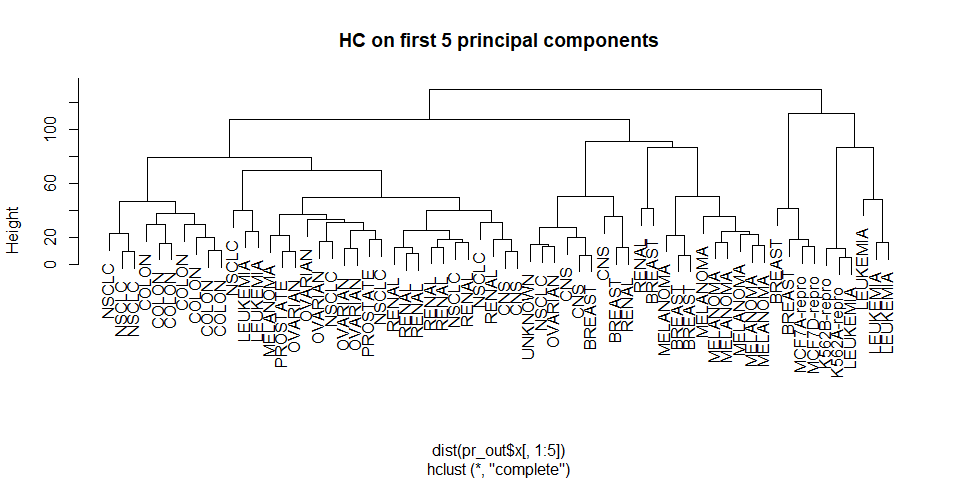

10.6 Lab 3: NCI60 Data Example
================

``` r
library(ISLR)
library(tidyverse)
```

Unsupervised techniques are often used in the analysis of genomic data.
In particular, PCA and hierarchical clustering are popular tools. We
illustrate these techniques on the `NCI60` cancer cell line microarray
data, which consists of 6,830 gene expression measurements on 64 cancer
cell lines.

``` r
nci_labs <- NCI60$labs
nci_data <- NCI60$data
```

Each cell line is labeled with a cancer type. We do not make use of the
cancer types in performing PCA and clustering, as these are unsupervised
techniques. But after performing PCA and clustering, we will check to
see the extent to which these cancer types agree with the results of
these unsupervised techniques.

``` r
dim(nci_data)
```

    ## [1]   64 6830

We begin by examining the cancer types for the cell lines.

``` r
nci_labs[1:4]
```

    ## [1] "CNS"   "CNS"   "CNS"   "RENAL"

``` r
nci_labs %>% table()
```

    ## .
    ##      BREAST         CNS       COLON K562A-repro K562B-repro    LEUKEMIA 
    ##           7           5           7           1           1           6 
    ## MCF7A-repro MCF7D-repro    MELANOMA       NSCLC     OVARIAN    PROSTATE 
    ##           1           1           8           9           6           2 
    ##       RENAL     UNKNOWN 
    ##           9           1

## 10.6.1 PCA on the NCI60 Data

We first perform PCA on the data after scaling the variables (genes) to
have standard deviation one, although one could reasonably argue that it
is better not to scale the genes.

``` r
pr_out <- prcomp(nci_data, scale = TRUE)

pr_out_x <- pr_out$x %>% as_tibble(rownames = "variable")
```

We now plot the first few principal component score vectors, in order to
visualize the data. The observations (cell lines) corresponding to a
given cancer type will be plotted in the same color, so that we can see
to what extent the observations within a cancer type are similar to each
other.

``` r
qplot(PC1, PC2, color = nci_labs, data = pr_out_x)
```

<!-- -->

``` r
qplot(PC2, PC3, color = nci_labs, data = pr_out_x)
```

<!-- -->

On the whole, cell lines corresponding to a single cancer type do tend
to have similar values on the first few principal component score
vectors. This indicates that cell lines from the same cancer type tend
to have pretty similar gene expression levels.

We can obtain a summary of the proportion of variance explained (PVE) of
the first few principal components using the `summary()` method for a
`prcomp` object:

``` r
summary(pr_out)
```

    ## Importance of components:
    ##                            PC1      PC2      PC3      PC4      PC5
    ## Standard deviation     27.8535 21.48136 19.82046 17.03256 15.97181
    ## Proportion of Variance  0.1136  0.06756  0.05752  0.04248  0.03735
    ## Cumulative Proportion   0.1136  0.18115  0.23867  0.28115  0.31850
    ##                             PC6      PC7      PC8      PC9     PC10
    ## Standard deviation     15.72108 14.47145 13.54427 13.14400 12.73860
    ## Proportion of Variance  0.03619  0.03066  0.02686  0.02529  0.02376
    ## Cumulative Proportion   0.35468  0.38534  0.41220  0.43750  0.46126
    ##                            PC11     PC12     PC13     PC14     PC15
    ## Standard deviation     12.68672 12.15769 11.83019 11.62554 11.43779
    ## Proportion of Variance  0.02357  0.02164  0.02049  0.01979  0.01915
    ## Cumulative Proportion   0.48482  0.50646  0.52695  0.54674  0.56590
    ##                            PC16     PC17     PC18     PC19    PC20
    ## Standard deviation     11.00051 10.65666 10.48880 10.43518 10.3219
    ## Proportion of Variance  0.01772  0.01663  0.01611  0.01594  0.0156
    ## Cumulative Proportion   0.58361  0.60024  0.61635  0.63229  0.6479
    ##                            PC21    PC22    PC23    PC24    PC25    PC26
    ## Standard deviation     10.14608 10.0544 9.90265 9.64766 9.50764 9.33253
    ## Proportion of Variance  0.01507  0.0148 0.01436 0.01363 0.01324 0.01275
    ## Cumulative Proportion   0.66296  0.6778 0.69212 0.70575 0.71899 0.73174
    ##                           PC27   PC28    PC29    PC30    PC31    PC32
    ## Standard deviation     9.27320 9.0900 8.98117 8.75003 8.59962 8.44738
    ## Proportion of Variance 0.01259 0.0121 0.01181 0.01121 0.01083 0.01045
    ## Cumulative Proportion  0.74433 0.7564 0.76824 0.77945 0.79027 0.80072
    ##                           PC33    PC34    PC35    PC36    PC37    PC38
    ## Standard deviation     8.37305 8.21579 8.15731 7.97465 7.90446 7.82127
    ## Proportion of Variance 0.01026 0.00988 0.00974 0.00931 0.00915 0.00896
    ## Cumulative Proportion  0.81099 0.82087 0.83061 0.83992 0.84907 0.85803
    ##                           PC39    PC40    PC41   PC42    PC43   PC44
    ## Standard deviation     7.72156 7.58603 7.45619 7.3444 7.10449 7.0131
    ## Proportion of Variance 0.00873 0.00843 0.00814 0.0079 0.00739 0.0072
    ## Cumulative Proportion  0.86676 0.87518 0.88332 0.8912 0.89861 0.9058
    ##                           PC45   PC46    PC47    PC48    PC49    PC50
    ## Standard deviation     6.95839 6.8663 6.80744 6.64763 6.61607 6.40793
    ## Proportion of Variance 0.00709 0.0069 0.00678 0.00647 0.00641 0.00601
    ## Cumulative Proportion  0.91290 0.9198 0.92659 0.93306 0.93947 0.94548
    ##                           PC51    PC52    PC53    PC54    PC55    PC56
    ## Standard deviation     6.21984 6.20326 6.06706 5.91805 5.91233 5.73539
    ## Proportion of Variance 0.00566 0.00563 0.00539 0.00513 0.00512 0.00482
    ## Cumulative Proportion  0.95114 0.95678 0.96216 0.96729 0.97241 0.97723
    ##                           PC57   PC58    PC59    PC60    PC61    PC62
    ## Standard deviation     5.47261 5.2921 5.02117 4.68398 4.17567 4.08212
    ## Proportion of Variance 0.00438 0.0041 0.00369 0.00321 0.00255 0.00244
    ## Cumulative Proportion  0.98161 0.9857 0.98940 0.99262 0.99517 0.99761
    ##                           PC63      PC64
    ## Standard deviation     4.04124 2.148e-14
    ## Proportion of Variance 0.00239 0.000e+00
    ## Cumulative Proportion  1.00000 1.000e+00

``` r
plot(pr_out)
```

<!-- -->

Note that the height of each bar in the bar plot is given by squaring
the corresponding element of `pr.out$sdev`. However, it is more
informative to plot the PVE of each principal component (i.e. a scree
plot) and the cumulative PVE of each principal component. This can be
done with just a little work.

``` r
pve <- summary(pr_out)$importance[2,]
cum_pve <- cumsum(pve)

qplot(seq_along(pve), pve, geom = "line") +
  geom_point() +
  labs(x = "Principal Component",
       y = "PVE")
```

<!-- -->

``` r
qplot(seq_along(cum_pve), cum_pve, geom = "line") +
  geom_point() +
  labs(x = "Principal Component",
       y = "Cumulative PVE")
```

<!-- -->

We see that together, the first seven principal components explain
around 40% of the variance in the data. This is not a huge amount of the
variance. However, looking at the scree plot, we see that while each of
the first seven principal components explain a substantial amount of
variance, there is a marked decrease in the variance explained by
further principal components. That is, there is an elbow in the plot
after approximately the seventh principal component. This suggests that
there may be little benefit to examining more than seven or so principal
components (though even examining seven principal components may be
difficult).

## 10.6.2 Clustering the Observations of the NCI60 Data

We now proceed to hierarchically cluster the cell lines in the `NCI60`
data, with the goal of finding out whether or not the observations
cluster into distinct types of cancer. To begin, we standardize the
variables to have mean zero and standard deviation one. As mentioned
earlier, this step is optional and should be performed only if we want
each gene to be on the same scale.

``` r
st_data <- scale(nci_data) %>% 
  as_tibble()
```

We now perform hierarchical clustering of the observations using
complete, single, and average linkage. Euclidean distance is used as the
dissimilarity measure.

``` r
data_dist <- dist(st_data)

plot(hclust(data_dist), labels = nci_labs, main = "Complete Linkage")
```

<!-- -->

``` r
plot(hclust(data_dist, method = "average"),
     labels = nci_labs, main = "Average Linkage")
```

<!-- -->

``` r
plot(hclust(data_dist, method = "single"),
     labels = nci_labs, main = "Single Linkage")
```

<!-- -->

Typically, single linkage will tend to yield trailing clusters: very
large clusters onto which individual observations attach one-by-one. On
the other hand, complete and average linkage tend to yield more
balanced, attractive clusters. For this reason, complete and average
linkage are generally preferred to single linkage. Clearly cell lines
within a single cancer type do tend to cluster together, although the
clustering is not perfect. We will use complete linkage hierarchical
clustering for the analysis that follows.

We can cut the dendrogram at the height that will yield a particular
number of clusters, say four:

``` r
hc_out <- hclust(data_dist)

hc_clusters <- cutree(hc_out, 4)

table(hc_clusters, nci_labs)
```

    ##            nci_labs
    ## hc_clusters BREAST CNS COLON K562A-repro K562B-repro LEUKEMIA MCF7A-repro
    ##           1      2   3     2           0           0        0           0
    ##           2      3   2     0           0           0        0           0
    ##           3      0   0     0           1           1        6           0
    ##           4      2   0     5           0           0        0           1
    ##            nci_labs
    ## hc_clusters MCF7D-repro MELANOMA NSCLC OVARIAN PROSTATE RENAL UNKNOWN
    ##           1           0        8     8       6        2     8       1
    ##           2           0        0     1       0        0     1       0
    ##           3           0        0     0       0        0     0       0
    ##           4           1        0     0       0        0     0       0

There are some clear patterns. All the leukemia cell lines fall in
cluster 3, while the breast cancer cell lines are spread out over three
different clusters.

We can plot the cut on the dendrogram that produces these four clusters:

``` r
par(mfrow = c(1,1))
plot(hc_out, labels = nci_labs)
abline(h = 139, col = "red")
```

<!-- -->

The argument `h=139` plots a horizontal line at height 139 on the
dendrogram; this is the height that results in four distinct clusters.

Printing the output of `hclust` gives a useful brief summary of the
object:

``` r
hc_out
```

    ## 
    ## Call:
    ## hclust(d = data_dist)
    ## 
    ## Cluster method   : complete 
    ## Distance         : euclidean 
    ## Number of objects: 64

We claimed earlier in Section 10.3.2 that K-means clustering and
hierarchical clustering with the dendrogram cut to obtain the same
number of clusters can yield very different results. How do these
`NCI60` hierarchical clustering results compare to what we get if we
perform K-means clustering with K=4?

``` r
set.seed(2)

km_out <- kmeans(st_data, 4, nstart = 20)

km_clusters <- km_out$cluster

table(km_clusters, hc_clusters)
```

    ##            hc_clusters
    ## km_clusters  1  2  3  4
    ##           1 11  0  0  9
    ##           2 20  7  0  0
    ##           3  9  0  0  0
    ##           4  0  0  8  0

Cluster 4 in K-means is identical to cluster 3 in HC, but others
clusters differ.

Rather than performing hierarchical clustering on the entire data
matrix, we can simply perform hierarchical clustering on the first few
principal component score vectors, as follows:

``` r
hc_out_2 <- hclust(dist(pr_out$x[,1:5]))

plot(hc_out_2, labels = nci_labs,
     main = "HC on first 5 principal components")
```

<!-- -->

``` r
table(cutree(hc_out_2, 4), nci_labs)
```

    ##    nci_labs
    ##     BREAST CNS COLON K562A-repro K562B-repro LEUKEMIA MCF7A-repro
    ##   1      0   2     7           0           0        2           0
    ##   2      5   3     0           0           0        0           0
    ##   3      0   0     0           1           1        4           0
    ##   4      2   0     0           0           0        0           1
    ##    nci_labs
    ##     MCF7D-repro MELANOMA NSCLC OVARIAN PROSTATE RENAL UNKNOWN
    ##   1           0        1     8       5        2     7       0
    ##   2           0        7     1       1        0     2       1
    ##   3           0        0     0       0        0     0       0
    ##   4           1        0     0       0        0     0       0

Not surprisingly, these results are different from the ones that we
obtained when we performed hierarchical clustering on the full data set.
Sometimes performing clustering on the first few principal component
score vectors can give better results than performing clustering on the
full data. In this situation, we might view the principal component step
as one of denoising the data. We could also perform K-means clustering
on the first few principal component score vectors rather than the full
data set.
