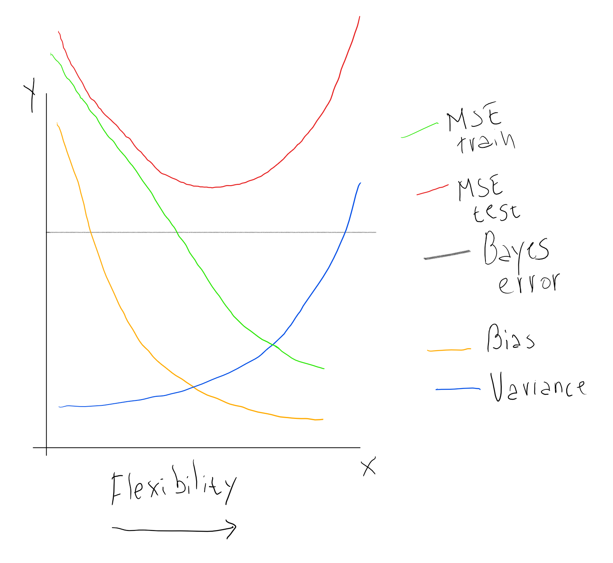

```{r setup, message=FALSE, warning=FALSE}
knitr::opts_chunk$set(warning = FALSE, message = FALSE)
library(tidyverse)
library(ISLR)
```


# 2.4 Exercises

## Conceptual

(1) For each of parts (a) through (d), indicate whether we would generally expect the performance of a flexible statistical learning method to be better or worse than an inflexible method. Justify your answer.

a. The sample size n is extremely large, and the number of predictors p is small.
    
A: A more flexible method should have better performance, because of the large sample size.

b. The number of predictors p is extremely large, and the number of observations n is small.
    
A: A more flexible method should have worse performance, because the small sample size *n* would lead to a high variance and overfitting.

c. The relationship between the predictors and response is highly non-linear.
  
A: A more flexible method should have better performance, because of the reduced bias.

d. The variance of the error terms, i.e. $\sigma^2 = Var(\epsilon)$, is extremely high.
  
A: Worse performance, because a more flexible method would be more likely to overfit to the errors in the training data.


(2) Explain whether each scenario is a classification or regression problem, and indicate whether we are most interested in inference or prediction. Finally, provide *n* and *p*.

a. We collect a set of data on the top 500 firms in the US. For each firm we record profit, number of employees, industry and the CEO salary. We are interested in understanding which factors affect CEO salary.
    
A: Regression. Inference. n = 500 (firms in the US). p = 3 (profit, number of employees, and industry salary).
    
b. We are considering launching a new product and wish to know whether it will be a success or a failure. We collect data on 20 similar products that were previously launched. For each product we have recorded whether it was a *success* or *failure*, price charged for the product, marketing budget, competition price, and ten other variables.
    
A: Classification. Prediction. n = 20 (other products). p = 13 (price charged, marketing budget, competition price, and the 10 other variables).
      
c.  We are interesting in predicting the % change in the US dollar in relation to the weekly changes in the world stock markets. Hence we collect weekly data for all of 2012. For each week we record the % change in the dollar, the % change in the US market, the % change in the British market, and the % change in the German market.
    
A: Regression. Prediction. n = 52 (weeks of 2012). p = 3 (% changes in US, UK and German markets).
      
(3) We now revisit the bias-variance decomposition.

a. Provide a sketch of typical (squared) bias, variance, training error, test error, and Bayes (or irreducible) error curves, on a single plot, as we go from less flexible statistical learning methods towards more flexible approaches. The x-axis should represent the amount of flexibility in the method, and the y-axis should represent the values for each curve. There should be five curves. Make sure to label each one.
    

        
b. Explain why each of the five curves has the shape displayed in part (a).
    
A: Bias goes down when flexibility increases, at the same time that variance goes up. The Bayes error is a constant, the minimum Test MSE we can theoretically achieve. Test MSE is the sum of the Bayes error, the bias and the variance, so this curve is always above the others, and goes downwards when the reductions in the bias (due to higher flexibility) are big enough to compensate the increases in variance, and viceversa. Train MSE can go down below the Bayes error and can even reach zero because, one way or another, all statistical learning methods try to minimize the Train MSE, and as we give them more degrees of freedom, they inevitably move towards that goal.
        

(4) You will now think of some real-life applications for statistical learning.

a. Describe three real-life applications in which *classification* might be useful. Describe the response, as well as the predictors. Is the goal of each application inference or prediction? Explain your answer.
  
A: 1. A bank may want to predict which customers are more likely to churn (close their accounts). The response variable would be if the customer has churned or not, and some posible predictors would be the amount of money spent by the customer, the number of transactions, their recency, among others. This could be either a prediction or a inference problem, since the bank may be interested not only in knowing *which* customers are likely to churn, but also *why* (so they can prevent churn).
        
2. There is a soccer match between Team A and Team B, and we want to know which of the 2 teams will win or if both will tie. The response variable is the match result (Team A wins, Team B wins, or it's a tie), and some predictors we would like to use are: possession of the ball in previous matches, number of championships won, which team is local or visitor, and so on. The goal of this application is prediction.
        
3. A one-stop-shop retailer is sending marketing e-mails to their customers, and they would like to send each e-mail only to the customers who will be interested in the respective products promoted. The response variable could be if the customer reads the e-mail or not, and some posible predictors are if the customer has read previous e-mails about the product categories included in the next e-mail, if the customer has bought products of those categories, age, amount of money spent in the retailer, etc.

b. Describe three real-life applications in which *regression* might be useful. Describe the response, as well as the predictors. Is the goal of each application inference or prediction? Explain your answer.
    
ANSWER:

1. A retailer wants to know how the demand for products will change as they change the price. The goal of this application is inference, and the response variable are the sales of each product (measured in money or units). Some predictors could be the proportion of high income customers for each product, the weight of each product in the customers' monthly expenditure, the price of the product in competitor retailers, and, of course, the change of the price of the product in the same retailer.
        
2. An e-commerce website wants to know how much traffic will come to their page this christmas, so they can provisionate the appropriate web server capacity, avoiding slow downs for their customers. The goal of this application is purely prediction. The response variable would be the number of page views in the chistmas season, and some predictors could be the amount of page views in the previous 3 months, the amount of page views in last year christmas, the economic growth year over year, and the confidence of customers in the future of the economy.
        
3. A researcher would like to know which factors affect the score obtained by students in a standarized math test. This is a inference application, since the researcher would like to give recommendations to improve the scores in the future, not to accurately predict such scores. The response variable is the score of each student in the test, and some explanatory variables could be: study hours per week for each students, years of experience of the teacher, percent of asistance to classes, etc.
        
c. Describe three real-life applications in which cluster analysis might be useful.
    
ANSWER: 

1. Segmenting customers based on purchase behavior.
    
2. Segmenting app users based on how the use the app.
    
3. Segmenting twitter users based on the topics that they talk about.
        

(5) What are the advantages and disadvantages of a very flexible (versus a less flexible) approach for regression or classification? Under what circumstances might a more flexible approach be preferred to a less flexible approach? When might a less flexible approach be preferred?

a. Disadvantages
    
ANSWER: A very flexible model could be more difficult or costly to compute.

Also it requieres a lot of data (big samples) to be reliable, since it has higher variance (higher risk of overfitting).

It's less interpretable, we may get an accurate prediction, but probably we will not know why the model is doing such prediction for each observation.
        
b. Advantages
    
ANSWER: If the "true model" which generated the data is complex, a more flexible model will make better predictions (will have lower Test MSE).
        
Generally, a more flexible approach is prefered if we have a large `n`, and we suspect that the relationship between the explanatory variables is complex (non-linear). If these conditions doesn't hold, we may want a less flexible approach. 
        
        
(6) Describe the differences between a parametric and a non-parametric statistical learning approach. What are the advantages of a parametric approach to regression or classification (as opposed to a non-parametric approach)? What are its disadvantages?

ANSWER: A parametric approach assumes some functional form to estimate the relationship between the predictors and the response variable. Because of that, the problem is simplified to just estimate the parameters of the assumed functional form. A non-parametric approach allows more flexibility, since it doesn't imposses a pre-defined functional form, but it alsow requieres more data to obtain a reliable estimation. The advantages and disadvantages of non-parametric approaches are pretty much the same as those of the more flexible models.

    
(7) The table below provides a training data set containing six observations, three predictors, and one qualitative response variable.

```{r echo=FALSE}
knitr::kable(
  df1 <- tibble::tibble(
    Obs = 1:6,
    X1 = c(0, 2, 0, 0, -1, 1),
    X2 = c(3, 0, 1, 1, 0, 1),
    X3 = c(0, 0, 3, 2, 1, 1),
    Y = c("Red", "Red", "Red", "Green", "Green", "Red")
  )
)
```

Suppose we wish to use this data set to make a prediction for $Y$ when $X1 = X2 = X3 = 0$ using K-nearest neighbors.

a. Compute the Euclidean distance between each observation and the test point, $X1 = X2 = X3 = 0$.
    
```{r}
distance_to_p1 <- function(x1, x2, x3) {
  sqrt(x1^2 + x2^2 + x3^2)
}

df1 %>% 
  mutate(distance = distance_to_p1(X1, X2, X3))
```
    
b. What is our prediction with $K = 1$? Why?

ANSWER: Green, since observation n°5 is Green and is their closest neighbor.
        
c. What is our prediction with $K = 3$? Why?
    
ANSWER: Red, because 2 of their 3 closest neighbors are red.
        
d. If the Bayes decision boundary in this problem is highly nonlinear, then would we expect the *best* value for $K$ to be large or small? Why?
    
ANSWER: Small. If the Bayes decision boundary is highly nonlinear, then more flexibility in our estimation is desired, and low values for K provide more flexibility.
        
## Applied

(8) This exercise relates to the `College` data set, which can be found in the file `College.csv`. It contains a number of variables for 777 different universities and colleges in the US. Descriptions of the variables can be found on page 54 of the book.

a. Read the data into `R`.
```{r college}
(college <- read_csv("College.csv"))
```
  
Now we're converting the first column (`X1`, which contain college names) to row names, since we don't really want to use it as data.
```{r}
college <- remove_rownames(college) %>% 
  column_to_rownames(var = "X1")
```

Use the `summary()` function to produce a numerical summary of the variables in the data set.
```{r}
summary(college)
```

Use the `pairs()` function to produce a scatterplot matrix of the first ten columns or variables of the data.
```{r}
college %>%
  select(2:11) %>% 
  pairs()
```

Produce a side-by-side boxplot of `Outstate` versus `Private`.
```{r}
ggplot(college, aes(Private, Outstate)) +
  geom_boxplot()
```

Create a new qualitative variable, called `Elite`, by binning the `Top10perc` variable. We are going to divide universities into two groups based on whether or not the proportion of students coming from the top 10% of their high school classes exceeds 50%.

```{r}
college <- college %>% 
  mutate(Elite = if_else(Top10perc > 50,
                         true = "Yes",
                         false = "No"),
         Elite = as.factor(Elite))
```

Use the `summary()` function to see how many elite universities there are.
```{r}
summary(college$Elite)
```

Now produce side-by-side boxplots of `Outstate` versus `Elite.`
```{r}
ggplot(college, aes(Elite, Outstate)) +
  geom_boxplot()
```

Produce some histograms with differing numbers of bins for a few of the quantitative variables.
```{r}
par(mfrow = c(2, 2))

hist(college$Apps, breaks = 30)
hist(college$Top10perc, breaks = 20)
hist(college$Expend, breaks = 30)
hist(college$PhD, breaks = 40)
```

(9) This exercise involves the `Auto` data set studied in the lab. Make sure that the missing values have been removed from the data.

```{r}
Auto <- as_tibble(ISLR::Auto)

is.na(Auto) %>% mean()
```

a. Which of the predictors are quantitative, and which are qualitative?
  
```{r}
str(Auto)
```
    
All of them are quantitative, except the name.
        
b. What is the *range* of each quantitative predictor?
    
```{r}
Auto %>% 
  select_if(is.numeric) %>% 
  map(range)
```
    
c. What is the mean and standard deviation of each quantitative predictor?
    
```{r}
Auto %>% 
  select_if(is.numeric) %>% 
  map(mean)
```
    
```{r}
Auto %>% 
  select_if(is.numeric) %>% 
  map(sd)
```

Alternative using list-columns to find `mean` and `sd`:
```{r}
(numeric_variables <- ISLR::Auto %>%
   select_if(is.numeric) %>%
   as.list() %>%
   enframe())
```

```{r}
(numeric_variables <-
   numeric_variables %>%
   mutate(mean = map_dbl(value, mean),
          sd = map_dbl(value, sd)))
```

d. Now remove the 10th through 85th observations. What is the range, mean, and standard deviation of each predictor in the subset of the data that remains?
    
```{r}
summary_mean_sd_range <- function(x) {
  x %>%
    select_if(is.numeric) %>%
    as.list() %>%
    enframe() %>% 
    mutate(mean = map_dbl(value, mean),
           sd = map_dbl(value, sd),
           min = map_dbl(value, min),
           max = map_dbl(value, max))
}

Auto_filtered <- Auto[-c(10:85), ]

summary_mean_sd_range(Auto_filtered)
```
    
e. Using the full data set, investigate the predictors graphically, using scatterplots or other tools of your choice. Create some plots highlighting the relationships among the predictors. Comment on your findings.
    
```{r}
Auto %>% 
  select_if(is.numeric) %>% 
  pairs()
```
    
Average miles per gallon increases over time, especially since 1980.

```{r}
ggplot(Auto, aes(as.factor(year), mpg)) + 
  geom_boxplot() 
```
        
At the same time, the average weight decreases.

```{r}
ggplot(Auto, aes(as.factor(year), weight)) + 
  geom_boxplot() 
```

¿Maybe both variables are correlated?

```{r}
ggplot(Auto, aes(mpg, weight, color = as.factor(cut_width(year, width = 4)))) +
  geom_point() +
  geom_smooth()
```
        
The greater efficiency in modern cars is partly due to the fact that they weigh less, but even keeping the weight constant, modern cars are more efficient (in miles per gallon) than older cars.

f. Suppose that we wish to predict gas mileage (`mpg`) on the basis of the other variables. Do your plots suggest that any of the other variables might be useful in predicting `mpg`? Justify your answer.

ANSWER: Yes. As seen above, `year` and  `weight` should be useful variables to predict `mpg`. Also, as seen in the plots produced by `pairs()`, `displacement`, `horsepower` and `acceleration` should also have good predictive power over `mpg`.
        
(10) This exercise involves the `Boston` data set, from the `MASS` package.

a. Load the `Boston` data set.
```{r}
Boston <- as_tibble(MASS::Boston)
```

b. Make some pairwise scatterplots of the predictors (columns) in this data set. Describe your findings.
    
```{r}
pairs(Boston)
```
    
Some relationships/correlations we can find in the data:
    
* Median value of homes decreases as pupil-teacher ratio increases (people value better access to education?).
* Higher value homes are more far away of employment centers than cheap ones.
* Median value of homes increases as the number of rooms increases.
* Median value of home decreases when there is more contamination (measured as nitrogen oxides concentration).
    
c. Are any of the predictors associated with per capita crime rate? If so, explain the relationship.
    
ANSWER: Yes. Median value of houses is negatively correlated with crime rates (maybe people are less willing to pay for homes in high crime sectors). Also, there is a positive correlation between crime rates and the proportion of old buildings, and a negative correltation with the distance to employment centers (areas located further away from employment centers have less crime).
    
d. Do any of the suburbs of Boston appear to have particularly high crime rates? Tax rates? Pupil-teacher ratios? Comment on the range of each predictor.
    
First we obtain the ranges (min and max) for each of these variables:
```{r}
Boston %>% 
  summary_mean_sd_range() %>% 
  filter(name %in% c("crim", "tax", "ptratio"))
```
    
* Crime rates: there are towns with near-zero crime rates, but on the other end, some have a crime rate of almost 90.
* Property tax rates goes from \$187 (per \$10,000) up to \$711 in the heaviest taxed zone.
* Pupil-teacher ratio: fluctuates between 12.6 and 22.
        
e. How many of the suburbs in this data set bound the Charles river?
    
```{r}
Boston %>% 
  filter(chas == 1) %>% 
  tally()
```
    
f. What is the median pupil-teacher ratio among the towns in this data set?
    
```{r}
Boston %>% 
  summarise(median_ptratio = median(ptratio))
```
    
g. Which suburb of Boston has lowest median value of owner occupied homes? What are the values of the other predictors for that suburb, and how do those values compare to the overall ranges for those predictors? Comment on your findings.
    
    These are the suburbs with lowest median value of houses.
```{r}
Boston %>% 
  mutate(rank_lowvalue = dense_rank(medv)) %>% 
  filter(rank_lowvalue == 1)
```
    
And these are the ranges (min-max) and median of the variables for the whole dataset.
```{r}
Boston %>% 
  summary_mean_sd_range() %>% 
  select(-sd)
```
        
Remarkable facts about the suburbus with the lowest median value:
        
* They have 100% of units built prior to 1940.
* Relatively high crime rate.
* High proportion of non-retail business (industries).
* High contamination.
* Rooms per dwelling are below average.
* Very close to employment centers.
* High property tax rate.
* High pupil-teacher ratio (few teachers for many pupils).
* One of them is the zone with highest proportion of black population.
        
h. In this data set, how many of the suburbs average more than seven rooms per dwelling? More than eight rooms per dwelling? Comment on the suburbs that average more than eight rooms per dwelling.
    
```{r}
Boston %>% 
  mutate(rm_ranges = cut(rm, breaks = 3:9)) %>% 
  count(rm_ranges)
```
    
64 suburbs have 7 or more average rooms per dwelling, and 13 suburbus have 8 or more.
        
```{r}
Boston %>% 
  filter(rm >= 8) %>% 
  summary_mean_sd_range()
  
```
        
Suburbs with 8 or more average rooms per dwelling have:
        
* Less crime than average.
* Less proportion of acres with non-retail business.
* Slightly less property tax rate than average.
* A median value two times higher than average. 