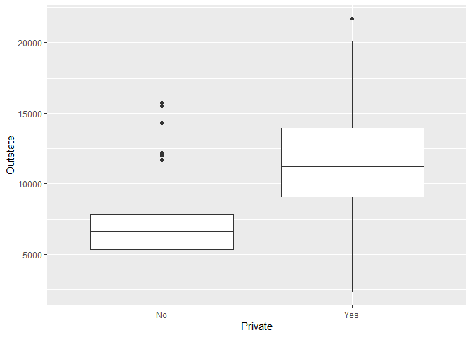
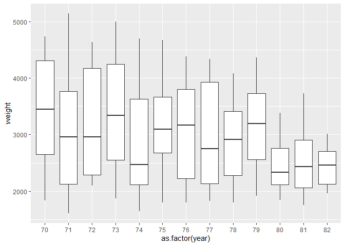
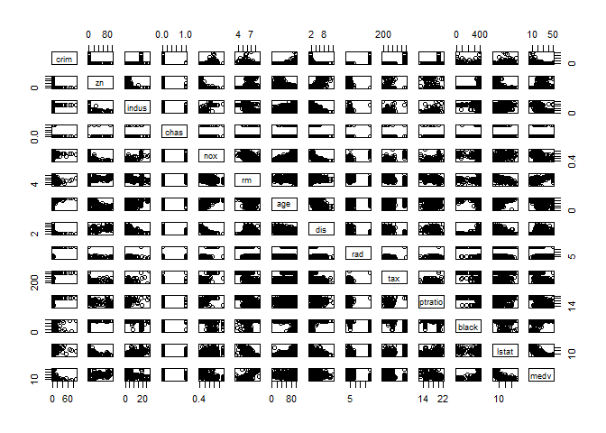

Chapter 2. Statistical Learning
================

``` r
knitr::opts_chunk$set(warning = FALSE, message = FALSE)
library(tidyverse)
```

    ## -- Attaching packages ------------------------------------------------ tidyverse 1.2.1 --

    ## v ggplot2 3.1.0       v purrr   0.3.2  
    ## v tibble  2.1.1       v dplyr   0.8.0.1
    ## v tidyr   0.8.3       v stringr 1.4.0  
    ## v readr   1.3.1       v forcats 0.4.0

    ## -- Conflicts --------------------------------------------------- tidyverse_conflicts() --
    ## x dplyr::filter() masks stats::filter()
    ## x dplyr::lag()    masks stats::lag()

``` r
library(ISLR)
```

# 2.4 Exercises

## Conceptual

#### 1\. For each of parts (a) through (d), indicate whether we would generally expect the performance of a flexible statistical learning method to be better or worse than an inflexible method. Justify your answer.

1.  The sample size n is extremely large, and the number of predictors p
    is small.
    
    A more flexible method should have better performance, because of
    the large sample size.

2.  The number of predictors p is extremely large, and the number of
    observations n is small.
    
    A more flexible method should have worse performance, because the
    small sample size *n* would lead to a high variance and overfitting.

3.  The relationship between the predictors and response is highly
    non-linear.
    
    A more flexible method should have better performance, because of
    the reduced bias.

4.  The variance of the error terms, i.e. \(\sigma^2 = Var(\epsilon)\),
    is extremely high.
    
    Worse performance, because a more flexible method would be more
    likely to overfit to the errors in the training
data.

#### 2\. Explain whether each scenario is a classification or regression problem, and indicate whether we are most interested in inference or prediction. Finally, provide *n* and *p*.

1.  We collect a set of data on the top 500 firms in the US. For each
    firm we record profit, number of employees, industry and the CEO
    salary. We are interested in understanding which factors affect CEO
    salary.
    
    Regression. Inference. n = 500 (firms in the US). p = 3 (profit,
    number of employees, and industry salary).

2.  We are considering launching a new product and wish to know whether
    it will be a success or a failure. We collect data on 20 similar
    products that were previously launched. For each product we have
    recorded whether it was a *success* or *failure*, price charged for
    the product, marketing budget, competition price, and ten other
    variables.
    
    Classification. Prediction. n = 20 (other products). p = 13 (price
    charged, marketing budget, competition price, and the 10 other
    variables).

3.  We are interesting in predicting the % change in the US dollar in
    relation to the weekly changes in the world stock markets. Hence we
    collect weekly data for all of 2012. For each week we record the %
    change in the dollar, the % change in the US market, the % change in
    the British market, and the % change in the German market.
    
    Regression. Prediction. n = 52 (weeks of 2012). p = 3 (% changes in
    US, UK and German markets).

#### 3\. We now revisit the bias-variance decomposition.

1.  Provide a sketch of typical (squared) bias, variance, training
    error, test error, and Bayes (or irreducible) error curves, on a
    single plot, as we go from less flexible statistical learning
    methods towards more flexible approaches. The x-axis should
    represent the amount of flexibility in the method, and the y-axis
    should represent the values for each curve. There should be five
    curves. Make sure to label each one.
    
    

2.  Explain why each of the five curves has the shape displayed in part
    (a).
    
    Bias goes down when flexibility increases, at the same time that
    variance goes up. The Bayes error is a constant, the minimum Test
    MSE we can theoretically achieve. Test MSE is the sum of the Bayes
    error, the bias and the variance, so this curve is always above the
    others, and goes downwards when the reductions in the bias (due to
    higher flexibility) are big enough to compensate the increases in
    variance, and viceversa. Train MSE can go down below the Bayes error
    and can even reach zero because, one way or another, all statistical
    learning methods try to minimize the Train MSE, and as we give them
    more degrees of freedom, they inevitably move towards that
goal.

#### 4\. You will now think of some real-life applications for statistical learning.

1.  Describe three real-life applications in which *classification*
    might be useful. Describe the response, as well as the predictors.
    Is the goal of each application inference or prediction? Explain
    your answer.
    
    1.  A bank may want to predict which customers are more likely to
        churn (close their accounts). The response variable would be if
        the customer has churned or not, and some posible predictors
        would be the amount of money spent by the customer, the number
        of transactions, their recency, among others. This could be
        either a prediction or a inference problem, since the bank may
        be interested not only in knowing *which* customers are likely
        to churn, but also *why* (so they can prevent churn).
    
    2.  There is a soccer match between Team A and Team B, and we want
        to know which of the 2 teams will win or if both will tie. The
        response variable is the match result (Team A wins, Team B wins,
        or it’s a tie), and some predictors we would like to use are:
        possession of the ball in previous matches, number of
        championships won, which team is local or visitor, and so on.
        The goal of this application is prediction.
    
    3.  A one-stop-shop retailer is sending marketing e-mails to their
        customers, and they would like to send each e-mail only to the
        customers who will be interested in the respective products
        promoted. The response variable could be if the customer reads
        the e-mail or not, and some posible predictors are if the
        customer has read previous e-mails about the product categories
        included in the next e-mail, if the customer has bought products
        of those categories, age, amount of money spent in the retailer,
        etc.

2.  Describe three real-life applications in which *regression* might be
    useful. Describe the response, as well as the predictors. Is the
    goal of each application inference or prediction? Explain your
    answer.
    
    1.  A retailer wants to know how the demand for products will change
        as they change the price. The goal of this application is
        inference, and the response variable are the sales of each
        product (measured in money or units). Some predictors could be
        the proportion of high income customers for each product, the
        weight of each product in the customers’ monthly expenditure,
        the price of the product in competitor retailers, and, of
        course, the change of the price of the product in the same
        retailer.
    
    2.  An e-commerce website wants to know how much traffic will come
        to their page this christmas, so they can provisionate the
        appropriate web server capacity, avoiding slow downs for their
        customers. The goal of this application is purely prediction.
        The response variable would be the number of page views in the
        chistmas season, and some predictors could be the amount of page
        views in the previous 3 months, the amount of page views in last
        year christmas, the economic growth year over year, and the
        confidence of customers in the future of the economy.
    
    3.  A researcher would like to know which factors affect the score
        obtained by students in a standarized math test. This is a
        inference application, since the researcher would like to give
        recommendations to improve the scores in the future, not to
        accurately predict such scores. The response variable is the
        score of each student in the test, and some explanatory
        variables could be: study hours per week for each students,
        years of experience of the teacher, percent of asistance to
        classes, etc.

3.  Describe three real-life applications in which cluster analysis
    might be useful.
    
    1.  Segmenting customers based on purchase behavior.
    
    2.  Segmenting app users based on how the use the app.
    
    3.  Segmenting twitter users based on the topics that they talk
        about.

#### 5\. What are the advantages and disadvantages of a very flexible (versus a less flexible) approach for regression or classification? Under what circumstances might a more flexible approach be preferred to a less flexible approach? When might a less flexible approach be preferred?

1.  Disadvantages
    
    A very flexible model could be more difficult or costly to compute.
    Also it requieres a lot of data (big samples) to be reliable, since
    it has higher variance (higher risk of overfitting). It’s less
    interpretable, we may get an accurate prediction, but probably we
    will not know why the model is doing such prediction for each
    observation.

2.  Advantages
    
    If the “true model” which generated the data is complex, a more
    flexible model will make better predictions (will have lower Test
    MSE).
    
    Generally, a more flexible approach is prefered if we have a large
    `n`, and we suspect that the relationship between the explanatory
    variables is complex (non-linear). If these conditions doesn’t hold,
    we may want a less flexible
approach.

#### 6\. Describe the differences between a parametric and a non-parametric statistical learning approach. What are the advantages of a parametric approach to regression or classification (as opposed to a non-parametric approach)? What are its disadvantages?

A parametric approach assumes some functional form to estimate the
relationship between the predictors and the response variable. Because
of that, the problem is simplified to just estimate the parameters of
the assumed functional form. A non-parametric approach allows more
flexibility, since it doesn’t imposses a pre-defined functional form,
but it alsow requieres more data to obtain a reliable estimation. The
advantages and disadvantages of non-parametric approaches are pretty
much the same as those of the more flexible
models.

#### 7\. The table below provides a training data set containing six observations, three predictors, and one qualitative response variable.

| Obs |  X1 | X2 | X3 | Y     |
| --: | --: | -: | -: | :---- |
|   1 |   0 |  3 |  0 | Red   |
|   2 |   2 |  0 |  0 | Red   |
|   3 |   0 |  1 |  3 | Red   |
|   4 |   0 |  1 |  2 | Green |
|   5 | \-1 |  0 |  1 | Green |
|   6 |   1 |  1 |  1 | Red   |

Suppose we wish to use this data set to make a prediction for \(Y\) when
\(X1 = X2 = X3 = 0\) using K-nearest neighbors.

1.  Compute the Euclidean distance between each observation and the test
    point, \(X1 = X2 = X3 = 0\).

<!-- end list -->

``` r
distance_to_p1 <- function(x1, x2, x3) {
  sqrt(x1^2 + x2^2 + x3^2)
}

df1 %>% 
  mutate(distance = distance_to_p1(X1, X2, X3))
```

    ## # A tibble: 6 x 6
    ##     Obs    X1    X2    X3 Y     distance
    ##   <int> <dbl> <dbl> <dbl> <chr>    <dbl>
    ## 1     1     0     3     0 Red       3   
    ## 2     2     2     0     0 Red       2   
    ## 3     3     0     1     3 Red       3.16
    ## 4     4     0     1     2 Green     2.24
    ## 5     5    -1     0     1 Green     1.41
    ## 6     6     1     1     1 Red       1.73

2.  What is our prediction with \(K = 1\)? Why?
    
    Green, since observation n°5 is Green and is their closest neighbor.

3.  What is our prediction with \(K = 3\)? Why?
    
    Red, because 2 of their 3 closest neighbors are red.

4.  If the Bayes decision boundary in this problem is highly nonlinear,
    then would we expect the *best* value for \(K\) to be large or
    small? Why?
    
    Small. If the Bayes decision boundary is highly nonlinear, then more
    flexibility in our estimation is desired, and low values for K
    provide more
flexibility.

## Applied

#### 8\. This exercise relates to the `College` data set, which can be found in the file `College.csv`. It contains a number of variables for 777 different universities and colleges in the US. Descriptions of the variables can be found on page 54 of the book.

1.  Read the data into `R`.

<!-- end list -->

``` r
(college <- read_csv("College.csv"))
```

    ## # A tibble: 777 x 19
    ##    X1    Private  Apps Accept Enroll Top10perc Top25perc F.Undergrad
    ##    <chr> <chr>   <dbl>  <dbl>  <dbl>     <dbl>     <dbl>       <dbl>
    ##  1 Abil~ Yes      1660   1232    721        23        52        2885
    ##  2 Adel~ Yes      2186   1924    512        16        29        2683
    ##  3 Adri~ Yes      1428   1097    336        22        50        1036
    ##  4 Agne~ Yes       417    349    137        60        89         510
    ##  5 Alas~ Yes       193    146     55        16        44         249
    ##  6 Albe~ Yes       587    479    158        38        62         678
    ##  7 Albe~ Yes       353    340    103        17        45         416
    ##  8 Albi~ Yes      1899   1720    489        37        68        1594
    ##  9 Albr~ Yes      1038    839    227        30        63         973
    ## 10 Alde~ Yes       582    498    172        21        44         799
    ## # ... with 767 more rows, and 11 more variables: P.Undergrad <dbl>,
    ## #   Outstate <dbl>, Room.Board <dbl>, Books <dbl>, Personal <dbl>,
    ## #   PhD <dbl>, Terminal <dbl>, S.F.Ratio <dbl>, perc.alumni <dbl>,
    ## #   Expend <dbl>, Grad.Rate <dbl>

Now we’re converting the first column (`X1`, which contain college
names) to row names, since we don’t really want to use it as data.

``` r
college <- remove_rownames(college) %>% 
  column_to_rownames(var = "X1")
```

Use the `summary()` function to produce a numerical summary of the
variables in the data
    set.

``` r
summary(college)
```

    ##    Private               Apps           Accept          Enroll    
    ##  Length:777         Min.   :   81   Min.   :   72   Min.   :  35  
    ##  Class :character   1st Qu.:  776   1st Qu.:  604   1st Qu.: 242  
    ##  Mode  :character   Median : 1558   Median : 1110   Median : 434  
    ##                     Mean   : 3002   Mean   : 2019   Mean   : 780  
    ##                     3rd Qu.: 3624   3rd Qu.: 2424   3rd Qu.: 902  
    ##                     Max.   :48094   Max.   :26330   Max.   :6392  
    ##    Top10perc       Top25perc      F.Undergrad     P.Undergrad     
    ##  Min.   : 1.00   Min.   :  9.0   Min.   :  139   Min.   :    1.0  
    ##  1st Qu.:15.00   1st Qu.: 41.0   1st Qu.:  992   1st Qu.:   95.0  
    ##  Median :23.00   Median : 54.0   Median : 1707   Median :  353.0  
    ##  Mean   :27.56   Mean   : 55.8   Mean   : 3700   Mean   :  855.3  
    ##  3rd Qu.:35.00   3rd Qu.: 69.0   3rd Qu.: 4005   3rd Qu.:  967.0  
    ##  Max.   :96.00   Max.   :100.0   Max.   :31643   Max.   :21836.0  
    ##     Outstate       Room.Board       Books           Personal   
    ##  Min.   : 2340   Min.   :1780   Min.   :  96.0   Min.   : 250  
    ##  1st Qu.: 7320   1st Qu.:3597   1st Qu.: 470.0   1st Qu.: 850  
    ##  Median : 9990   Median :4200   Median : 500.0   Median :1200  
    ##  Mean   :10441   Mean   :4358   Mean   : 549.4   Mean   :1341  
    ##  3rd Qu.:12925   3rd Qu.:5050   3rd Qu.: 600.0   3rd Qu.:1700  
    ##  Max.   :21700   Max.   :8124   Max.   :2340.0   Max.   :6800  
    ##       PhD            Terminal       S.F.Ratio      perc.alumni   
    ##  Min.   :  8.00   Min.   : 24.0   Min.   : 2.50   Min.   : 0.00  
    ##  1st Qu.: 62.00   1st Qu.: 71.0   1st Qu.:11.50   1st Qu.:13.00  
    ##  Median : 75.00   Median : 82.0   Median :13.60   Median :21.00  
    ##  Mean   : 72.66   Mean   : 79.7   Mean   :14.09   Mean   :22.74  
    ##  3rd Qu.: 85.00   3rd Qu.: 92.0   3rd Qu.:16.50   3rd Qu.:31.00  
    ##  Max.   :103.00   Max.   :100.0   Max.   :39.80   Max.   :64.00  
    ##      Expend        Grad.Rate     
    ##  Min.   : 3186   Min.   : 10.00  
    ##  1st Qu.: 6751   1st Qu.: 53.00  
    ##  Median : 8377   Median : 65.00  
    ##  Mean   : 9660   Mean   : 65.46  
    ##  3rd Qu.:10830   3rd Qu.: 78.00  
    ##  Max.   :56233   Max.   :118.00

Use the `pairs()` function to produce a scatterplot matrix of the first
ten columns or variables of the data.

``` r
college %>%
  select(2:11) %>% 
  pairs()
```

<!-- -->

Produce a side-by-side boxplot of `Outstate` versus `Private`.

``` r
ggplot(college, aes(Private, Outstate)) +
  geom_boxplot()
```

<!-- -->

Create a new qualitative variable, called `Elite`, by binning the
`Top10perc` variable. We are going to divide universities into two
groups based on whether or not the proportion of students coming from
the top 10% of their high school classes exceeds 50%.

``` r
college <- college %>% 
  mutate(Elite = if_else(Top10perc > 50,
                         true = "Yes",
                         false = "No"),
         Elite = as.factor(Elite))
```

Use the `summary()` function to see how many elite universities there
are.

``` r
summary(college$Elite)
```

    ##  No Yes 
    ## 699  78

Now produce side-by-side boxplots of `Outstate` versus `Elite.`

``` r
ggplot(college, aes(Elite, Outstate)) +
  geom_boxplot()
```

<!-- -->

Produce some histograms with differing numbers of bins for a few of the
quantitative variables.

``` r
par(mfrow = c(2, 2))

hist(college$Apps, breaks = 30)
hist(college$Top10perc, breaks = 20)
hist(college$Expend, breaks = 30)
hist(college$PhD, breaks = 40)
```

<!-- -->

#### 9\. This exercise involves the `Auto` data set studied in the lab. Make sure that the missing values have been removed from the data.

``` r
Auto <- as_tibble(ISLR::Auto)

is.na(Auto) %>% mean()
```

    ## [1] 0

##### a. Which of the predictors are quantitative, and which are qualitative?

``` r
str(Auto)
```

    ## Classes 'tbl_df', 'tbl' and 'data.frame':    392 obs. of  9 variables:
    ##  $ mpg         : num  18 15 18 16 17 15 14 14 14 15 ...
    ##  $ cylinders   : num  8 8 8 8 8 8 8 8 8 8 ...
    ##  $ displacement: num  307 350 318 304 302 429 454 440 455 390 ...
    ##  $ horsepower  : num  130 165 150 150 140 198 220 215 225 190 ...
    ##  $ weight      : num  3504 3693 3436 3433 3449 ...
    ##  $ acceleration: num  12 11.5 11 12 10.5 10 9 8.5 10 8.5 ...
    ##  $ year        : num  70 70 70 70 70 70 70 70 70 70 ...
    ##  $ origin      : num  1 1 1 1 1 1 1 1 1 1 ...
    ##  $ name        : Factor w/ 304 levels "amc ambassador brougham",..: 49 36 231 14 161 141 54 223 241 2 ...

All of them are quantitative, except the name.

##### b. What is the *range* of each quantitative predictor?

``` r
Auto %>% 
  select_if(is.numeric) %>% 
  map(range)
```

    ## $mpg
    ## [1]  9.0 46.6
    ## 
    ## $cylinders
    ## [1] 3 8
    ## 
    ## $displacement
    ## [1]  68 455
    ## 
    ## $horsepower
    ## [1]  46 230
    ## 
    ## $weight
    ## [1] 1613 5140
    ## 
    ## $acceleration
    ## [1]  8.0 24.8
    ## 
    ## $year
    ## [1] 70 82
    ## 
    ## $origin
    ## [1] 1 3

##### c. What is the mean and standard deviation of each quantitative predictor?

``` r
Auto %>% 
  select_if(is.numeric) %>% 
  map(mean)
```

    ## $mpg
    ## [1] 23.44592
    ## 
    ## $cylinders
    ## [1] 5.471939
    ## 
    ## $displacement
    ## [1] 194.412
    ## 
    ## $horsepower
    ## [1] 104.4694
    ## 
    ## $weight
    ## [1] 2977.584
    ## 
    ## $acceleration
    ## [1] 15.54133
    ## 
    ## $year
    ## [1] 75.97959
    ## 
    ## $origin
    ## [1] 1.576531

``` r
Auto %>% 
  select_if(is.numeric) %>% 
  map(sd)
```

    ## $mpg
    ## [1] 7.805007
    ## 
    ## $cylinders
    ## [1] 1.705783
    ## 
    ## $displacement
    ## [1] 104.644
    ## 
    ## $horsepower
    ## [1] 38.49116
    ## 
    ## $weight
    ## [1] 849.4026
    ## 
    ## $acceleration
    ## [1] 2.758864
    ## 
    ## $year
    ## [1] 3.683737
    ## 
    ## $origin
    ## [1] 0.8055182

Alternative using list-columns to find `mean` and `sd`:

``` r
(numeric_variables <- ISLR::Auto %>%
   select_if(is.numeric) %>%
   as.list() %>%
   enframe())
```

    ## # A tibble: 8 x 2
    ##   name         value      
    ##   <chr>        <list>     
    ## 1 mpg          <dbl [392]>
    ## 2 cylinders    <dbl [392]>
    ## 3 displacement <dbl [392]>
    ## 4 horsepower   <dbl [392]>
    ## 5 weight       <dbl [392]>
    ## 6 acceleration <dbl [392]>
    ## 7 year         <dbl [392]>
    ## 8 origin       <dbl [392]>

``` r
(numeric_variables <-
   numeric_variables %>%
   mutate(mean = map_dbl(value, mean),
          sd = map_dbl(value, sd)))
```

    ## # A tibble: 8 x 4
    ##   name         value          mean      sd
    ##   <chr>        <list>        <dbl>   <dbl>
    ## 1 mpg          <dbl [392]>   23.4    7.81 
    ## 2 cylinders    <dbl [392]>    5.47   1.71 
    ## 3 displacement <dbl [392]>  194.   105.   
    ## 4 horsepower   <dbl [392]>  104.    38.5  
    ## 5 weight       <dbl [392]> 2978.   849.   
    ## 6 acceleration <dbl [392]>   15.5    2.76 
    ## 7 year         <dbl [392]>   76.0    3.68 
    ## 8 origin       <dbl [392]>    1.58   0.806

##### d. Now remove the 10th through 85th observations. What is the range, mean, and standard deviation of each predictor in the subset of the data that remains?

``` r
summary_mean_sd_range <- function(x) {
  x %>%
    select_if(is.numeric) %>%
    as.list() %>%
    enframe() %>% 
    mutate(mean = map_dbl(value, mean),
           sd = map_dbl(value, sd),
           min = map_dbl(value, min),
           max = map_dbl(value, max))
}

Auto_filtered <- Auto[-c(10:85), ]

summary_mean_sd_range(Auto_filtered)
```

    ## # A tibble: 8 x 6
    ##   name         value          mean      sd    min    max
    ##   <chr>        <list>        <dbl>   <dbl>  <dbl>  <dbl>
    ## 1 mpg          <dbl [316]>   24.4    7.87    11     46.6
    ## 2 cylinders    <dbl [316]>    5.37   1.65     3      8  
    ## 3 displacement <dbl [316]>  187.    99.7     68    455  
    ## 4 horsepower   <dbl [316]>  101.    35.7     46    230  
    ## 5 weight       <dbl [316]> 2936.   811.    1649   4997  
    ## 6 acceleration <dbl [316]>   15.7    2.69     8.5   24.8
    ## 7 year         <dbl [316]>   77.1    3.11    70     82  
    ## 8 origin       <dbl [316]>    1.60   0.820    1      3

##### e. Using the full data set, investigate the predictors graphically, using scatterplots or other tools of your choice. Create some plots highlighting the relationships among the predictors. Comment on your findings.

``` r
Auto %>% 
  select_if(is.numeric) %>% 
  pairs()
```

<!-- -->

Average miles per gallon increases over time, especially since 1980.

``` r
ggplot(Auto, aes(as.factor(year), mpg)) + 
  geom_boxplot() 
```

<!-- -->

At the same time, the average weight decreases.

``` r
ggplot(Auto, aes(as.factor(year), weight)) + 
  geom_boxplot() 
```

<!-- -->

¿Maybe both variables are
correlated?

``` r
ggplot(Auto, aes(mpg, weight, color = as.factor(cut_width(year, width = 4)))) +
  geom_point() +
  geom_smooth()
```

<!-- -->

The greater efficiency in modern cars is partly due to the fact that
they weigh less, but even keeping the weight constant, modern cars are
more efficient (in miles per gallon) than older
cars.

##### f. Suppose that we wish to predict gas mileage (`mpg`) on the basis of the other variables. Do your plots suggest that any of the other variables might be useful in predicting `mpg`? Justify your answer.

``` 
Yes. As seen above, `year` and  `weight` should be useful variables to predict `mpg`. Also, as seen in the plots produced by `pairs()`, `displacement`, `horsepower` and `acceleration` should also have good predictive power over `mpg`.
    
```

#### 10\. This exercise involves the `Boston` data set, from the `MASS` package.

##### a. Load the `Boston` data set.

``` r
Boston <- as_tibble(MASS::Boston)
```

##### b. Make some pairwise scatterplots of the predictors (columns) in this data set. Describe your findings.

``` r
pairs(Boston)
```

<!-- -->

Some relationships/correlations we can find in the data:

  - Median value of homes decreases as pupil-teacher ratio increases
    (people value better access to education?).
  - Higher value homes are more far away of employment centers than
    cheap ones.
  - Median value of homes increases as the number of rooms increases.
  - Median value of home decreases when there is more contamination
    (measured as nitrogen oxides
concentration).

##### c. Are any of the predictors associated with per capita crime rate? If so, explain the relationship.

    Yes. Median value of houses is negatively correlated with crime rates (maybe people are less willing to pay for homes in high crime sectors). Also, there is a positive correlation between crime rates and the proportion of old buildings, and a negative correltation with the distance to employment centers (areas located further away from employment centers have less crime).

##### d. Do any of the suburbs of Boston appear to have particularly high crime rates? Tax rates? Pupil-teacher ratios? Comment on the range of each predictor.

    First we obtain the ranges (min and max) for each of these variables:

``` r
Boston %>% 
  summary_mean_sd_range() %>% 
  filter(name %in% c("crim", "tax", "ptratio"))
```

    ## # A tibble: 3 x 6
    ##   name    value         mean     sd       min   max
    ##   <chr>   <list>       <dbl>  <dbl>     <dbl> <dbl>
    ## 1 crim    <dbl [506]>   3.61   8.60   0.00632  89.0
    ## 2 tax     <dbl [506]> 408.   169.   187       711  
    ## 3 ptratio <dbl [506]>  18.5    2.16  12.6      22

  - Crime rates: there are towns with near-zero crime rates, but on the
    other end, some have a crime rate of almost 90.
  - Property tax rates goes from $187 (per $10,000) up to $711 in the
    heaviest taxed zone.
  - Pupil-teacher ratio: fluctuates between 12.6 and
22.

##### e. How many of the suburbs in this data set bound the Charles river?

``` r
Boston %>% 
  filter(chas == 1) %>% 
  tally()
```

    ## # A tibble: 1 x 1
    ##       n
    ##   <int>
    ## 1    35

##### f. What is the median pupil-teacher ratio among the towns in this data set?

``` r
Boston %>% 
  summarise(median_ptratio = median(ptratio))
```

    ## # A tibble: 1 x 1
    ##   median_ptratio
    ##            <dbl>
    ## 1           19.0

##### g. Which suburb of Boston has lowest median value of owner occupied homes? What are the values of the other predictors for that suburb, and how do those values compare to the overall ranges for those predictors? Comment on your findings.

    These are the suburbs with lowest median value of houses.

``` r
Boston %>% 
  mutate(rank_lowvalue = dense_rank(medv)) %>% 
  filter(rank_lowvalue == 1)
```

    ## # A tibble: 2 x 15
    ##    crim    zn indus  chas   nox    rm   age   dis   rad   tax ptratio black
    ##   <dbl> <dbl> <dbl> <int> <dbl> <dbl> <dbl> <dbl> <int> <dbl>   <dbl> <dbl>
    ## 1  38.4     0  18.1     0 0.693  5.45   100  1.49    24   666    20.2  397.
    ## 2  67.9     0  18.1     0 0.693  5.68   100  1.43    24   666    20.2  385.
    ## # ... with 3 more variables: lstat <dbl>, medv <dbl>, rank_lowvalue <int>

And these are the ranges (min-max) and median of the variables for the
whole dataset.

``` r
Boston %>% 
  summary_mean_sd_range() %>% 
  select(-sd)
```

    ## # A tibble: 14 x 5
    ##    name    value           mean       min     max
    ##    <chr>   <list>         <dbl>     <dbl>   <dbl>
    ##  1 crim    <dbl [506]>   3.61     0.00632  89.0  
    ##  2 zn      <dbl [506]>  11.4      0       100    
    ##  3 indus   <dbl [506]>  11.1      0.46     27.7  
    ##  4 chas    <int [506]>   0.0692   0         1    
    ##  5 nox     <dbl [506]>   0.555    0.385     0.871
    ##  6 rm      <dbl [506]>   6.28     3.56      8.78 
    ##  7 age     <dbl [506]>  68.6      2.9     100    
    ##  8 dis     <dbl [506]>   3.80     1.13     12.1  
    ##  9 rad     <int [506]>   9.55     1        24    
    ## 10 tax     <dbl [506]> 408.     187       711    
    ## 11 ptratio <dbl [506]>  18.5     12.6      22    
    ## 12 black   <dbl [506]> 357.       0.32    397.   
    ## 13 lstat   <dbl [506]>  12.7      1.73     38.0  
    ## 14 medv    <dbl [506]>  22.5      5        50

Remarkable facts about the suburbus with the lowest median value:

  - They have 100% of units built prior to 1940.
  - Relatively high crime rate.
  - High proportion of non-retail business (industries).
  - High contamination.
  - Rooms per dwelling are below average.
  - Very close to employment centers.
  - High property tax rate.
  - High pupil-teacher ratio (few teachers for many pupils).
  - One of them is the zone with highest proportion of black
population.

##### h. In this data set, how many of the suburbs average more than seven rooms per dwelling? More than eight rooms per dwelling? Comment on the suburbs that average more than eight rooms per dwelling.

``` r
Boston %>% 
  mutate(rm_ranges = cut(rm, breaks = 3:9)) %>% 
  count(rm_ranges)
```

    ## # A tibble: 6 x 2
    ##   rm_ranges     n
    ##   <fct>     <int>
    ## 1 (3,4]         2
    ## 2 (4,5]        14
    ## 3 (5,6]       157
    ## 4 (6,7]       269
    ## 5 (7,8]        51
    ## 6 (8,9]        13

64 suburbs have 7 or more average rooms per dwelling, and 13 suburbus
have 8 or more.

``` r
Boston %>% 
  filter(rm >= 8) %>% 
  summary_mean_sd_range()
```

    ## # A tibble: 14 x 6
    ##    name    value         mean       sd      min     max
    ##    <chr>   <list>       <dbl>    <dbl>    <dbl>   <dbl>
    ##  1 crim    <dbl [13]>   0.719   0.902    0.0201   3.47 
    ##  2 zn      <dbl [13]>  13.6    26.3      0       95    
    ##  3 indus   <dbl [13]>   7.08    5.39     2.68    19.6  
    ##  4 chas    <int [13]>   0.154   0.376    0        1    
    ##  5 nox     <dbl [13]>   0.539   0.0924   0.416    0.718
    ##  6 rm      <dbl [13]>   8.35    0.251    8.03     8.78 
    ##  7 age     <dbl [13]>  71.5    24.6      8.4     93.9  
    ##  8 dis     <dbl [13]>   3.43    1.88     1.80     8.91 
    ##  9 rad     <int [13]>   7.46    5.33     2       24    
    ## 10 tax     <dbl [13]> 325.    111.     224      666    
    ## 11 ptratio <dbl [13]>  16.4     2.41    13       20.2  
    ## 12 black   <dbl [13]> 385.     10.5    355.     397.   
    ## 13 lstat   <dbl [13]>   4.31    1.37     2.47     7.44 
    ## 14 medv    <dbl [13]>  44.2     8.09    21.9     50

Suburbus with 8 or more average rooms per dwelling have:

  - Less crime than average.
  - Less proportion of acres with non-retail business.
  - Slightly less property tax rate than average.
  - A median value two times higher than average.
