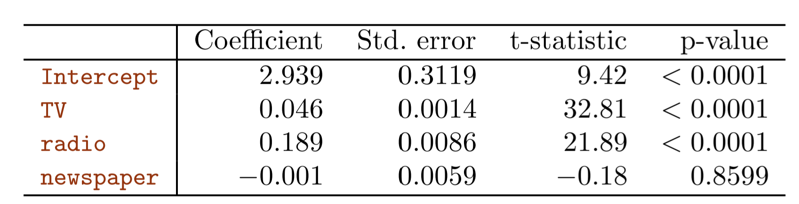
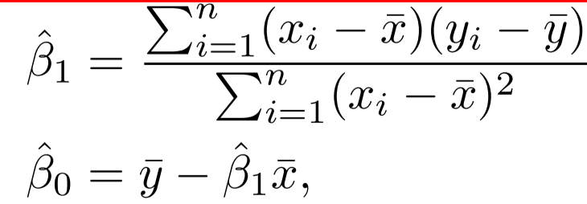
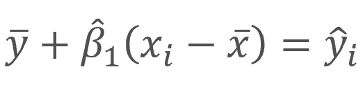

```{r setup, message = FALSE, warning=FALSE}
knitr::opts_chunk$set(warning = FALSE, message = FALSE)
library(tidyverse)
library(ISLR)
library(MASS)
library(modelr)
library(car)
```

# 3.6. Lab: Linear Regression

## 3.6.2 Simple Linear Regression

We will start by using the `lm()` function to fit a simple linear regression model, with `medv` as the response and `lstat` as the predictor. 

```{r}
(model1 <- lm(medv ~ lstat, data = Boston))
```

The `predict()` function can be used to produce confidence intervals and prediction intervals for the prediction of medv for a given value of lstat.
```{r}
predict(model1, tibble(lstat = c(5, 10, 15)), interval = "prediction")
```
```{r}
predict(model1, tibble(lstat = c(5, 10, 15)), interval = "confidence")
```

We will now plot `medv` and `lstat` along with the least squares regression line:
```{r}
ggplot(Boston, aes(lstat, medv)) +
  geom_point() +
  geom_abline(intercept = coef(model1)[1],
              slope = coef(model1)[2],
              color = "red")
```

There is some evidence for non-linearity in the relationship between lstat and `medv`.

Diagnostic plots for the linear model:
```{r}
par(mfrow = c(2, 2))
plot(model1)
```

Plotting the residuals:
```{r}
Boston %>% 
  add_residuals(model1) %>% 
  ggplot(aes(lstat, resid)) +
  geom_point() +
  geom_smooth(method = "loess", se = FALSE)
```

Plotting the studentized residuals (each residual divided by its standard error):
```{r}
Boston %>% 
  mutate(rstudent = rstudent(model1)) %>% 
  add_predictions(model1) %>% 
  ggplot(aes(pred, rstudent)) + 
  geom_point() +
  geom_hline(yintercept = 0, color = "red")
```

On the basis of the residual plots, there is some evidence of non-linearity. Leverage statistics can be computed for any number of predictors using the `hatvalues()` function.
```{r}
Boston %>% 
  add_predictions(model1) %>% 
  mutate(leverage = hatvalues(model1)) %>% 
  ggplot(aes(pred, leverage)) +
  geom_point()
```

Which observation has the largest leverage statistic?
```{r}
Boston %>% 
  mutate(leverage = hatvalues(model1)) %>% 
  filter(leverage == max(leverage))
```

## 3.6.3 Multiple Linear Regression

Model using a couple of predictors:
```{r}
model2 <- lm(medv ~ lstat + age, data = Boston)
summary(model2)
```

Model using all the dataset variables as predictors:
```{r}
model3 <- lm(medv ~ ., data = Boston)
summary(model3)
```

Computing the variance inflation factors:
```{r}
car::vif(model3)
```

Model using all variables except `age` (because it has a high p-value).
```{r}
model4 <- lm(medv ~ . - age, data = Boston)
summary(model4)
```

## 3.6.4 Interaction Terms
The syntax `lstat*age` simultaneously includes `lstat`, `age`, and the interaction term `lstat × age` as predictors; it is a shorthand for `lstat+age+lstat:age`.

```{r}
model5 <- lm(medv ~ lstat * age, data = Boston)
summary(model5)
```

## 3.6.5 Non-linear Transformations of the Predictors
Given a predictor $X$, we can create a predictor $X^2$ using `I(X^2)`. The function `I()` is needed since the `^` has a special meaning in a formula; wrapping as we do allows the standard usage in R, which is to raise X to the power 2. We now perform a regression of `medv` onto `lstat`
and `lstat2`.
```{r}
model6 <- lm(medv ~ lstat + I(lstat^2), data = Boston)
summary(model6)
```

It looks like the quadratic term leads to an improvement in the model. Let's use `anova()` to quantify the extent to which the quadratic fit is superior to the linear fit.
```{r}
anova(model1, model6)
```

Diagnostic plots for the quadratic model:
```{r}
par(mfrow = c(2, 2))
plot(model6)
```

Note that now there is little discernible pattern in the residuals plot.

We can use higher order polynomial terms using the function `poly()`, e.g.  `poly(lstat, 5)`.

## 3.6.6 Qualitative Predictors
We will now examine the `Carseats` data, which is part of the `ISLR` package. We will attempt to predict `Sales` (child car seat sales) in 400 locations based on a number of predictors.

Given a qualitative variable such as `Carseats$Shelveloc`, R generates dummy variables automatically.

The `contasts()` function returns the coding that R uses for the dummy variables.
```{r}
contrasts(Carseats$ShelveLoc)
```

# 3.7 Exercises

## Conceptual

(1) Describe the null hypotheses to which the p-values given in Table 3.4 correspond. Explain what conclusions you can draw based on these p-values. Your explanation should be phrased in terms of `sales`, `TV`, `radio`, and `newspaper`, rather than in terms of the coefficients of the linear model.



In each case the null hypothesis is that changes in `TV`, `radio`, or `newspaper` marketing budget (each one by itself) are not associated with changes in total `sales`, holding all the other variables constant. The `Intercept` null hypothesis is that `sales` are equal to zero when all the other variables are equal to zero.

From these p-values whe can conclude that more money spent on `TV` and `radio` is associated with more `sales`. In average, a $1,000 increase in `TV` advertising is associated with 46 more units sold, and an equal increase in `radio` with 189 more units sold.

(2) Carefully explain the differences between the KNN classifier and KNN regression methods.

A key difference between these two methods is that the KNN regression returns an average of the values of the nearest neighbours (because the response variable in a regression is continuous), but the KNN classifier just returns the class to which most of the nearby neighbors belong (in other words, it splits the space in areas or regions based on a decision boundary). 

(3) Suppose we have a data set with five predictors, X1 = GPA, X2 = IQ, X3 = Gender (1 for Female and 0 for Male), X4 = Interaction between GPA and IQ, and X5 = Interaction between GPA and Gender. The response is starting salary after graduation (in thousands of dollars). Suppose we use least squares to fit the model, and get β0 = 50, β1 = 20, β2 = 0.07, β3 = 35, β4 = 0.01, β5 = −10. 

a. Which answer is correct, and why?

ANWER: 


"iii" is correct. When GPA is higher than 3.5, males earn more than females, provided that GPA an IQ is fixed.
    
b. Predict the salary of a female with IQ of 110 and a GPA of 4.0.

    50 + 4*20 + 110*0.07 + 1*35 + 4*110*0.01 + 4*(-10) = 137.1
    
c. True or false: Since the coefficient for the GPA/IQ interaction term is very small, there is very little evidence of an interaction effect. Justify your answer.

ANSWER: False. We need to see the p-value to know if there is evidence of an interaction effect. It could happen that the standard error is so low that the interaction term is statistically significant, even though its estimated value is very low.

(4)  I collect a set of data (n = 100 observations) containing a single predictor and a quantitative response. I then fit a linear regression model to the data, as well as a separate cubic regression, i.e. $Y = β0 + β1X + β2X2 + β3X3 + e$.

a. Suppose that the true relationship between X and Y is linear, i.e. $Y = β0 + β1X + e$. Consider the training residual sum of squares (RSS) for the linear regression, and also the training RSS for the cubic regression. Would we expect one to be lower than the other, would we expect them to be the same, or is there not enough information to tell? Justify your answer.

ANSWER: One would expect that the training RSS of the cubic regression to be lower than the RSS of the linear regression because the training RSS always goes down when the model flexibility goes up. 
    
b. Answer (a) using test rather than training RSS.

ANSWER: In this case the expected RSS of the linear regression should be lower because the cubic regression would have a higher variance, which would not be offsetted by a reduction in bias (since the "true model" is actually linear). 
    
c. Suppose that the true relationship between X and Y is not linear, but we don’t know how far it is from linear. Consider the training RSS for the linear regression, and also the training RSS for the cubic regression. Would we expect one to be lower than the other, would we expect them to be the same, or is there not enough information to tell? Justify your answer.

ANSWER: Same as (a). One would expect that the training RSS of the cubic regression to be lower than the RSS of the linear regression because the training RSS always goes down when the model flexibility goes up. 
    
d. Answer (c) using test rather than training RSS.

ANSWER: It would depend on how non-linear is the true relationship between X and Y. If it's just cuadratic, either the linear model or the cubic model could have a lower training RSS. However, if the true relationship is very far from linear, then one expect the cubic regression RSS to be lower.
    
(5) Consider the fitted values that result from performing linear regression without an intercept. In this setting, the ith fitted value takes the form


Skipped. Best answer found in the internet: https://rpubs.com/toleafar/219579

6. Using (3.4), argue that in the case of simple linear regression, the least squares line always passes through the point $(\overline{x}, \overline{y})$.

ANSWER: From (3.4) we have:
    


So we can write:
    


In the last equation we can see than when $x_i = \overline{x}$, then $\hat{y} = \overline{y}$, which guarantees that the least squares line will pass through the mentioned point.

(7) It is claimed in the text that in the case of simple linear regression of $Y$ onto $X$, the $R^2$ statistic (3.17) is equal to the square of the correlation between $X$ and $Y$ (3.18). Prove that this is the case. For simplicity, you may assume that $\overline{x} = \overline{y} = 0$.

Skipped. Best solution found in: https://rpubs.com/ppaquay/65559 

## Applied

(8) This question involves the use of simple linear regression on the `Auto` data set.

a. Use the `lm()` function to perform a simple linear regression with `mpg` as the response and `horsepower` as the predictor. Use the `summary()` function to print the results. Comment on the output. For example:

i. Is there a relationship between the predictor and the response?

ii. How strong is the relationship between the predictor and the response?

iii. Is the relationship between the predictor and the response positive or negative?

iv. What is the predicted `mpg` associated with a `horsepower` of 98? What are the associated 95% confidence and prediction intervals?

```{r lm_mpg_hp}
lm_mpg_hp <- lm(mpg ~ horsepower, data = Auto)
summary(lm_mpg_hp)
```

The output indicates that *there is* a relationship between `mpg` and `horsepower`, and it's very strong, since the p-value for the coefficient is very very low. Also, it's a negative relationship (for an increase in one unit of `horsepower`, we expect to see a decrease of roughly -0.16 in `mpg`).
    
```{r}
predict(lm_mpg_hp, tibble(horsepower = 98), interval = "confidence")
```
    
```{r}
predict(lm_mpg_hp, tibble(horsepower = 98), interval = "prediction")
```

The predicted `mpg` for a value of 98 for `horsepower` is 24.47. The confidence interval is (23.97, 24.96) and the prediction interval is (14.8, 34.12).
    
b. Plot the response and the predictor. 

```{r}
lm_mpg_hp %>%
  ggplot(aes(horsepower, mpg)) +
  geom_point() +
  geom_abline(slope = coef(lm_mpg_hp)["horsepower"],
              intercept = coef(lm_mpg_hp)["(Intercept)"], 
              color = "red")
```

c. Use the `plot()` function to produce diagnostic plots of the least squares regression fit. Comment on any problems you see with the fit.
```{r}
par(mfrow = c(2, 2))
plot(lm_mpg_hp)
```

Looking at the 'Residuals vs Fitted' plot we can see that the relationship between `mpg` and `horsepower` is probably non-linear, but we're fitting a linear model. Another problem is the high leverage data points shown in the fourth plot
    
(9) This question involves the use of multiple linear regression on the `Auto` data set.

a. Produce a scatterplot matrix which includes all of the variables in the data set.
```{r}
plot(Auto)
```

b. Compute the matrix of correlations between the variables using the function `cor()`. You will need to exclude the name variable, which is qualitative.
```{r}
Auto %>% 
  dplyr::select(-name) %>% 
  cor()
```

c. Use the `lm()` function to perform a multiple linear regression with mpg as the response and all other variables except name as the predictors. Usethe `summary()` function to print the results. Comment on the output. For instance:

i. Is there a relationship between the predictors and the response? 

ii. Which predictors appear to have a statistically significant relationship to the response? 

iii. What does the coeficient for the `year` variable suggest? 

```{r}
lm_mpg_allothers <- lm(mpg ~ .-name, data = Auto)
summary(lm_mpg_allothers)
```

We can conclude that there is a relationship between at least one of the predictors and the response variable, since the p-value for the F-statistic is almost zero. The predictors which shown a statiscally significant relationship are `displacement`, `weight`, `year` and `origin`.
    
Also, the coefficent for the `year` variable suggest that, holding constant all the other predictors, each year the cars increase their efficiency by 0.75 miles per gallon, on average.
    
d. Use the `plot()` function to produce diagnostic plots of the linear regression fit. Comment on any problems you see with the fit. Do the residual plots suggest any unusually large outliers? Does the leverage plot identify any observations with unusually high leverage?
```{r}
par(mfrow = c(2, 2))
plot(lm_mpg_allothers)
```

There are no particularly high residuals / outliers in the model. However, the observation n°14 has a relatively high leverage (compared to the other observations).

e. Use the `*` and `:` symbols to fit linear regression models with interaction effects. Do any interactions appear to be statistically significant?
```{r}
lm(mpg ~ year*weight*horsepower, data = Auto) %>% 
  summary()
```

In this case all the interaction coefficients are statistically significant.
    
f. Try a few different transformations of the variables, such as $log(X)$, $\sqrt(X)$, $X^2$. Comment on your findings.
```{r}
lm(mpg ~ horsepower + I(horsepower^2), data = Auto) %>% plot()
```

```{r}
lm(mpg ~ poly(horsepower, 3), data = Auto) %>% summary()
```

In previous diagnostic plots we seen that the relationship between `horsepower` and `mpg` was probably non-linear (because the residuals showed a pattern across the `horsepower` variable). Now we can see that adding a cuadratic term for `horsepower` fixes this, and captures the non-linear relationship present in the data. However, adding a cubic term doesn't increses the explanatory power of the model.
    
(10) This question should be answered using the `Carseats` data set

a. Fit a multiple regression model to predict `Sales` using `Price`, `Urban`, and `Urban`.
```{r}
lm_carseats <- lm(Sales ~ Price + Urban + US, data = Carseats)
summary(lm_carseats)
```

b. Provide an interpretation of each coefficient in the model. Be careful—some of the variables in the model are qualitative!

ANSWER:

The Intercept estimate tell us that when all the other variables are zero (Price is equal to zero, the store is in a rural location, and is not located in the US) we can expect to see sales of 13,043 (asumming that the effects are linear and additive).

The `Price` coefficient indicates that an increase of 1 in the final price brings sales down by 54 units. The `UrbanYes` coefficient is not statistically significant, so we can't conclude that the sales level is different in urban areas vs. rural areas (holding constant all the other variables). Finally, the `USYes` coefficient is significant, and its value implies that a store in the US sales 1,200 more units, on average, than a non-US store.
    
c. Write out the model in equation form, being careful to handle the qualitative variables properly.


d. For which of the predictors can you reject the null hypothesis $H_0 : \beta_j = 0$?

ANSWER: The Intercept, `Price`, `Urban`, and `US`.
    
e. On the basis of your response to the previous question, fit a smaller model that only uses the predictors for which there is evidence of association with the outcome.
```{r}
lm_carseats_simp <- lm(Sales ~ Price + US, data = Carseats)
summary(lm_carseats_simp)
```

f. How well do the models in (a) and (e) fit the data?

ANSWER: The fit of both models is very similar, but the second model has a better adjusted R-squared, because we have removed a variable with no explanatory power (adjusted R-squared penalizes for each variable we add to the model, so including variables with little correlation with the response don't bring the number upwards, as it happens with the simple R-squared).

g. Using the model from (e), obtain 95% confidence intervals for the coefficient(s).
```{r}
confint(lm_carseats_simp)
```

h. Is there evidence of outliers or high leverage observations in the model from (e)?
```{r}
par(mfrow = c(2,2))
plot(lm_carseats_simp)
```

ANSWER: In the diagnostic plots we see little evidence of outlier observations. There seems to be an observation with relatively high leverage, but it's not problematic since it has a very low residual.
    
(11) In this problem we will investigate the t-statistic for the null hypothesis $H_0 : β = 0$ in simple linear regression without an intercept. To begin, we generate a predictor `x` and a response `y` as follows.
```{r}
set.seed(1)
x <- rnorm (100)
y <- 2*x + rnorm (100)
```

a. Perform a simple linear regression of `y` onto `x`, without an intercept. Report the coeficient estimate $\hat{\beta}$, the standard error of this coeficient estimate, and the t-statistic and p-value associated with the null hypothesis $H_0 : β = 0$. Comment on these results. (You can perform regression without an intercept using the command `lm(y∼x+0)`.)
```{r}
model_wo_int <- lm(y ~ x + 0)
summary(model_wo_int)
```

ANSWER: Since the data was generated by ourselves, we know that in the true model the coeficient $\beta_1$ is equal to 2, and the estimated value is very close to that. Also, the t-statistic is high, and the corresponding p-value is almost zero, indicating that is very unlikely that the null hypothesis $H_0 : β = 0$ would be true (we know it's not).
    
b. Now perform a simple linear regression of `x` onto `y` without an intercept, and report the coefficient estimate, its standard error, and the corresponding t-statistic and p-values associated with the null hypothesis $H0 : β = 0$. Comment on these results.
```{r}
model2_wo_int <- lm(x ~ y + 0)
summary(model2_wo_int)
```
  
As in the previous model, here the null hypothesis is rejected, concluding that there is a relationship between `x` and `y.`
    
c. What is the relationship between the results obtained in (a) and (b)?

ANSWER: Both models should represent the same linear relationship between `y` and `x`, but expressed in different ways. However, I don't understand why the estimate in the second model is ~0.4 instead of ~0.5 (when we solve for `x` in the true model, we find that the coeficient for `y` must be the inverse of 2 = 0.5).
    
d. Skipped, best solution found here: https://rpubs.com/ppaquay/65559

```{r}
n <- length(x)
t_ver1 <- (sqrt(n-1) * (x %*% y)) / sqrt((x %*% x)*(y %*% y) - ((x %*% y)^2))

t_ver2 <- 
  model2_wo_int %>% 
  broom::tidy() %>% 
  pull(statistic)

near(t_ver1, t_ver2)
```

e. Using the results from (d), argue that the t-statistic for the regression of `y` onto `x` is the same as the t-statistic for the regression of `x` onto `y`. 

ANSWER: The formula expressed in (d) shows that the t-value in this case (a simple linear regression without intercept) is the same when we switch the variables (i.e. the formula is simetrical on `x` and `y`).
    
f. In `R`, show that when regression is performed *with* an intercept, the t-statistic for $H_0 : β_1 = 0$ is the same for the regression of `y`
onto `x` as it is for the regression of `x` onto `y`.

```{r}
modelxy_with_int <- lm(x ~ y)
modelyx_with_int <- lm(y ~ x)
summary(modelxy_with_int)
summary(modelyx_with_int)
```

We can see that in both cases the t-value is almost the same.
    
(12) This problem involves simple linear regression without an intercept.

a. Recall that the coefficient estimate $\hat{\beta}$ for the linear regression of $Y$ onto $X$ without an intercept is given by (3.38). Under what circumstance is the coefficient estimate for the regression of $X$ onto $Y$ the same as the coefficient estimate for the regression of $Y$ onto $X$? 

ANSWER: The numerator in the $\hat{\beta}$ is always the same weather the regression is `y ~ x` or `x ~ y`. However, the denominator is usually different. If we want the whole coefficient to be the same in both cases, then this equality must be true:
    
$\sum{y_i^2} = \sum{x_i^2}$

b. Generate an example in `R` with $n = 100$ observations in which the coefficient estimate for the regression of $X$ onto $Y$ is different
from the coefficient estimate for the regression of $Y$ onto $X$.
```{r}
set.seed(1989)
x_1 <- rnorm(100)
y_1 <- rnorm(100) + 2*x_1

lm(x_1 ~ y_1 + 0) %>% summary()
lm(y_1 ~ x_1 + 0) %>% summary()
```

c. Generate an example in `R` with $n = 100$ observations in which the coefficient estimate for the regression of $X$ onto $Y$ *is the same* as the coefficient estimate for the regression of $Y$ onto $X$.
```{r}
x_2 <- rnorm(100)
y_2 <- sample(x_2, 100, replace = FALSE)

lm(x_2 ~ y_2 + 0) %>% summary()
lm(y_2 ~ x_2 + 0) %>% summary()
```

(14) This problem focuses on the *collinearity* problem.

a. Perform the following commands in `R`:
```{r}
set.seed(1)
x1 <- runif(100)
x2 <- 0.5*x1 + rnorm(100)/100
y <- 2 + 2*x1 + 0.3*x2 + rnorm(100)
```

The last line corresponds to creating a linear model in which y is a function of `x1` and `x2.` Write out the form of the linear model. What are the regression coefficients?

Answer: $y_i  = \beta_0 + \beta_1\cdot x_1+\beta_2\cdot x_2+\epsilon$. Where $\beta_1$ equals 2, $\beta_1$ equals 2 and $\beta_2$ equals 0.3.

b. What is the correlation between `x1` and `x2`? Create a scatterplot displaying the relationship between the variables.
```{r}
cor(x1, x2)
```
```{r}
qplot(x1, x2, geom = "point")
```

c. Using this data, fit a least squares regression to predict `y` using `x1` and `x2`. Describe the results obtained. What are $\hat{\beta_0}$, $\hat{\beta_1}$, and $\hat{\beta_2}$? How do these relate to the true $\hat{\beta_0}$, $\hat{\beta_1}$, and $\hat{\beta_0}$? Can you reject the null hypothesis $H_0 : \beta_1 = 0$? How about the null hypothesis $H_1:\beta_2 = 0$?

```{r}
reg_colin <- lm(y ~ x1 + x2)
summary(reg_colin)
```
```{r}
confint(reg_colin)
```

Only the Intercept estimate is near his true value. The estimates for the other coefficients are way off the correct values (2 and 0.3). Also, the confidence intervals for these coefficients are very wide, and in both cases we can't even reject the null hypothesis of each coefficient being equal to zero.
  
d. Now fit a least squares regression to predict `y` using only `x1`. Comment on your results. Can you reject the null hypothesis $H_0:\beta_1=0$?
```{r}
reg_no_colin <- lm(y ~ x1)
summary(reg_no_colin)
```
```{r}
confint(reg_no_colin)
```

Now the estimate for $\beta_1$ is much closer it's true value. Also, now we can't reject the null hypothesis of it being equal to zero.
    
e. Now fit a least squares regression to predict `y` using only `x2`. Comment on your results. Can you reject the null hypothesis $H_0:\beta_2=0$?
```{r}
reg_no_colin2 <- lm(y ~ x2)
summary(reg_no_colin2)
```
```{r}
confint(reg_no_colin2)
```

    As in d), in this case we can also reject the null hypothesis of the coefficient being equal to zero. However, the estimated value is much higher than it's true value (the true value is even outside the confidence interval). This may be because, since `x2` has been generated from `x1`, it's coefficient is picking up the relationship from both `x2` and `x1` (through their correlation) with the response variable.
    
f. Do the results obtained in (c)–(e) contradict each other? Explain your answer.

ANSWER: No. The results in (c) show what we should expect given the presence of heavy collinearity between two variables (bigger standard errors which in turn reduce the p-value, reducing the statistical power), while (d) and (e) show a more precise estimation when we rule out this problem. 

g. Now suppose we obtain one additional observation, which was unfortunately mismeasured.
```{r}
x1 <- c(x1 , 0.1)
x2 <- c(x2 , 0.8)
y <- c(y, 6)
```
Re-fit the linear models from (c) to (e) using this new data. What effect does this new observation have on the each of the models? In each model, is this observation an outlier? A high-leverage point? Both? Explain your answers.

```{r}
reg_colin_2 <- lm(y ~ x1 + x2)
summary(reg_colin_2)
```

```{r}
reg_no_colin1_2 <- lm(y ~ x1)
summary(reg_no_colin1_2)
```
```{r}
reg_no_colin2_2 <- lm(y ~ x2)
summary(reg_no_colin2_2)
```

The mismeasured observations have a big impact in models (c) and (e) but not so much in (d). This is because in that model, the new observation it's just an outlier, not a high leverage point (its value falls in the same range for `x1` as the rest of the observations). But in (c) and (e) the observation is both an outlier and a high leverage point (its value is unusual in `x2`, and also in `x1` and `x2` together). This introduces big bias in the estimate of `x2`.
    
(15) This problem involves the `Boston` data set, which we saw in the lab for this chapter. We will now try to predict per capita crime rate using the other variables in this data set. In other words, per capita crime rate is the response, and the other variables are the predictors.

a. For each predictor, fit a simple linear regression model to predict the response. Describe your results. In which of the models is there a statistically significant association between the predictor and the response? Create some plots to back up your assertions. 
```{r}
predictors <- 
  Boston %>% 
  dplyr::select(-crim) %>% 
  colnames()

simple_reg_crime <- function(predictor) {
  formula_crim <- as.formula(str_c("crim ~ ", predictor))
  lm(formula_crim, 
     data = Boston)
}

regs_crim <- map(predictors, simple_reg_crime)

(
  estimates_crim <-
    map(regs_crim, broom::tidy) %>%
    bind_rows() %>%
    filter(term != "(Intercept)") %>%
    mutate(Significant = ifelse(p.value < 0.05,
                                "Yes",
                                "No"))
)
```

```{r}
Boston %>%
  mutate_if(is.numeric, scale) %>% 
  gather(-crim, key = "variable", value = "value") %>% 
  ggplot(aes(value, crim), alpha = 0.05) +
  geom_point() +
  facet_wrap(~ variable) +
  geom_smooth(method = "glm", color = "red")
```

```{r}
cor(Boston) %>%
  corrplot::corrplot()
```

The regression models show that the response variable has a statiscally significant relationship with almost all the other variables, except `chas` (a binary variable that is equal to 1 if the suburb bounds the Charles River).
    
b. Fit a multiple regression model to predict the response using all of the predictors. Describe your results. For which predictors can we reject the null hypothesis $H_0 : \beta_j =0$?

```{r}
full_reg <- lm(crim ~ ., data = Boston)
summary(full_reg)
```

When we fit a model with all the available variables for many of them we can't reject the null hypothesis $H_0 : \beta_j =0$ (that is, they are not longer statistically significant once we add other predictors for the regession). The only coefficients which remain with a p-value less than 0.05 are `zn`, `dis`, `rad`, `black`, and `medv`.
    
c. How do your results from (a) compare to your results from (b)? Create a plot displaying the univariate regression coefficients from (a) on the x-axis, and the multiple regression coefficients from (b) on the y-axis. That is, each predictor is displayed as a single point in the plot. Its coefficient in a simple linear regression model is shown on the x-axis, and its coefficient estimate in the multiple linear regression model is shown on the y-axis.

```{r}
estimates_multi_crim <- 
  full_reg %>% 
  broom::tidy() %>% 
  dplyr::select(term, estimate)

estimates_crim %>% 
  dplyr::select(term, estimate) %>% 
  left_join(estimates_multi_crim, 
            by = "term",
            suffix = c("_simple", "_multi")) %>% 
  ggplot(aes(estimate_simple, estimate_multi)) +
  geom_point() +
  geom_abline(intercept = 0, slope = 1, color = "red") +
  ggrepel::geom_text_repel(aes(label = term))
```

`rm`, `chas` and `dis` estimates increased their value in the multiple linear regression, while the `nox` estimate dramatically decreased from 30 to -10. This probably means that `nox` correlates with other variables that have a positive relationship with `crime`, but when we hold the other variables constant, an increase in `nox` it's actually linked to less `crime.`
    
d.  Is there evidence of non-linear association between any of the predictors and the response? To answer this question, for each predictor X, fit a model of the form: $Y = \beta_0 + \beta_1\cdot X +\beta_2\cdot X^2 + \beta_3\cdot X^3 + \epsilon$
```{r}
cubic_reg_crime <- function(predictor) {
  formula_crim <- as.formula(str_c("crim ~ ", predictor, " + I(",predictor, "^2)", 
                                   " + I(",predictor, "^3)"))
  lm(formula_crim, 
     data = Boston)
}

regs_crim_cubic <- map(predictors, cubic_reg_crime)

(
  estimates_crim_cubic <-
    map(regs_crim_cubic, broom::tidy) %>%
    bind_rows() %>%
    filter(term != "(Intercept)") %>%
    mutate(Significant = ifelse(p.value < 0.05,
                                "Yes",
                                "No")) %>% 
    filter(Significant == "Yes")
)
```

In many variables we see evidence of non linear relationship: `indus`, `nox`, `age`, `dis`, `pratio` and `medv`.