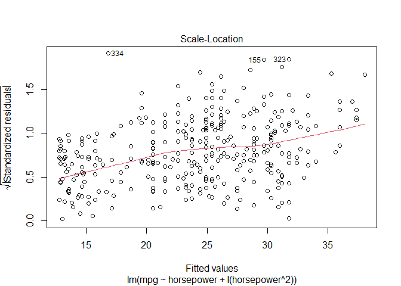
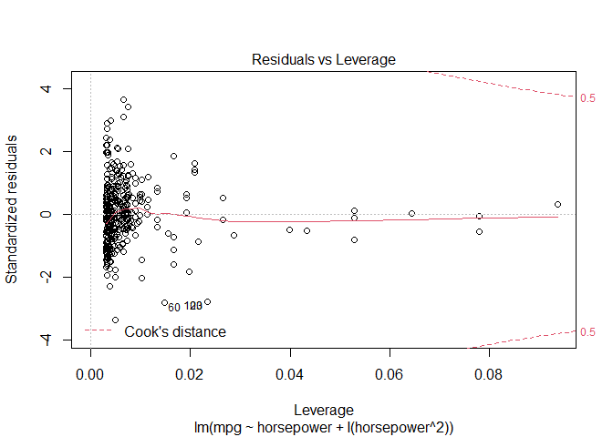
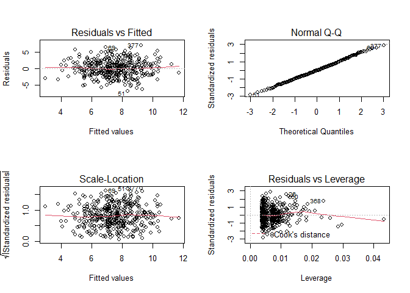

Chapter 3. Linear Regression
================

``` r
knitr::opts_chunk$set(warning = FALSE, message = FALSE)
library(tidyverse)
library(ISLR)
library(MASS)
library(modelr)
library(car)
```

# 3.6. Lab: Linear Regression

## 3.6.2 Simple Linear Regression

We will start by using the `lm()` function to fit a simple linear
regression model, with `medv` as the response and `lstat` as the
predictor.

``` r
(model1 <- lm(medv ~ lstat, data = Boston))
```

    ## 
    ## Call:
    ## lm(formula = medv ~ lstat, data = Boston)
    ## 
    ## Coefficients:
    ## (Intercept)        lstat  
    ##       34.55        -0.95

The `predict()` function can be used to produce confidence intervals and
prediction intervals for the prediction of medv for a given value of
lstat.

``` r
predict(model1, tibble(lstat = c(5, 10, 15)), interval = "prediction")
```

    ##        fit       lwr      upr
    ## 1 29.80359 17.565675 42.04151
    ## 2 25.05335 12.827626 37.27907
    ## 3 20.30310  8.077742 32.52846

``` r
predict(model1, tibble(lstat = c(5, 10, 15)), interval = "confidence")
```

    ##        fit      lwr      upr
    ## 1 29.80359 29.00741 30.59978
    ## 2 25.05335 24.47413 25.63256
    ## 3 20.30310 19.73159 20.87461

We will now plot `medv` and `lstat` along with the least squares
regression line:

``` r
ggplot(Boston, aes(lstat, medv)) +
  geom_point() +
  geom_abline(intercept = coef(model1)[1],
              slope = coef(model1)[2],
              color = "red")
```

<!-- -->

There is some evidence for non-linearity in the relationship between
lstat and `medv`.

Diagnostic plots for the linear model:

``` r
par(mfrow = c(2, 2))
plot(model1)
```

<!-- -->

Plotting the residuals:

``` r
Boston %>% 
  add_residuals(model1) %>% 
  ggplot(aes(lstat, resid)) +
  geom_point() +
  geom_smooth(method = "loess", se = FALSE)
```

<!-- -->

Plotting the studentized residuals (each residual divided by its
standard error):

``` r
Boston %>% 
  mutate(rstudent = rstudent(model1)) %>% 
  add_predictions(model1) %>% 
  ggplot(aes(pred, rstudent)) + 
  geom_point() +
  geom_hline(yintercept = 0, color = "red")
```

<!-- -->

On the basis of the residual plots, there is some evidence of
non-linearity. Leverage statistics can be computed for any number of
predictors using the `hatvalues()` function.

``` r
Boston %>% 
  add_predictions(model1) %>% 
  mutate(leverage = hatvalues(model1)) %>% 
  ggplot(aes(pred, leverage)) +
  geom_point()
```

<!-- -->

Which observation has the largest leverage statistic?

``` r
Boston %>% 
  mutate(leverage = hatvalues(model1)) %>% 
  filter(leverage == max(leverage))
```

    ##      crim zn indus chas   nox    rm age   dis rad tax ptratio black lstat medv
    ## 1 18.4982  0  18.1    0 0.668 4.138 100 1.137  24 666    20.2 396.9 37.97 13.8
    ##     leverage
    ## 1 0.02686517

## 3.6.3 Multiple Linear Regression

Model using a couple of predictors:

``` r
model2 <- lm(medv ~ lstat + age, data = Boston)
summary(model2)
```

    ## 
    ## Call:
    ## lm(formula = medv ~ lstat + age, data = Boston)
    ## 
    ## Residuals:
    ##     Min      1Q  Median      3Q     Max 
    ## -15.981  -3.978  -1.283   1.968  23.158 
    ## 
    ## Coefficients:
    ##             Estimate Std. Error t value Pr(>|t|)    
    ## (Intercept) 33.22276    0.73085  45.458  < 2e-16 ***
    ## lstat       -1.03207    0.04819 -21.416  < 2e-16 ***
    ## age          0.03454    0.01223   2.826  0.00491 ** 
    ## ---
    ## Signif. codes:  0 '***' 0.001 '**' 0.01 '*' 0.05 '.' 0.1 ' ' 1
    ## 
    ## Residual standard error: 6.173 on 503 degrees of freedom
    ## Multiple R-squared:  0.5513, Adjusted R-squared:  0.5495 
    ## F-statistic:   309 on 2 and 503 DF,  p-value: < 2.2e-16

Model using all the dataset variables as predictors:

``` r
model3 <- lm(medv ~ ., data = Boston)
summary(model3)
```

    ## 
    ## Call:
    ## lm(formula = medv ~ ., data = Boston)
    ## 
    ## Residuals:
    ##     Min      1Q  Median      3Q     Max 
    ## -15.595  -2.730  -0.518   1.777  26.199 
    ## 
    ## Coefficients:
    ##               Estimate Std. Error t value Pr(>|t|)    
    ## (Intercept)  3.646e+01  5.103e+00   7.144 3.28e-12 ***
    ## crim        -1.080e-01  3.286e-02  -3.287 0.001087 ** 
    ## zn           4.642e-02  1.373e-02   3.382 0.000778 ***
    ## indus        2.056e-02  6.150e-02   0.334 0.738288    
    ## chas         2.687e+00  8.616e-01   3.118 0.001925 ** 
    ## nox         -1.777e+01  3.820e+00  -4.651 4.25e-06 ***
    ## rm           3.810e+00  4.179e-01   9.116  < 2e-16 ***
    ## age          6.922e-04  1.321e-02   0.052 0.958229    
    ## dis         -1.476e+00  1.995e-01  -7.398 6.01e-13 ***
    ## rad          3.060e-01  6.635e-02   4.613 5.07e-06 ***
    ## tax         -1.233e-02  3.760e-03  -3.280 0.001112 ** 
    ## ptratio     -9.527e-01  1.308e-01  -7.283 1.31e-12 ***
    ## black        9.312e-03  2.686e-03   3.467 0.000573 ***
    ## lstat       -5.248e-01  5.072e-02 -10.347  < 2e-16 ***
    ## ---
    ## Signif. codes:  0 '***' 0.001 '**' 0.01 '*' 0.05 '.' 0.1 ' ' 1
    ## 
    ## Residual standard error: 4.745 on 492 degrees of freedom
    ## Multiple R-squared:  0.7406, Adjusted R-squared:  0.7338 
    ## F-statistic: 108.1 on 13 and 492 DF,  p-value: < 2.2e-16

Computing the variance inflation factors:

``` r
car::vif(model3)
```

    ##     crim       zn    indus     chas      nox       rm      age      dis 
    ## 1.792192 2.298758 3.991596 1.073995 4.393720 1.933744 3.100826 3.955945 
    ##      rad      tax  ptratio    black    lstat 
    ## 7.484496 9.008554 1.799084 1.348521 2.941491

Model using all variables except `age` (because it has a high p-value).

``` r
model4 <- lm(medv ~ . - age, data = Boston)
summary(model4)
```

    ## 
    ## Call:
    ## lm(formula = medv ~ . - age, data = Boston)
    ## 
    ## Residuals:
    ##      Min       1Q   Median       3Q      Max 
    ## -15.6054  -2.7313  -0.5188   1.7601  26.2243 
    ## 
    ## Coefficients:
    ##               Estimate Std. Error t value Pr(>|t|)    
    ## (Intercept)  36.436927   5.080119   7.172 2.72e-12 ***
    ## crim         -0.108006   0.032832  -3.290 0.001075 ** 
    ## zn            0.046334   0.013613   3.404 0.000719 ***
    ## indus         0.020562   0.061433   0.335 0.737989    
    ## chas          2.689026   0.859598   3.128 0.001863 ** 
    ## nox         -17.713540   3.679308  -4.814 1.97e-06 ***
    ## rm            3.814394   0.408480   9.338  < 2e-16 ***
    ## dis          -1.478612   0.190611  -7.757 5.03e-14 ***
    ## rad           0.305786   0.066089   4.627 4.75e-06 ***
    ## tax          -0.012329   0.003755  -3.283 0.001099 ** 
    ## ptratio      -0.952211   0.130294  -7.308 1.10e-12 ***
    ## black         0.009321   0.002678   3.481 0.000544 ***
    ## lstat        -0.523852   0.047625 -10.999  < 2e-16 ***
    ## ---
    ## Signif. codes:  0 '***' 0.001 '**' 0.01 '*' 0.05 '.' 0.1 ' ' 1
    ## 
    ## Residual standard error: 4.74 on 493 degrees of freedom
    ## Multiple R-squared:  0.7406, Adjusted R-squared:  0.7343 
    ## F-statistic: 117.3 on 12 and 493 DF,  p-value: < 2.2e-16

## 3.6.4 Interaction Terms

The syntax `lstat*age` simultaneously includes `lstat`, `age`, and the
interaction term `lstat × age` as predictors; it is a shorthand for
`lstat+age+lstat:age`.

``` r
model5 <- lm(medv ~ lstat * age, data = Boston)
summary(model5)
```

    ## 
    ## Call:
    ## lm(formula = medv ~ lstat * age, data = Boston)
    ## 
    ## Residuals:
    ##     Min      1Q  Median      3Q     Max 
    ## -15.806  -4.045  -1.333   2.085  27.552 
    ## 
    ## Coefficients:
    ##               Estimate Std. Error t value Pr(>|t|)    
    ## (Intercept) 36.0885359  1.4698355  24.553  < 2e-16 ***
    ## lstat       -1.3921168  0.1674555  -8.313 8.78e-16 ***
    ## age         -0.0007209  0.0198792  -0.036   0.9711    
    ## lstat:age    0.0041560  0.0018518   2.244   0.0252 *  
    ## ---
    ## Signif. codes:  0 '***' 0.001 '**' 0.01 '*' 0.05 '.' 0.1 ' ' 1
    ## 
    ## Residual standard error: 6.149 on 502 degrees of freedom
    ## Multiple R-squared:  0.5557, Adjusted R-squared:  0.5531 
    ## F-statistic: 209.3 on 3 and 502 DF,  p-value: < 2.2e-16

## 3.6.5 Non-linear Transformations of the Predictors

Given a predictor \(X\), we can create a predictor \(X^2\) using
`I(X^2)`. The function `I()` is needed since the `^` has a special
meaning in a formula; wrapping as we do allows the standard usage in R,
which is to raise X to the power 2. We now perform a regression of
`medv` onto `lstat` and `lstat2`.

``` r
model6 <- lm(medv ~ lstat + I(lstat^2), data = Boston)
summary(model6)
```

    ## 
    ## Call:
    ## lm(formula = medv ~ lstat + I(lstat^2), data = Boston)
    ## 
    ## Residuals:
    ##      Min       1Q   Median       3Q      Max 
    ## -15.2834  -3.8313  -0.5295   2.3095  25.4148 
    ## 
    ## Coefficients:
    ##              Estimate Std. Error t value Pr(>|t|)    
    ## (Intercept) 42.862007   0.872084   49.15   <2e-16 ***
    ## lstat       -2.332821   0.123803  -18.84   <2e-16 ***
    ## I(lstat^2)   0.043547   0.003745   11.63   <2e-16 ***
    ## ---
    ## Signif. codes:  0 '***' 0.001 '**' 0.01 '*' 0.05 '.' 0.1 ' ' 1
    ## 
    ## Residual standard error: 5.524 on 503 degrees of freedom
    ## Multiple R-squared:  0.6407, Adjusted R-squared:  0.6393 
    ## F-statistic: 448.5 on 2 and 503 DF,  p-value: < 2.2e-16

It looks like the quadratic term leads to an improvement in the model.
Let’s use `anova()` to quantify the extent to which the quadratic fit is
superior to the linear fit.

``` r
anova(model1, model6)
```

    ## Analysis of Variance Table
    ## 
    ## Model 1: medv ~ lstat
    ## Model 2: medv ~ lstat + I(lstat^2)
    ##   Res.Df   RSS Df Sum of Sq     F    Pr(>F)    
    ## 1    504 19472                                 
    ## 2    503 15347  1    4125.1 135.2 < 2.2e-16 ***
    ## ---
    ## Signif. codes:  0 '***' 0.001 '**' 0.01 '*' 0.05 '.' 0.1 ' ' 1

Diagnostic plots for the quadratic model:

``` r
par(mfrow = c(2, 2))
plot(model6)
```

<!-- -->

Note that now there is little discernible pattern in the residuals plot.

We can use higher order polynomial terms using the function `poly()`,
e.g. `poly(lstat, 5)`.

## 3.6.6 Qualitative Predictors

We will now examine the `Carseats` data, which is part of the `ISLR`
package. We will attempt to predict `Sales` (child car seat sales) in
400 locations based on a number of predictors.

Given a qualitative variable such as `Carseats$Shelveloc`, R generates
dummy variables automatically.

The `contasts()` function returns the coding that R uses for the dummy
variables.

``` r
contrasts(Carseats$ShelveLoc)
```

    ##        Good Medium
    ## Bad       0      0
    ## Good      1      0
    ## Medium    0      1

# 3.7 Exercises

## Conceptual

(1) Describe the null hypotheses to which the p-values given in Table
3.4 correspond. Explain what conclusions you can draw based on these
p-values. Your explanation should be phrased in terms of `sales`, `TV`,
`radio`, and `newspaper`, rather than in terms of the coefficients of
the linear model.


In each case the null hypothesis is that changes in `TV`, `radio`, or
`newspaper` marketing budget (each one by itself) are not associated
with changes in total `sales`, holding all the other variables constant.
The `Intercept` null hypothesis is that `sales` are equal to zero when
all the other variables are equal to zero.

From these p-values whe can conclude that more money spent on `TV` and
`radio` is associated with more `sales`. In average, a $1,000 increase
in `TV` advertising is associated with 46 more units sold, and an equal
increase in `radio` with 189 more units sold.

(2) Carefully explain the differences between the KNN classifier and KNN
regression methods.

A key difference between these two methods is that the KNN regression
returns an average of the values of the nearest neighbours (because the
response variable in a regression is continuous), but the KNN classifier
just returns the class to which most of the nearby neighbors belong (in
other words, it splits the space in areas or regions based on a decision
boundary).

(3) Suppose we have a data set with five predictors, X1 = GPA, X2 = IQ,
X3 = Gender (1 for Female and 0 for Male), X4 = Interaction between GPA
and IQ, and X5 = Interaction between GPA and Gender. The response is
starting salary after graduation (in thousands of dollars). Suppose we
use least squares to fit the model, and get β0 = 50, β1 = 20, β2 = 0.07,
β3 = 35, β4 = 0.01, β5 = −10.

a. Which answer is correct, and why?

ANWER: 

“iii” is correct. When GPA is higher than 3.5, males earn more than
females, provided that GPA an IQ is fixed.

b. Predict the salary of a female with IQ of 110 and a GPA of 4.0.

    50 + 4*20 + 110*0.07 + 1*35 + 4*110*0.01 + 4*(-10) = 137.1

c. True or false: Since the coefficient for the GPA/IQ interaction term
is very small, there is very little evidence of an interaction effect.
Justify your answer.

ANSWER: False. We need to see the p-value to know if there is evidence
of an interaction effect. It could happen that the standard error is so
low that the interaction term is statistically significant, even though
its estimated value is very low.

(4) I collect a set of data (n = 100 observations) containing a single
predictor and a quantitative response. I then fit a linear regression
model to the data, as well as a separate cubic regression,
i.e. \(Y = β0 + β1X + β2X2 + β3X3 + e\).

a. Suppose that the true relationship between X and Y is linear,
i.e. \(Y = β0 + β1X + e\). Consider the training residual sum of
squares (RSS) for the linear regression, and also the training RSS for
the cubic regression. Would we expect one to be lower than the other,
would we expect them to be the same, or is there not enough information
to tell? Justify your answer.

ANSWER: One would expect that the training RSS of the cubic regression
to be lower than the RSS of the linear regression because the training
RSS always goes down when the model flexibility goes up.

b. Answer (a) using test rather than training RSS.

ANSWER: In this case the expected RSS of the linear regression should be
lower because the cubic regression would have a higher variance, which
would not be offsetted by a reduction in bias (since the “true model” is
actually linear).

c. Suppose that the true relationship between X and Y is not linear, but
we don’t know how far it is from linear. Consider the training RSS for
the linear regression, and also the training RSS for the cubic
regression. Would we expect one to be lower than the other, would we
expect them to be the same, or is there not enough information to tell?
Justify your answer.

ANSWER: Same as (a). One would expect that the training RSS of the cubic
regression to be lower than the RSS of the linear regression because the
training RSS always goes down when the model flexibility goes up.

d. Answer (c) using test rather than training RSS.

ANSWER: It would depend on how non-linear is the true relationship
between X and Y. If it’s just cuadratic, either the linear model or the
cubic model could have a lower training RSS. However, if the true
relationship is very far from linear, then one expect the cubic
regression RSS to be lower.

(5) Consider the fitted values that result from performing linear
regression without an intercept. In this setting, the ith fitted value
takes the form


Skipped. Best answer found in the internet:
<https://rpubs.com/toleafar/219579>

6.  Using (3.4), argue that in the case of simple linear regression, the
    least squares line always passes through the point
    \((\overline{x}, \overline{y})\).

ANSWER: From (3.4) we have:


So we can write:

  In the last equation we can
see than when \(x_i = \overline{x}\), then \(\hat{y} = \overline{y}\),
which guarantees that the least squares line will pass through the
mentioned point.

(7) It is claimed in the text that in the case of simple linear
regression of \(Y\) onto \(X\), the \(R^2\) statistic (3.17) is equal to
the square of the correlation between \(X\) and \(Y\) (3.18). Prove that
this is the case. For simplicity, you may assume that
\(\overline{x} = \overline{y} = 0\).

Skipped. Best solution found in: <https://rpubs.com/ppaquay/65559>

## Applied

(8) This question involves the use of simple linear regression on the
`Auto` data set.

a. Use the `lm()` function to perform a simple linear regression with
`mpg` as the response and `horsepower` as the predictor. Use the
`summary()` function to print the results. Comment on the output. For
example:

i. Is there a relationship between the predictor and the response?

ii. How strong is the relationship between the predictor and the
response?

iii. Is the relationship between the predictor and the response positive
or negative?

iv. What is the predicted `mpg` associated with a `horsepower` of 98?
What are the associated 95% confidence and prediction intervals?

``` r
lm_mpg_hp <- lm(mpg ~ horsepower, data = Auto)
summary(lm_mpg_hp)
```

    ## 
    ## Call:
    ## lm(formula = mpg ~ horsepower, data = Auto)
    ## 
    ## Residuals:
    ##      Min       1Q   Median       3Q      Max 
    ## -13.5710  -3.2592  -0.3435   2.7630  16.9240 
    ## 
    ## Coefficients:
    ##              Estimate Std. Error t value Pr(>|t|)    
    ## (Intercept) 39.935861   0.717499   55.66   <2e-16 ***
    ## horsepower  -0.157845   0.006446  -24.49   <2e-16 ***
    ## ---
    ## Signif. codes:  0 '***' 0.001 '**' 0.01 '*' 0.05 '.' 0.1 ' ' 1
    ## 
    ## Residual standard error: 4.906 on 390 degrees of freedom
    ## Multiple R-squared:  0.6059, Adjusted R-squared:  0.6049 
    ## F-statistic: 599.7 on 1 and 390 DF,  p-value: < 2.2e-16

The output indicates that *there is* a relationship between `mpg` and
`horsepower`, and it’s very strong, since the p-value for the
coefficient is very very low. Also, it’s a negative relationship (for an
increase in one unit of `horsepower`, we expect to see a decrease of
roughly -0.16 in `mpg`).

``` r
predict(lm_mpg_hp, tibble(horsepower = 98), interval = "confidence")
```

    ##        fit      lwr      upr
    ## 1 24.46708 23.97308 24.96108

``` r
predict(lm_mpg_hp, tibble(horsepower = 98), interval = "prediction")
```

    ##        fit     lwr      upr
    ## 1 24.46708 14.8094 34.12476

The predicted `mpg` for a value of 98 for `horsepower` is 24.47. The
confidence interval is (23.97, 24.96) and the prediction interval is
(14.8, 34.12).

b. Plot the response and the predictor.

``` r
lm_mpg_hp %>%
  ggplot(aes(horsepower, mpg)) +
  geom_point() +
  geom_abline(slope = coef(lm_mpg_hp)["horsepower"],
              intercept = coef(lm_mpg_hp)["(Intercept)"], 
              color = "red")
```

<!-- -->

c. Use the `plot()` function to produce diagnostic plots of the least
squares regression fit. Comment on any problems you see with the fit.

``` r
par(mfrow = c(2, 2))
plot(lm_mpg_hp)
```

<!-- -->

Looking at the ‘Residuals vs Fitted’ plot we can see that the
relationship between `mpg` and `horsepower` is probably non-linear, but
we’re fitting a linear model. Another problem is the high leverage data
points shown in the fourth plot

(9) This question involves the use of multiple linear regression on the
`Auto` data set.

a. Produce a scatterplot matrix which includes all of the variables in
the data set.

``` r
plot(Auto)
```

<!-- -->

b. Compute the matrix of correlations between the variables using the
function `cor()`. You will need to exclude the name variable, which is
qualitative.

``` r
Auto %>% 
  dplyr::select(-name) %>% 
  cor()
```

    ##                     mpg  cylinders displacement horsepower     weight
    ## mpg           1.0000000 -0.7776175   -0.8051269 -0.7784268 -0.8322442
    ## cylinders    -0.7776175  1.0000000    0.9508233  0.8429834  0.8975273
    ## displacement -0.8051269  0.9508233    1.0000000  0.8972570  0.9329944
    ## horsepower   -0.7784268  0.8429834    0.8972570  1.0000000  0.8645377
    ## weight       -0.8322442  0.8975273    0.9329944  0.8645377  1.0000000
    ## acceleration  0.4233285 -0.5046834   -0.5438005 -0.6891955 -0.4168392
    ## year          0.5805410 -0.3456474   -0.3698552 -0.4163615 -0.3091199
    ## origin        0.5652088 -0.5689316   -0.6145351 -0.4551715 -0.5850054
    ##              acceleration       year     origin
    ## mpg             0.4233285  0.5805410  0.5652088
    ## cylinders      -0.5046834 -0.3456474 -0.5689316
    ## displacement   -0.5438005 -0.3698552 -0.6145351
    ## horsepower     -0.6891955 -0.4163615 -0.4551715
    ## weight         -0.4168392 -0.3091199 -0.5850054
    ## acceleration    1.0000000  0.2903161  0.2127458
    ## year            0.2903161  1.0000000  0.1815277
    ## origin          0.2127458  0.1815277  1.0000000

c. Use the `lm()` function to perform a multiple linear regression with
mpg as the response and all other variables except name as the
predictors. Usethe `summary()` function to print the results. Comment on
the output. For instance:

i. Is there a relationship between the predictors and the response?

ii. Which predictors appear to have a statistically significant
relationship to the response?

iii. What does the coeficient for the `year` variable suggest?

``` r
lm_mpg_allothers <- lm(mpg ~ .-name, data = Auto)
summary(lm_mpg_allothers)
```

    ## 
    ## Call:
    ## lm(formula = mpg ~ . - name, data = Auto)
    ## 
    ## Residuals:
    ##     Min      1Q  Median      3Q     Max 
    ## -9.5903 -2.1565 -0.1169  1.8690 13.0604 
    ## 
    ## Coefficients:
    ##                Estimate Std. Error t value Pr(>|t|)    
    ## (Intercept)  -17.218435   4.644294  -3.707  0.00024 ***
    ## cylinders     -0.493376   0.323282  -1.526  0.12780    
    ## displacement   0.019896   0.007515   2.647  0.00844 ** 
    ## horsepower    -0.016951   0.013787  -1.230  0.21963    
    ## weight        -0.006474   0.000652  -9.929  < 2e-16 ***
    ## acceleration   0.080576   0.098845   0.815  0.41548    
    ## year           0.750773   0.050973  14.729  < 2e-16 ***
    ## origin         1.426141   0.278136   5.127 4.67e-07 ***
    ## ---
    ## Signif. codes:  0 '***' 0.001 '**' 0.01 '*' 0.05 '.' 0.1 ' ' 1
    ## 
    ## Residual standard error: 3.328 on 384 degrees of freedom
    ## Multiple R-squared:  0.8215, Adjusted R-squared:  0.8182 
    ## F-statistic: 252.4 on 7 and 384 DF,  p-value: < 2.2e-16

We can conclude that there is a relationship between at least one of the
predictors and the response variable, since the p-value for the
F-statistic is almost zero. The predictors which shown a statiscally
significant relationship are `displacement`, `weight`, `year` and
`origin`.

Also, the coefficent for the `year` variable suggest that, holding
constant all the other predictors, each year the cars increase their
efficiency by 0.75 miles per gallon, on average.

d. Use the `plot()` function to produce diagnostic plots of the linear
regression fit. Comment on any problems you see with the fit. Do the
residual plots suggest any unusually large outliers? Does the leverage
plot identify any observations with unusually high leverage?

``` r
par(mfrow = c(2, 2))
plot(lm_mpg_allothers)
```

<!-- -->

There are no particularly high residuals / outliers in the model.
However, the observation n°14 has a relatively high leverage (compared
to the other observations).

e. Use the `*` and `:` symbols to fit linear regression models with
interaction effects. Do any interactions appear to be statistically
significant?

``` r
lm(mpg ~ year*weight*horsepower, data = Auto) %>% 
  summary()
```

    ## 
    ## Call:
    ## lm(formula = mpg ~ year * weight * horsepower, data = Auto)
    ## 
    ## Residuals:
    ##     Min      1Q  Median      3Q     Max 
    ## -7.8796 -1.6800 -0.0639  1.2556 11.5534 
    ## 
    ## Coefficients:
    ##                          Estimate Std. Error t value Pr(>|t|)    
    ## (Intercept)            -1.577e+02  3.694e+01  -4.270 2.47e-05 ***
    ## year                    2.886e+00  4.906e-01   5.884 8.75e-09 ***
    ## weight                  1.889e-02  1.286e-02   1.469  0.14273    
    ## horsepower              1.696e+00  4.208e-01   4.029 6.74e-05 ***
    ## year:weight            -3.943e-04  1.712e-04  -2.303  0.02180 *  
    ## year:horsepower        -2.540e-02  5.652e-03  -4.494 9.27e-06 ***
    ## weight:horsepower      -3.218e-04  1.112e-04  -2.893  0.00403 ** 
    ## year:weight:horsepower  4.972e-06  1.500e-06   3.314  0.00101 ** 
    ## ---
    ## Signif. codes:  0 '***' 0.001 '**' 0.01 '*' 0.05 '.' 0.1 ' ' 1
    ## 
    ## Residual standard error: 2.826 on 384 degrees of freedom
    ## Multiple R-squared:  0.8712, Adjusted R-squared:  0.8689 
    ## F-statistic: 371.2 on 7 and 384 DF,  p-value: < 2.2e-16

In this case all the interaction coefficients are statistically
significant.

f. Try a few different transformations of the variables, such as
\(log(X)\), \(\sqrt(X)\), \(X^2\). Comment on your findings.

``` r
lm(mpg ~ horsepower + I(horsepower^2), data = Auto) %>% plot()
```

<!-- --><!-- --><!-- --><!-- -->

``` r
lm(mpg ~ poly(horsepower, 3), data = Auto) %>% summary()
```

    ## 
    ## Call:
    ## lm(formula = mpg ~ poly(horsepower, 3), data = Auto)
    ## 
    ## Residuals:
    ##      Min       1Q   Median       3Q      Max 
    ## -14.7039  -2.4491  -0.1519   2.2035  15.8159 
    ## 
    ## Coefficients:
    ##                      Estimate Std. Error t value Pr(>|t|)    
    ## (Intercept)            23.446      0.221 106.105   <2e-16 ***
    ## poly(horsepower, 3)1 -120.138      4.375 -27.460   <2e-16 ***
    ## poly(horsepower, 3)2   44.090      4.375  10.078   <2e-16 ***
    ## poly(horsepower, 3)3   -3.949      4.375  -0.903    0.367    
    ## ---
    ## Signif. codes:  0 '***' 0.001 '**' 0.01 '*' 0.05 '.' 0.1 ' ' 1
    ## 
    ## Residual standard error: 4.375 on 388 degrees of freedom
    ## Multiple R-squared:  0.6882, Adjusted R-squared:  0.6858 
    ## F-statistic: 285.5 on 3 and 388 DF,  p-value: < 2.2e-16

In previous diagnostic plots we seen that the relationship between
`horsepower` and `mpg` was probably non-linear (because the residuals
showed a pattern across the `horsepower` variable). Now we can see that
adding a cuadratic term for `horsepower` fixes this, and captures the
non-linear relationship present in the data. However, adding a cubic
term doesn’t increses the explanatory power of the model.

(10) This question should be answered using the `Carseats` data set

a. Fit a multiple regression model to predict `Sales` using `Price`,
`Urban`, and `Urban`.

``` r
lm_carseats <- lm(Sales ~ Price + Urban + US, data = Carseats)
summary(lm_carseats)
```

    ## 
    ## Call:
    ## lm(formula = Sales ~ Price + Urban + US, data = Carseats)
    ## 
    ## Residuals:
    ##     Min      1Q  Median      3Q     Max 
    ## -6.9206 -1.6220 -0.0564  1.5786  7.0581 
    ## 
    ## Coefficients:
    ##              Estimate Std. Error t value Pr(>|t|)    
    ## (Intercept) 13.043469   0.651012  20.036  < 2e-16 ***
    ## Price       -0.054459   0.005242 -10.389  < 2e-16 ***
    ## UrbanYes    -0.021916   0.271650  -0.081    0.936    
    ## USYes        1.200573   0.259042   4.635 4.86e-06 ***
    ## ---
    ## Signif. codes:  0 '***' 0.001 '**' 0.01 '*' 0.05 '.' 0.1 ' ' 1
    ## 
    ## Residual standard error: 2.472 on 396 degrees of freedom
    ## Multiple R-squared:  0.2393, Adjusted R-squared:  0.2335 
    ## F-statistic: 41.52 on 3 and 396 DF,  p-value: < 2.2e-16

b. Provide an interpretation of each coefficient in the model. Be
careful—some of the variables in the model are qualitative\!

ANSWER:

The Intercept estimate tell us that when all the other variables are
zero (Price is equal to zero, the store is in a rural location, and is
not located in the US) we can expect to see sales of 13,043 (asumming
that the effects are linear and additive).

The `Price` coefficient indicates that an increase of 1 in the final
price brings sales down by 54 units. The `UrbanYes` coefficient is not
statistically significant, so we can’t conclude that the sales level is
different in urban areas vs. rural areas (holding constant all the other
variables). Finally, the `USYes` coefficient is significant, and its
value implies that a store in the US sales 1,200 more units, on average,
than a non-US store.

c. Write out the model in equation form, being careful to handle the
qualitative variables properly.


d. For which of the predictors can you reject the null hypothesis
\(H_0 : \beta_j = 0\)?

ANSWER: The Intercept, `Price`, `Urban`, and `US`.

e. On the basis of your response to the previous question, fit a smaller
model that only uses the predictors for which there is evidence of
association with the outcome.

``` r
lm_carseats_simp <- lm(Sales ~ Price + US, data = Carseats)
summary(lm_carseats_simp)
```

    ## 
    ## Call:
    ## lm(formula = Sales ~ Price + US, data = Carseats)
    ## 
    ## Residuals:
    ##     Min      1Q  Median      3Q     Max 
    ## -6.9269 -1.6286 -0.0574  1.5766  7.0515 
    ## 
    ## Coefficients:
    ##             Estimate Std. Error t value Pr(>|t|)    
    ## (Intercept) 13.03079    0.63098  20.652  < 2e-16 ***
    ## Price       -0.05448    0.00523 -10.416  < 2e-16 ***
    ## USYes        1.19964    0.25846   4.641 4.71e-06 ***
    ## ---
    ## Signif. codes:  0 '***' 0.001 '**' 0.01 '*' 0.05 '.' 0.1 ' ' 1
    ## 
    ## Residual standard error: 2.469 on 397 degrees of freedom
    ## Multiple R-squared:  0.2393, Adjusted R-squared:  0.2354 
    ## F-statistic: 62.43 on 2 and 397 DF,  p-value: < 2.2e-16

f. How well do the models in (a) and (e) fit the data?

ANSWER: The fit of both models is very similar, but the second model has
a better adjusted R-squared, because we have removed a variable with no
explanatory power (adjusted R-squared penalizes for each variable we add
to the model, so including variables with little correlation with the
response don’t bring the number upwards, as it happens with the simple
R-squared).

g. Using the model from (e), obtain 95% confidence intervals for the
coefficient(s).

``` r
confint(lm_carseats_simp)
```

    ##                   2.5 %      97.5 %
    ## (Intercept) 11.79032020 14.27126531
    ## Price       -0.06475984 -0.04419543
    ## USYes        0.69151957  1.70776632

h. Is there evidence of outliers or high leverage observations in the
model from (e)?

``` r
par(mfrow = c(2,2))
plot(lm_carseats_simp)
```

<!-- -->

ANSWER: In the diagnostic plots we see little evidence of outlier
observations. There seems to be an observation with relatively high
leverage, but it’s not problematic since it has a very low residual.

(11) In this problem we will investigate the t-statistic for the null
hypothesis \(H_0 : β = 0\) in simple linear regression without an
intercept. To begin, we generate a predictor `x` and a response `y` as
follows.

``` r
set.seed(1)
x <- rnorm (100)
y <- 2*x + rnorm (100)
```

a. Perform a simple linear regression of `y` onto `x`, without an
intercept. Report the coeficient estimate \(\hat{\beta}\), the standard
error of this coeficient estimate, and the t-statistic and p-value
associated with the null hypothesis \(H_0 : β = 0\). Comment on these
results. (You can perform regression without an intercept using the
command `lm(y∼x+0)`.)

``` r
model_wo_int <- lm(y ~ x + 0)
summary(model_wo_int)
```

    ## 
    ## Call:
    ## lm(formula = y ~ x + 0)
    ## 
    ## Residuals:
    ##     Min      1Q  Median      3Q     Max 
    ## -1.9154 -0.6472 -0.1771  0.5056  2.3109 
    ## 
    ## Coefficients:
    ##   Estimate Std. Error t value Pr(>|t|)    
    ## x   1.9939     0.1065   18.73   <2e-16 ***
    ## ---
    ## Signif. codes:  0 '***' 0.001 '**' 0.01 '*' 0.05 '.' 0.1 ' ' 1
    ## 
    ## Residual standard error: 0.9586 on 99 degrees of freedom
    ## Multiple R-squared:  0.7798, Adjusted R-squared:  0.7776 
    ## F-statistic: 350.7 on 1 and 99 DF,  p-value: < 2.2e-16

ANSWER: Since the data was generated by ourselves, we know that in the
true model the coeficient \(\beta_1\) is equal to 2, and the estimated
value is very close to that. Also, the t-statistic is high, and the
corresponding p-value is almost zero, indicating that is very unlikely
that the null hypothesis \(H_0 : β = 0\) would be true (we know it’s
not).

b. Now perform a simple linear regression of `x` onto `y` without an
intercept, and report the coefficient estimate, its standard error, and
the corresponding t-statistic and p-values associated with the null
hypothesis \(H0 : β = 0\). Comment on these results.

``` r
model2_wo_int <- lm(x ~ y + 0)
summary(model2_wo_int)
```

    ## 
    ## Call:
    ## lm(formula = x ~ y + 0)
    ## 
    ## Residuals:
    ##     Min      1Q  Median      3Q     Max 
    ## -0.8699 -0.2368  0.1030  0.2858  0.8938 
    ## 
    ## Coefficients:
    ##   Estimate Std. Error t value Pr(>|t|)    
    ## y  0.39111    0.02089   18.73   <2e-16 ***
    ## ---
    ## Signif. codes:  0 '***' 0.001 '**' 0.01 '*' 0.05 '.' 0.1 ' ' 1
    ## 
    ## Residual standard error: 0.4246 on 99 degrees of freedom
    ## Multiple R-squared:  0.7798, Adjusted R-squared:  0.7776 
    ## F-statistic: 350.7 on 1 and 99 DF,  p-value: < 2.2e-16

As in the previous model, here the null hypothesis is rejected,
concluding that there is a relationship between `x` and `y.`

c. What is the relationship between the results obtained in (a) and (b)?

ANSWER: Both models should represent the same linear relationship
between `y` and `x`, but expressed in different ways. However, I don’t
understand why the estimate in the second model is \~0.4 instead of
\~0.5 (when we solve for `x` in the true model, we find that the
coeficient for `y` must be the inverse of 2 = 0.5).

d. Skipped, best solution found here: <https://rpubs.com/ppaquay/65559>

``` r
n <- length(x)
t_ver1 <- (sqrt(n-1) * (x %*% y)) / sqrt((x %*% x)*(y %*% y) - ((x %*% y)^2))

t_ver2 <- 
  model2_wo_int %>% 
  broom::tidy() %>% 
  pull(statistic)

near(t_ver1, t_ver2)
```

    ##      [,1]
    ## [1,] TRUE

e. Using the results from (d), argue that the t-statistic for the
regression of `y` onto `x` is the same as the t-statistic for the
regression of `x` onto `y`.

ANSWER: The formula expressed in (d) shows that the t-value in this case
(a simple linear regression without intercept) is the same when we
switch the variables (i.e. the formula is simetrical on `x` and `y`).

f. In `R`, show that when regression is performed *with* an intercept,
the t-statistic for \(H_0 : β_1 = 0\) is the same for the regression of
`y` onto `x` as it is for the regression of `x` onto `y`.

``` r
modelxy_with_int <- lm(x ~ y)
modelyx_with_int <- lm(y ~ x)
summary(modelxy_with_int)
```

    ## 
    ## Call:
    ## lm(formula = x ~ y)
    ## 
    ## Residuals:
    ##      Min       1Q   Median       3Q      Max 
    ## -0.90848 -0.28101  0.06274  0.24570  0.85736 
    ## 
    ## Coefficients:
    ##             Estimate Std. Error t value Pr(>|t|)    
    ## (Intercept)  0.03880    0.04266    0.91    0.365    
    ## y            0.38942    0.02099   18.56   <2e-16 ***
    ## ---
    ## Signif. codes:  0 '***' 0.001 '**' 0.01 '*' 0.05 '.' 0.1 ' ' 1
    ## 
    ## Residual standard error: 0.4249 on 98 degrees of freedom
    ## Multiple R-squared:  0.7784, Adjusted R-squared:  0.7762 
    ## F-statistic: 344.3 on 1 and 98 DF,  p-value: < 2.2e-16

``` r
summary(modelyx_with_int)
```

    ## 
    ## Call:
    ## lm(formula = y ~ x)
    ## 
    ## Residuals:
    ##     Min      1Q  Median      3Q     Max 
    ## -1.8768 -0.6138 -0.1395  0.5394  2.3462 
    ## 
    ## Coefficients:
    ##             Estimate Std. Error t value Pr(>|t|)    
    ## (Intercept) -0.03769    0.09699  -0.389    0.698    
    ## x            1.99894    0.10773  18.556   <2e-16 ***
    ## ---
    ## Signif. codes:  0 '***' 0.001 '**' 0.01 '*' 0.05 '.' 0.1 ' ' 1
    ## 
    ## Residual standard error: 0.9628 on 98 degrees of freedom
    ## Multiple R-squared:  0.7784, Adjusted R-squared:  0.7762 
    ## F-statistic: 344.3 on 1 and 98 DF,  p-value: < 2.2e-16

We can see that in both cases the t-value is almost the same.

(12) This problem involves simple linear regression without an
intercept.

a. Recall that the coefficient estimate \(\hat{\beta}\) for the linear
regression of \(Y\) onto \(X\) without an intercept is given by (3.38).
Under what circumstance is the coefficient estimate for the regression
of \(X\) onto \(Y\) the same as the coefficient estimate for the
regression of \(Y\) onto \(X\)?

ANSWER: The numerator in the \(\hat{\beta}\) is always the same weather
the regression is `y ~ x` or `x ~ y`. However, the denominator is
usually different. If we want the whole coefficient to be the same in
both cases, then this equality must be true:

\(\sum{y_i^2} = \sum{x_i^2}\)

b. Generate an example in `R` with \(n = 100\) observations in which the
coefficient estimate for the regression of \(X\) onto \(Y\) is different
from the coefficient estimate for the regression of \(Y\) onto \(X\).

``` r
set.seed(1989)
x_1 <- rnorm(100)
y_1 <- rnorm(100) + 2*x_1

lm(x_1 ~ y_1 + 0) %>% summary()
```

    ## 
    ## Call:
    ## lm(formula = x_1 ~ y_1 + 0)
    ## 
    ## Residuals:
    ##      Min       1Q   Median       3Q      Max 
    ## -0.94313 -0.25160  0.00501  0.26080  1.28222 
    ## 
    ## Coefficients:
    ##     Estimate Std. Error t value Pr(>|t|)    
    ## y_1  0.41411    0.01899   21.81   <2e-16 ***
    ## ---
    ## Signif. codes:  0 '***' 0.001 '**' 0.01 '*' 0.05 '.' 0.1 ' ' 1
    ## 
    ## Residual standard error: 0.4325 on 99 degrees of freedom
    ## Multiple R-squared:  0.8277, Adjusted R-squared:  0.826 
    ## F-statistic: 475.7 on 1 and 99 DF,  p-value: < 2.2e-16

``` r
lm(y_1 ~ x_1 + 0) %>% summary()
```

    ## 
    ## Call:
    ## lm(formula = y_1 ~ x_1 + 0)
    ## 
    ## Residuals:
    ##      Min       1Q   Median       3Q      Max 
    ## -2.69131 -0.63116 -0.05623  0.52089  2.72321 
    ## 
    ## Coefficients:
    ##     Estimate Std. Error t value Pr(>|t|)    
    ## x_1  1.99887    0.09164   21.81   <2e-16 ***
    ## ---
    ## Signif. codes:  0 '***' 0.001 '**' 0.01 '*' 0.05 '.' 0.1 ' ' 1
    ## 
    ## Residual standard error: 0.9503 on 99 degrees of freedom
    ## Multiple R-squared:  0.8277, Adjusted R-squared:  0.826 
    ## F-statistic: 475.7 on 1 and 99 DF,  p-value: < 2.2e-16

c. Generate an example in `R` with \(n = 100\) observations in which the
coefficient estimate for the regression of \(X\) onto \(Y\) *is the
same* as the coefficient estimate for the regression of \(Y\) onto
\(X\).

``` r
x_2 <- rnorm(100)
y_2 <- sample(x_2, 100, replace = FALSE)

lm(x_2 ~ y_2 + 0) %>% summary()
```

    ## 
    ## Call:
    ## lm(formula = x_2 ~ y_2 + 0)
    ## 
    ## Residuals:
    ##      Min       1Q   Median       3Q      Max 
    ## -3.15853 -0.68461 -0.07436  0.63679  2.64401 
    ## 
    ## Coefficients:
    ##     Estimate Std. Error t value Pr(>|t|)  
    ## y_2  0.17061    0.09903   1.723    0.088 .
    ## ---
    ## Signif. codes:  0 '***' 0.001 '**' 0.01 '*' 0.05 '.' 0.1 ' ' 1
    ## 
    ## Residual standard error: 0.965 on 99 degrees of freedom
    ## Multiple R-squared:  0.02911,    Adjusted R-squared:  0.0193 
    ## F-statistic: 2.968 on 1 and 99 DF,  p-value: 0.08804

``` r
lm(y_2 ~ x_2 + 0) %>% summary()
```

    ## 
    ## Call:
    ## lm(formula = y_2 ~ x_2 + 0)
    ## 
    ## Residuals:
    ##      Min       1Q   Median       3Q      Max 
    ## -3.12868 -0.65179 -0.07524  0.54794  2.83044 
    ## 
    ## Coefficients:
    ##     Estimate Std. Error t value Pr(>|t|)  
    ## x_2  0.17061    0.09903   1.723    0.088 .
    ## ---
    ## Signif. codes:  0 '***' 0.001 '**' 0.01 '*' 0.05 '.' 0.1 ' ' 1
    ## 
    ## Residual standard error: 0.965 on 99 degrees of freedom
    ## Multiple R-squared:  0.02911,    Adjusted R-squared:  0.0193 
    ## F-statistic: 2.968 on 1 and 99 DF,  p-value: 0.08804

(14) This problem focuses on the *collinearity* problem.

a. Perform the following commands in `R`:

``` r
set.seed(1)
x1 <- runif(100)
x2 <- 0.5*x1 + rnorm(100)/100
y <- 2 + 2*x1 + 0.3*x2 + rnorm(100)
```

The last line corresponds to creating a linear model in which y is a
function of `x1` and `x2.` Write out the form of the linear model. What
are the regression coefficients?

Answer: \(y_i = \beta_0 + \beta_1\cdot x_1+\beta_2\cdot x_2+\epsilon\).
Where \(\beta_1\) equals 2, \(\beta_1\) equals 2 and \(\beta_2\) equals
0.3.

b. What is the correlation between `x1` and `x2`? Create a scatterplot
displaying the relationship between the variables.

``` r
cor(x1, x2)
```

    ## [1] 0.9975904

``` r
qplot(x1, x2, geom = "point")
```

<!-- -->

c. Using this data, fit a least squares regression to predict `y` using
`x1` and `x2`. Describe the results obtained. What are
\(\hat{\beta_0}\), \(\hat{\beta_1}\), and \(\hat{\beta_2}\)? How do
these relate to the true \(\hat{\beta_0}\), \(\hat{\beta_1}\), and
\(\hat{\beta_0}\)? Can you reject the null hypothesis
\(H_0 : \beta_1 = 0\)? How about the null hypothesis
\(H_1:\beta_2 = 0\)?

``` r
reg_colin <- lm(y ~ x1 + x2)
summary(reg_colin)
```

    ## 
    ## Call:
    ## lm(formula = y ~ x1 + x2)
    ## 
    ## Residuals:
    ##     Min      1Q  Median      3Q     Max 
    ## -2.8311 -0.7273 -0.0537  0.6338  2.3359 
    ## 
    ## Coefficients:
    ##             Estimate Std. Error t value Pr(>|t|)    
    ## (Intercept)   2.1305     0.2319   9.188 7.61e-15 ***
    ## x1           -1.7540     5.7178  -0.307    0.760    
    ## x2            7.3967    11.3372   0.652    0.516    
    ## ---
    ## Signif. codes:  0 '***' 0.001 '**' 0.01 '*' 0.05 '.' 0.1 ' ' 1
    ## 
    ## Residual standard error: 1.056 on 97 degrees of freedom
    ## Multiple R-squared:  0.2051, Adjusted R-squared:  0.1887 
    ## F-statistic: 12.51 on 2 and 97 DF,  p-value: 1.465e-05

``` r
confint(reg_colin)
```

    ##                  2.5 %    97.5 %
    ## (Intercept)   1.670279  2.590721
    ## x1          -13.102232  9.594275
    ## x2          -15.104513 29.897996

Only the Intercept estimate is near his true value. The estimates for
the other coefficients are way off the correct values (2 and 0.3). Also,
the confidence intervals for these coefficients are very wide, and in
both cases we can’t even reject the null hypothesis of each coefficient
being equal to zero.

d. Now fit a least squares regression to predict `y` using only `x1`.
Comment on your results. Can you reject the null hypothesis
\(H_0:\beta_1=0\)?

``` r
reg_no_colin <- lm(y ~ x1)
summary(reg_no_colin)
```

    ## 
    ## Call:
    ## lm(formula = y ~ x1)
    ## 
    ## Residuals:
    ##      Min       1Q   Median       3Q      Max 
    ## -2.87789 -0.68357 -0.07517  0.61429  2.40388 
    ## 
    ## Coefficients:
    ##             Estimate Std. Error t value Pr(>|t|)    
    ## (Intercept)   2.1172     0.2303   9.193 6.83e-15 ***
    ## x1            1.9675     0.3955   4.974 2.79e-06 ***
    ## ---
    ## Signif. codes:  0 '***' 0.001 '**' 0.01 '*' 0.05 '.' 0.1 ' ' 1
    ## 
    ## Residual standard error: 1.053 on 98 degrees of freedom
    ## Multiple R-squared:  0.2016, Adjusted R-squared:  0.1934 
    ## F-statistic: 24.74 on 1 and 98 DF,  p-value: 2.795e-06

``` r
confint(reg_no_colin)
```

    ##                2.5 %   97.5 %
    ## (Intercept) 1.660191 2.574280
    ## x1          1.182575 2.752416

Now the estimate for \(\beta_1\) is much closer it’s true value. Also,
now we can’t reject the null hypothesis of it being equal to zero.

e. Now fit a least squares regression to predict `y` using only `x2`.
Comment on your results. Can you reject the null hypothesis
\(H_0:\beta_2=0\)?

``` r
reg_no_colin2 <- lm(y ~ x2)
summary(reg_no_colin2)
```

    ## 
    ## Call:
    ## lm(formula = y ~ x2)
    ## 
    ## Residuals:
    ##      Min       1Q   Median       3Q      Max 
    ## -2.85470 -0.68465 -0.06898  0.60983  2.34499 
    ## 
    ## Coefficients:
    ##             Estimate Std. Error t value Pr(>|t|)    
    ## (Intercept)   2.1199     0.2282   9.288 4.24e-15 ***
    ## x2            3.9273     0.7829   5.016 2.35e-06 ***
    ## ---
    ## Signif. codes:  0 '***' 0.001 '**' 0.01 '*' 0.05 '.' 0.1 ' ' 1
    ## 
    ## Residual standard error: 1.051 on 98 degrees of freedom
    ## Multiple R-squared:  0.2043, Adjusted R-squared:  0.1962 
    ## F-statistic: 25.16 on 1 and 98 DF,  p-value: 2.35e-06

``` r
confint(reg_no_colin2)
```

    ##                2.5 %   97.5 %
    ## (Intercept) 1.666984 2.572828
    ## x2          2.373658 5.481029

As in d), in this case we can also reject the null hypothesis of the
coefficient being equal to zero. However, the estimated value is much
higher than it’s true value (the true value is even outside the
confidence interval). This may be because, since `x2` has been generated
from `x1`, it’s coefficient is picking up the relationship from both
`x2` and `x1` (through their correlation) with the response variable.

f. Do the results obtained in (c)–(e) contradict each other? Explain
your answer.

ANSWER: No. The results in (c) show what we should expect given the
presence of heavy collinearity between two variables (bigger standard
errors which in turn reduce the p-value, reducing the statistical
power), while (d) and (e) show a more precise estimation when we rule
out this problem.

g. Now suppose we obtain one additional observation, which was
unfortunately mismeasured.

``` r
x1 <- c(x1 , 0.1)
x2 <- c(x2 , 0.8)
y <- c(y, 6)
```

Re-fit the linear models from (c) to (e) using this new data. What
effect does this new observation have on the each of the models? In each
model, is this observation an outlier? A high-leverage point? Both?
Explain your answers.

``` r
reg_colin_2 <- lm(y ~ x1 + x2)
summary(reg_colin_2)
```

    ## 
    ## Call:
    ## lm(formula = y ~ x1 + x2)
    ## 
    ## Residuals:
    ##      Min       1Q   Median       3Q      Max 
    ## -2.84668 -0.67731 -0.05031  0.58942  2.34440 
    ## 
    ## Coefficients:
    ##             Estimate Std. Error t value Pr(>|t|)    
    ## (Intercept)   2.1250     0.2294   9.265 4.77e-15 ***
    ## x1           -0.5183     0.7578  -0.684 0.495630    
    ## x2            4.9440     1.4114   3.503 0.000695 ***
    ## ---
    ## Signif. codes:  0 '***' 0.001 '**' 0.01 '*' 0.05 '.' 0.1 ' ' 1
    ## 
    ## Residual standard error: 1.051 on 98 degrees of freedom
    ## Multiple R-squared:  0.2495, Adjusted R-squared:  0.2341 
    ## F-statistic: 16.29 on 2 and 98 DF,  p-value: 7.82e-07

``` r
reg_no_colin1_2 <- lm(y ~ x1)
summary(reg_no_colin1_2)
```

    ## 
    ## Call:
    ## lm(formula = y ~ x1)
    ## 
    ## Residuals:
    ##     Min      1Q  Median      3Q     Max 
    ## -2.8726 -0.6826 -0.0747  0.5774  3.5626 
    ## 
    ## Coefficients:
    ##             Estimate Std. Error t value Pr(>|t|)    
    ## (Intercept)   2.2616     0.2385   9.481 1.48e-15 ***
    ## x1            1.7575     0.4116   4.270 4.50e-05 ***
    ## ---
    ## Signif. codes:  0 '***' 0.001 '**' 0.01 '*' 0.05 '.' 0.1 ' ' 1
    ## 
    ## Residual standard error: 1.109 on 99 degrees of freedom
    ## Multiple R-squared:  0.1555, Adjusted R-squared:  0.147 
    ## F-statistic: 18.23 on 1 and 99 DF,  p-value: 4.498e-05

``` r
reg_no_colin2_2 <- lm(y ~ x2)
summary(reg_no_colin2_2)
```

    ## 
    ## Call:
    ## lm(formula = y ~ x2)
    ## 
    ## Residuals:
    ##      Min       1Q   Median       3Q      Max 
    ## -2.87832 -0.66757 -0.06731  0.62962  2.36205 
    ## 
    ## Coefficients:
    ##             Estimate Std. Error t value Pr(>|t|)    
    ## (Intercept)   2.0773     0.2179   9.532 1.15e-15 ***
    ## x2            4.1164     0.7245   5.681 1.34e-07 ***
    ## ---
    ## Signif. codes:  0 '***' 0.001 '**' 0.01 '*' 0.05 '.' 0.1 ' ' 1
    ## 
    ## Residual standard error: 1.048 on 99 degrees of freedom
    ## Multiple R-squared:  0.2459, Adjusted R-squared:  0.2383 
    ## F-statistic: 32.28 on 1 and 99 DF,  p-value: 1.345e-07

The mismeasured observations have a big impact in models (c) and (e) but
not so much in (d). This is because in that model, the new observation
it’s just an outlier, not a high leverage point (its value falls in the
same range for `x1` as the rest of the observations). But in (c) and (e)
the observation is both an outlier and a high leverage point (its value
is unusual in `x2`, and also in `x1` and `x2` together). This introduces
big bias in the estimate of `x2`.

(15) This problem involves the `Boston` data set, which we saw in the
lab for this chapter. We will now try to predict per capita crime rate
using the other variables in this data set. In other words, per capita
crime rate is the response, and the other variables are the predictors.

a. For each predictor, fit a simple linear regression model to predict
the response. Describe your results. In which of the models is there a
statistically significant association between the predictor and the
response? Create some plots to back up your assertions.

``` r
predictors <- 
  Boston %>% 
  dplyr::select(-crim) %>% 
  colnames()

simple_reg_crime <- function(predictor) {
  formula_crim <- as.formula(str_c("crim ~ ", predictor))
  lm(formula_crim, 
     data = Boston)
}

regs_crim <- map(predictors, simple_reg_crime)

(
  estimates_crim <-
    map(regs_crim, broom::tidy) %>%
    bind_rows() %>%
    filter(term != "(Intercept)") %>%
    mutate(Significant = ifelse(p.value < 0.05,
                                "Yes",
                                "No"))
)
```

    ## # A tibble: 13 x 6
    ##    term    estimate std.error statistic  p.value Significant
    ##    <chr>      <dbl>     <dbl>     <dbl>    <dbl> <chr>      
    ##  1 zn       -0.0739   0.0161      -4.59 5.51e- 6 Yes        
    ##  2 indus     0.510    0.0510       9.99 1.45e-21 Yes        
    ##  3 chas     -1.89     1.51        -1.26 2.09e- 1 No         
    ##  4 nox      31.2      3.00        10.4  3.75e-23 Yes        
    ##  5 rm       -2.68     0.532       -5.04 6.35e- 7 Yes        
    ##  6 age       0.108    0.0127       8.46 2.85e-16 Yes        
    ##  7 dis      -1.55     0.168       -9.21 8.52e-19 Yes        
    ##  8 rad       0.618    0.0343      18.0  2.69e-56 Yes        
    ##  9 tax       0.0297   0.00185     16.1  2.36e-47 Yes        
    ## 10 ptratio   1.15     0.169        6.80 2.94e-11 Yes        
    ## 11 black    -0.0363   0.00387     -9.37 2.49e-19 Yes        
    ## 12 lstat     0.549    0.0478      11.5  2.65e-27 Yes        
    ## 13 medv     -0.363    0.0384      -9.46 1.17e-19 Yes

``` r
Boston %>%
  mutate_if(is.numeric, scale) %>% 
  gather(-crim, key = "variable", value = "value") %>% 
  ggplot(aes(value, crim), alpha = 0.05) +
  geom_point() +
  facet_wrap(~ variable) +
  geom_smooth(method = "glm", color = "red")
```

<!-- -->

``` r
cor(Boston) %>%
  corrplot::corrplot()
```

<!-- -->

The regression models show that the response variable has a statiscally
significant relationship with almost all the other variables, except
`chas` (a binary variable that is equal to 1 if the suburb bounds the
Charles River).

b. Fit a multiple regression model to predict the response using all of
the predictors. Describe your results. For which predictors can we
reject the null hypothesis \(H_0 : \beta_j =0\)?

``` r
full_reg <- lm(crim ~ ., data = Boston)
summary(full_reg)
```

    ## 
    ## Call:
    ## lm(formula = crim ~ ., data = Boston)
    ## 
    ## Residuals:
    ##    Min     1Q Median     3Q    Max 
    ## -9.924 -2.120 -0.353  1.019 75.051 
    ## 
    ## Coefficients:
    ##               Estimate Std. Error t value Pr(>|t|)    
    ## (Intercept)  17.033228   7.234903   2.354 0.018949 *  
    ## zn            0.044855   0.018734   2.394 0.017025 *  
    ## indus        -0.063855   0.083407  -0.766 0.444294    
    ## chas         -0.749134   1.180147  -0.635 0.525867    
    ## nox         -10.313535   5.275536  -1.955 0.051152 .  
    ## rm            0.430131   0.612830   0.702 0.483089    
    ## age           0.001452   0.017925   0.081 0.935488    
    ## dis          -0.987176   0.281817  -3.503 0.000502 ***
    ## rad           0.588209   0.088049   6.680 6.46e-11 ***
    ## tax          -0.003780   0.005156  -0.733 0.463793    
    ## ptratio      -0.271081   0.186450  -1.454 0.146611    
    ## black        -0.007538   0.003673  -2.052 0.040702 *  
    ## lstat         0.126211   0.075725   1.667 0.096208 .  
    ## medv         -0.198887   0.060516  -3.287 0.001087 ** 
    ## ---
    ## Signif. codes:  0 '***' 0.001 '**' 0.01 '*' 0.05 '.' 0.1 ' ' 1
    ## 
    ## Residual standard error: 6.439 on 492 degrees of freedom
    ## Multiple R-squared:  0.454,  Adjusted R-squared:  0.4396 
    ## F-statistic: 31.47 on 13 and 492 DF,  p-value: < 2.2e-16

When we fit a model with all the available variables for many of them we
can’t reject the null hypothesis \(H_0 : \beta_j =0\) (that is, they are
not longer statistically significant once we add other predictors for
the regession). The only coefficients which remain with a p-value less
than 0.05 are `zn`, `dis`, `rad`, `black`, and `medv`.

c. How do your results from (a) compare to your results from (b)? Create
a plot displaying the univariate regression coefficients from (a) on the
x-axis, and the multiple regression coefficients from (b) on the y-axis.
That is, each predictor is displayed as a single point in the plot. Its
coefficient in a simple linear regression model is shown on the x-axis,
and its coefficient estimate in the multiple linear regression model is
shown on the y-axis.

``` r
estimates_multi_crim <- 
  full_reg %>% 
  broom::tidy() %>% 
  dplyr::select(term, estimate)

estimates_crim %>% 
  dplyr::select(term, estimate) %>% 
  left_join(estimates_multi_crim, 
            by = "term",
            suffix = c("_simple", "_multi")) %>% 
  ggplot(aes(estimate_simple, estimate_multi)) +
  geom_point() +
  geom_abline(intercept = 0, slope = 1, color = "red") +
  ggrepel::geom_text_repel(aes(label = term))
```

<!-- -->

`rm`, `chas` and `dis` estimates increased their value in the multiple
linear regression, while the `nox` estimate dramatically decreased from
30 to -10. This probably means that `nox` correlates with other
variables that have a positive relationship with `crime`, but when we
hold the other variables constant, an increase in `nox` it’s actually
linked to less `crime.`

d. Is there evidence of non-linear association between any of the
predictors and the response? To answer this question, for each predictor
X, fit a model of the form:
\(Y = \beta_0 + \beta_1\cdot X +\beta_2\cdot X^2 + \beta_3\cdot X^3 + \epsilon\)

``` r
cubic_reg_crime <- function(predictor) {
  formula_crim <- as.formula(str_c("crim ~ ", predictor, " + I(",predictor, "^2)", 
                                   " + I(",predictor, "^3)"))
  lm(formula_crim, 
     data = Boston)
}

regs_crim_cubic <- map(predictors, cubic_reg_crime)

(
  estimates_crim_cubic <-
    map(regs_crim_cubic, broom::tidy) %>%
    bind_rows() %>%
    filter(term != "(Intercept)") %>%
    mutate(Significant = ifelse(p.value < 0.05,
                                "Yes",
                                "No")) %>% 
    filter(Significant == "Yes")
)
```

    ## # A tibble: 18 x 6
    ##    term              estimate   std.error statistic  p.value Significant
    ##    <chr>                <dbl>       <dbl>     <dbl>    <dbl> <chr>      
    ##  1 zn              -0.332       0.110         -3.03 2.61e- 3 Yes        
    ##  2 indus           -1.97        0.482         -4.08 5.30e- 5 Yes        
    ##  3 I(indus^2)       0.252       0.0393         6.41 3.42e-10 Yes        
    ##  4 I(indus^3)      -0.00698     0.000957      -7.29 1.20e-12 Yes        
    ##  5 nox          -1279.        170.            -7.51 2.76e-13 Yes        
    ##  6 I(nox^2)      2249.        280.             8.03 6.81e-15 Yes        
    ##  7 I(nox^3)     -1246.        149.            -8.34 6.96e-16 Yes        
    ##  8 I(age^2)        -0.00723     0.00364       -1.99 4.74e- 2 Yes        
    ##  9 I(age^3)         0.0000575   0.0000211      2.72 6.68e- 3 Yes        
    ## 10 dis            -15.6         1.74          -8.96 6.37e-18 Yes        
    ## 11 I(dis^2)         2.45        0.346          7.08 4.94e-12 Yes        
    ## 12 I(dis^3)        -0.119       0.0204        -5.81 1.09e- 8 Yes        
    ## 13 ptratio        -82.4        27.6           -2.98 3.03e- 3 Yes        
    ## 14 I(ptratio^2)     4.64        1.61           2.88 4.12e- 3 Yes        
    ## 15 I(ptratio^3)    -0.0848      0.0309        -2.74 6.30e- 3 Yes        
    ## 16 medv            -5.09        0.434        -11.7  2.64e-28 Yes        
    ## 17 I(medv^2)        0.155       0.0172         9.05 3.26e-18 Yes        
    ## 18 I(medv^3)       -0.00149     0.000204      -7.31 1.05e-12 Yes

In many variables we see evidence of non linear relationship: `indus`,
`nox`, `age`, `dis`, `pratio` and `medv`.
