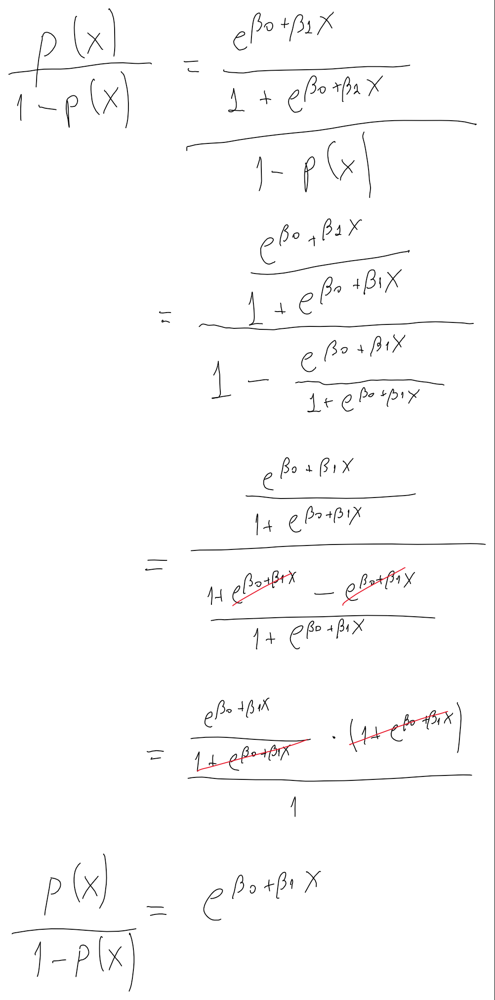
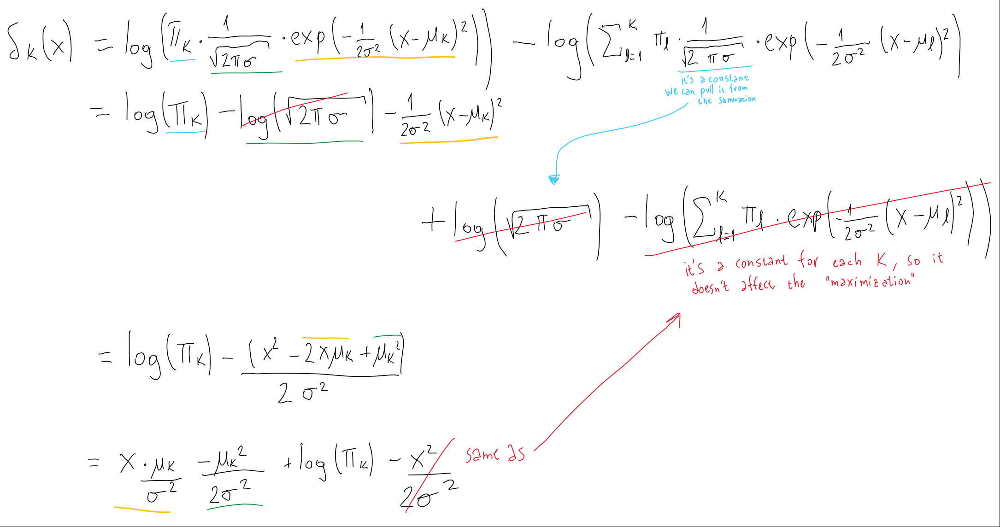
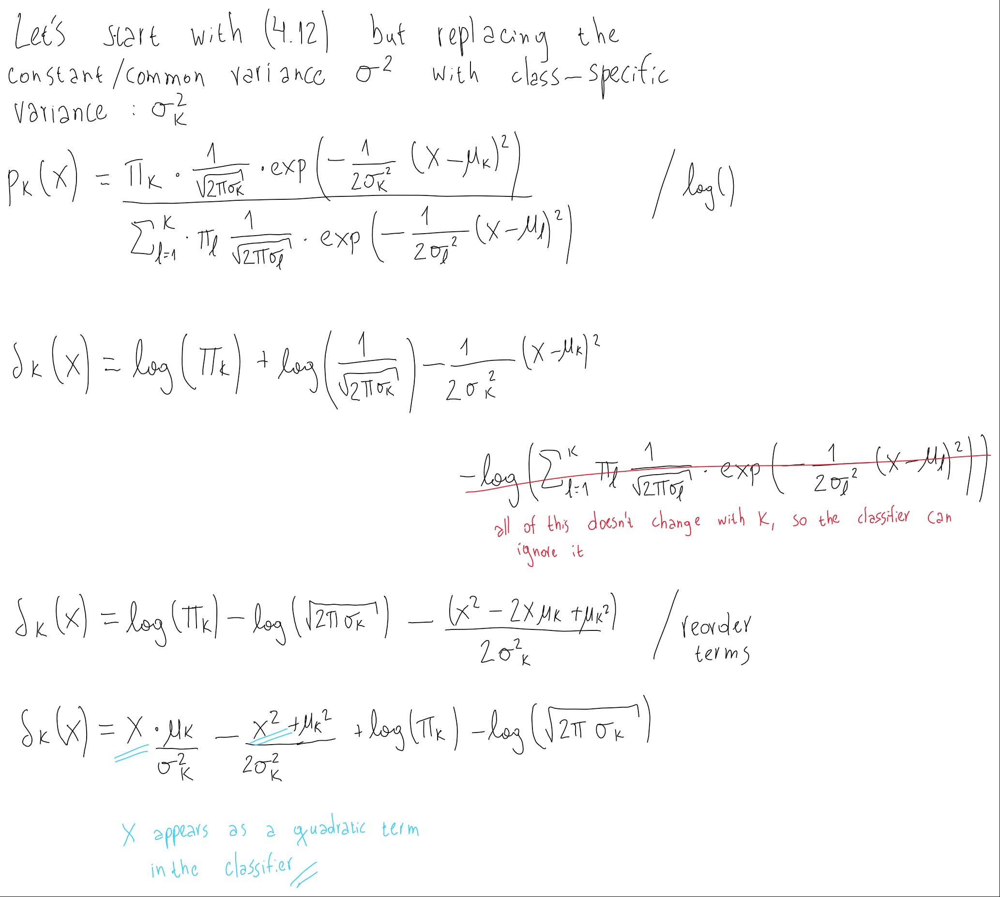
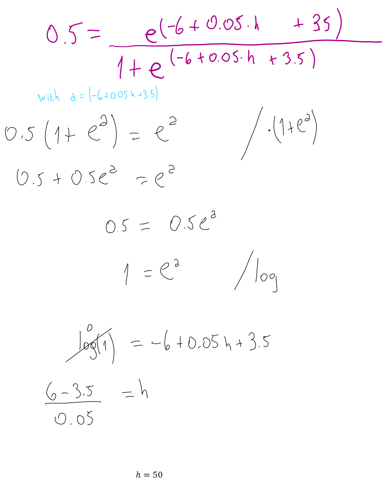
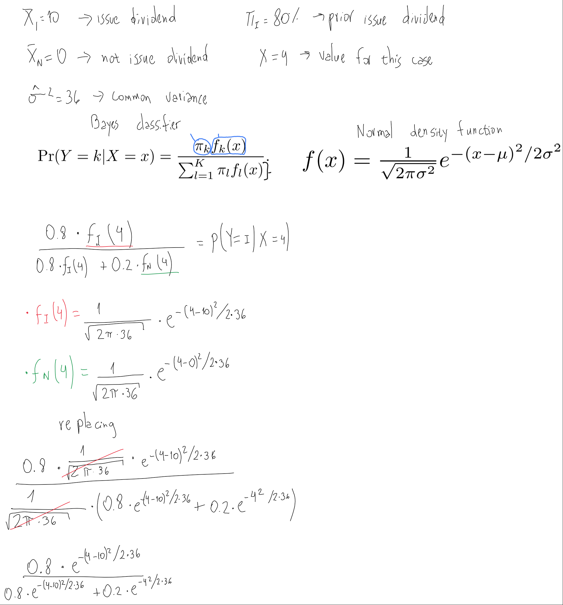

```{r setup, warning=FALSE, message=FALSE}
library(tidyverse)
library(ISLR)
library(caret)
library(modelr)
lda <- MASS::lda
qda <- MASS::qda
```

# Conceptual

1. Using a little bit of algebra, prove that (4.2) is equivalent to (4.3). In other words, the logistic function representation and logit representation for the logistic regression model are equivalent.

 

2.  It was stated in the text that classifying an observation to the class for which (4.12) is largest is equivalent to classifying an observation to the class for which (4.13) is largest. Prove that this is the case. In other words, under the assumption that the observations in the kth class are drawn from a $N(μ_k,σ^2)$ distribution, the Bayes’ classifier assigns an observation to the class for which the discriminant function is maximized.



3. This problem relates to the QDA model, in which the observations within each class are drawn from a normal distribution with a class specific mean vector and a class specific covariance matrix. We consider the simple case where $p = 1$; i.e. there is only one feature.

Suppose that we have K classes, and that if an observation belongs to the _k_th_ class then $X$ comes from a one-dimensional normal distribution, $X ∼ N(μ_k,σ^2_k)$. Recall that the density function for the one-dimensional normal distribution is given in (4.11). Prove that in this case, the Bayes’ classifier is not linear. Argue that it is in fact quadratic.

Hint: For this problem, you should follow the arguments laid out in Section 4.4.2, but without making the assumption that $σ^2_1 = ... = σ^2_K$.



4. When the number of features $p$ is large, there tends to be a deterioration in the performance of KNN and other local approaches that perform prediction using only observations that are near the test observation for which a prediction must be made. This phenomenon is known as the curse of dimensionality, and it ties into the fact that non-parametric approaches often perform poorly when p is large. We will now investigate this curse.

a. Suppose that we have a set of observations, each with measurements on $p = 1$ feature, $X$. We assume that $X$ is uniformly (evenly) distributed on $[0, 1]$. Associated with each observation is a response value. Suppose that we wish to predict a test observation’s response using only observations that are within 10% of the range of $X$ closest to that test observation. For instance, in order to predict the response for a test observation with $X = 0.6$, we will use observations in the range $[0.55, 0.65]$. On average, what fraction of the available observations will we use to make the prediction?

A 10% percent.
    
b.  Now suppose that we have a set of observations, each with measurements on $p = 2$ features, $X_1$ and $X_2$. We assume that $(X_1,X_2)$ are uniformly distributed on $[0, 1] × [0, 1]$. We wish to predict a test observation’s response using only observations that are within 10% of the range of $X_1$ and within 10% of the range of $X_2$ closest to that test observation. For instance, in order to predict the response for a test observation with $X_1 = 0.6$ and $X_2 =0.35$, we will use observations in the range $[0.55, 0.65]$ for $X_1$ and in the range $[0.3, 0.4]$ for $X_2$. On average, what fraction of the available observations will we use to make the prediction?

1% percent (10% x 10%).

c. Now suppose that we have a set of observations on $p = 100$ features. Again the observations are uniformly distributed on each feature, and again each feature ranges in value from 0 to 1. We wish to predict a test observation’s response using observations within the 10% of each feature’s range that is closest to that test observation. What fraction of the available observations will we use to make the prediction?

```{r}
0.1 ^ 100
```

d. Using your answers to parts (a)–(c), argue that a drawback of KNN when p is large is that there are very few training observations “near” any given test observation.

A large p implies working in high-dimensional space. In such conditions, the distance between all the observations become very large (there are no actual "near neighbors"), so the differences between those high distances become irrelevant or very small comparatively.
    
e.  Now suppose that we wish to make a prediction for a test observation by creating a p-dimensional hypercube centered around the test observation that contains, on average, 10% of the training observations. For $p = 1, 2$, and $100$, what is the length of each side of the hypercube? Comment on your answer.

```{r}
sqrt(0.1)
```

```{r}
0.1^0.01
```

Asuming that the observations are equaly distributed on the p-dimensional space, then for $p = 1$ each side of the hypercube has length of 0.1 times the length of the space. For $p = 2$ it's 0.31 times, and for $p = 100$ it's 0.98 times.
    
5. We now examine the differences between LDA and QDA.

a. If the Bayes decision boundary is linear, do we expect LDA or QDA to perform better on the training set? On the test set?

QDA should perform better in the training set (a more flexible model always has better performance in training data), and LDA in the test set (since the true boundary is linear, QDA increases the variance error but doesn't provide a reduction in bias).
    
b. If the Bayes decision boundary is non-linear, do we expect LDA or QDA to perform better on the training set? On the test set?

QDA should perform better in the training set (same reason as above), but also in the test set, since the true boundary is non-linear.
    
c. In general, as the sample size n increases, do we expect the test prediction accuracy of QDA relative to LDA to improve, decline, or be unchanged? Why?

An increase in sample size reduces the variance error. Since QDA is the model has higher variance, one would expect it to benefit the most when we increase the sample size, improving its prediction accuracy relative to LDA.
    
d. True or False: Even if the Bayes decision boundary for a given problem is linear, we will probably achieve a superior test error rate using QDA rather than LDA because QDA is flexible enough to model a linear decision boundary. Justify your answer.

False. In spite of being flexible enough to model a linear boundary, the flexibility of QDA comes at the price of higher variance error, without a reduction in bias (because in this case the true boundary is linear). If we are sure that the Bayes boundary is linear we're better off using LDA or Logistic Regression.
    
6. Suppose we collect data for a group of students in a statistics class with variables $X_1 =$ hours studied, $X_2 =$ undergrad GPA, and $Y =$ receive an A. We fit a logistic regression and produce estimated coefficient, $\hatβ_0 = −6$, $\hatβ_1 =0.05$, $\hatβ_2 = 1$.

a. Estimate the probability that a student who studies for 40 h and has an undergrad GPA of 3.5 gets an A in the class.

```{r}
exp(-6 + 0.05*40 + 3.5)/(1 + exp(-6 + 0.05*40 + 3.5))
```

b. How many hours would the student in part (a) need to study to have a 50% chance of getting an A in the class?

50 hours.
    
 

7. Suppose that we wish to predict whether a given stock will issue a dividend this year (“Yes” or “No”) based on X, last year’s percent profit. We examine a large number of companies and discover that the mean value of X for companies that issued a dividend was $\bar{X} = 10 $ while the mean for those that didn’t was $\bar{X} = 0$. In addition, the
variance of X for these two sets of companies was $\hatσ^2 = 36$. Finally, 80% of companies issued dividends. Assuming that X follows a normal distribution, predict the probability that a company will issue a dividend this year given that its percentage profit was $X = 4$ last year.

Hint: Recall that the density function for a normal random variable.  You will need to use Bayes’ theorem.



Then calculating the last expression: 
    
```{r}
a <- 0.8 * exp(-(4-10)^2/(2*36))
b <- 0.2 * exp(-(4)^2/(2*36))

a/(a+b)
```

So the probability acording to Bayes estimator is 0.751.
    
8. Suppose that we take a data set, divide it into equally-sized training and test sets, and then try out two different classification procedures. First we use logistic regression and get an error rate of 20% on the training data and 30% on the test data. Next we use 1-nearest neighbors (i.e. $K = 1$) and get an average error rate (averaged over both test and training data sets) of 18%. Based on these results, which method should we prefer to use for classification of new observations? Why?

It will depend on which are the actual error rate values for the 1-NN method. Despite it having a lower error rate in average, it could happen that the test error rate to be much higher that the error in training, at the point of even having a higher error rate than the logistic regression. This is plausible since 1-NN is known for providing high flexibility and, therefore, having a low error rate in training data, but this does not always imply a low error rate in the test data.
    
9. This problem has to do with odds. 

(a) On average, what fraction of people with an odds of 0.37 of defaulting on their credit card payment will in fact default?

27%, since 0.27/(1 - 0.27) is roughly equal to 0.37.

(b) Suppose that an individual has a 16% chance of defaulting on her credit card payment. What are the odds that she will default?

```{r}
0.16/(1-0.16)
```
    
# Applied

10. This question should be answered using the `Weekly` data set, which is part of the `ISLR` package. This data is similar in nature to the `Smarket` data from this chapter’s lab, except that it contains 1089 weekly returns for 21 years, from the beginning of 1990 to the end of 2010.

(a) Produce some numerical and graphical summaries of the Weekly
data. Do there appear to be any patterns?

```{r}
plot(Weekly)
```

```{r}
Weekly %>% 
  select_if(is.numeric) %>% 
  cor() %>% 
  corrplot::corrplot()
```

At first glance there are not many patterns among the variables. However, there seems to be an increase in  `Volume` across the `Year`s. Also, higher `Volume` seems to be asociated with more extreme values for `Today` returns.
    
(b) Use the full data set to perform a logistic regression with `Direction` as the response and the five lag variables plus Volume as predictors. Use the summary function to print the results. Do any of the predictors appear to be statistically significant? If so, which ones?
```{r}
log_reg_weekly <- 
  glm(Direction ~ . - Today, data = Weekly, family = "binomial")

summary(log_reg_weekly)
```

Only `Lag2` is statistically significant.
    
(c) Compute the confusion matrix and overall fraction of correct predictions. Explain what the confusion matrix is telling you about the types of mistakes made by logistic regression.

```{r}
actual_direction <- Weekly[["Direction"]]
predicted_direction <- 
  ifelse(predict(log_reg_weekly, type = "response")  > 0.5, 
         "Up", "Down") %>% 
  factor(levels = c("Down", "Up"))

caret::confusionMatrix(data = predicted_direction, 
                       reference = actual_direction)

```

In the confusion matrix we can see both the Type I Error (when we predict the Positive Class but the true condition is Negative: 47), associated with the False Positive Rate (47/605 = 7.7%), and the Type II Error (when we predict the Negative class but the true condition is Positive: 428), associated with the False Negative Rate (428/484 = 88.4%).

(d) Now fit the logistic regression model using a training data period from 1990 to 2008, with `Lag2` as the only predictor. Compute the confusion matrix and the overall fraction of correct predictions for the held out data (that is, the data from 2009 and 2010).

```{r}
train_weekly <- Weekly %>% 
  filter(between(Year, 1990, 2008))

test_weekly <- Weekly %>% 
  filter(between(Year, 2009, 2010))

reg_upto2008 <- 
  glm(Direction ~ Lag2, data = train_weekly, family = "binomial")

```

```{r}
add_pred_direction <- function(df, model) {
  df %>% 
  add_predictions(model, type = "response") %>% 
  mutate(pred_direction = ifelse(
    pred > 0.5,
    "Up",
    "Down"
  ),
  pred_direction = factor(pred_direction, levels = c("Down", "Up")))
}
```

```{r}
test_weekly_reg <- 
  test_weekly %>% 
  add_pred_direction(reg_upto2008)

caret::confusionMatrix(data = test_weekly_reg[["pred_direction"]],
                       reference = test_weekly_reg[["Direction"]])
```

Sensitivity doubles, but specificity is almost the same (it's weird that that this model has better performance in the test data, than the first model in the training data).
    
(e) Repeat (d) using LDA.
```{r}
lda_upto2008 <- 
  MASS::lda(Direction ~ Lag2, data = train_weekly)

test_weekly_lda <- 
  test_weekly %>% 
  mutate(pred_direction = 
           predict(lda_upto2008, 
                   newdata = test_weekly, 
                   type = "response")[["class"]])

caret::confusionMatrix(data = test_weekly_lda[["pred_direction"]],
                       reference = test_weekly_lda[["Direction"]])
```

(f) Repeat (d) using QDA.
```{r}
qda_upto2008 <- 
  MASS::qda(Direction ~ Lag2, data = train_weekly)

test_weekly_qda <- 
  test_weekly %>% 
  mutate(pred_direction = 
           predict(qda_upto2008, 
                   newdata = test_weekly, 
                   type = "response")[["class"]])

caret::confusionMatrix(data = test_weekly_qda[["pred_direction"]],
                       reference = test_weekly_qda[["Direction"]])
```

(f) Repeat (d) using KNN with K = 1
```{r}
train_x_weekly <- 
  train_weekly %>%
  select(Lag2)

train_y_weekly <- 
  train_weekly[["Direction"]]

test_x_weekly <- 
  test_weekly %>% 
  select(Lag2)

knn_upto2008 <- class::knn(
  train = train_x_weekly,
  test = test_x_weekly,
  cl = train_y_weekly,
  k = 1
)

caret::confusionMatrix(
  data = knn_upto2008,
  reference = test_weekly[["Direction"]]
)
```

(h) Which of these methods appears to provide the best results on this data?

None of the models have "good results", in the sense that the accuracy obtained is very close to what would be obtained through random predictions, or predicting the majority class to all the observations. However, LDA and the Logistic Regression provide better results (higher accuracy and neg/pos predictive value) than QDA and 1-NN. 
    
(i) Experiment with different combinations of predictors, including possible transformations and interactions, for each of the methods. Report the variables, method, and associated confusion matrix that appears to provide the best results on the held out data. Note that you should also experiment with values for K in the KNN classifier.

Logistic Regression
```{r}
reg2_upto2008 <- 
  glm(Direction ~ Lag1 + Lag2 + Volume, 
      data = train_weekly, family = "binomial")

reg3_upto2008 <- 
  glm(Direction ~ Lag1 + Lag2, 
      data = train_weekly, family = "binomial")

reg4_upto2008 <- 
  glm(Direction ~ Lag1 + Lag2 + Lag3 + Volume, 
      data = train_weekly, family = "binomial")

reg5_upto2008 <- 
  glm(Direction ~ Lag1 + Lag2 + Lag3 + Volume, 
      data = train_weekly, family = "binomial")

reg6_upto2008 <- 
  glm(Direction ~ Lag1 + Lag2 + Lag3 + Volume + I(Volume)^2, 
      data = train_weekly, family = "binomial")

reg7_upto2008 <- 
  glm(Direction ~ Lag1 + Lag2*Volume + Lag3, 
      data = train_weekly, family = "binomial")

test_weekly_reg <- 
  test_weekly_reg %>%
  add_predictions(reg2_upto2008, var = "pred_reg2", type = "response") %>%
  add_predictions(reg3_upto2008, var = "pred_reg3", type = "response") %>%
  add_predictions(reg4_upto2008, var = "pred_reg4", type = "response") %>%
  add_predictions(reg4_upto2008, var = "pred_reg5", type = "response") %>%
  add_predictions(reg4_upto2008, var = "pred_reg6", type = "response") %>%
  add_predictions(reg4_upto2008, var = "pred_reg7", type = "response") %>%
  mutate_at(vars(starts_with("pred_reg")),
            ~ factor(ifelse(. > 0.5,
                            "Up",
                            "Down"), levels = c("Down", "Up")))
```

```{r}
caret::confusionMatrix(data = test_weekly_reg[["pred_reg2"]],
                       reference = test_weekly_reg[["Direction"]])
```

```{r}
caret::confusionMatrix(data = test_weekly_reg[["pred_reg3"]],
                       reference = test_weekly_reg[["Direction"]])
```

```{r}
caret::confusionMatrix(data = test_weekly_reg[["pred_reg4"]],
                       reference = test_weekly_reg[["Direction"]])
```

```{r}
caret::confusionMatrix(data = test_weekly_reg[["pred_reg5"]],
                       reference = test_weekly_reg[["Direction"]])
```

```{r}
caret::confusionMatrix(data = test_weekly_reg[["pred_reg6"]],
                       reference = test_weekly_reg[["Direction"]])
```

```{r}
caret::confusionMatrix(data = test_weekly_reg[["pred_reg7"]],
                       reference = test_weekly_reg[["Direction"]])
```

Linear Discriminant Analysis:
```{r}
lda2_upto2008 <- 
  lda(Direction ~ Lag1 + Lag2 + Volume, 
      data = train_weekly)

lda3_upto2008 <- 
  lda(Direction ~ Lag1 + Lag2, 
      data = train_weekly)

lda4_upto2008 <- 
  lda(Direction ~ Lag1 + Lag2 + Lag3 + Volume, 
      data = train_weekly)

lda5_upto2008 <- 
  lda(Direction ~ Lag1 + Lag2 + Lag3 + Volume, 
      data = train_weekly)

lda6_upto2008 <- 
  lda(Direction ~ Lag1 + Lag2 + Lag3 + Volume + I(Volume)^2, 
      data = train_weekly)

lda7_upto2008 <- 
  lda(Direction ~ Lag1 + Lag2*Volume + Lag3, 
      data = train_weekly)

conf_matrix_lda <- function(lda_model) {
  pred_class <- 
    predict(lda_model, test_weekly)[["class"]]
  
  caret::confusionMatrix(data = pred_class,
                         reference = test_weekly[["Direction"]])
}
```

```{r}
conf_matrix_lda(lda2_upto2008)
```

```{r}
conf_matrix_lda(lda3_upto2008)
```

```{r}
conf_matrix_lda(lda4_upto2008)
```

```{r}
conf_matrix_lda(lda5_upto2008)
```

```{r}
conf_matrix_lda(lda6_upto2008)
```

```{r}
conf_matrix_lda(lda7_upto2008)
```

Quadratic Discriminant Analysis:
```{r}
qda2_upto2008 <- 
  qda(Direction ~ Lag1 + Lag2 + Volume, 
      data = train_weekly)

qda3_upto2008 <- 
  qda(Direction ~ Lag1 + Lag2, 
      data = train_weekly)

qda4_upto2008 <- 
  qda(Direction ~ Lag1 + Lag2 + Lag3 + Volume, 
      data = train_weekly)

qda5_upto2008 <- 
  qda(Direction ~ Lag1 + Lag2 + Lag3 + Volume, 
      data = train_weekly)

qda6_upto2008 <- 
  qda(Direction ~ Lag1 + Lag2 + Lag3 + Lag4 + Volume , 
      data = train_weekly)

qda7_upto2008 <- 
  qda(Direction ~ Lag1 + Lag2*Volume + Lag3, 
      data = train_weekly)

map(
  list(
    qda2_upto2008,
    qda3_upto2008,
    qda4_upto2008,
    qda5_upto2008,
    qda6_upto2008,
    qda7_upto2008
  ),
  conf_matrix_lda
)
```

KNN:
```{r}
conf_matrix_knn <- function(k) {
  class::knn(
    train = train_x_weekly,
    test = test_x_weekly,
    cl = train_y_weekly,
    k = k
  ) %>%
    caret::confusionMatrix(data = .,
                           reference = test_weekly[["Direction"]])
  
}

map(2:15, conf_matrix_knn)
```

We don't get better results using more variables in Logistic Regression, LDA and QDA. However, the accuracy of KNN increses if we choose K > 1, obtaining a maximum of 59% with K = 13.
    
11. In this problem, you will develop a model to predict whether a given car gets high or low gas mileage based on the `Auto` data set.

(a) Create a binary variable, `mpg01`, that contains a 1 if `mpg` contains a value above its median, and a 0 if `mpg` contains a value below its median. You can compute the median using the `median()` function. 
```{r}
Auto <- Auto %>%
  mutate(mpg01 = factor(ifelse(mpg > median(mpg),
                               1, 0)))
```

(b) Explore the data graphically in order to investigate the association between `mpg01` and the other features. Which of the other features seem most likely to be useful in predicting `mpg01`? Scatterplots and boxplots may be useful tools to answer this question. Describe your findings.

```{r}
Auto %>%
  count(cylinders, mpg01) %>% 
  ggplot(aes(factor(cylinders), n, fill = mpg01)) +
  geom_col(position = position_fill())
```

```{r}
ggplot(Auto, aes(mpg01, displacement)) +
  geom_boxplot()
```

```{r}
qplot(mpg01, horsepower, data = Auto, geom = "boxplot")
```

```{r}
qplot(mpg01, weight, data = Auto, geom = "boxplot")
```

```{r}
qplot(mpg01, acceleration, data = Auto, geom = "boxplot")
```

```{r}
ggplot(Auto, aes(acceleration, acceleration, color = mpg01)) +
  geom_point() 
```

```{r}
ggplot(Auto, aes(year, fill = mpg01)) +
  geom_bar(position = position_fill())
```

```{r}
ggplot(Auto, aes(origin, fill = mpg01)) +
  geom_bar(position = position_fill())
```


```{r}
ggplot(Auto, aes(acceleration, displacement, color = mpg01)) +
  geom_point() 
```

(c) Split the data into a training set and a test set.
```{r}
train_auto <- Auto %>% 
  sample_frac(size = 0.5)
  
test_auto <- Auto %>% 
  anti_join(train_auto)
```

(d) Perform LDA on the training data in order to predict `mpg01` using the variables that seemed most associated with `mpg01` in (b). What is the test error of the model obtained?
```{r}
auto_lda <- 
  lda(mpg01 ~ year + acceleration + displacement + weight + horsepower + origin + cylinders,
      data = train_auto)

predictions_auto_lda <- 
  predict(auto_lda, newdata = test_auto)[["class"]]

caret::confusionMatrix(data = predictions_auto_lda,
                       reference = test_auto[["mpg01"]])
```

The error rate is approximately 9%.
    
(e) Same as (d) but using QDA.
```{r}
auto_qda <- 
  qda(mpg01 ~ year + acceleration + displacement + weight + horsepower + origin + cylinders,
      data = train_auto)

predictions_auto_qda <- 
  predict(auto_qda, newdata = test_auto)[["class"]]

caret::confusionMatrix(data = predictions_auto_qda,
                       reference = test_auto[["mpg01"]])
```

The error rate is approximately 8.7%.
    
(f) Same as (d) but using Logistic Regression.
```{r}
auto_reg <- 
  glm(mpg01 ~ year + acceleration + displacement + weight + horsepower + origin + cylinders,
      data = train_auto,
      family = "binomial")

predictions_auto_reg <- 
  predict(auto_reg, newdata = test_auto, type = "response") %>% 
  map_int(~ifelse(. > 0.5, 1L, 0L)) %>% 
  factor()

caret::confusionMatrix(data = predictions_auto_reg,
                       reference = test_auto[["mpg01"]])
```

The error rate is approximately 11.7%.
    
(g) Same as (d) but using KNN, with several values of K. Which values of K seems to perform the best on this test data?
```{r}
train_x_auto <-
  train_auto %>%
  select(year,
         acceleration,
         displacement,
         weight,
         horsepower,
         origin,
         cylinders) %>% 
  mutate_all(scale)

test_x_auto <-
  test_auto %>%
  select(year,
         acceleration,
         displacement,
         weight,
         horsepower,
         origin,
         cylinders) %>% 
  mutate_all(scale)

train_y_auto <- train_auto[["mpg01"]]

knn_auto <- function(k) {
  class::knn(
    train = train_x_auto,
    test = test_x_auto,
    cl = train_y_auto,
    k = k
  ) %>% 
    
  caret::confusionMatrix(data = .,
                       reference = test_auto[["mpg01"]])

}

map(1:15, knn_auto)
```

The minimum test error rate that we see is 8.16%, and it's obtained with several values of K. Overall, the error ratio does not fluctuate very much as we increase K.
    
12. This problem involves writing functions. 

(a) Write a function, `Power()`, that prints out the result of raising 2 to the 3rd power. In other words, your function should compute 2^3 and print out the results.

```{r}
Power <- function() {
  print(2^3)
}

Power()
```

(b) Create a new function, `Power2()`, that allows you to pass any two numbers, `x` and `a`, and prints out the value of `x^a`.
```{r}
Power2 <- function(x, a) {
  print(x^a)
}

Power2(3, 8)
```

(c) Using the `Power2()` function that you just wrote, compute 10^3, 8^17, and 131^3
```{r}
Power2(10, 3)
Power2(8, 17)
Power2(131, 3)
```

(d) Now create a new function, `Power3()`, that actually returns the result `x^a` as an R object, rather than simply printing it to the screen.
```{r}
Power3 <- function(x, a) {
  result <- x^a
  
  result
}
```

(e) Now using the `Power3()` function, create a plot of $f(x)= x^2$. The x-axis should display a range of integers from 1 to 10, and the y-axis should display $x^2$. Label the axes appropriately, and use an appropriate title for the figure. Consider displaying either the x-axis, the y-axis, or both on the log-scale. 
```{r}
plot_data <- 
  tibble(
    x = 1:10,
    y = Power3(x, 2)
  )

ggplot(plot_data, aes(x, y)) +
  geom_line()
```

```{r}
ggplot(plot_data, aes(x, y)) +
  geom_line() +
  scale_y_log10() +
  scale_x_log10()
```

(f) Create a function, `PlotPower()`, that allows you to create a plot of `x` against `x^a` for a fixed a and for `a` range of values of `x`.
```{r}
PlotPower <- function(x, a) {
  plot_data <- 
  tibble(
    x = x,
    y = x^a
  )

ggplot(plot_data, aes(x, y)) +
  geom_line()
}

PlotPower(1:10, 3)
```

13. Using the `Boston` data set, fit classification models in order to predict whether a given suburb has a crime rate above or below the median. Explore logistic regression, LDA, and KNN models using various subsets of the predictors. Describe your findings.
```{r}
Boston <- MASS::Boston %>%
   as_tibble() %>%
   mutate(crim01 = ifelse(crim > median(crim),
                          1, 0))

Boston_train <- Boston %>% 
  sample_frac(size = 0.5)

Boston_test <- Boston %>% 
  anti_join(Boston_train)

Boston
```

Exploring correlations:
```{r}
cor(Boston) %>% 
  corrplot::corrplot()
```

Trying Logistic Regression:
```{r}
predictors <-
  list(
    predictors_1 = "crim01 ~ zn + indus + nox + age + dis + rad + tax + black + lstat",
    predictors_2 = "crim01 ~ zn + indus + nox + age + dis + rad + tax + lstat",
    predictors_3 = "crim01 ~ indus + nox + rm + age + dis + rad + tax + black + lstat + medv"
  ) %>%
  map(as.formula)

reg_boston <- tibble(
  variables = predictors,
  models = map(predictors, ~glm(., family = "binomial", data = Boston_train)),
  predictions = map(models, ~predict(., newdata = Boston_test, type = "response")),
  predicted_class = map(predictions, ~ifelse(. > 0.5, 1, 0)),
  confusion_matrix = map(predicted_class, ~caret::confusionMatrix(data = factor(.), 
                                                                  reference = factor(Boston_test[["crim01"]])))
)

reg_boston[["confusion_matrix"]]
```

The first set of variables seems to have the lowest test error rate.

Linear Discriminant Analysis:
```{r}
lda_boston <- tibble(
  variables = predictors,
  models = map(predictors, ~ lda(., data = Boston_train)),
  predictions = map(models, ~ predict(., newdata = Boston_test)[["class"]]),
  confusion_matrix = map(
    predictions,
    ~ caret::confusionMatrix(data = .,
                             reference = factor(Boston_test[["crim01"]]))
  )
)

lda_boston[["confusion_matrix"]]
```

Here the second set of variables has the lower test error rate.

KNN (here we're going to explore different values of K instead of subsets of predictors).
```{r}
Boston_train_x <- 
  Boston_train %>% 
  select(zn, indus, nox, age, dis, rad, tax, black, lstat)

Boston_test_x <- 
  Boston_test %>% 
  select(zn, indus, nox, age, dis, rad, tax, black, lstat)

Boston_train_y <- Boston_train[["crim01"]]


knn_boston <- tibble(
  k = 1:15,
  predictions = map(
    k,
    ~ class::knn(k = ., Boston_train_x, Boston_test_x, cl = Boston_train_y)
  ),
  confusion_matrix = map(
    predictions,
    ~ caret::confusionMatrix(data = .,
                             reference = factor(Boston_test[["crim01"]]))
  )
)

knn_boston[["confusion_matrix"]]
 
```

KNN with K = 3 beats Logistic Regression and LDA in test error rate, obtaining just 7.9%.