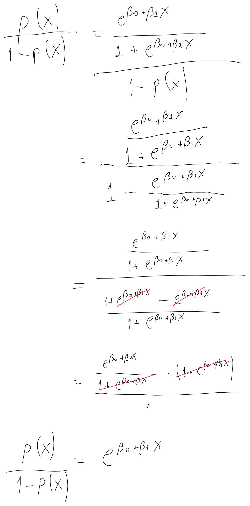
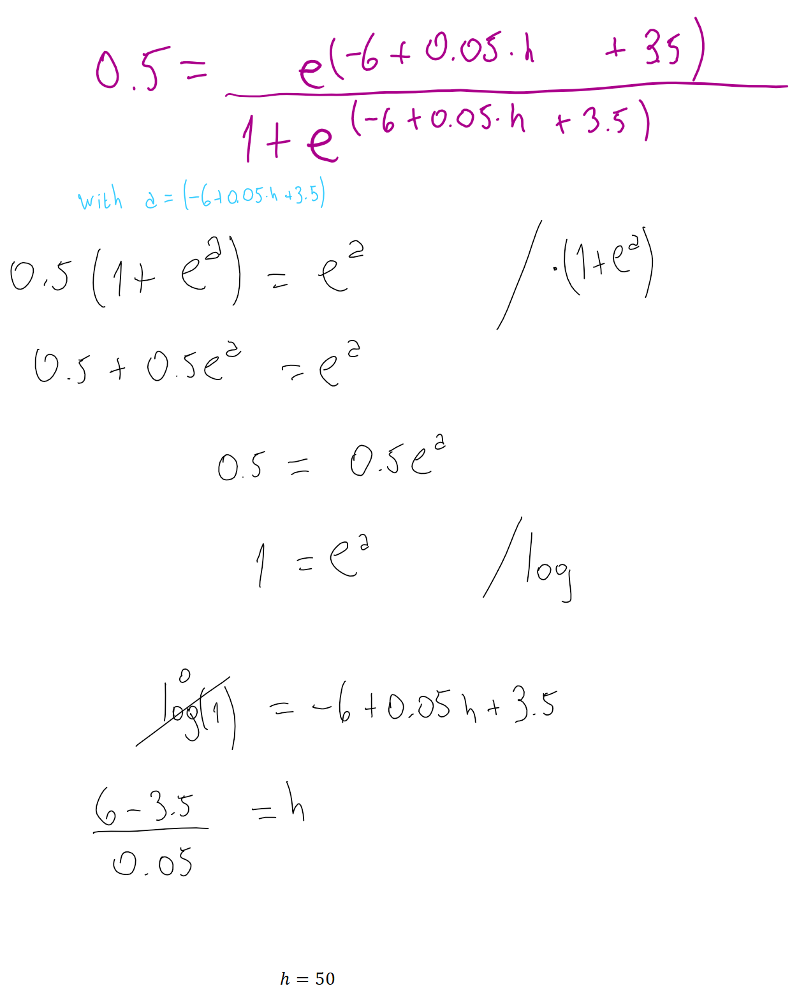
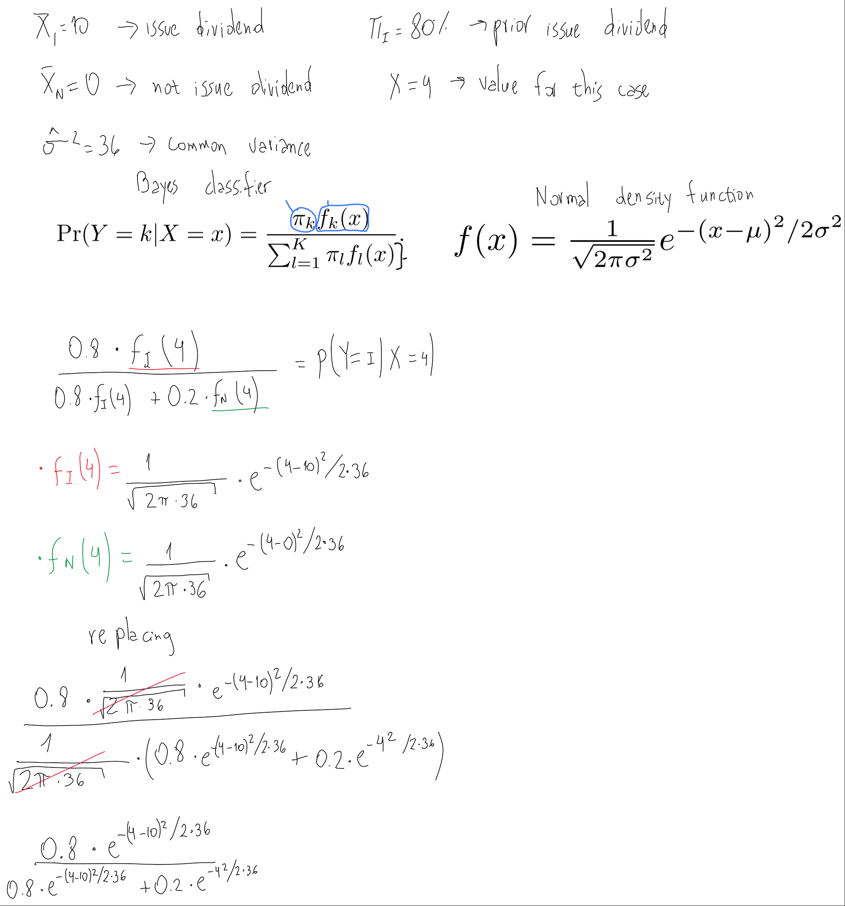

Chapter 4. Classification - Exercises
================

``` r
library(tidyverse)
library(ISLR)
library(caret)
library(modelr)
lda <- MASS::lda
qda <- MASS::qda
```

# Conceptual

1.  Using a little bit of algebra, prove that (4.2) is equivalent to
    (4.3). In other words, the logistic function representation and
    logit representation for the logistic regression model are
    equivalent.



2.  It was stated in the text that classifying an observation to the
    class for which (4.12) is largest is equivalent to classifying an
    observation to the class for which (4.13) is largest. Prove that
    this is the case. In other words, under the assumption that the
    observations in the kth class are drawn from a \(N(μ_k,σ^2)\)
    distribution, the Bayes’ classifier assigns an observation to the
    class for which the discriminant function is maximized.


3.  This problem relates to the QDA model, in which the observations
    within each class are drawn from a normal distribution with a class
    specific mean vector and a class specific covariance matrix. We
    consider the simple case where \(p = 1\); i.e. there is only one
    feature.

Suppose that we have K classes, and that if an observation belongs to
the *k\_th* class then \(X\) comes from a one-dimensional normal
distribution, \(X ∼ N(μ_k,σ^2_k)\). Recall that the density function for
the one-dimensional normal distribution is given in (4.11). Prove that
in this case, the Bayes’ classifier is not linear. Argue that it is in
fact quadratic.

Hint: For this problem, you should follow the arguments laid out in
Section 4.4.2, but without making the assumption that
\(σ^2_1 = ... = σ^2_K\).


4.  When the number of features \(p\) is large, there tends to be a
    deterioration in the performance of KNN and other local approaches
    that perform prediction using only observations that are near the
    test observation for which a prediction must be made. This
    phenomenon is known as the curse of dimensionality, and it ties into
    the fact that non-parametric approaches often perform poorly when p
    is large. We will now investigate this curse.

a. Suppose that we have a set of observations, each with measurements on
\(p = 1\) feature, \(X\). We assume that \(X\) is uniformly (evenly)
distributed on \([0, 1]\). Associated with each observation is a
response value. Suppose that we wish to predict a test observation’s
response using only observations that are within 10% of the range of
\(X\) closest to that test observation. For instance, in order to
predict the response for a test observation with \(X = 0.6\), we will
use observations in the range \([0.55, 0.65]\). On average, what
fraction of the available observations will we use to make the
prediction?

A 10% percent.

b. Now suppose that we have a set of observations, each with
measurements on \(p = 2\) features, \(X_1\) and \(X_2\). We assume that
\((X_1,X_2)\) are uniformly distributed on \([0, 1] × [0, 1]\). We wish
to predict a test observation’s response using only observations that
are within 10% of the range of \(X_1\) and within 10% of the range of
\(X_2\) closest to that test observation. For instance, in order to
predict the response for a test observation with \(X_1 = 0.6\) and
\(X_2 =0.35\), we will use observations in the range \([0.55, 0.65]\)
for \(X_1\) and in the range \([0.3, 0.4]\) for \(X_2\). On average,
what fraction of the available observations will we use to make the
prediction?

1% percent (10% x 10%).

c. Now suppose that we have a set of observations on \(p = 100\)
features. Again the observations are uniformly distributed on each
feature, and again each feature ranges in value from 0 to 1. We wish to
predict a test observation’s response using observations within the 10%
of each feature’s range that is closest to that test observation. What
fraction of the available observations will we use to make the
prediction?

``` r
0.1 ^ 100
```

    ## [1] 1e-100

d. Using your answers to parts (a)–(c), argue that a drawback of KNN
when p is large is that there are very few training observations “near”
any given test observation.

A large p implies working in high-dimensional space. In such conditions,
the distance between all the observations become very large (there are
no actual “near neighbors”), so the differences between those high
distances become irrelevant or very small comparatively.

e. Now suppose that we wish to make a prediction for a test observation
by creating a p-dimensional hypercube centered around the test
observation that contains, on average, 10% of the training observations.
For \(p = 1, 2\), and \(100\), what is the length of each side of the
hypercube? Comment on your answer.

``` r
sqrt(0.1)
```

    ## [1] 0.3162278

``` r
0.1^0.01
```

    ## [1] 0.9772372

Asuming that the observations are equaly distributed on the
p-dimensional space, then for \(p = 1\) each side of the hypercube has
length of 0.1 times the length of the space. For \(p = 2\) it’s 0.31
times, and for \(p = 100\) it’s 0.98 times.

5.  We now examine the differences between LDA and QDA.

a. If the Bayes decision boundary is linear, do we expect LDA or QDA to
perform better on the training set? On the test set?

QDA should perform better in the training set (a more flexible model
always has better performance in training data), and LDA in the test set
(since the true boundary is linear, QDA increases the variance error but
doesn’t provide a reduction in bias).

b. If the Bayes decision boundary is non-linear, do we expect LDA or QDA
to perform better on the training set? On the test set?

QDA should perform better in the training set (same reason as above),
but also in the test set, since the true boundary is non-linear.

c. In general, as the sample size n increases, do we expect the test
prediction accuracy of QDA relative to LDA to improve, decline, or be
unchanged? Why?

An increase in sample size reduces the variance error. Since QDA is the
model has higher variance, one would expect it to benefit the most when
we increase the sample size, improving its prediction accuracy relative
to LDA.

d. True or False: Even if the Bayes decision boundary for a given
problem is linear, we will probably achieve a superior test error rate
using QDA rather than LDA because QDA is flexible enough to model a
linear decision boundary. Justify your answer.

False. In spite of being flexible enough to model a linear boundary, the
flexibility of QDA comes at the price of higher variance error, without
a reduction in bias (because in this case the true boundary is linear).
If we are sure that the Bayes boundary is linear we’re better off using
LDA or Logistic Regression.

6.  Suppose we collect data for a group of students in a statistics
    class with variables \(X_1 =\) hours studied, \(X_2 =\) undergrad
    GPA, and \(Y =\) receive an A. We fit a logistic regression and
    produce estimated coefficient, \(\hatβ_0 = −6\), \(\hatβ_1 =0.05\),
    \(\hatβ_2 = 1\).

a. Estimate the probability that a student who studies for 40 h and has
an undergrad GPA of 3.5 gets an A in the class.

``` r
exp(-6 + 0.05*40 + 3.5)/(1 + exp(-6 + 0.05*40 + 3.5))
```

    ## [1] 0.3775407

b. How many hours would the student in part (a) need to study to have a
50% chance of getting an A in the class?

50 hours.



7.  Suppose that we wish to predict whether a given stock will issue a
    dividend this year (“Yes” or “No”) based on X, last year’s percent
    profit. We examine a large number of companies and discover that the
    mean value of X for companies that issued a dividend was ${X} = 10 $
    while the mean for those that didn’t was \(\bar{X} = 0\). In
    addition, the variance of X for these two sets of companies was
    \(\hatσ^2 = 36\). Finally, 80% of companies issued dividends.
    Assuming that X follows a normal distribution, predict the
    probability that a company will issue a dividend this year given
    that its percentage profit was \(X = 4\) last year.

Hint: Recall that the density function for a normal random variable. You
will need to use Bayes’ theorem.



Then calculating the last expression:

``` r
a <- 0.8 * exp(-(4-10)^2/(2*36))
b <- 0.2 * exp(-(4)^2/(2*36))

a/(a+b)
```

    ## [1] 0.7518525

So the probability acording to Bayes estimator is 0.751.

8.  Suppose that we take a data set, divide it into equally-sized
    training and test sets, and then try out two different
    classification procedures. First we use logistic regression and get
    an error rate of 20% on the training data and 30% on the test data.
    Next we use 1-nearest neighbors (i.e. \(K = 1\)) and get an average
    error rate (averaged over both test and training data sets) of 18%.
    Based on these results, which method should we prefer to use for
    classification of new observations? Why?

It will depend on which are the actual error rate values for the 1-NN
method. Despite it having a lower error rate in average, it could happen
that the test error rate to be much higher that the error in training,
at the point of even having a higher error rate than the logistic
regression. This is plausible since 1-NN is known for providing high
flexibility and, therefore, having a low error rate in training data,
but this does not always imply a low error rate in the test data.

9.  This problem has to do with odds.

(a) On average, what fraction of people with an odds of 0.37 of
defaulting on their credit card payment will in fact default?

27%, since 0.27/(1 - 0.27) is roughly equal to 0.37.

(b) Suppose that an individual has a 16% chance of defaulting on her
credit card payment. What are the odds that she will default?

``` r
0.16/(1-0.16)
```

    ## [1] 0.1904762

# Applied

10. This question should be answered using the `Weekly` data set, which
    is part of the `ISLR` package. This data is similar in nature to the
    `Smarket` data from this chapter’s lab, except that it contains 1089
    weekly returns for 21 years, from the beginning of 1990 to the end
    of 2010.

(a) Produce some numerical and graphical summaries of the Weekly data.
Do there appear to be any patterns?

``` r
plot(Weekly)
```

<!-- -->

``` r
Weekly %>% 
  select_if(is.numeric) %>% 
  cor() %>% 
  corrplot::corrplot()
```

<!-- -->

At first glance there are not many patterns among the variables.
However, there seems to be an increase in `Volume` across the `Year`s.
Also, higher `Volume` seems to be asociated with more extreme values for
`Today` returns.

(b) Use the full data set to perform a logistic regression with
`Direction` as the response and the five lag variables plus Volume as
predictors. Use the summary function to print the results. Do any of the
predictors appear to be statistically significant? If so, which ones?

``` r
log_reg_weekly <- 
  glm(Direction ~ . - Today, data = Weekly, family = "binomial")

summary(log_reg_weekly)
```

    ## 
    ## Call:
    ## glm(formula = Direction ~ . - Today, family = "binomial", data = Weekly)
    ## 
    ## Deviance Residuals: 
    ##     Min       1Q   Median       3Q      Max  
    ## -1.7071  -1.2578   0.9941   1.0873   1.4665  
    ## 
    ## Coefficients:
    ##              Estimate Std. Error z value Pr(>|z|)  
    ## (Intercept) 17.225822  37.890522   0.455   0.6494  
    ## Year        -0.008500   0.018991  -0.448   0.6545  
    ## Lag1        -0.040688   0.026447  -1.538   0.1239  
    ## Lag2         0.059449   0.026970   2.204   0.0275 *
    ## Lag3        -0.015478   0.026703  -0.580   0.5622  
    ## Lag4        -0.027316   0.026485  -1.031   0.3024  
    ## Lag5        -0.014022   0.026409  -0.531   0.5955  
    ## Volume       0.003256   0.068836   0.047   0.9623  
    ## ---
    ## Signif. codes:  0 '***' 0.001 '**' 0.01 '*' 0.05 '.' 0.1 ' ' 1
    ## 
    ## (Dispersion parameter for binomial family taken to be 1)
    ## 
    ##     Null deviance: 1496.2  on 1088  degrees of freedom
    ## Residual deviance: 1486.2  on 1081  degrees of freedom
    ## AIC: 1502.2
    ## 
    ## Number of Fisher Scoring iterations: 4

Only `Lag2` is statistically significant.

(c) Compute the confusion matrix and overall fraction of correct
predictions. Explain what the confusion matrix is telling you about the
types of mistakes made by logistic regression.

``` r
actual_direction <- Weekly[["Direction"]]
predicted_direction <- 
  ifelse(predict(log_reg_weekly, type = "response")  > 0.5, 
         "Up", "Down") %>% 
  factor(levels = c("Down", "Up"))

caret::confusionMatrix(data = predicted_direction, 
                       reference = actual_direction)
```

    ## Confusion Matrix and Statistics
    ## 
    ##           Reference
    ## Prediction Down  Up
    ##       Down   56  47
    ##       Up    428 558
    ##                                           
    ##                Accuracy : 0.5638          
    ##                  95% CI : (0.5338, 0.5935)
    ##     No Information Rate : 0.5556          
    ##     P-Value [Acc > NIR] : 0.3024          
    ##                                           
    ##                   Kappa : 0.0413          
    ##                                           
    ##  Mcnemar's Test P-Value : <2e-16          
    ##                                           
    ##             Sensitivity : 0.11570         
    ##             Specificity : 0.92231         
    ##          Pos Pred Value : 0.54369         
    ##          Neg Pred Value : 0.56592         
    ##              Prevalence : 0.44444         
    ##          Detection Rate : 0.05142         
    ##    Detection Prevalence : 0.09458         
    ##       Balanced Accuracy : 0.51901         
    ##                                           
    ##        'Positive' Class : Down            
    ## 

In the confusion matrix we can see both the Type I Error (when we
predict the Positive Class but the true condition is Negative: 47),
associated with the False Positive Rate (47/605 = 7.7%), and the Type II
Error (when we predict the Negative class but the true condition is
Positive: 428), associated with the False Negative Rate (428/484 =
88.4%).

(d) Now fit the logistic regression model using a training data period
from 1990 to 2008, with `Lag2` as the only predictor. Compute the
confusion matrix and the overall fraction of correct predictions for the
held out data (that is, the data from 2009 and 2010).

``` r
train_weekly <- Weekly %>% 
  filter(between(Year, 1990, 2008))

test_weekly <- Weekly %>% 
  filter(between(Year, 2009, 2010))

reg_upto2008 <- 
  glm(Direction ~ Lag2, data = train_weekly, family = "binomial")
```

``` r
add_pred_direction <- function(df, model) {
  df %>% 
  add_predictions(model, type = "response") %>% 
  mutate(pred_direction = ifelse(
    pred > 0.5,
    "Up",
    "Down"
  ),
  pred_direction = factor(pred_direction, levels = c("Down", "Up")))
}
```

``` r
test_weekly_reg <- 
  test_weekly %>% 
  add_pred_direction(reg_upto2008)

caret::confusionMatrix(data = test_weekly_reg[["pred_direction"]],
                       reference = test_weekly_reg[["Direction"]])
```

    ## Confusion Matrix and Statistics
    ## 
    ##           Reference
    ## Prediction Down Up
    ##       Down    9  5
    ##       Up     34 56
    ##                                          
    ##                Accuracy : 0.625          
    ##                  95% CI : (0.5247, 0.718)
    ##     No Information Rate : 0.5865         
    ##     P-Value [Acc > NIR] : 0.2439         
    ##                                          
    ##                   Kappa : 0.1414         
    ##                                          
    ##  Mcnemar's Test P-Value : 7.34e-06       
    ##                                          
    ##             Sensitivity : 0.20930        
    ##             Specificity : 0.91803        
    ##          Pos Pred Value : 0.64286        
    ##          Neg Pred Value : 0.62222        
    ##              Prevalence : 0.41346        
    ##          Detection Rate : 0.08654        
    ##    Detection Prevalence : 0.13462        
    ##       Balanced Accuracy : 0.56367        
    ##                                          
    ##        'Positive' Class : Down           
    ## 

Sensitivity doubles, but specificity is almost the same (it’s weird that
that this model has better performance in the test data, than the first
model in the training data).

(e) Repeat (d) using LDA.

``` r
lda_upto2008 <- 
  MASS::lda(Direction ~ Lag2, data = train_weekly)

test_weekly_lda <- 
  test_weekly %>% 
  mutate(pred_direction = 
           predict(lda_upto2008, 
                   newdata = test_weekly, 
                   type = "response")[["class"]])

caret::confusionMatrix(data = test_weekly_lda[["pred_direction"]],
                       reference = test_weekly_lda[["Direction"]])
```

    ## Confusion Matrix and Statistics
    ## 
    ##           Reference
    ## Prediction Down Up
    ##       Down    9  5
    ##       Up     34 56
    ##                                          
    ##                Accuracy : 0.625          
    ##                  95% CI : (0.5247, 0.718)
    ##     No Information Rate : 0.5865         
    ##     P-Value [Acc > NIR] : 0.2439         
    ##                                          
    ##                   Kappa : 0.1414         
    ##                                          
    ##  Mcnemar's Test P-Value : 7.34e-06       
    ##                                          
    ##             Sensitivity : 0.20930        
    ##             Specificity : 0.91803        
    ##          Pos Pred Value : 0.64286        
    ##          Neg Pred Value : 0.62222        
    ##              Prevalence : 0.41346        
    ##          Detection Rate : 0.08654        
    ##    Detection Prevalence : 0.13462        
    ##       Balanced Accuracy : 0.56367        
    ##                                          
    ##        'Positive' Class : Down           
    ## 

(f) Repeat (d) using QDA.

``` r
qda_upto2008 <- 
  MASS::qda(Direction ~ Lag2, data = train_weekly)

test_weekly_qda <- 
  test_weekly %>% 
  mutate(pred_direction = 
           predict(qda_upto2008, 
                   newdata = test_weekly, 
                   type = "response")[["class"]])

caret::confusionMatrix(data = test_weekly_qda[["pred_direction"]],
                       reference = test_weekly_qda[["Direction"]])
```

    ## Confusion Matrix and Statistics
    ## 
    ##           Reference
    ## Prediction Down Up
    ##       Down    0  0
    ##       Up     43 61
    ##                                           
    ##                Accuracy : 0.5865          
    ##                  95% CI : (0.4858, 0.6823)
    ##     No Information Rate : 0.5865          
    ##     P-Value [Acc > NIR] : 0.5419          
    ##                                           
    ##                   Kappa : 0               
    ##                                           
    ##  Mcnemar's Test P-Value : 1.504e-10       
    ##                                           
    ##             Sensitivity : 0.0000          
    ##             Specificity : 1.0000          
    ##          Pos Pred Value :    NaN          
    ##          Neg Pred Value : 0.5865          
    ##              Prevalence : 0.4135          
    ##          Detection Rate : 0.0000          
    ##    Detection Prevalence : 0.0000          
    ##       Balanced Accuracy : 0.5000          
    ##                                           
    ##        'Positive' Class : Down            
    ## 

(f) Repeat (d) using KNN with K = 1

``` r
train_x_weekly <- 
  train_weekly %>%
  select(Lag2)

train_y_weekly <- 
  train_weekly[["Direction"]]

test_x_weekly <- 
  test_weekly %>% 
  select(Lag2)

knn_upto2008 <- class::knn(
  train = train_x_weekly,
  test = test_x_weekly,
  cl = train_y_weekly,
  k = 1
)

caret::confusionMatrix(
  data = knn_upto2008,
  reference = test_weekly[["Direction"]]
)
```

    ## Confusion Matrix and Statistics
    ## 
    ##           Reference
    ## Prediction Down Up
    ##       Down   21 30
    ##       Up     22 31
    ##                                           
    ##                Accuracy : 0.5             
    ##                  95% CI : (0.4003, 0.5997)
    ##     No Information Rate : 0.5865          
    ##     P-Value [Acc > NIR] : 0.9700          
    ##                                           
    ##                   Kappa : -0.0033         
    ##                                           
    ##  Mcnemar's Test P-Value : 0.3317          
    ##                                           
    ##             Sensitivity : 0.4884          
    ##             Specificity : 0.5082          
    ##          Pos Pred Value : 0.4118          
    ##          Neg Pred Value : 0.5849          
    ##              Prevalence : 0.4135          
    ##          Detection Rate : 0.2019          
    ##    Detection Prevalence : 0.4904          
    ##       Balanced Accuracy : 0.4983          
    ##                                           
    ##        'Positive' Class : Down            
    ## 

(h) Which of these methods appears to provide the best results on this
data?

None of the models have “good results”, in the sense that the accuracy
obtained is very close to what would be obtained through random
predictions, or predicting the majority class to all the observations.
However, LDA and the Logistic Regression provide better results (higher
accuracy and neg/pos predictive value) than QDA and 1-NN.

(i) Experiment with different combinations of predictors, including
possible transformations and interactions, for each of the methods.
Report the variables, method, and associated confusion matrix that
appears to provide the best results on the held out data. Note that you
should also experiment with values for K in the KNN classifier.

Logistic Regression

``` r
reg2_upto2008 <- 
  glm(Direction ~ Lag1 + Lag2 + Volume, 
      data = train_weekly, family = "binomial")

reg3_upto2008 <- 
  glm(Direction ~ Lag1 + Lag2, 
      data = train_weekly, family = "binomial")

reg4_upto2008 <- 
  glm(Direction ~ Lag1 + Lag2 + Lag3 + Volume, 
      data = train_weekly, family = "binomial")

reg5_upto2008 <- 
  glm(Direction ~ Lag1 + Lag2 + Lag3 + Volume, 
      data = train_weekly, family = "binomial")

reg6_upto2008 <- 
  glm(Direction ~ Lag1 + Lag2 + Lag3 + Volume + I(Volume)^2, 
      data = train_weekly, family = "binomial")

reg7_upto2008 <- 
  glm(Direction ~ Lag1 + Lag2*Volume + Lag3, 
      data = train_weekly, family = "binomial")

test_weekly_reg <- 
  test_weekly_reg %>%
  add_predictions(reg2_upto2008, var = "pred_reg2", type = "response") %>%
  add_predictions(reg3_upto2008, var = "pred_reg3", type = "response") %>%
  add_predictions(reg4_upto2008, var = "pred_reg4", type = "response") %>%
  add_predictions(reg4_upto2008, var = "pred_reg5", type = "response") %>%
  add_predictions(reg4_upto2008, var = "pred_reg6", type = "response") %>%
  add_predictions(reg4_upto2008, var = "pred_reg7", type = "response") %>%
  mutate_at(vars(starts_with("pred_reg")),
            ~ factor(ifelse(. > 0.5,
                            "Up",
                            "Down"), levels = c("Down", "Up")))
```

``` r
caret::confusionMatrix(data = test_weekly_reg[["pred_reg2"]],
                       reference = test_weekly_reg[["Direction"]])
```

    ## Confusion Matrix and Statistics
    ## 
    ##           Reference
    ## Prediction Down Up
    ##       Down   27 33
    ##       Up     16 28
    ##                                           
    ##                Accuracy : 0.5288          
    ##                  95% CI : (0.4285, 0.6275)
    ##     No Information Rate : 0.5865          
    ##     P-Value [Acc > NIR] : 0.90168         
    ##                                           
    ##                   Kappa : 0.0821          
    ##                                           
    ##  Mcnemar's Test P-Value : 0.02227         
    ##                                           
    ##             Sensitivity : 0.6279          
    ##             Specificity : 0.4590          
    ##          Pos Pred Value : 0.4500          
    ##          Neg Pred Value : 0.6364          
    ##              Prevalence : 0.4135          
    ##          Detection Rate : 0.2596          
    ##    Detection Prevalence : 0.5769          
    ##       Balanced Accuracy : 0.5435          
    ##                                           
    ##        'Positive' Class : Down            
    ## 

``` r
caret::confusionMatrix(data = test_weekly_reg[["pred_reg3"]],
                       reference = test_weekly_reg[["Direction"]])
```

    ## Confusion Matrix and Statistics
    ## 
    ##           Reference
    ## Prediction Down Up
    ##       Down    7  8
    ##       Up     36 53
    ##                                           
    ##                Accuracy : 0.5769          
    ##                  95% CI : (0.4761, 0.6732)
    ##     No Information Rate : 0.5865          
    ##     P-Value [Acc > NIR] : 0.6193          
    ##                                           
    ##                   Kappa : 0.035           
    ##                                           
    ##  Mcnemar's Test P-Value : 4.693e-05       
    ##                                           
    ##             Sensitivity : 0.16279         
    ##             Specificity : 0.86885         
    ##          Pos Pred Value : 0.46667         
    ##          Neg Pred Value : 0.59551         
    ##              Prevalence : 0.41346         
    ##          Detection Rate : 0.06731         
    ##    Detection Prevalence : 0.14423         
    ##       Balanced Accuracy : 0.51582         
    ##                                           
    ##        'Positive' Class : Down            
    ## 

``` r
caret::confusionMatrix(data = test_weekly_reg[["pred_reg4"]],
                       reference = test_weekly_reg[["Direction"]])
```

    ## Confusion Matrix and Statistics
    ## 
    ##           Reference
    ## Prediction Down Up
    ##       Down   30 37
    ##       Up     13 24
    ##                                           
    ##                Accuracy : 0.5192          
    ##                  95% CI : (0.4191, 0.6183)
    ##     No Information Rate : 0.5865          
    ##     P-Value [Acc > NIR] : 0.931618        
    ##                                           
    ##                   Kappa : 0.0842          
    ##                                           
    ##  Mcnemar's Test P-Value : 0.001143        
    ##                                           
    ##             Sensitivity : 0.6977          
    ##             Specificity : 0.3934          
    ##          Pos Pred Value : 0.4478          
    ##          Neg Pred Value : 0.6486          
    ##              Prevalence : 0.4135          
    ##          Detection Rate : 0.2885          
    ##    Detection Prevalence : 0.6442          
    ##       Balanced Accuracy : 0.5456          
    ##                                           
    ##        'Positive' Class : Down            
    ## 

``` r
caret::confusionMatrix(data = test_weekly_reg[["pred_reg5"]],
                       reference = test_weekly_reg[["Direction"]])
```

    ## Confusion Matrix and Statistics
    ## 
    ##           Reference
    ## Prediction Down Up
    ##       Down   30 37
    ##       Up     13 24
    ##                                           
    ##                Accuracy : 0.5192          
    ##                  95% CI : (0.4191, 0.6183)
    ##     No Information Rate : 0.5865          
    ##     P-Value [Acc > NIR] : 0.931618        
    ##                                           
    ##                   Kappa : 0.0842          
    ##                                           
    ##  Mcnemar's Test P-Value : 0.001143        
    ##                                           
    ##             Sensitivity : 0.6977          
    ##             Specificity : 0.3934          
    ##          Pos Pred Value : 0.4478          
    ##          Neg Pred Value : 0.6486          
    ##              Prevalence : 0.4135          
    ##          Detection Rate : 0.2885          
    ##    Detection Prevalence : 0.6442          
    ##       Balanced Accuracy : 0.5456          
    ##                                           
    ##        'Positive' Class : Down            
    ## 

``` r
caret::confusionMatrix(data = test_weekly_reg[["pred_reg6"]],
                       reference = test_weekly_reg[["Direction"]])
```

    ## Confusion Matrix and Statistics
    ## 
    ##           Reference
    ## Prediction Down Up
    ##       Down   30 37
    ##       Up     13 24
    ##                                           
    ##                Accuracy : 0.5192          
    ##                  95% CI : (0.4191, 0.6183)
    ##     No Information Rate : 0.5865          
    ##     P-Value [Acc > NIR] : 0.931618        
    ##                                           
    ##                   Kappa : 0.0842          
    ##                                           
    ##  Mcnemar's Test P-Value : 0.001143        
    ##                                           
    ##             Sensitivity : 0.6977          
    ##             Specificity : 0.3934          
    ##          Pos Pred Value : 0.4478          
    ##          Neg Pred Value : 0.6486          
    ##              Prevalence : 0.4135          
    ##          Detection Rate : 0.2885          
    ##    Detection Prevalence : 0.6442          
    ##       Balanced Accuracy : 0.5456          
    ##                                           
    ##        'Positive' Class : Down            
    ## 

``` r
caret::confusionMatrix(data = test_weekly_reg[["pred_reg7"]],
                       reference = test_weekly_reg[["Direction"]])
```

    ## Confusion Matrix and Statistics
    ## 
    ##           Reference
    ## Prediction Down Up
    ##       Down   30 37
    ##       Up     13 24
    ##                                           
    ##                Accuracy : 0.5192          
    ##                  95% CI : (0.4191, 0.6183)
    ##     No Information Rate : 0.5865          
    ##     P-Value [Acc > NIR] : 0.931618        
    ##                                           
    ##                   Kappa : 0.0842          
    ##                                           
    ##  Mcnemar's Test P-Value : 0.001143        
    ##                                           
    ##             Sensitivity : 0.6977          
    ##             Specificity : 0.3934          
    ##          Pos Pred Value : 0.4478          
    ##          Neg Pred Value : 0.6486          
    ##              Prevalence : 0.4135          
    ##          Detection Rate : 0.2885          
    ##    Detection Prevalence : 0.6442          
    ##       Balanced Accuracy : 0.5456          
    ##                                           
    ##        'Positive' Class : Down            
    ## 

Linear Discriminant Analysis:

``` r
lda2_upto2008 <- 
  lda(Direction ~ Lag1 + Lag2 + Volume, 
      data = train_weekly)

lda3_upto2008 <- 
  lda(Direction ~ Lag1 + Lag2, 
      data = train_weekly)

lda4_upto2008 <- 
  lda(Direction ~ Lag1 + Lag2 + Lag3 + Volume, 
      data = train_weekly)

lda5_upto2008 <- 
  lda(Direction ~ Lag1 + Lag2 + Lag3 + Volume, 
      data = train_weekly)

lda6_upto2008 <- 
  lda(Direction ~ Lag1 + Lag2 + Lag3 + Volume + I(Volume)^2, 
      data = train_weekly)
```

    ## Warning in lda.default(x, grouping, ...): variables are collinear

``` r
lda7_upto2008 <- 
  lda(Direction ~ Lag1 + Lag2*Volume + Lag3, 
      data = train_weekly)

conf_matrix_lda <- function(lda_model) {
  pred_class <- 
    predict(lda_model, test_weekly)[["class"]]
  
  caret::confusionMatrix(data = pred_class,
                         reference = test_weekly[["Direction"]])
}
```

``` r
conf_matrix_lda(lda2_upto2008)
```

    ## Confusion Matrix and Statistics
    ## 
    ##           Reference
    ## Prediction Down Up
    ##       Down   27 33
    ##       Up     16 28
    ##                                           
    ##                Accuracy : 0.5288          
    ##                  95% CI : (0.4285, 0.6275)
    ##     No Information Rate : 0.5865          
    ##     P-Value [Acc > NIR] : 0.90168         
    ##                                           
    ##                   Kappa : 0.0821          
    ##                                           
    ##  Mcnemar's Test P-Value : 0.02227         
    ##                                           
    ##             Sensitivity : 0.6279          
    ##             Specificity : 0.4590          
    ##          Pos Pred Value : 0.4500          
    ##          Neg Pred Value : 0.6364          
    ##              Prevalence : 0.4135          
    ##          Detection Rate : 0.2596          
    ##    Detection Prevalence : 0.5769          
    ##       Balanced Accuracy : 0.5435          
    ##                                           
    ##        'Positive' Class : Down            
    ## 

``` r
conf_matrix_lda(lda3_upto2008)
```

    ## Confusion Matrix and Statistics
    ## 
    ##           Reference
    ## Prediction Down Up
    ##       Down    7  8
    ##       Up     36 53
    ##                                           
    ##                Accuracy : 0.5769          
    ##                  95% CI : (0.4761, 0.6732)
    ##     No Information Rate : 0.5865          
    ##     P-Value [Acc > NIR] : 0.6193          
    ##                                           
    ##                   Kappa : 0.035           
    ##                                           
    ##  Mcnemar's Test P-Value : 4.693e-05       
    ##                                           
    ##             Sensitivity : 0.16279         
    ##             Specificity : 0.86885         
    ##          Pos Pred Value : 0.46667         
    ##          Neg Pred Value : 0.59551         
    ##              Prevalence : 0.41346         
    ##          Detection Rate : 0.06731         
    ##    Detection Prevalence : 0.14423         
    ##       Balanced Accuracy : 0.51582         
    ##                                           
    ##        'Positive' Class : Down            
    ## 

``` r
conf_matrix_lda(lda4_upto2008)
```

    ## Confusion Matrix and Statistics
    ## 
    ##           Reference
    ## Prediction Down Up
    ##       Down   30 37
    ##       Up     13 24
    ##                                           
    ##                Accuracy : 0.5192          
    ##                  95% CI : (0.4191, 0.6183)
    ##     No Information Rate : 0.5865          
    ##     P-Value [Acc > NIR] : 0.931618        
    ##                                           
    ##                   Kappa : 0.0842          
    ##                                           
    ##  Mcnemar's Test P-Value : 0.001143        
    ##                                           
    ##             Sensitivity : 0.6977          
    ##             Specificity : 0.3934          
    ##          Pos Pred Value : 0.4478          
    ##          Neg Pred Value : 0.6486          
    ##              Prevalence : 0.4135          
    ##          Detection Rate : 0.2885          
    ##    Detection Prevalence : 0.6442          
    ##       Balanced Accuracy : 0.5456          
    ##                                           
    ##        'Positive' Class : Down            
    ## 

``` r
conf_matrix_lda(lda5_upto2008)
```

    ## Confusion Matrix and Statistics
    ## 
    ##           Reference
    ## Prediction Down Up
    ##       Down   30 37
    ##       Up     13 24
    ##                                           
    ##                Accuracy : 0.5192          
    ##                  95% CI : (0.4191, 0.6183)
    ##     No Information Rate : 0.5865          
    ##     P-Value [Acc > NIR] : 0.931618        
    ##                                           
    ##                   Kappa : 0.0842          
    ##                                           
    ##  Mcnemar's Test P-Value : 0.001143        
    ##                                           
    ##             Sensitivity : 0.6977          
    ##             Specificity : 0.3934          
    ##          Pos Pred Value : 0.4478          
    ##          Neg Pred Value : 0.6486          
    ##              Prevalence : 0.4135          
    ##          Detection Rate : 0.2885          
    ##    Detection Prevalence : 0.6442          
    ##       Balanced Accuracy : 0.5456          
    ##                                           
    ##        'Positive' Class : Down            
    ## 

``` r
conf_matrix_lda(lda6_upto2008)
```

    ## Confusion Matrix and Statistics
    ## 
    ##           Reference
    ## Prediction Down Up
    ##       Down   30 37
    ##       Up     13 24
    ##                                           
    ##                Accuracy : 0.5192          
    ##                  95% CI : (0.4191, 0.6183)
    ##     No Information Rate : 0.5865          
    ##     P-Value [Acc > NIR] : 0.931618        
    ##                                           
    ##                   Kappa : 0.0842          
    ##                                           
    ##  Mcnemar's Test P-Value : 0.001143        
    ##                                           
    ##             Sensitivity : 0.6977          
    ##             Specificity : 0.3934          
    ##          Pos Pred Value : 0.4478          
    ##          Neg Pred Value : 0.6486          
    ##              Prevalence : 0.4135          
    ##          Detection Rate : 0.2885          
    ##    Detection Prevalence : 0.6442          
    ##       Balanced Accuracy : 0.5456          
    ##                                           
    ##        'Positive' Class : Down            
    ## 

``` r
conf_matrix_lda(lda7_upto2008)
```

    ## Confusion Matrix and Statistics
    ## 
    ##           Reference
    ## Prediction Down Up
    ##       Down   30 36
    ##       Up     13 25
    ##                                           
    ##                Accuracy : 0.5288          
    ##                  95% CI : (0.4285, 0.6275)
    ##     No Information Rate : 0.5865          
    ##     P-Value [Acc > NIR] : 0.901684        
    ##                                           
    ##                   Kappa : 0.0996          
    ##                                           
    ##  Mcnemar's Test P-Value : 0.001673        
    ##                                           
    ##             Sensitivity : 0.6977          
    ##             Specificity : 0.4098          
    ##          Pos Pred Value : 0.4545          
    ##          Neg Pred Value : 0.6579          
    ##              Prevalence : 0.4135          
    ##          Detection Rate : 0.2885          
    ##    Detection Prevalence : 0.6346          
    ##       Balanced Accuracy : 0.5538          
    ##                                           
    ##        'Positive' Class : Down            
    ## 

Quadratic Discriminant Analysis:

``` r
qda2_upto2008 <- 
  qda(Direction ~ Lag1 + Lag2 + Volume, 
      data = train_weekly)

qda3_upto2008 <- 
  qda(Direction ~ Lag1 + Lag2, 
      data = train_weekly)

qda4_upto2008 <- 
  qda(Direction ~ Lag1 + Lag2 + Lag3 + Volume, 
      data = train_weekly)

qda5_upto2008 <- 
  qda(Direction ~ Lag1 + Lag2 + Lag3 + Volume, 
      data = train_weekly)

qda6_upto2008 <- 
  qda(Direction ~ Lag1 + Lag2 + Lag3 + Lag4 + Volume , 
      data = train_weekly)

qda7_upto2008 <- 
  qda(Direction ~ Lag1 + Lag2*Volume + Lag3, 
      data = train_weekly)

map(
  list(
    qda2_upto2008,
    qda3_upto2008,
    qda4_upto2008,
    qda5_upto2008,
    qda6_upto2008,
    qda7_upto2008
  ),
  conf_matrix_lda
)
```

    ## [[1]]
    ## Confusion Matrix and Statistics
    ## 
    ##           Reference
    ## Prediction Down Up
    ##       Down   31 44
    ##       Up     12 17
    ##                                          
    ##                Accuracy : 0.4615         
    ##                  95% CI : (0.3633, 0.562)
    ##     No Information Rate : 0.5865         
    ##     P-Value [Acc > NIR] : 0.9962         
    ##                                          
    ##                   Kappa : -3e-04         
    ##                                          
    ##  Mcnemar's Test P-Value : 3.435e-05      
    ##                                          
    ##             Sensitivity : 0.7209         
    ##             Specificity : 0.2787         
    ##          Pos Pred Value : 0.4133         
    ##          Neg Pred Value : 0.5862         
    ##              Prevalence : 0.4135         
    ##          Detection Rate : 0.2981         
    ##    Detection Prevalence : 0.7212         
    ##       Balanced Accuracy : 0.4998         
    ##                                          
    ##        'Positive' Class : Down           
    ##                                          
    ## 
    ## [[2]]
    ## Confusion Matrix and Statistics
    ## 
    ##           Reference
    ## Prediction Down Up
    ##       Down    7 10
    ##       Up     36 51
    ##                                         
    ##                Accuracy : 0.5577        
    ##                  95% CI : (0.457, 0.655)
    ##     No Information Rate : 0.5865        
    ##     P-Value [Acc > NIR] : 0.7579156     
    ##                                         
    ##                   Kappa : -0.0013       
    ##                                         
    ##  Mcnemar's Test P-Value : 0.0002278     
    ##                                         
    ##             Sensitivity : 0.16279       
    ##             Specificity : 0.83607       
    ##          Pos Pred Value : 0.41176       
    ##          Neg Pred Value : 0.58621       
    ##              Prevalence : 0.41346       
    ##          Detection Rate : 0.06731       
    ##    Detection Prevalence : 0.16346       
    ##       Balanced Accuracy : 0.49943       
    ##                                         
    ##        'Positive' Class : Down          
    ##                                         
    ## 
    ## [[3]]
    ## Confusion Matrix and Statistics
    ## 
    ##           Reference
    ## Prediction Down Up
    ##       Down   35 47
    ##       Up      8 14
    ##                                           
    ##                Accuracy : 0.4712          
    ##                  95% CI : (0.3725, 0.5715)
    ##     No Information Rate : 0.5865          
    ##     P-Value [Acc > NIR] : 0.9932          
    ##                                           
    ##                   Kappa : 0.0383          
    ##                                           
    ##  Mcnemar's Test P-Value : 2.992e-07       
    ##                                           
    ##             Sensitivity : 0.8140          
    ##             Specificity : 0.2295          
    ##          Pos Pred Value : 0.4268          
    ##          Neg Pred Value : 0.6364          
    ##              Prevalence : 0.4135          
    ##          Detection Rate : 0.3365          
    ##    Detection Prevalence : 0.7885          
    ##       Balanced Accuracy : 0.5217          
    ##                                           
    ##        'Positive' Class : Down            
    ##                                           
    ## 
    ## [[4]]
    ## Confusion Matrix and Statistics
    ## 
    ##           Reference
    ## Prediction Down Up
    ##       Down   35 47
    ##       Up      8 14
    ##                                           
    ##                Accuracy : 0.4712          
    ##                  95% CI : (0.3725, 0.5715)
    ##     No Information Rate : 0.5865          
    ##     P-Value [Acc > NIR] : 0.9932          
    ##                                           
    ##                   Kappa : 0.0383          
    ##                                           
    ##  Mcnemar's Test P-Value : 2.992e-07       
    ##                                           
    ##             Sensitivity : 0.8140          
    ##             Specificity : 0.2295          
    ##          Pos Pred Value : 0.4268          
    ##          Neg Pred Value : 0.6364          
    ##              Prevalence : 0.4135          
    ##          Detection Rate : 0.3365          
    ##    Detection Prevalence : 0.7885          
    ##       Balanced Accuracy : 0.5217          
    ##                                           
    ##        'Positive' Class : Down            
    ##                                           
    ## 
    ## [[5]]
    ## Confusion Matrix and Statistics
    ## 
    ##           Reference
    ## Prediction Down Up
    ##       Down   35 50
    ##       Up      8 11
    ##                                         
    ##                Accuracy : 0.4423        
    ##                  95% CI : (0.345, 0.543)
    ##     No Information Rate : 0.5865        
    ##     P-Value [Acc > NIR] : 0.9989        
    ##                                         
    ##                   Kappa : -0.005        
    ##                                         
    ##  Mcnemar's Test P-Value : 7.303e-08     
    ##                                         
    ##             Sensitivity : 0.8140        
    ##             Specificity : 0.1803        
    ##          Pos Pred Value : 0.4118        
    ##          Neg Pred Value : 0.5789        
    ##              Prevalence : 0.4135        
    ##          Detection Rate : 0.3365        
    ##    Detection Prevalence : 0.8173        
    ##       Balanced Accuracy : 0.4971        
    ##                                         
    ##        'Positive' Class : Down          
    ##                                         
    ## 
    ## [[6]]
    ## Confusion Matrix and Statistics
    ## 
    ##           Reference
    ## Prediction Down Up
    ##       Down   39 53
    ##       Up      4  8
    ##                                           
    ##                Accuracy : 0.4519          
    ##                  95% CI : (0.3541, 0.5526)
    ##     No Information Rate : 0.5865          
    ##     P-Value [Acc > NIR] : 0.9979          
    ##                                           
    ##                   Kappa : 0.0326          
    ##                                           
    ##  Mcnemar's Test P-Value : 2.047e-10       
    ##                                           
    ##             Sensitivity : 0.9070          
    ##             Specificity : 0.1311          
    ##          Pos Pred Value : 0.4239          
    ##          Neg Pred Value : 0.6667          
    ##              Prevalence : 0.4135          
    ##          Detection Rate : 0.3750          
    ##    Detection Prevalence : 0.8846          
    ##       Balanced Accuracy : 0.5191          
    ##                                           
    ##        'Positive' Class : Down            
    ## 

KNN:

``` r
conf_matrix_knn <- function(k) {
  class::knn(
    train = train_x_weekly,
    test = test_x_weekly,
    cl = train_y_weekly,
    k = k
  ) %>%
    caret::confusionMatrix(data = .,
                           reference = test_weekly[["Direction"]])
  
}

map(2:15, conf_matrix_knn)
```

    ## [[1]]
    ## Confusion Matrix and Statistics
    ## 
    ##           Reference
    ## Prediction Down Up
    ##       Down   22 25
    ##       Up     21 36
    ##                                         
    ##                Accuracy : 0.5577        
    ##                  95% CI : (0.457, 0.655)
    ##     No Information Rate : 0.5865        
    ##     P-Value [Acc > NIR] : 0.7579        
    ##                                         
    ##                   Kappa : 0.1004        
    ##                                         
    ##  Mcnemar's Test P-Value : 0.6583        
    ##                                         
    ##             Sensitivity : 0.5116        
    ##             Specificity : 0.5902        
    ##          Pos Pred Value : 0.4681        
    ##          Neg Pred Value : 0.6316        
    ##              Prevalence : 0.4135        
    ##          Detection Rate : 0.2115        
    ##    Detection Prevalence : 0.4519        
    ##       Balanced Accuracy : 0.5509        
    ##                                         
    ##        'Positive' Class : Down          
    ##                                         
    ## 
    ## [[2]]
    ## Confusion Matrix and Statistics
    ## 
    ##           Reference
    ## Prediction Down Up
    ##       Down   15 19
    ##       Up     28 42
    ##                                           
    ##                Accuracy : 0.5481          
    ##                  95% CI : (0.4474, 0.6459)
    ##     No Information Rate : 0.5865          
    ##     P-Value [Acc > NIR] : 0.8152          
    ##                                           
    ##                   Kappa : 0.0386          
    ##                                           
    ##  Mcnemar's Test P-Value : 0.2432          
    ##                                           
    ##             Sensitivity : 0.3488          
    ##             Specificity : 0.6885          
    ##          Pos Pred Value : 0.4412          
    ##          Neg Pred Value : 0.6000          
    ##              Prevalence : 0.4135          
    ##          Detection Rate : 0.1442          
    ##    Detection Prevalence : 0.3269          
    ##       Balanced Accuracy : 0.5187          
    ##                                           
    ##        'Positive' Class : Down            
    ##                                           
    ## 
    ## [[3]]
    ## Confusion Matrix and Statistics
    ## 
    ##           Reference
    ## Prediction Down Up
    ##       Down   16 21
    ##       Up     27 40
    ##                                          
    ##                Accuracy : 0.5385         
    ##                  95% CI : (0.438, 0.6367)
    ##     No Information Rate : 0.5865         
    ##     P-Value [Acc > NIR] : 0.8631         
    ##                                          
    ##                   Kappa : 0.0284         
    ##                                          
    ##  Mcnemar's Test P-Value : 0.4705         
    ##                                          
    ##             Sensitivity : 0.3721         
    ##             Specificity : 0.6557         
    ##          Pos Pred Value : 0.4324         
    ##          Neg Pred Value : 0.5970         
    ##              Prevalence : 0.4135         
    ##          Detection Rate : 0.1538         
    ##    Detection Prevalence : 0.3558         
    ##       Balanced Accuracy : 0.5139         
    ##                                          
    ##        'Positive' Class : Down           
    ##                                          
    ## 
    ## [[4]]
    ## Confusion Matrix and Statistics
    ## 
    ##           Reference
    ## Prediction Down Up
    ##       Down   16 21
    ##       Up     27 40
    ##                                          
    ##                Accuracy : 0.5385         
    ##                  95% CI : (0.438, 0.6367)
    ##     No Information Rate : 0.5865         
    ##     P-Value [Acc > NIR] : 0.8631         
    ##                                          
    ##                   Kappa : 0.0284         
    ##                                          
    ##  Mcnemar's Test P-Value : 0.4705         
    ##                                          
    ##             Sensitivity : 0.3721         
    ##             Specificity : 0.6557         
    ##          Pos Pred Value : 0.4324         
    ##          Neg Pred Value : 0.5970         
    ##              Prevalence : 0.4135         
    ##          Detection Rate : 0.1538         
    ##    Detection Prevalence : 0.3558         
    ##       Balanced Accuracy : 0.5139         
    ##                                          
    ##        'Positive' Class : Down           
    ##                                          
    ## 
    ## [[5]]
    ## Confusion Matrix and Statistics
    ## 
    ##           Reference
    ## Prediction Down Up
    ##       Down   16 21
    ##       Up     27 40
    ##                                          
    ##                Accuracy : 0.5385         
    ##                  95% CI : (0.438, 0.6367)
    ##     No Information Rate : 0.5865         
    ##     P-Value [Acc > NIR] : 0.8631         
    ##                                          
    ##                   Kappa : 0.0284         
    ##                                          
    ##  Mcnemar's Test P-Value : 0.4705         
    ##                                          
    ##             Sensitivity : 0.3721         
    ##             Specificity : 0.6557         
    ##          Pos Pred Value : 0.4324         
    ##          Neg Pred Value : 0.5970         
    ##              Prevalence : 0.4135         
    ##          Detection Rate : 0.1538         
    ##    Detection Prevalence : 0.3558         
    ##       Balanced Accuracy : 0.5139         
    ##                                          
    ##        'Positive' Class : Down           
    ##                                          
    ## 
    ## [[6]]
    ## Confusion Matrix and Statistics
    ## 
    ##           Reference
    ## Prediction Down Up
    ##       Down   16 19
    ##       Up     27 42
    ##                                         
    ##                Accuracy : 0.5577        
    ##                  95% CI : (0.457, 0.655)
    ##     No Information Rate : 0.5865        
    ##     P-Value [Acc > NIR] : 0.7579        
    ##                                         
    ##                   Kappa : 0.0623        
    ##                                         
    ##  Mcnemar's Test P-Value : 0.3020        
    ##                                         
    ##             Sensitivity : 0.3721        
    ##             Specificity : 0.6885        
    ##          Pos Pred Value : 0.4571        
    ##          Neg Pred Value : 0.6087        
    ##              Prevalence : 0.4135        
    ##          Detection Rate : 0.1538        
    ##    Detection Prevalence : 0.3365        
    ##       Balanced Accuracy : 0.5303        
    ##                                         
    ##        'Positive' Class : Down          
    ##                                         
    ## 
    ## [[7]]
    ## Confusion Matrix and Statistics
    ## 
    ##           Reference
    ## Prediction Down Up
    ##       Down   16 20
    ##       Up     27 41
    ##                                           
    ##                Accuracy : 0.5481          
    ##                  95% CI : (0.4474, 0.6459)
    ##     No Information Rate : 0.5865          
    ##     P-Value [Acc > NIR] : 0.8152          
    ##                                           
    ##                   Kappa : 0.0453          
    ##                                           
    ##  Mcnemar's Test P-Value : 0.3815          
    ##                                           
    ##             Sensitivity : 0.3721          
    ##             Specificity : 0.6721          
    ##          Pos Pred Value : 0.4444          
    ##          Neg Pred Value : 0.6029          
    ##              Prevalence : 0.4135          
    ##          Detection Rate : 0.1538          
    ##    Detection Prevalence : 0.3462          
    ##       Balanced Accuracy : 0.5221          
    ##                                           
    ##        'Positive' Class : Down            
    ##                                           
    ## 
    ## [[8]]
    ## Confusion Matrix and Statistics
    ## 
    ##           Reference
    ## Prediction Down Up
    ##       Down   17 21
    ##       Up     26 40
    ##                                           
    ##                Accuracy : 0.5481          
    ##                  95% CI : (0.4474, 0.6459)
    ##     No Information Rate : 0.5865          
    ##     P-Value [Acc > NIR] : 0.8152          
    ##                                           
    ##                   Kappa : 0.052           
    ##                                           
    ##  Mcnemar's Test P-Value : 0.5596          
    ##                                           
    ##             Sensitivity : 0.3953          
    ##             Specificity : 0.6557          
    ##          Pos Pred Value : 0.4474          
    ##          Neg Pred Value : 0.6061          
    ##              Prevalence : 0.4135          
    ##          Detection Rate : 0.1635          
    ##    Detection Prevalence : 0.3654          
    ##       Balanced Accuracy : 0.5255          
    ##                                           
    ##        'Positive' Class : Down            
    ##                                           
    ## 
    ## [[9]]
    ## Confusion Matrix and Statistics
    ## 
    ##           Reference
    ## Prediction Down Up
    ##       Down   19 20
    ##       Up     24 41
    ##                                           
    ##                Accuracy : 0.5769          
    ##                  95% CI : (0.4761, 0.6732)
    ##     No Information Rate : 0.5865          
    ##     P-Value [Acc > NIR] : 0.6193          
    ##                                           
    ##                   Kappa : 0.1156          
    ##                                           
    ##  Mcnemar's Test P-Value : 0.6511          
    ##                                           
    ##             Sensitivity : 0.4419          
    ##             Specificity : 0.6721          
    ##          Pos Pred Value : 0.4872          
    ##          Neg Pred Value : 0.6308          
    ##              Prevalence : 0.4135          
    ##          Detection Rate : 0.1827          
    ##    Detection Prevalence : 0.3750          
    ##       Balanced Accuracy : 0.5570          
    ##                                           
    ##        'Positive' Class : Down            
    ##                                           
    ## 
    ## [[10]]
    ## Confusion Matrix and Statistics
    ## 
    ##           Reference
    ## Prediction Down Up
    ##       Down   19 21
    ##       Up     24 40
    ##                                           
    ##                Accuracy : 0.5673          
    ##                  95% CI : (0.4665, 0.6641)
    ##     No Information Rate : 0.5865          
    ##     P-Value [Acc > NIR] : 0.6921          
    ##                                           
    ##                   Kappa : 0.0986          
    ##                                           
    ##  Mcnemar's Test P-Value : 0.7656          
    ##                                           
    ##             Sensitivity : 0.4419          
    ##             Specificity : 0.6557          
    ##          Pos Pred Value : 0.4750          
    ##          Neg Pred Value : 0.6250          
    ##              Prevalence : 0.4135          
    ##          Detection Rate : 0.1827          
    ##    Detection Prevalence : 0.3846          
    ##       Balanced Accuracy : 0.5488          
    ##                                           
    ##        'Positive' Class : Down            
    ##                                           
    ## 
    ## [[11]]
    ## Confusion Matrix and Statistics
    ## 
    ##           Reference
    ## Prediction Down Up
    ##       Down   19 23
    ##       Up     24 38
    ##                                           
    ##                Accuracy : 0.5481          
    ##                  95% CI : (0.4474, 0.6459)
    ##     No Information Rate : 0.5865          
    ##     P-Value [Acc > NIR] : 0.8152          
    ##                                           
    ##                   Kappa : 0.065           
    ##                                           
    ##  Mcnemar's Test P-Value : 1.0000          
    ##                                           
    ##             Sensitivity : 0.4419          
    ##             Specificity : 0.6230          
    ##          Pos Pred Value : 0.4524          
    ##          Neg Pred Value : 0.6129          
    ##              Prevalence : 0.4135          
    ##          Detection Rate : 0.1827          
    ##    Detection Prevalence : 0.4038          
    ##       Balanced Accuracy : 0.5324          
    ##                                           
    ##        'Positive' Class : Down            
    ##                                           
    ## 
    ## [[12]]
    ## Confusion Matrix and Statistics
    ## 
    ##           Reference
    ## Prediction Down Up
    ##       Down   20 21
    ##       Up     23 40
    ##                                           
    ##                Accuracy : 0.5769          
    ##                  95% CI : (0.4761, 0.6732)
    ##     No Information Rate : 0.5865          
    ##     P-Value [Acc > NIR] : 0.6193          
    ##                                           
    ##                   Kappa : 0.1217          
    ##                                           
    ##  Mcnemar's Test P-Value : 0.8802          
    ##                                           
    ##             Sensitivity : 0.4651          
    ##             Specificity : 0.6557          
    ##          Pos Pred Value : 0.4878          
    ##          Neg Pred Value : 0.6349          
    ##              Prevalence : 0.4135          
    ##          Detection Rate : 0.1923          
    ##    Detection Prevalence : 0.3942          
    ##       Balanced Accuracy : 0.5604          
    ##                                           
    ##        'Positive' Class : Down            
    ##                                           
    ## 
    ## [[13]]
    ## Confusion Matrix and Statistics
    ## 
    ##           Reference
    ## Prediction Down Up
    ##       Down   20 21
    ##       Up     23 40
    ##                                           
    ##                Accuracy : 0.5769          
    ##                  95% CI : (0.4761, 0.6732)
    ##     No Information Rate : 0.5865          
    ##     P-Value [Acc > NIR] : 0.6193          
    ##                                           
    ##                   Kappa : 0.1217          
    ##                                           
    ##  Mcnemar's Test P-Value : 0.8802          
    ##                                           
    ##             Sensitivity : 0.4651          
    ##             Specificity : 0.6557          
    ##          Pos Pred Value : 0.4878          
    ##          Neg Pred Value : 0.6349          
    ##              Prevalence : 0.4135          
    ##          Detection Rate : 0.1923          
    ##    Detection Prevalence : 0.3942          
    ##       Balanced Accuracy : 0.5604          
    ##                                           
    ##        'Positive' Class : Down            
    ##                                           
    ## 
    ## [[14]]
    ## Confusion Matrix and Statistics
    ## 
    ##           Reference
    ## Prediction Down Up
    ##       Down   20 20
    ##       Up     23 41
    ##                                           
    ##                Accuracy : 0.5865          
    ##                  95% CI : (0.4858, 0.6823)
    ##     No Information Rate : 0.5865          
    ##     P-Value [Acc > NIR] : 0.5419          
    ##                                           
    ##                   Kappa : 0.1387          
    ##                                           
    ##  Mcnemar's Test P-Value : 0.7604          
    ##                                           
    ##             Sensitivity : 0.4651          
    ##             Specificity : 0.6721          
    ##          Pos Pred Value : 0.5000          
    ##          Neg Pred Value : 0.6406          
    ##              Prevalence : 0.4135          
    ##          Detection Rate : 0.1923          
    ##    Detection Prevalence : 0.3846          
    ##       Balanced Accuracy : 0.5686          
    ##                                           
    ##        'Positive' Class : Down            
    ## 

We don’t get better results using more variables in Logistic Regression,
LDA and QDA. However, the accuracy of KNN increses if we choose K \> 1,
obtaining a maximum of 59% with K = 13.

11. In this problem, you will develop a model to predict whether a given
    car gets high or low gas mileage based on the `Auto` data set.

(a) Create a binary variable, `mpg01`, that contains a 1 if `mpg`
contains a value above its median, and a 0 if `mpg` contains a value
below its median. You can compute the median using the `median()`
function.

``` r
Auto <- Auto %>%
  mutate(mpg01 = factor(ifelse(mpg > median(mpg),
                               1, 0)))
```

(b) Explore the data graphically in order to investigate the association
between `mpg01` and the other features. Which of the other features seem
most likely to be useful in predicting `mpg01`? Scatterplots and
boxplots may be useful tools to answer this question. Describe your
findings.

``` r
Auto %>%
  count(cylinders, mpg01) %>% 
  ggplot(aes(factor(cylinders), n, fill = mpg01)) +
  geom_col(position = position_fill())
```

<!-- -->

``` r
ggplot(Auto, aes(mpg01, displacement)) +
  geom_boxplot()
```

<!-- -->

``` r
qplot(mpg01, horsepower, data = Auto, geom = "boxplot")
```

<!-- -->

``` r
qplot(mpg01, weight, data = Auto, geom = "boxplot")
```

<!-- -->

``` r
qplot(mpg01, acceleration, data = Auto, geom = "boxplot")
```

<!-- -->

``` r
ggplot(Auto, aes(acceleration, acceleration, color = mpg01)) +
  geom_point() 
```

<!-- -->

``` r
ggplot(Auto, aes(year, fill = mpg01)) +
  geom_bar(position = position_fill())
```

<!-- -->

``` r
ggplot(Auto, aes(origin, fill = mpg01)) +
  geom_bar(position = position_fill())
```

<!-- -->

``` r
ggplot(Auto, aes(acceleration, displacement, color = mpg01)) +
  geom_point() 
```

<!-- -->

(c) Split the data into a training set and a test set.

``` r
train_auto <- Auto %>% 
  sample_frac(size = 0.5)
  
test_auto <- Auto %>% 
  anti_join(train_auto)
```

    ## Joining, by = c("mpg", "cylinders", "displacement", "horsepower", "weight", "acceleration", "year", "origin", "name", "mpg01")

(d) Perform LDA on the training data in order to predict `mpg01` using
the variables that seemed most associated with `mpg01` in (b). What is
the test error of the model obtained?

``` r
auto_lda <- 
  lda(mpg01 ~ year + acceleration + displacement + weight + horsepower + origin + cylinders,
      data = train_auto)

predictions_auto_lda <- 
  predict(auto_lda, newdata = test_auto)[["class"]]

caret::confusionMatrix(data = predictions_auto_lda,
                       reference = test_auto[["mpg01"]])
```

    ## Confusion Matrix and Statistics
    ## 
    ##           Reference
    ## Prediction  0  1
    ##          0 87  5
    ##          1 10 94
    ##                                           
    ##                Accuracy : 0.9235          
    ##                  95% CI : (0.8769, 0.9565)
    ##     No Information Rate : 0.5051          
    ##     P-Value [Acc > NIR] : <2e-16          
    ##                                           
    ##                   Kappa : 0.8468          
    ##                                           
    ##  Mcnemar's Test P-Value : 0.3017          
    ##                                           
    ##             Sensitivity : 0.8969          
    ##             Specificity : 0.9495          
    ##          Pos Pred Value : 0.9457          
    ##          Neg Pred Value : 0.9038          
    ##              Prevalence : 0.4949          
    ##          Detection Rate : 0.4439          
    ##    Detection Prevalence : 0.4694          
    ##       Balanced Accuracy : 0.9232          
    ##                                           
    ##        'Positive' Class : 0               
    ## 

The error rate is approximately 9%.

(e) Same as (d) but using QDA.

``` r
auto_qda <- 
  qda(mpg01 ~ year + acceleration + displacement + weight + horsepower + origin + cylinders,
      data = train_auto)

predictions_auto_qda <- 
  predict(auto_qda, newdata = test_auto)[["class"]]

caret::confusionMatrix(data = predictions_auto_qda,
                       reference = test_auto[["mpg01"]])
```

    ## Confusion Matrix and Statistics
    ## 
    ##           Reference
    ## Prediction  0  1
    ##          0 87 10
    ##          1 10 89
    ##                                           
    ##                Accuracy : 0.898           
    ##                  95% CI : (0.8468, 0.9365)
    ##     No Information Rate : 0.5051          
    ##     P-Value [Acc > NIR] : <2e-16          
    ##                                           
    ##                   Kappa : 0.7959          
    ##                                           
    ##  Mcnemar's Test P-Value : 1               
    ##                                           
    ##             Sensitivity : 0.8969          
    ##             Specificity : 0.8990          
    ##          Pos Pred Value : 0.8969          
    ##          Neg Pred Value : 0.8990          
    ##              Prevalence : 0.4949          
    ##          Detection Rate : 0.4439          
    ##    Detection Prevalence : 0.4949          
    ##       Balanced Accuracy : 0.8979          
    ##                                           
    ##        'Positive' Class : 0               
    ## 

The error rate is approximately 8.7%.

(f) Same as (d) but using Logistic Regression.

``` r
auto_reg <- 
  glm(mpg01 ~ year + acceleration + displacement + weight + horsepower + origin + cylinders,
      data = train_auto,
      family = "binomial")

predictions_auto_reg <- 
  predict(auto_reg, newdata = test_auto, type = "response") %>% 
  map_int(~ifelse(. > 0.5, 1L, 0L)) %>% 
  factor()

caret::confusionMatrix(data = predictions_auto_reg,
                       reference = test_auto[["mpg01"]])
```

    ## Confusion Matrix and Statistics
    ## 
    ##           Reference
    ## Prediction  0  1
    ##          0 90 15
    ##          1  7 84
    ##                                          
    ##                Accuracy : 0.8878         
    ##                  95% CI : (0.835, 0.9283)
    ##     No Information Rate : 0.5051         
    ##     P-Value [Acc > NIR] : <2e-16         
    ##                                          
    ##                   Kappa : 0.7757         
    ##                                          
    ##  Mcnemar's Test P-Value : 0.1356         
    ##                                          
    ##             Sensitivity : 0.9278         
    ##             Specificity : 0.8485         
    ##          Pos Pred Value : 0.8571         
    ##          Neg Pred Value : 0.9231         
    ##              Prevalence : 0.4949         
    ##          Detection Rate : 0.4592         
    ##    Detection Prevalence : 0.5357         
    ##       Balanced Accuracy : 0.8882         
    ##                                          
    ##        'Positive' Class : 0              
    ## 

The error rate is approximately 11.7%.

(g) Same as (d) but using KNN, with several values of K. Which values of
K seems to perform the best on this test data?

``` r
train_x_auto <-
  train_auto %>%
  select(year,
         acceleration,
         displacement,
         weight,
         horsepower,
         origin,
         cylinders) %>% 
  mutate_all(scale)

test_x_auto <-
  test_auto %>%
  select(year,
         acceleration,
         displacement,
         weight,
         horsepower,
         origin,
         cylinders) %>% 
  mutate_all(scale)

train_y_auto <- train_auto[["mpg01"]]

knn_auto <- function(k) {
  class::knn(
    train = train_x_auto,
    test = test_x_auto,
    cl = train_y_auto,
    k = k
  ) %>% 
    
  caret::confusionMatrix(data = .,
                       reference = test_auto[["mpg01"]])

}

map(1:15, knn_auto)
```

    ## [[1]]
    ## Confusion Matrix and Statistics
    ## 
    ##           Reference
    ## Prediction  0  1
    ##          0 87 10
    ##          1 10 89
    ##                                           
    ##                Accuracy : 0.898           
    ##                  95% CI : (0.8468, 0.9365)
    ##     No Information Rate : 0.5051          
    ##     P-Value [Acc > NIR] : <2e-16          
    ##                                           
    ##                   Kappa : 0.7959          
    ##                                           
    ##  Mcnemar's Test P-Value : 1               
    ##                                           
    ##             Sensitivity : 0.8969          
    ##             Specificity : 0.8990          
    ##          Pos Pred Value : 0.8969          
    ##          Neg Pred Value : 0.8990          
    ##              Prevalence : 0.4949          
    ##          Detection Rate : 0.4439          
    ##    Detection Prevalence : 0.4949          
    ##       Balanced Accuracy : 0.8979          
    ##                                           
    ##        'Positive' Class : 0               
    ##                                           
    ## 
    ## [[2]]
    ## Confusion Matrix and Statistics
    ## 
    ##           Reference
    ## Prediction  0  1
    ##          0 86 10
    ##          1 11 89
    ##                                           
    ##                Accuracy : 0.8929          
    ##                  95% CI : (0.8409, 0.9324)
    ##     No Information Rate : 0.5051          
    ##     P-Value [Acc > NIR] : <2e-16          
    ##                                           
    ##                   Kappa : 0.7857          
    ##                                           
    ##  Mcnemar's Test P-Value : 1               
    ##                                           
    ##             Sensitivity : 0.8866          
    ##             Specificity : 0.8990          
    ##          Pos Pred Value : 0.8958          
    ##          Neg Pred Value : 0.8900          
    ##              Prevalence : 0.4949          
    ##          Detection Rate : 0.4388          
    ##    Detection Prevalence : 0.4898          
    ##       Balanced Accuracy : 0.8928          
    ##                                           
    ##        'Positive' Class : 0               
    ##                                           
    ## 
    ## [[3]]
    ## Confusion Matrix and Statistics
    ## 
    ##           Reference
    ## Prediction  0  1
    ##          0 88  6
    ##          1  9 93
    ##                                           
    ##                Accuracy : 0.9235          
    ##                  95% CI : (0.8769, 0.9565)
    ##     No Information Rate : 0.5051          
    ##     P-Value [Acc > NIR] : <2e-16          
    ##                                           
    ##                   Kappa : 0.8469          
    ##                                           
    ##  Mcnemar's Test P-Value : 0.6056          
    ##                                           
    ##             Sensitivity : 0.9072          
    ##             Specificity : 0.9394          
    ##          Pos Pred Value : 0.9362          
    ##          Neg Pred Value : 0.9118          
    ##              Prevalence : 0.4949          
    ##          Detection Rate : 0.4490          
    ##    Detection Prevalence : 0.4796          
    ##       Balanced Accuracy : 0.9233          
    ##                                           
    ##        'Positive' Class : 0               
    ##                                           
    ## 
    ## [[4]]
    ## Confusion Matrix and Statistics
    ## 
    ##           Reference
    ## Prediction  0  1
    ##          0 88  7
    ##          1  9 92
    ##                                           
    ##                Accuracy : 0.9184          
    ##                  95% CI : (0.8708, 0.9526)
    ##     No Information Rate : 0.5051          
    ##     P-Value [Acc > NIR] : <2e-16          
    ##                                           
    ##                   Kappa : 0.8367          
    ##                                           
    ##  Mcnemar's Test P-Value : 0.8026          
    ##                                           
    ##             Sensitivity : 0.9072          
    ##             Specificity : 0.9293          
    ##          Pos Pred Value : 0.9263          
    ##          Neg Pred Value : 0.9109          
    ##              Prevalence : 0.4949          
    ##          Detection Rate : 0.4490          
    ##    Detection Prevalence : 0.4847          
    ##       Balanced Accuracy : 0.9183          
    ##                                           
    ##        'Positive' Class : 0               
    ##                                           
    ## 
    ## [[5]]
    ## Confusion Matrix and Statistics
    ## 
    ##           Reference
    ## Prediction  0  1
    ##          0 88  5
    ##          1  9 94
    ##                                           
    ##                Accuracy : 0.9286          
    ##                  95% CI : (0.8831, 0.9604)
    ##     No Information Rate : 0.5051          
    ##     P-Value [Acc > NIR] : <2e-16          
    ##                                           
    ##                   Kappa : 0.8571          
    ##                                           
    ##  Mcnemar's Test P-Value : 0.4227          
    ##                                           
    ##             Sensitivity : 0.9072          
    ##             Specificity : 0.9495          
    ##          Pos Pred Value : 0.9462          
    ##          Neg Pred Value : 0.9126          
    ##              Prevalence : 0.4949          
    ##          Detection Rate : 0.4490          
    ##    Detection Prevalence : 0.4745          
    ##       Balanced Accuracy : 0.9284          
    ##                                           
    ##        'Positive' Class : 0               
    ##                                           
    ## 
    ## [[6]]
    ## Confusion Matrix and Statistics
    ## 
    ##           Reference
    ## Prediction  0  1
    ##          0 88  6
    ##          1  9 93
    ##                                           
    ##                Accuracy : 0.9235          
    ##                  95% CI : (0.8769, 0.9565)
    ##     No Information Rate : 0.5051          
    ##     P-Value [Acc > NIR] : <2e-16          
    ##                                           
    ##                   Kappa : 0.8469          
    ##                                           
    ##  Mcnemar's Test P-Value : 0.6056          
    ##                                           
    ##             Sensitivity : 0.9072          
    ##             Specificity : 0.9394          
    ##          Pos Pred Value : 0.9362          
    ##          Neg Pred Value : 0.9118          
    ##              Prevalence : 0.4949          
    ##          Detection Rate : 0.4490          
    ##    Detection Prevalence : 0.4796          
    ##       Balanced Accuracy : 0.9233          
    ##                                           
    ##        'Positive' Class : 0               
    ##                                           
    ## 
    ## [[7]]
    ## Confusion Matrix and Statistics
    ## 
    ##           Reference
    ## Prediction  0  1
    ##          0 87  6
    ##          1 10 93
    ##                                           
    ##                Accuracy : 0.9184          
    ##                  95% CI : (0.8708, 0.9526)
    ##     No Information Rate : 0.5051          
    ##     P-Value [Acc > NIR] : <2e-16          
    ##                                           
    ##                   Kappa : 0.8366          
    ##                                           
    ##  Mcnemar's Test P-Value : 0.4533          
    ##                                           
    ##             Sensitivity : 0.8969          
    ##             Specificity : 0.9394          
    ##          Pos Pred Value : 0.9355          
    ##          Neg Pred Value : 0.9029          
    ##              Prevalence : 0.4949          
    ##          Detection Rate : 0.4439          
    ##    Detection Prevalence : 0.4745          
    ##       Balanced Accuracy : 0.9182          
    ##                                           
    ##        'Positive' Class : 0               
    ##                                           
    ## 
    ## [[8]]
    ## Confusion Matrix and Statistics
    ## 
    ##           Reference
    ## Prediction  0  1
    ##          0 84  5
    ##          1 13 94
    ##                                           
    ##                Accuracy : 0.9082          
    ##                  95% CI : (0.8587, 0.9447)
    ##     No Information Rate : 0.5051          
    ##     P-Value [Acc > NIR] : < 2e-16         
    ##                                           
    ##                   Kappa : 0.8162          
    ##                                           
    ##  Mcnemar's Test P-Value : 0.09896         
    ##                                           
    ##             Sensitivity : 0.8660          
    ##             Specificity : 0.9495          
    ##          Pos Pred Value : 0.9438          
    ##          Neg Pred Value : 0.8785          
    ##              Prevalence : 0.4949          
    ##          Detection Rate : 0.4286          
    ##    Detection Prevalence : 0.4541          
    ##       Balanced Accuracy : 0.9077          
    ##                                           
    ##        'Positive' Class : 0               
    ##                                           
    ## 
    ## [[9]]
    ## Confusion Matrix and Statistics
    ## 
    ##           Reference
    ## Prediction  0  1
    ##          0 85  5
    ##          1 12 94
    ##                                           
    ##                Accuracy : 0.9133          
    ##                  95% CI : (0.8648, 0.9487)
    ##     No Information Rate : 0.5051          
    ##     P-Value [Acc > NIR] : <2e-16          
    ##                                           
    ##                   Kappa : 0.8264          
    ##                                           
    ##  Mcnemar's Test P-Value : 0.1456          
    ##                                           
    ##             Sensitivity : 0.8763          
    ##             Specificity : 0.9495          
    ##          Pos Pred Value : 0.9444          
    ##          Neg Pred Value : 0.8868          
    ##              Prevalence : 0.4949          
    ##          Detection Rate : 0.4337          
    ##    Detection Prevalence : 0.4592          
    ##       Balanced Accuracy : 0.9129          
    ##                                           
    ##        'Positive' Class : 0               
    ##                                           
    ## 
    ## [[10]]
    ## Confusion Matrix and Statistics
    ## 
    ##           Reference
    ## Prediction  0  1
    ##          0 85  5
    ##          1 12 94
    ##                                           
    ##                Accuracy : 0.9133          
    ##                  95% CI : (0.8648, 0.9487)
    ##     No Information Rate : 0.5051          
    ##     P-Value [Acc > NIR] : <2e-16          
    ##                                           
    ##                   Kappa : 0.8264          
    ##                                           
    ##  Mcnemar's Test P-Value : 0.1456          
    ##                                           
    ##             Sensitivity : 0.8763          
    ##             Specificity : 0.9495          
    ##          Pos Pred Value : 0.9444          
    ##          Neg Pred Value : 0.8868          
    ##              Prevalence : 0.4949          
    ##          Detection Rate : 0.4337          
    ##    Detection Prevalence : 0.4592          
    ##       Balanced Accuracy : 0.9129          
    ##                                           
    ##        'Positive' Class : 0               
    ##                                           
    ## 
    ## [[11]]
    ## Confusion Matrix and Statistics
    ## 
    ##           Reference
    ## Prediction  0  1
    ##          0 84  5
    ##          1 13 94
    ##                                           
    ##                Accuracy : 0.9082          
    ##                  95% CI : (0.8587, 0.9447)
    ##     No Information Rate : 0.5051          
    ##     P-Value [Acc > NIR] : < 2e-16         
    ##                                           
    ##                   Kappa : 0.8162          
    ##                                           
    ##  Mcnemar's Test P-Value : 0.09896         
    ##                                           
    ##             Sensitivity : 0.8660          
    ##             Specificity : 0.9495          
    ##          Pos Pred Value : 0.9438          
    ##          Neg Pred Value : 0.8785          
    ##              Prevalence : 0.4949          
    ##          Detection Rate : 0.4286          
    ##    Detection Prevalence : 0.4541          
    ##       Balanced Accuracy : 0.9077          
    ##                                           
    ##        'Positive' Class : 0               
    ##                                           
    ## 
    ## [[12]]
    ## Confusion Matrix and Statistics
    ## 
    ##           Reference
    ## Prediction  0  1
    ##          0 84  4
    ##          1 13 95
    ##                                           
    ##                Accuracy : 0.9133          
    ##                  95% CI : (0.8648, 0.9487)
    ##     No Information Rate : 0.5051          
    ##     P-Value [Acc > NIR] : < 2e-16         
    ##                                           
    ##                   Kappa : 0.8263          
    ##                                           
    ##  Mcnemar's Test P-Value : 0.05235         
    ##                                           
    ##             Sensitivity : 0.8660          
    ##             Specificity : 0.9596          
    ##          Pos Pred Value : 0.9545          
    ##          Neg Pred Value : 0.8796          
    ##              Prevalence : 0.4949          
    ##          Detection Rate : 0.4286          
    ##    Detection Prevalence : 0.4490          
    ##       Balanced Accuracy : 0.9128          
    ##                                           
    ##        'Positive' Class : 0               
    ##                                           
    ## 
    ## [[13]]
    ## Confusion Matrix and Statistics
    ## 
    ##           Reference
    ## Prediction  0  1
    ##          0 83  4
    ##          1 14 95
    ##                                           
    ##                Accuracy : 0.9082          
    ##                  95% CI : (0.8587, 0.9447)
    ##     No Information Rate : 0.5051          
    ##     P-Value [Acc > NIR] : < 2e-16         
    ##                                           
    ##                   Kappa : 0.8161          
    ##                                           
    ##  Mcnemar's Test P-Value : 0.03389         
    ##                                           
    ##             Sensitivity : 0.8557          
    ##             Specificity : 0.9596          
    ##          Pos Pred Value : 0.9540          
    ##          Neg Pred Value : 0.8716          
    ##              Prevalence : 0.4949          
    ##          Detection Rate : 0.4235          
    ##    Detection Prevalence : 0.4439          
    ##       Balanced Accuracy : 0.9076          
    ##                                           
    ##        'Positive' Class : 0               
    ##                                           
    ## 
    ## [[14]]
    ## Confusion Matrix and Statistics
    ## 
    ##           Reference
    ## Prediction  0  1
    ##          0 83  4
    ##          1 14 95
    ##                                           
    ##                Accuracy : 0.9082          
    ##                  95% CI : (0.8587, 0.9447)
    ##     No Information Rate : 0.5051          
    ##     P-Value [Acc > NIR] : < 2e-16         
    ##                                           
    ##                   Kappa : 0.8161          
    ##                                           
    ##  Mcnemar's Test P-Value : 0.03389         
    ##                                           
    ##             Sensitivity : 0.8557          
    ##             Specificity : 0.9596          
    ##          Pos Pred Value : 0.9540          
    ##          Neg Pred Value : 0.8716          
    ##              Prevalence : 0.4949          
    ##          Detection Rate : 0.4235          
    ##    Detection Prevalence : 0.4439          
    ##       Balanced Accuracy : 0.9076          
    ##                                           
    ##        'Positive' Class : 0               
    ##                                           
    ## 
    ## [[15]]
    ## Confusion Matrix and Statistics
    ## 
    ##           Reference
    ## Prediction  0  1
    ##          0 84  4
    ##          1 13 95
    ##                                           
    ##                Accuracy : 0.9133          
    ##                  95% CI : (0.8648, 0.9487)
    ##     No Information Rate : 0.5051          
    ##     P-Value [Acc > NIR] : < 2e-16         
    ##                                           
    ##                   Kappa : 0.8263          
    ##                                           
    ##  Mcnemar's Test P-Value : 0.05235         
    ##                                           
    ##             Sensitivity : 0.8660          
    ##             Specificity : 0.9596          
    ##          Pos Pred Value : 0.9545          
    ##          Neg Pred Value : 0.8796          
    ##              Prevalence : 0.4949          
    ##          Detection Rate : 0.4286          
    ##    Detection Prevalence : 0.4490          
    ##       Balanced Accuracy : 0.9128          
    ##                                           
    ##        'Positive' Class : 0               
    ## 

The minimum test error rate that we see is 8.16%, and it’s obtained with
several values of K. Overall, the error ratio does not fluctuate very
much as we increase K.

12. This problem involves writing functions.

(a) Write a function, `Power()`, that prints out the result of raising 2
to the 3rd power. In other words, your function should compute 2^3 and
print out the results.

``` r
Power <- function() {
  print(2^3)
}

Power()
```

    ## [1] 8

(b) Create a new function, `Power2()`, that allows you to pass any two
numbers, `x` and `a`, and prints out the value of `x^a`.

``` r
Power2 <- function(x, a) {
  print(x^a)
}

Power2(3, 8)
```

    ## [1] 6561

(c) Using the `Power2()` function that you just wrote, compute 10^3,
8^17, and 131^3

``` r
Power2(10, 3)
```

    ## [1] 1000

``` r
Power2(8, 17)
```

    ## [1] 2.2518e+15

``` r
Power2(131, 3)
```

    ## [1] 2248091

(d) Now create a new function, `Power3()`, that actually returns the
result `x^a` as an R object, rather than simply printing it to the
screen.

``` r
Power3 <- function(x, a) {
  result <- x^a
  
  result
}
```

(e) Now using the `Power3()` function, create a plot of \(f(x)= x^2\).
The x-axis should display a range of integers from 1 to 10, and the
y-axis should display \(x^2\). Label the axes appropriately, and use an
appropriate title for the figure. Consider displaying either the x-axis,
the y-axis, or both on the log-scale.

``` r
plot_data <- 
  tibble(
    x = 1:10,
    y = Power3(x, 2)
  )

ggplot(plot_data, aes(x, y)) +
  geom_line()
```

<!-- -->

``` r
ggplot(plot_data, aes(x, y)) +
  geom_line() +
  scale_y_log10() +
  scale_x_log10()
```

<!-- -->

(f) Create a function, `PlotPower()`, that allows you to create a plot
of `x` against `x^a` for a fixed a and for `a` range of values of `x`.

``` r
PlotPower <- function(x, a) {
  plot_data <- 
  tibble(
    x = x,
    y = x^a
  )

ggplot(plot_data, aes(x, y)) +
  geom_line()
}

PlotPower(1:10, 3)
```

<!-- -->

13. Using the `Boston` data set, fit classification models in order to
    predict whether a given suburb has a crime rate above or below the
    median. Explore logistic regression, LDA, and KNN models using
    various subsets of the predictors. Describe your findings.

<!-- end list -->

``` r
Boston <- MASS::Boston %>%
   as_tibble() %>%
   mutate(crim01 = ifelse(crim > median(crim),
                          1, 0))

Boston_train <- Boston %>% 
  sample_frac(size = 0.5)

Boston_test <- Boston %>% 
  anti_join(Boston_train)
```

    ## Joining, by = c("crim", "zn", "indus", "chas", "nox", "rm", "age", "dis", "rad", "tax", "ptratio", "black", "lstat", "medv", "crim01")

``` r
Boston
```

    ## # A tibble: 506 x 15
    ##       crim    zn indus  chas   nox    rm   age   dis   rad   tax ptratio
    ##      <dbl> <dbl> <dbl> <int> <dbl> <dbl> <dbl> <dbl> <int> <dbl>   <dbl>
    ##  1 0.00632  18    2.31     0 0.538  6.58  65.2  4.09     1   296    15.3
    ##  2 0.0273    0    7.07     0 0.469  6.42  78.9  4.97     2   242    17.8
    ##  3 0.0273    0    7.07     0 0.469  7.18  61.1  4.97     2   242    17.8
    ##  4 0.0324    0    2.18     0 0.458  7.00  45.8  6.06     3   222    18.7
    ##  5 0.0690    0    2.18     0 0.458  7.15  54.2  6.06     3   222    18.7
    ##  6 0.0298    0    2.18     0 0.458  6.43  58.7  6.06     3   222    18.7
    ##  7 0.0883   12.5  7.87     0 0.524  6.01  66.6  5.56     5   311    15.2
    ##  8 0.145    12.5  7.87     0 0.524  6.17  96.1  5.95     5   311    15.2
    ##  9 0.211    12.5  7.87     0 0.524  5.63 100    6.08     5   311    15.2
    ## 10 0.170    12.5  7.87     0 0.524  6.00  85.9  6.59     5   311    15.2
    ## # ... with 496 more rows, and 4 more variables: black <dbl>, lstat <dbl>,
    ## #   medv <dbl>, crim01 <dbl>

Exploring correlations:

``` r
cor(Boston) %>% 
  corrplot::corrplot()
```

<!-- -->

Trying Logistic Regression:

``` r
predictors <-
  list(
    predictors_1 = "crim01 ~ zn + indus + nox + age + dis + rad + tax + black + lstat",
    predictors_2 = "crim01 ~ zn + indus + nox + age + dis + rad + tax + lstat",
    predictors_3 = "crim01 ~ indus + nox + rm + age + dis + rad + tax + black + lstat + medv"
  ) %>%
  map(as.formula)

reg_boston <- tibble(
  variables = predictors,
  models = map(predictors, ~glm(., family = "binomial", data = Boston_train)),
  predictions = map(models, ~predict(., newdata = Boston_test, type = "response")),
  predicted_class = map(predictions, ~ifelse(. > 0.5, 1, 0)),
  confusion_matrix = map(predicted_class, ~caret::confusionMatrix(data = factor(.), 
                                                                  reference = factor(Boston_test[["crim01"]])))
)
```

    ## Warning: glm.fit: fitted probabilities numerically 0 or 1 occurred
    
    ## Warning: glm.fit: fitted probabilities numerically 0 or 1 occurred

``` r
reg_boston[["confusion_matrix"]]
```

    ## $predictors_1
    ## Confusion Matrix and Statistics
    ## 
    ##           Reference
    ## Prediction   0   1
    ##          0 103  13
    ##          1  17 120
    ##                                           
    ##                Accuracy : 0.8814          
    ##                  95% CI : (0.8351, 0.9185)
    ##     No Information Rate : 0.5257          
    ##     P-Value [Acc > NIR] : <2e-16          
    ##                                           
    ##                   Kappa : 0.7618          
    ##                                           
    ##  Mcnemar's Test P-Value : 0.5839          
    ##                                           
    ##             Sensitivity : 0.8583          
    ##             Specificity : 0.9023          
    ##          Pos Pred Value : 0.8879          
    ##          Neg Pred Value : 0.8759          
    ##              Prevalence : 0.4743          
    ##          Detection Rate : 0.4071          
    ##    Detection Prevalence : 0.4585          
    ##       Balanced Accuracy : 0.8803          
    ##                                           
    ##        'Positive' Class : 0               
    ##                                           
    ## 
    ## $predictors_2
    ## Confusion Matrix and Statistics
    ## 
    ##           Reference
    ## Prediction   0   1
    ##          0 100  15
    ##          1  20 118
    ##                                           
    ##                Accuracy : 0.8617          
    ##                  95% CI : (0.8129, 0.9017)
    ##     No Information Rate : 0.5257          
    ##     P-Value [Acc > NIR] : <2e-16          
    ##                                           
    ##                   Kappa : 0.722           
    ##                                           
    ##  Mcnemar's Test P-Value : 0.499           
    ##                                           
    ##             Sensitivity : 0.8333          
    ##             Specificity : 0.8872          
    ##          Pos Pred Value : 0.8696          
    ##          Neg Pred Value : 0.8551          
    ##              Prevalence : 0.4743          
    ##          Detection Rate : 0.3953          
    ##    Detection Prevalence : 0.4545          
    ##       Balanced Accuracy : 0.8603          
    ##                                           
    ##        'Positive' Class : 0               
    ##                                           
    ## 
    ## $predictors_3
    ## Confusion Matrix and Statistics
    ## 
    ##           Reference
    ## Prediction   0   1
    ##          0 101  16
    ##          1  19 117
    ##                                           
    ##                Accuracy : 0.8617          
    ##                  95% CI : (0.8129, 0.9017)
    ##     No Information Rate : 0.5257          
    ##     P-Value [Acc > NIR] : <2e-16          
    ##                                           
    ##                   Kappa : 0.7222          
    ##                                           
    ##  Mcnemar's Test P-Value : 0.7353          
    ##                                           
    ##             Sensitivity : 0.8417          
    ##             Specificity : 0.8797          
    ##          Pos Pred Value : 0.8632          
    ##          Neg Pred Value : 0.8603          
    ##              Prevalence : 0.4743          
    ##          Detection Rate : 0.3992          
    ##    Detection Prevalence : 0.4625          
    ##       Balanced Accuracy : 0.8607          
    ##                                           
    ##        'Positive' Class : 0               
    ## 

The first set of variables seems to have the lowest test error rate.

Linear Discriminant Analysis:

``` r
lda_boston <- tibble(
  variables = predictors,
  models = map(predictors, ~ lda(., data = Boston_train)),
  predictions = map(models, ~ predict(., newdata = Boston_test)[["class"]]),
  confusion_matrix = map(
    predictions,
    ~ caret::confusionMatrix(data = .,
                             reference = factor(Boston_test[["crim01"]]))
  )
)

lda_boston[["confusion_matrix"]]
```

    ## $predictors_1
    ## Confusion Matrix and Statistics
    ## 
    ##           Reference
    ## Prediction   0   1
    ##          0 114  35
    ##          1   6  98
    ##                                           
    ##                Accuracy : 0.8379          
    ##                  95% CI : (0.7866, 0.8811)
    ##     No Information Rate : 0.5257          
    ##     P-Value [Acc > NIR] : < 2.2e-16       
    ##                                           
    ##                   Kappa : 0.6788          
    ##                                           
    ##  Mcnemar's Test P-Value : 1.226e-05       
    ##                                           
    ##             Sensitivity : 0.9500          
    ##             Specificity : 0.7368          
    ##          Pos Pred Value : 0.7651          
    ##          Neg Pred Value : 0.9423          
    ##              Prevalence : 0.4743          
    ##          Detection Rate : 0.4506          
    ##    Detection Prevalence : 0.5889          
    ##       Balanced Accuracy : 0.8434          
    ##                                           
    ##        'Positive' Class : 0               
    ##                                           
    ## 
    ## $predictors_2
    ## Confusion Matrix and Statistics
    ## 
    ##           Reference
    ## Prediction   0   1
    ##          0 113  35
    ##          1   7  98
    ##                                           
    ##                Accuracy : 0.834           
    ##                  95% CI : (0.7823, 0.8777)
    ##     No Information Rate : 0.5257          
    ##     P-Value [Acc > NIR] : < 2.2e-16       
    ##                                           
    ##                   Kappa : 0.6709          
    ##                                           
    ##  Mcnemar's Test P-Value : 3.097e-05       
    ##                                           
    ##             Sensitivity : 0.9417          
    ##             Specificity : 0.7368          
    ##          Pos Pred Value : 0.7635          
    ##          Neg Pred Value : 0.9333          
    ##              Prevalence : 0.4743          
    ##          Detection Rate : 0.4466          
    ##    Detection Prevalence : 0.5850          
    ##       Balanced Accuracy : 0.8393          
    ##                                           
    ##        'Positive' Class : 0               
    ##                                           
    ## 
    ## $predictors_3
    ## Confusion Matrix and Statistics
    ## 
    ##           Reference
    ## Prediction   0   1
    ##          0 115  34
    ##          1   5  99
    ##                                          
    ##                Accuracy : 0.8458         
    ##                  95% CI : (0.7954, 0.888)
    ##     No Information Rate : 0.5257         
    ##     P-Value [Acc > NIR] : < 2.2e-16      
    ##                                          
    ##                   Kappa : 0.6945         
    ##                                          
    ##  Mcnemar's Test P-Value : 7.34e-06       
    ##                                          
    ##             Sensitivity : 0.9583         
    ##             Specificity : 0.7444         
    ##          Pos Pred Value : 0.7718         
    ##          Neg Pred Value : 0.9519         
    ##              Prevalence : 0.4743         
    ##          Detection Rate : 0.4545         
    ##    Detection Prevalence : 0.5889         
    ##       Balanced Accuracy : 0.8513         
    ##                                          
    ##        'Positive' Class : 0              
    ## 

Here the second set of variables has the lower test error rate.

KNN (here we’re going to explore different values of K instead of
subsets of predictors).

``` r
Boston_train_x <- 
  Boston_train %>% 
  select(zn, indus, nox, age, dis, rad, tax, black, lstat)

Boston_test_x <- 
  Boston_test %>% 
  select(zn, indus, nox, age, dis, rad, tax, black, lstat)

Boston_train_y <- Boston_train[["crim01"]]


knn_boston <- tibble(
  k = 1:15,
  predictions = map(
    k,
    ~ class::knn(k = ., Boston_train_x, Boston_test_x, cl = Boston_train_y)
  ),
  confusion_matrix = map(
    predictions,
    ~ caret::confusionMatrix(data = .,
                             reference = factor(Boston_test[["crim01"]]))
  )
)

knn_boston[["confusion_matrix"]]
```

    ## [[1]]
    ## Confusion Matrix and Statistics
    ## 
    ##           Reference
    ## Prediction   0   1
    ##          0 104  12
    ##          1  16 121
    ##                                          
    ##                Accuracy : 0.8893         
    ##                  95% CI : (0.844, 0.9252)
    ##     No Information Rate : 0.5257         
    ##     P-Value [Acc > NIR] : <2e-16         
    ##                                          
    ##                   Kappa : 0.7777         
    ##                                          
    ##  Mcnemar's Test P-Value : 0.5708         
    ##                                          
    ##             Sensitivity : 0.8667         
    ##             Specificity : 0.9098         
    ##          Pos Pred Value : 0.8966         
    ##          Neg Pred Value : 0.8832         
    ##              Prevalence : 0.4743         
    ##          Detection Rate : 0.4111         
    ##    Detection Prevalence : 0.4585         
    ##       Balanced Accuracy : 0.8882         
    ##                                          
    ##        'Positive' Class : 0              
    ##                                          
    ## 
    ## [[2]]
    ## Confusion Matrix and Statistics
    ## 
    ##           Reference
    ## Prediction   0   1
    ##          0 106  12
    ##          1  14 121
    ##                                           
    ##                Accuracy : 0.8972          
    ##                  95% CI : (0.8531, 0.9318)
    ##     No Information Rate : 0.5257          
    ##     P-Value [Acc > NIR] : <2e-16          
    ##                                           
    ##                   Kappa : 0.7938          
    ##                                           
    ##  Mcnemar's Test P-Value : 0.8445          
    ##                                           
    ##             Sensitivity : 0.8833          
    ##             Specificity : 0.9098          
    ##          Pos Pred Value : 0.8983          
    ##          Neg Pred Value : 0.8963          
    ##              Prevalence : 0.4743          
    ##          Detection Rate : 0.4190          
    ##    Detection Prevalence : 0.4664          
    ##       Balanced Accuracy : 0.8966          
    ##                                           
    ##        'Positive' Class : 0               
    ##                                           
    ## 
    ## [[3]]
    ## Confusion Matrix and Statistics
    ## 
    ##           Reference
    ## Prediction   0   1
    ##          0 105  11
    ##          1  15 122
    ##                                           
    ##                Accuracy : 0.8972          
    ##                  95% CI : (0.8531, 0.9318)
    ##     No Information Rate : 0.5257          
    ##     P-Value [Acc > NIR] : <2e-16          
    ##                                           
    ##                   Kappa : 0.7936          
    ##                                           
    ##  Mcnemar's Test P-Value : 0.5563          
    ##                                           
    ##             Sensitivity : 0.8750          
    ##             Specificity : 0.9173          
    ##          Pos Pred Value : 0.9052          
    ##          Neg Pred Value : 0.8905          
    ##              Prevalence : 0.4743          
    ##          Detection Rate : 0.4150          
    ##    Detection Prevalence : 0.4585          
    ##       Balanced Accuracy : 0.8961          
    ##                                           
    ##        'Positive' Class : 0               
    ##                                           
    ## 
    ## [[4]]
    ## Confusion Matrix and Statistics
    ## 
    ##           Reference
    ## Prediction   0   1
    ##          0 104  11
    ##          1  16 122
    ##                                           
    ##                Accuracy : 0.8933          
    ##                  95% CI : (0.8485, 0.9285)
    ##     No Information Rate : 0.5257          
    ##     P-Value [Acc > NIR] : <2e-16          
    ##                                           
    ##                   Kappa : 0.7856          
    ##                                           
    ##  Mcnemar's Test P-Value : 0.4414          
    ##                                           
    ##             Sensitivity : 0.8667          
    ##             Specificity : 0.9173          
    ##          Pos Pred Value : 0.9043          
    ##          Neg Pred Value : 0.8841          
    ##              Prevalence : 0.4743          
    ##          Detection Rate : 0.4111          
    ##    Detection Prevalence : 0.4545          
    ##       Balanced Accuracy : 0.8920          
    ##                                           
    ##        'Positive' Class : 0               
    ##                                           
    ## 
    ## [[5]]
    ## Confusion Matrix and Statistics
    ## 
    ##           Reference
    ## Prediction   0   1
    ##          0 100  11
    ##          1  20 122
    ##                                           
    ##                Accuracy : 0.8775          
    ##                  95% CI : (0.8306, 0.9152)
    ##     No Information Rate : 0.5257          
    ##     P-Value [Acc > NIR] : <2e-16          
    ##                                           
    ##                   Kappa : 0.7534          
    ##                                           
    ##  Mcnemar's Test P-Value : 0.1508          
    ##                                           
    ##             Sensitivity : 0.8333          
    ##             Specificity : 0.9173          
    ##          Pos Pred Value : 0.9009          
    ##          Neg Pred Value : 0.8592          
    ##              Prevalence : 0.4743          
    ##          Detection Rate : 0.3953          
    ##    Detection Prevalence : 0.4387          
    ##       Balanced Accuracy : 0.8753          
    ##                                           
    ##        'Positive' Class : 0               
    ##                                           
    ## 
    ## [[6]]
    ## Confusion Matrix and Statistics
    ## 
    ##           Reference
    ## Prediction   0   1
    ##          0 100  13
    ##          1  20 120
    ##                                           
    ##                Accuracy : 0.8696          
    ##                  95% CI : (0.8217, 0.9085)
    ##     No Information Rate : 0.5257          
    ##     P-Value [Acc > NIR] : <2e-16          
    ##                                           
    ##                   Kappa : 0.7377          
    ##                                           
    ##  Mcnemar's Test P-Value : 0.2963          
    ##                                           
    ##             Sensitivity : 0.8333          
    ##             Specificity : 0.9023          
    ##          Pos Pred Value : 0.8850          
    ##          Neg Pred Value : 0.8571          
    ##              Prevalence : 0.4743          
    ##          Detection Rate : 0.3953          
    ##    Detection Prevalence : 0.4466          
    ##       Balanced Accuracy : 0.8678          
    ##                                           
    ##        'Positive' Class : 0               
    ##                                           
    ## 
    ## [[7]]
    ## Confusion Matrix and Statistics
    ## 
    ##           Reference
    ## Prediction   0   1
    ##          0 102  12
    ##          1  18 121
    ##                                           
    ##                Accuracy : 0.8814          
    ##                  95% CI : (0.8351, 0.9185)
    ##     No Information Rate : 0.5257          
    ##     P-Value [Acc > NIR] : <2e-16          
    ##                                           
    ##                   Kappa : 0.7616          
    ##                                           
    ##  Mcnemar's Test P-Value : 0.3613          
    ##                                           
    ##             Sensitivity : 0.8500          
    ##             Specificity : 0.9098          
    ##          Pos Pred Value : 0.8947          
    ##          Neg Pred Value : 0.8705          
    ##              Prevalence : 0.4743          
    ##          Detection Rate : 0.4032          
    ##    Detection Prevalence : 0.4506          
    ##       Balanced Accuracy : 0.8799          
    ##                                           
    ##        'Positive' Class : 0               
    ##                                           
    ## 
    ## [[8]]
    ## Confusion Matrix and Statistics
    ## 
    ##           Reference
    ## Prediction   0   1
    ##          0 101  14
    ##          1  19 119
    ##                                           
    ##                Accuracy : 0.8696          
    ##                  95% CI : (0.8217, 0.9085)
    ##     No Information Rate : 0.5257          
    ##     P-Value [Acc > NIR] : <2e-16          
    ##                                           
    ##                   Kappa : 0.7379          
    ##                                           
    ##  Mcnemar's Test P-Value : 0.4862          
    ##                                           
    ##             Sensitivity : 0.8417          
    ##             Specificity : 0.8947          
    ##          Pos Pred Value : 0.8783          
    ##          Neg Pred Value : 0.8623          
    ##              Prevalence : 0.4743          
    ##          Detection Rate : 0.3992          
    ##    Detection Prevalence : 0.4545          
    ##       Balanced Accuracy : 0.8682          
    ##                                           
    ##        'Positive' Class : 0               
    ##                                           
    ## 
    ## [[9]]
    ## Confusion Matrix and Statistics
    ## 
    ##           Reference
    ## Prediction   0   1
    ##          0 101  15
    ##          1  19 118
    ##                                           
    ##                Accuracy : 0.8656          
    ##                  95% CI : (0.8173, 0.9051)
    ##     No Information Rate : 0.5257          
    ##     P-Value [Acc > NIR] : <2e-16          
    ##                                           
    ##                   Kappa : 0.7301          
    ##                                           
    ##  Mcnemar's Test P-Value : 0.6069          
    ##                                           
    ##             Sensitivity : 0.8417          
    ##             Specificity : 0.8872          
    ##          Pos Pred Value : 0.8707          
    ##          Neg Pred Value : 0.8613          
    ##              Prevalence : 0.4743          
    ##          Detection Rate : 0.3992          
    ##    Detection Prevalence : 0.4585          
    ##       Balanced Accuracy : 0.8644          
    ##                                           
    ##        'Positive' Class : 0               
    ##                                           
    ## 
    ## [[10]]
    ## Confusion Matrix and Statistics
    ## 
    ##           Reference
    ## Prediction   0   1
    ##          0 101  17
    ##          1  19 116
    ##                                           
    ##                Accuracy : 0.8577          
    ##                  95% CI : (0.8085, 0.8983)
    ##     No Information Rate : 0.5257          
    ##     P-Value [Acc > NIR] : <2e-16          
    ##                                           
    ##                   Kappa : 0.7144          
    ##                                           
    ##  Mcnemar's Test P-Value : 0.8676          
    ##                                           
    ##             Sensitivity : 0.8417          
    ##             Specificity : 0.8722          
    ##          Pos Pred Value : 0.8559          
    ##          Neg Pred Value : 0.8593          
    ##              Prevalence : 0.4743          
    ##          Detection Rate : 0.3992          
    ##    Detection Prevalence : 0.4664          
    ##       Balanced Accuracy : 0.8569          
    ##                                           
    ##        'Positive' Class : 0               
    ##                                           
    ## 
    ## [[11]]
    ## Confusion Matrix and Statistics
    ## 
    ##           Reference
    ## Prediction   0   1
    ##          0 101  16
    ##          1  19 117
    ##                                           
    ##                Accuracy : 0.8617          
    ##                  95% CI : (0.8129, 0.9017)
    ##     No Information Rate : 0.5257          
    ##     P-Value [Acc > NIR] : <2e-16          
    ##                                           
    ##                   Kappa : 0.7222          
    ##                                           
    ##  Mcnemar's Test P-Value : 0.7353          
    ##                                           
    ##             Sensitivity : 0.8417          
    ##             Specificity : 0.8797          
    ##          Pos Pred Value : 0.8632          
    ##          Neg Pred Value : 0.8603          
    ##              Prevalence : 0.4743          
    ##          Detection Rate : 0.3992          
    ##    Detection Prevalence : 0.4625          
    ##       Balanced Accuracy : 0.8607          
    ##                                           
    ##        'Positive' Class : 0               
    ##                                           
    ## 
    ## [[12]]
    ## Confusion Matrix and Statistics
    ## 
    ##           Reference
    ## Prediction   0   1
    ##          0  98  16
    ##          1  22 117
    ##                                           
    ##                Accuracy : 0.8498          
    ##                  95% CI : (0.7997, 0.8915)
    ##     No Information Rate : 0.5257          
    ##     P-Value [Acc > NIR] : <2e-16          
    ##                                           
    ##                   Kappa : 0.6981          
    ##                                           
    ##  Mcnemar's Test P-Value : 0.4173          
    ##                                           
    ##             Sensitivity : 0.8167          
    ##             Specificity : 0.8797          
    ##          Pos Pred Value : 0.8596          
    ##          Neg Pred Value : 0.8417          
    ##              Prevalence : 0.4743          
    ##          Detection Rate : 0.3874          
    ##    Detection Prevalence : 0.4506          
    ##       Balanced Accuracy : 0.8482          
    ##                                           
    ##        'Positive' Class : 0               
    ##                                           
    ## 
    ## [[13]]
    ## Confusion Matrix and Statistics
    ## 
    ##           Reference
    ## Prediction   0   1
    ##          0  97  16
    ##          1  23 117
    ##                                          
    ##                Accuracy : 0.8458         
    ##                  95% CI : (0.7954, 0.888)
    ##     No Information Rate : 0.5257         
    ##     P-Value [Acc > NIR] : <2e-16         
    ##                                          
    ##                   Kappa : 0.69           
    ##                                          
    ##  Mcnemar's Test P-Value : 0.3367         
    ##                                          
    ##             Sensitivity : 0.8083         
    ##             Specificity : 0.8797         
    ##          Pos Pred Value : 0.8584         
    ##          Neg Pred Value : 0.8357         
    ##              Prevalence : 0.4743         
    ##          Detection Rate : 0.3834         
    ##    Detection Prevalence : 0.4466         
    ##       Balanced Accuracy : 0.8440         
    ##                                          
    ##        'Positive' Class : 0              
    ##                                          
    ## 
    ## [[14]]
    ## Confusion Matrix and Statistics
    ## 
    ##           Reference
    ## Prediction   0   1
    ##          0 100  15
    ##          1  20 118
    ##                                           
    ##                Accuracy : 0.8617          
    ##                  95% CI : (0.8129, 0.9017)
    ##     No Information Rate : 0.5257          
    ##     P-Value [Acc > NIR] : <2e-16          
    ##                                           
    ##                   Kappa : 0.722           
    ##                                           
    ##  Mcnemar's Test P-Value : 0.499           
    ##                                           
    ##             Sensitivity : 0.8333          
    ##             Specificity : 0.8872          
    ##          Pos Pred Value : 0.8696          
    ##          Neg Pred Value : 0.8551          
    ##              Prevalence : 0.4743          
    ##          Detection Rate : 0.3953          
    ##    Detection Prevalence : 0.4545          
    ##       Balanced Accuracy : 0.8603          
    ##                                           
    ##        'Positive' Class : 0               
    ##                                           
    ## 
    ## [[15]]
    ## Confusion Matrix and Statistics
    ## 
    ##           Reference
    ## Prediction   0   1
    ##          0 101  16
    ##          1  19 117
    ##                                           
    ##                Accuracy : 0.8617          
    ##                  95% CI : (0.8129, 0.9017)
    ##     No Information Rate : 0.5257          
    ##     P-Value [Acc > NIR] : <2e-16          
    ##                                           
    ##                   Kappa : 0.7222          
    ##                                           
    ##  Mcnemar's Test P-Value : 0.7353          
    ##                                           
    ##             Sensitivity : 0.8417          
    ##             Specificity : 0.8797          
    ##          Pos Pred Value : 0.8632          
    ##          Neg Pred Value : 0.8603          
    ##              Prevalence : 0.4743          
    ##          Detection Rate : 0.3992          
    ##    Detection Prevalence : 0.4625          
    ##       Balanced Accuracy : 0.8607          
    ##                                           
    ##        'Positive' Class : 0               
    ## 

KNN with K = 3 beats Logistic Regression and LDA in test error rate,
obtaining just 7.9%.
