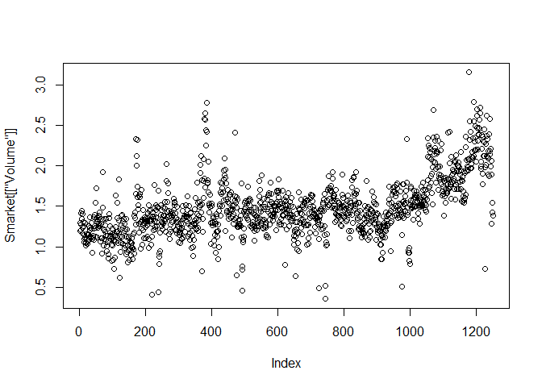
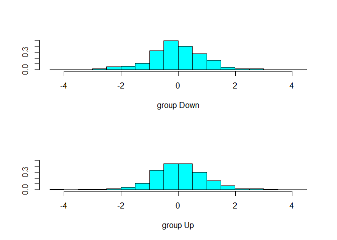

4.6 Lab: Logistic Regression, LDA, QDA, and KNN
================

``` r
library(tidyverse)
library(ISLR)
library(modelr)
library(class)
Smarket <- ISLR::Smarket %>% 
  rownames_to_column(var = "day") %>% 
  as_tibble()
```

``` r
summary(Smarket)
```

    ##      day                 Year           Lag1                Lag2          
    ##  Length:1250        Min.   :2001   Min.   :-4.922000   Min.   :-4.922000  
    ##  Class :character   1st Qu.:2002   1st Qu.:-0.639500   1st Qu.:-0.639500  
    ##  Mode  :character   Median :2003   Median : 0.039000   Median : 0.039000  
    ##                     Mean   :2003   Mean   : 0.003834   Mean   : 0.003919  
    ##                     3rd Qu.:2004   3rd Qu.: 0.596750   3rd Qu.: 0.596750  
    ##                     Max.   :2005   Max.   : 5.733000   Max.   : 5.733000  
    ##       Lag3                Lag4                Lag5         
    ##  Min.   :-4.922000   Min.   :-4.922000   Min.   :-4.92200  
    ##  1st Qu.:-0.640000   1st Qu.:-0.640000   1st Qu.:-0.64000  
    ##  Median : 0.038500   Median : 0.038500   Median : 0.03850  
    ##  Mean   : 0.001716   Mean   : 0.001636   Mean   : 0.00561  
    ##  3rd Qu.: 0.596750   3rd Qu.: 0.596750   3rd Qu.: 0.59700  
    ##  Max.   : 5.733000   Max.   : 5.733000   Max.   : 5.73300  
    ##      Volume           Today           Direction 
    ##  Min.   :0.3561   Min.   :-4.922000   Down:602  
    ##  1st Qu.:1.2574   1st Qu.:-0.639500   Up  :648  
    ##  Median :1.4229   Median : 0.038500             
    ##  Mean   :1.4783   Mean   : 0.003138             
    ##  3rd Qu.:1.6417   3rd Qu.: 0.596750             
    ##  Max.   :3.1525   Max.   : 5.733000

``` r
Smarket %>% 
  select_if(is.numeric) %>% 
  cor()
```

    ##              Year         Lag1         Lag2         Lag3         Lag4
    ## Year   1.00000000  0.029699649  0.030596422  0.033194581  0.035688718
    ## Lag1   0.02969965  1.000000000 -0.026294328 -0.010803402 -0.002985911
    ## Lag2   0.03059642 -0.026294328  1.000000000 -0.025896670 -0.010853533
    ## Lag3   0.03319458 -0.010803402 -0.025896670  1.000000000 -0.024051036
    ## Lag4   0.03568872 -0.002985911 -0.010853533 -0.024051036  1.000000000
    ## Lag5   0.02978799 -0.005674606 -0.003557949 -0.018808338 -0.027083641
    ## Volume 0.53900647  0.040909908 -0.043383215 -0.041823686 -0.048414246
    ## Today  0.03009523 -0.026155045 -0.010250033 -0.002447647 -0.006899527
    ##                Lag5      Volume        Today
    ## Year    0.029787995  0.53900647  0.030095229
    ## Lag1   -0.005674606  0.04090991 -0.026155045
    ## Lag2   -0.003557949 -0.04338321 -0.010250033
    ## Lag3   -0.018808338 -0.04182369 -0.002447647
    ## Lag4   -0.027083641 -0.04841425 -0.006899527
    ## Lag5    1.000000000 -0.02200231 -0.034860083
    ## Volume -0.022002315  1.00000000  0.014591823
    ## Today  -0.034860083  0.01459182  1.000000000

``` r
plot(Smarket[["Volume"]])
```

<!-- -->

## 4.6.2 Logistic Regression

``` r
glm_fit <- glm(Direction ~ Lag1 + Lag2 + Lag3 + Lag4 + Lag5 + Volume,
               data = Smarket,
               family = binomial)
summary(glm_fit)
```

    ## 
    ## Call:
    ## glm(formula = Direction ~ Lag1 + Lag2 + Lag3 + Lag4 + Lag5 + 
    ##     Volume, family = binomial, data = Smarket)
    ## 
    ## Deviance Residuals: 
    ##    Min      1Q  Median      3Q     Max  
    ## -1.446  -1.203   1.065   1.145   1.326  
    ## 
    ## Coefficients:
    ##              Estimate Std. Error z value Pr(>|z|)
    ## (Intercept) -0.126000   0.240736  -0.523    0.601
    ## Lag1        -0.073074   0.050167  -1.457    0.145
    ## Lag2        -0.042301   0.050086  -0.845    0.398
    ## Lag3         0.011085   0.049939   0.222    0.824
    ## Lag4         0.009359   0.049974   0.187    0.851
    ## Lag5         0.010313   0.049511   0.208    0.835
    ## Volume       0.135441   0.158360   0.855    0.392
    ## 
    ## (Dispersion parameter for binomial family taken to be 1)
    ## 
    ##     Null deviance: 1731.2  on 1249  degrees of freedom
    ## Residual deviance: 1727.6  on 1243  degrees of freedom
    ## AIC: 1741.6
    ## 
    ## Number of Fisher Scoring iterations: 3

``` r
coef(glm_fit)
```

    ##  (Intercept)         Lag1         Lag2         Lag3         Lag4 
    ## -0.126000257 -0.073073746 -0.042301344  0.011085108  0.009358938 
    ##         Lag5       Volume 
    ##  0.010313068  0.135440659

``` r
glm_probs <- predict(glm_fit, type = "response")
glm_probs[1:10]
```

    ##         1         2         3         4         5         6         7 
    ## 0.5070841 0.4814679 0.4811388 0.5152224 0.5107812 0.5069565 0.4926509 
    ##         8         9        10 
    ## 0.5092292 0.5176135 0.4888378

``` r
contrasts(Smarket[["Direction"]])
```

    ##      Up
    ## Down  0
    ## Up    1

``` r
Smarket_preds <- 
  Smarket %>% 
  add_predictions(glm_fit, type = "response") %>% 
  mutate(pred_direction = ifelse(pred < 0.5,
                                 "Down",
                                 "Up"))
```

``` r
table(Smarket_preds[["Direction"]],
      Smarket_preds[["pred_direction"]])
```

    ##       
    ##        Down  Up
    ##   Down  145 457
    ##   Up    141 507

``` r
mean(Smarket_preds[["Direction"]] == Smarket_preds[["pred_direction"]])
```

    ## [1] 0.5216

### Implementing separation between test and training data

``` r
Smarket_train <- 
  Smarket %>% 
  filter(Year <= 2004)

Smarket_test <- 
  Smarket %>% 
  filter(Year == 2005)
```

``` r
glm_fit <- glm(Direction ~ Lag1 + Lag2 + Lag3 + Lag4 + Lag5 + Volume,
               data = Smarket_train,
               family = binomial)
summary(glm_fit)
```

    ## 
    ## Call:
    ## glm(formula = Direction ~ Lag1 + Lag2 + Lag3 + Lag4 + Lag5 + 
    ##     Volume, family = binomial, data = Smarket_train)
    ## 
    ## Deviance Residuals: 
    ##    Min      1Q  Median      3Q     Max  
    ## -1.302  -1.190   1.079   1.160   1.350  
    ## 
    ## Coefficients:
    ##              Estimate Std. Error z value Pr(>|z|)
    ## (Intercept)  0.191213   0.333690   0.573    0.567
    ## Lag1        -0.054178   0.051785  -1.046    0.295
    ## Lag2        -0.045805   0.051797  -0.884    0.377
    ## Lag3         0.007200   0.051644   0.139    0.889
    ## Lag4         0.006441   0.051706   0.125    0.901
    ## Lag5        -0.004223   0.051138  -0.083    0.934
    ## Volume      -0.116257   0.239618  -0.485    0.628
    ## 
    ## (Dispersion parameter for binomial family taken to be 1)
    ## 
    ##     Null deviance: 1383.3  on 997  degrees of freedom
    ## Residual deviance: 1381.1  on 991  degrees of freedom
    ## AIC: 1395.1
    ## 
    ## Number of Fisher Scoring iterations: 3

Predicting using the test data:

``` r
Smarket_test <-
  Smarket_test %>% 
  add_predictions(glm_fit, type = "response") %>% 
  mutate(pred_direction = ifelse(pred < 0.5,
                                 "Down",
                                 "Up"))
```

``` r
mean(Smarket_test[["Direction"]] == Smarket_test[["pred_direction"]])
```

    ## [1] 0.4801587

Now trying with just the two predictors with the strongest relationship
with the response variable:

``` r
glm_fit_minimal <- glm(Direction ~ Lag1 + Lag2,
                       data = Smarket_train,
                       family = binomial)

Smarket_test <-
  Smarket_test %>% 
  add_predictions(glm_fit_minimal, type = "response") %>% 
  mutate(pred_direction = ifelse(pred < 0.5,
                                 "Down",
                                 "Up"))

mean(Smarket_test[["Direction"]] == Smarket_test[["pred_direction"]])
```

    ## [1] 0.5595238

Prediction using specific values for `Lag1` and `Lag2`:

``` r
predict(glm_fit_minimal,
        newdata = tibble(
          Lag1 = c(1.2, 1.5),
          Lag2 = c(1.1, -0.8)
        ),
        type = "response"
)
```

    ##         1         2 
    ## 0.4791462 0.4960939

## 4.6.3 Linear Discriminant Analysis

``` r
lda_fit <- MASS::lda(Direction ~ Lag1 + Lag2,
                     data = Smarket_train)
lda_fit
```

    ## Call:
    ## lda(Direction ~ Lag1 + Lag2, data = Smarket_train)
    ## 
    ## Prior probabilities of groups:
    ##     Down       Up 
    ## 0.491984 0.508016 
    ## 
    ## Group means:
    ##             Lag1        Lag2
    ## Down  0.04279022  0.03389409
    ## Up   -0.03954635 -0.03132544
    ## 
    ## Coefficients of linear discriminants:
    ##             LD1
    ## Lag1 -0.6420190
    ## Lag2 -0.5135293

``` r
plot(lda_fit)
```

<!-- -->

``` r
prediction_lda <- 
  predict(lda_fit, newdata = Smarket_test)
str(prediction_lda)
```

    ## List of 3
    ##  $ class    : Factor w/ 2 levels "Down","Up": 2 2 2 2 2 2 2 2 2 2 ...
    ##  $ posterior: num [1:252, 1:2] 0.49 0.479 0.467 0.474 0.493 ...
    ##   ..- attr(*, "dimnames")=List of 2
    ##   .. ..$ : chr [1:252] "1" "2" "3" "4" ...
    ##   .. ..$ : chr [1:2] "Down" "Up"
    ##  $ x        : num [1:252, 1] 0.0829 0.5911 1.1672 0.8334 -0.0379 ...
    ##   ..- attr(*, "dimnames")=List of 2
    ##   .. ..$ : chr [1:252] "1" "2" "3" "4" ...
    ##   .. ..$ : chr "LD1"

``` r
lda_class <- prediction_lda$class
mean(lda_class == Smarket_test[["Direction"]])
```

    ## [1] 0.5595238

``` r
sum(prediction_lda[["posterior"]][,1] > 0.5)
```

    ## [1] 70

``` r
table(lda_class, Smarket_test[["Direction"]])
```

    ##          
    ## lda_class Down  Up
    ##      Down   35  35
    ##      Up     76 106

``` r
prediction_lda$posterior[1:20,1]
```

    ##         1         2         3         4         5         6         7 
    ## 0.4901792 0.4792185 0.4668185 0.4740011 0.4927877 0.4938562 0.4951016 
    ##         8         9        10        11        12        13        14 
    ## 0.4872861 0.4907013 0.4844026 0.4906963 0.5119988 0.4895152 0.4706761 
    ##        15        16        17        18        19        20 
    ## 0.4744593 0.4799583 0.4935775 0.5030894 0.4978806 0.4886331

``` r
lda_class[1:20]
```

    ##  [1] Up   Up   Up   Up   Up   Up   Up   Up   Up   Up   Up   Down Up   Up  
    ## [15] Up   Up   Up   Down Up   Up  
    ## Levels: Down Up

``` r
Smarket_test %>% 
  mutate(pred_direction_lda = prediction_lda[["class"]]) %>% 
  count(pred_direction, pred_direction_lda)
```

    ## # A tibble: 2 x 3
    ##   pred_direction pred_direction_lda     n
    ##   <chr>          <fct>              <int>
    ## 1 Down           Down                  70
    ## 2 Up             Up                   182

``` r
prediction_lda[["posterior"]] %>% summary()
```

    ##       Down              Up        
    ##  Min.   :0.4578   Min.   :0.4798  
    ##  1st Qu.:0.4847   1st Qu.:0.4994  
    ##  Median :0.4926   Median :0.5074  
    ##  Mean   :0.4923   Mean   :0.5077  
    ##  3rd Qu.:0.5006   3rd Qu.:0.5153  
    ##  Max.   :0.5202   Max.   :0.5422

## 4.6.4 Quadratic Discriminant Analysis

``` r
qda_fit <- MASS::qda(Direction ~ Lag1 + Lag2,
                     data = Smarket_train)

qda_fit
```

    ## Call:
    ## qda(Direction ~ Lag1 + Lag2, data = Smarket_train)
    ## 
    ## Prior probabilities of groups:
    ##     Down       Up 
    ## 0.491984 0.508016 
    ## 
    ## Group means:
    ##             Lag1        Lag2
    ## Down  0.04279022  0.03389409
    ## Up   -0.03954635 -0.03132544

``` r
prediction_qda <- predict(qda_fit,
                          newdata = Smarket_test)
```

``` r
table(prediction_qda[["class"]],
      Smarket_test[["Direction"]])
```

    ##       
    ##        Down  Up
    ##   Down   30  20
    ##   Up     81 121

``` r
mean(prediction_qda[["class"]] == Smarket_test[["Direction"]])
```

    ## [1] 0.5992063

## 4.6.5 K-Nearest Neighbors

``` r
train_x <-  Smarket_train %>% 
  select(Lag1, Lag2)

test_x <- Smarket_test %>% 
  select(Lag1, Lag2)

train_y <- Smarket_train %>% 
  select(Direction)
```

``` r
set.seed(1)
knn_pred <- knn(as.matrix(train_x),
                as.matrix(test_x),
                as.matrix(train_y),
                k = 1)
```

``` r
table(knn_pred, Smarket_test[["Direction"]])
```

    ##         
    ## knn_pred Down Up
    ##     Down   43 58
    ##     Up     68 83

``` r
(83+43)/252
```

    ## [1] 0.5

Now with K = 3

``` r
set.seed(1)
knn_pred_k3 <- knn(as.matrix(train_x),
                   as.matrix(test_x),
                   as.matrix(train_y),
                   k = 3)
```

``` r
table(knn_pred_k3, Smarket_test[["Direction"]])
```

    ##            
    ## knn_pred_k3 Down Up
    ##        Down   48 55
    ##        Up     63 86

``` r
(48+86)/252
```

    ## [1] 0.531746

## 4.6.6 An Application to Caravan Insurance Data

``` r
summary(Caravan[["Purchase"]])
```

    ##   No  Yes 
    ## 5474  348

Scaling the variables and spliting between train and test data:

``` r
Caravan_scaled <- Caravan %>% 
  mutate_if(is.numeric, scale) %>% 
  mutate(id = row_number())

Caravan_test <- Caravan_scaled %>% 
  filter(id <= 1000) %>% 
  select(-id)

Caravan_train <- Caravan_scaled %>% 
  filter(id > 1000) %>% 
  select(-id)
```

Subsetting to get the inputs to the `knn` function.

``` r
train_x <-  Caravan_train %>% 
  select(-Purchase)

test_x <- Caravan_test %>% 
  select(-Purchase)

train_y <- Caravan_train %>% 
  select(Purchase)
```

Set seed for replicability and obtaining the predictions (with k = 1)

``` r
set.seed(1)
knn_pred_caravan <- knn(as.matrix(train_x),
                        as.matrix(test_x),
                        as.matrix(train_y),
                        k = 1)
```

The predictions are correct 87.2% of the time (TP + TN)/(P + N)

``` r
mean(knn_pred_caravan == Caravan_test[["Purchase"]])
```

    ## [1] 0.882

But a “dumb” model which always predict that the customer would not
purchase insurance would have 94.1% accuracy.

``` r
mean(Caravan_test[["Purchase"]] == "No")
```

    ## [1] 0.941

But how well does our model do in terms of precision? i.e. TP / (TP +
FP).

``` r
table(knn_pred_caravan, Caravan_test[["Purchase"]])
```

    ##                 
    ## knn_pred_caravan  No Yes
    ##              No  873  50
    ##              Yes  68   9

``` r
9/(68+9)
```

    ## [1] 0.1168831

It gets an 11.6%, which is almost twice as we would get using a random
guess (not bad). Let’s see if we can get better results by increasing
the `k` parameter:

``` r
set.seed(1)
knn_pred_caravan_k3 <- knn(as.matrix(train_x),
                           as.matrix(test_x),
                           as.matrix(train_y),
                           k = 3)

table(knn_pred_caravan_k3, Caravan_test[["Purchase"]])
```

    ##                    
    ## knn_pred_caravan_k3  No Yes
    ##                 No  921  54
    ##                 Yes  20   5

With k = 3 we get 20% precision, a threefold increase versus random
guess.

``` r
5/(20+5)
```

    ## [1] 0.2

``` r
set.seed(1)
knn_pred_caravan_k5 <- knn(as.matrix(train_x),
                           as.matrix(test_x),
                           as.matrix(train_y),
                           k = 5)

table(knn_pred_caravan_k5, Caravan_test[["Purchase"]])
```

    ##                    
    ## knn_pred_caravan_k5  No Yes
    ##                 No  930  55
    ##                 Yes  11   4

``` r
4/(11+4)
```

    ## [1] 0.2666667

Now with k = 5 we have almost five times more precision than with random
guessing. However, the recall or sensitivity decreases a little versus
the k = 3 model.

Now let’s see how well logistic regression works with this data:

``` r
glm_caravan <- glm(Purchase ~ .,
                   data = Caravan_train,
                   family = "binomial")
```

    ## Warning: glm.fit: fitted probabilities numerically 0 or 1 occurred

``` r
glm_pred_caravan <- predict(glm_caravan, Caravan_test, type = "response")

glm_pred_05cutoff <- ifelse(glm_pred_caravan > 0.5,
                            "Yes",
                            "No")

glm_pred_025cutoff <- ifelse(glm_pred_caravan > 0.25,
                            "Yes",
                            "No")
```

``` r
table(glm_pred_05cutoff, Caravan_test[["Purchase"]])
```

    ##                  
    ## glm_pred_05cutoff  No Yes
    ##               No  934  59
    ##               Yes   7   0

With a 0.5 cutoff we get a precision of 0%, not good.

``` r
table(glm_pred_025cutoff, Caravan_test[["Purchase"]])
```

    ##                   
    ## glm_pred_025cutoff  No Yes
    ##                No  919  48
    ##                Yes  22  11

``` r
11/(22+11)
```

    ## [1] 0.3333333

But with a cut-off of 0.25 we obtain the best result yet: 33% precision.
