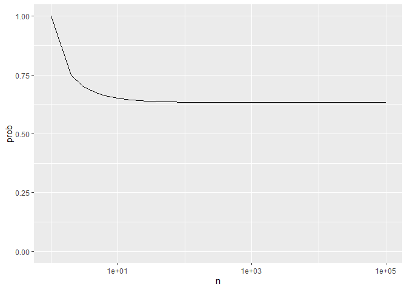
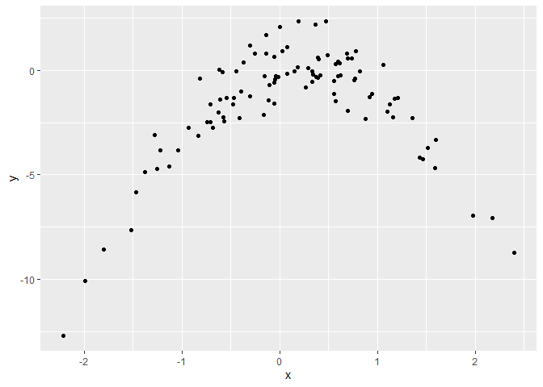

Chapter 5. Resampling Methods
================

``` r
library(tidyverse)
library(ISLR)
library(modelr)
library(caret)
```

## Conceptual

(1) Using basic statistical properties of the variance, as well as
single variable calculus, derive (5.6). In other words, prove that \(α\)
given by (5.6) does indeed minimize \(Var(αX +(1 − α)Y)\).


(2) We will now derive the probability that a given observation is part
of a bootstrap sample. Suppose that we obtain a bootstrap sample from a
set of \(n\) observations.

(a) What is the probability that the first bootstrap observation is not
the \(j\)th observation from the original sample? Justify your answer.

\((n-1)/n\). Because each observation in the sample has the same
probability to be chosen, and the probability to pick any given
observation is \(1/n\).

(b) What is the probability that the second bootstrap observation is not
the \(j\)th observation from the original sample?

The same as in (a), because we’re sampling with replacement.

(c) Argue that the probability that the \(j\)th observation is not in
the bootstrap sample is \((1 − 1/n)^n\).

Because the probability that an event (of probability \(p\)) happens
\(n\) times in a row is \(p^n\), and having the \(j\)th observation
completely left out of the bootstrap sample is the same as having the
event described in (a) happening \(n\) times in a row.

(d) When \(n = 5\), what is the probability that the \(j\)th observation
is in the bootstrap sample?

``` r
1-(1-1/5)^5
```

    ## [1] 0.67232

(e) When n = 100, what is the probability that the jth observation is in
the bootstrap sample?

``` r
1-(1-1/100)^100
```

    ## [1] 0.6339677

(f) When \(n = 10,000\), what is the probability that the \(j\)th
observation is in the bootstrap sample?

``` r
1-(1-1/10000)^10000
```

    ## [1] 0.632139

(g) Create a plot that displays, for each integer value of n from 1 to
100,000, the probability that the \(j\)th observation is in the
bootstrap sample. Comment on what you observe.

``` r
plot_data <- 
  tibble(
    n = 1:100000,
    prob = 1-(1-1/n)^n
  )

ggplot(plot_data, aes(n, prob)) +
  geom_line() +
  expand_limits(y = 0) + 
  scale_x_log10()
```

<!-- -->

It starts at 1, but quickly converges to 0.632.

(h) We will now investigate numerically the probability that a bootstrap
sample of size n = 100 contains the jth observation. Here j = 4. We
repeatedly create bootstrap samples, and each time we record whether or
not the fourth observation is contained in the bootstrap sample.

``` r
store <- rep (NA , 100000)
for (i in 1:100000) { 
  store[i] <- sum(sample(1:100, rep =TRUE) == 4) > 0
}
mean(store)
```

    ## [1] 0.63431

Comment on the results obtained.

The probability of having the \(j\)th observation in the sample is very
close to the value to which the plot in (g) converges.

(3) We now review k-fold cross-validation.

(a) Explain how k-fold cross-validation is implemented.

The available data is randomly splited in k samples (or “folds”) of
equal size. Then the model is trained k times, leaving out a different
fold each time, and using it after as test o validation data.

(b) What are the advantages and disadvantages of k-fold cross validation
relative to:

i. The validation set approach?

K-fold cross validation greatly reduces the variability of the test
error rate estimate, compared to using the validation set approach. Also
it has less bias because we’re using a higher fraction of the available
data to train the model. A minor disavantage is that it slightly
increases the computation cost of obtaining error rate estimates (we
need to fit the model k times, not just once).

ii. LOOCV?

K-fold CV requieres less computation cost than LOOCV, because we need to
fit the model k times instead of n (and most of the times k \< n). Also,
it has less variance in the estimation, because there is less overlap in
the training data used in each iteration.

However, k-fold CV has more bias than LOOCV, since we’re using less
training observations for each model.

(4) Suppose that we use some statistical learning method to make a
prediction for the response Y for a particular value of the predictor X.
Carefully describe how we might estimate the standard deviation of our
prediction.

Some statistical learning methods, like linear or logistic regression,
provide us with the standard deviations of the coefficient estimates and
the predictions. But other methods doesn’t provide this information. In
this case, we could apply a resampling method like the bootstrap. For
this we need to create a function that computes the statistical of
interest (in this case, the prediction) using a sample of the data. Then
we pass that function to the function `boot()` (along with the original
data and the number `B` of iterations) and then we get an estimation of
the standard error of the predictions, obtained through repeteadly
fitting the model in `B` samples (with replacement.)

## Applied

(5) In Chapter 4, we used logistic regression to predict the probability
of default using `income` and `balance` on the `Default` data set. We
will now estimate the test error of this logistic regression model using
the validation set approach. Do not forget to set a random seed before
beginning your analysis.

(a) Fit a logistic regression model that uses `income` and `balance` to
predict `default`.

``` r
glm_default <- glm(default ~ balance + income,
                   data = Default,
                   family = "binomial")

summary(glm_default)
```

    ## 
    ## Call:
    ## glm(formula = default ~ balance + income, family = "binomial", 
    ##     data = Default)
    ## 
    ## Deviance Residuals: 
    ##     Min       1Q   Median       3Q      Max  
    ## -2.4725  -0.1444  -0.0574  -0.0211   3.7245  
    ## 
    ## Coefficients:
    ##               Estimate Std. Error z value Pr(>|z|)    
    ## (Intercept) -1.154e+01  4.348e-01 -26.545  < 2e-16 ***
    ## balance      5.647e-03  2.274e-04  24.836  < 2e-16 ***
    ## income       2.081e-05  4.985e-06   4.174 2.99e-05 ***
    ## ---
    ## Signif. codes:  0 '***' 0.001 '**' 0.01 '*' 0.05 '.' 0.1 ' ' 1
    ## 
    ## (Dispersion parameter for binomial family taken to be 1)
    ## 
    ##     Null deviance: 2920.6  on 9999  degrees of freedom
    ## Residual deviance: 1579.0  on 9997  degrees of freedom
    ## AIC: 1585
    ## 
    ## Number of Fisher Scoring iterations: 8

(b) Using the validation set approach, estimate the test error of this
model. In order to do this, you must perform the following steps:

i. Split the sample set into a training set and a validation set.

ii. Fit a multiple logistic regression model using only the training
observations.

iii. Obtain a prediction of default status for each individual in the
validation set by computing the posterior probability of default for
that individual, and classifying the individual to the default category
if the posterior probability is greater than 0.5.

iv. Compute the validation set error, which is the fraction of the
observations in the validation set that are misclassified.

``` r
set.seed(1989)

train_default <- 
  Default %>% 
  sample_frac(size = 0.5)

test_default <- 
  Default %>% 
  anti_join(train_default)

glm_train_default <- glm(default ~ balance + income,
                         data = train_default,
                         family = "binomial")

test_default <- test_default %>% 
  add_predictions(glm_train_default, type = "response") %>% 
  mutate(pred_class = ifelse(
    pred > 0.5, "Yes", "No"),
  pred_class = factor(pred_class, levels = c("No", "Yes")))

caret::confusionMatrix(test_default[["pred_class"]],
                       reference = test_default[["default"]])
```

    ## Confusion Matrix and Statistics
    ## 
    ##           Reference
    ## Prediction   No  Yes
    ##        No  4813  111
    ##        Yes   19   57
    ##                                           
    ##                Accuracy : 0.974           
    ##                  95% CI : (0.9692, 0.9782)
    ##     No Information Rate : 0.9664          
    ##     P-Value [Acc > NIR] : 0.001154        
    ##                                           
    ##                   Kappa : 0.4558          
    ##                                           
    ##  Mcnemar's Test P-Value : 1.449e-15       
    ##                                           
    ##             Sensitivity : 0.9961          
    ##             Specificity : 0.3393          
    ##          Pos Pred Value : 0.9775          
    ##          Neg Pred Value : 0.7500          
    ##              Prevalence : 0.9664          
    ##          Detection Rate : 0.9626          
    ##    Detection Prevalence : 0.9848          
    ##       Balanced Accuracy : 0.6677          
    ##                                           
    ##        'Positive' Class : No              
    ## 

Validation set error is as follows:

``` r
1-0.974
```

    ## [1] 0.026

(c) Repeat the process in (b) three times, using three different splits
of the observations into a training set and a validation set. Comment on
the results obtained.

``` r
estimate_error_glm_default <- function(...) {
  train_default <-
    Default %>%
    sample_frac(size = 0.5)
  
  test_default <-
    Default %>%
    anti_join(train_default, 
              by = c("default", "student", "balance", "income"))
  
  glm_train_default <- glm(default ~ balance + income,
                           data = train_default,
                           family = "binomial")
  
  test_default <- test_default %>%
    add_predictions(glm_train_default, type = "response") %>%
    mutate(
      pred_class = ifelse(pred > 0.5, "Yes", "No"),
      pred_class = factor(pred_class, levels = c("No", "Yes"))
    )
  
  conf_matrix <-
    caret::confusionMatrix(test_default[["pred_class"]],
                           reference = test_default[["default"]])
  
  1 - conf_matrix[["overall"]][["Accuracy"]]
}

(test_error_rates <- 
  map_dbl(1:3, estimate_error_glm_default))
```

    ## [1] 0.0222 0.0278 0.0246

``` r
mean(test_error_rates)
```

    ## [1] 0.02486667

``` r
sd(test_error_rates)
```

    ## [1] 0.002809508

The average test error rate is slightly higher than in (b), and we also
see a standard eviation of 0.0011 in these three cases.

(d) Now consider a logistic regression model that predicts the
probability of `default` using `income`, `balance`, and a dummy variable
for `student`. Estimate the test error for this model using the
validation set approach. Comment on whether or not including a dummy
variable for student leads to a reduction in the test error rate.

``` r
set.seed(1991)

train_default <- 
  Default %>% 
  sample_frac(size = 0.5)

test_default <- 
  Default %>% 
  anti_join(train_default)
```

    ## Joining, by = c("default", "student", "balance", "income")

``` r
glm_train_default_2 <- glm(default ~ balance + income + student,
                         data = train_default,
                         family = "binomial")

test_default <- test_default %>% 
  add_predictions(glm_train_default, type = "response") %>% 
  mutate(pred_class = ifelse(
    pred > 0.5, "Yes", "No"),
  pred_class = factor(pred_class, levels = c("No", "Yes")))

conf_matrix <- 
  caret::confusionMatrix(test_default[["pred_class"]],
                       reference = test_default[["default"]])

1-conf_matrix[["overall"]][["Accuracy"]]
```

    ## [1] 0.0272

The test error rate obtained is almost the same as with the simpler
model, so I wouldn’t say that incorporing the variable `student`
improves the Accuracy.

(7) We continue to consider the use of a logistic regression model to
predict the probability of `default` using `income` and `balance` on the
`Default` data set.

In particular, we will now compute estimates for the standard errors of
the `income` and `balance` logistic regression coefficients in two
different ways: (1) using the bootstrap, and (2) using the standard
formula for computing the standard errors in the `glm()` function. Do
not forget to set a random seed before beginning your analysis.

(a) Using the `summary()` and `glm()` functions, determine the estimated
standard errors for the coefficients associated with income and balance
in a multiple logistic regression model that uses both predictors.

``` r
summary(glm_default)
```

    ## 
    ## Call:
    ## glm(formula = default ~ balance + income, family = "binomial", 
    ##     data = Default)
    ## 
    ## Deviance Residuals: 
    ##     Min       1Q   Median       3Q      Max  
    ## -2.4725  -0.1444  -0.0574  -0.0211   3.7245  
    ## 
    ## Coefficients:
    ##               Estimate Std. Error z value Pr(>|z|)    
    ## (Intercept) -1.154e+01  4.348e-01 -26.545  < 2e-16 ***
    ## balance      5.647e-03  2.274e-04  24.836  < 2e-16 ***
    ## income       2.081e-05  4.985e-06   4.174 2.99e-05 ***
    ## ---
    ## Signif. codes:  0 '***' 0.001 '**' 0.01 '*' 0.05 '.' 0.1 ' ' 1
    ## 
    ## (Dispersion parameter for binomial family taken to be 1)
    ## 
    ##     Null deviance: 2920.6  on 9999  degrees of freedom
    ## Residual deviance: 1579.0  on 9997  degrees of freedom
    ## AIC: 1585
    ## 
    ## Number of Fisher Scoring iterations: 8

(b) Write a function, boot.fn(), that takes as input the Default data
set as well as an index of the observations, and that outputs the
coefficient estimates for income and balance in the multiple logistic
regression model.

``` r
boot.fn <- function(data, indexes) {
  data <- data[indexes,]
  
  glm(default ~ balance + income,
      data = data,
      family = "binomial") %>% 
    coefficients()
}
```

(c) Use the boot() function together with your boot.fn() function to
estimate the standard errors of the logistic regression coefficients for
income and balance.

``` r
boot::boot(Default, boot.fn, 1000)
```

    ## 
    ## ORDINARY NONPARAMETRIC BOOTSTRAP
    ## 
    ## 
    ## Call:
    ## boot::boot(data = Default, statistic = boot.fn, R = 1000)
    ## 
    ## 
    ## Bootstrap Statistics :
    ##          original        bias     std. error
    ## t1* -1.154047e+01  1.567597e-04 4.359111e-01
    ## t2*  5.647103e-03  1.510398e-06 2.279440e-04
    ## t3*  2.080898e-05 -1.694973e-07 4.876856e-06

(d) Comment on the estimated standard errors obtained using the `glm()`
function and using your bootstrap function.

The estimated standard errors for all the coefficients are very close in
the `glm()` and bootstrap functions.

(7) In Sections 5.3.2 and 5.3.3, we saw that the `cv.glm()` function can
be used in order to compute the LOOCV test error estimate.
Alternatively, one could compute those quantities using just the `glm()`
and `predict.glm()` functions, and a `for` loop. You will now take this
approach in order to compute the LOOCV error for a simple logistic
regression model on the `Weekly` data set. Recall that in the context of
classification problems, the LOOCV error is given in (5.4).

(a) Fit a logistic regression model that predicts `Direction` using
`Lag1` and `Lag2`.

``` r
glm(Direction ~ Lag1 + Lag2,
    data = Weekly,
    family = "binomial") %>% 
  summary()
```

    ## 
    ## Call:
    ## glm(formula = Direction ~ Lag1 + Lag2, family = "binomial", data = Weekly)
    ## 
    ## Deviance Residuals: 
    ##    Min      1Q  Median      3Q     Max  
    ## -1.623  -1.261   1.001   1.083   1.506  
    ## 
    ## Coefficients:
    ##             Estimate Std. Error z value Pr(>|z|)    
    ## (Intercept)  0.22122    0.06147   3.599 0.000319 ***
    ## Lag1        -0.03872    0.02622  -1.477 0.139672    
    ## Lag2         0.06025    0.02655   2.270 0.023232 *  
    ## ---
    ## Signif. codes:  0 '***' 0.001 '**' 0.01 '*' 0.05 '.' 0.1 ' ' 1
    ## 
    ## (Dispersion parameter for binomial family taken to be 1)
    ## 
    ##     Null deviance: 1496.2  on 1088  degrees of freedom
    ## Residual deviance: 1488.2  on 1086  degrees of freedom
    ## AIC: 1494.2
    ## 
    ## Number of Fisher Scoring iterations: 4

(b) Fit a logistic regression model that predicts `Direction` using
`Lag1` and `Lag2` using all but the first observation.

``` r
glm_lfo <-
  glm(Direction ~ Lag1 + Lag2,
      data = Weekly[-1, ],
      family = "binomial") 
```

(c) Use the model from (b) to predict the direction of the first
observation. You can do this by predicting that the first observation
will go up if \(P(Direction ="Up"|Lag1, Lag2) > 0.5\). Was this
observation correctly classified?

``` r
Weekly %>% 
  filter(row_number() == 1) %>% 
  add_predictions(glm_lfo, type = "response") %>% 
  select(Direction, pred)
```

    ##   Direction      pred
    ## 1      Down 0.5713923

It is incorrectly classified.

(d) Write a for loop from \(i = 1\) to \(i = n\), where \(n\) is the
number of observations in the data set, that performs each of the
following steps:

i. Fit a logistic regression model using all but the \(ith\) observation
to predict `Direction` using `Lag1` and `Lag2`.

ii. Compute the posterior probability of the market moving up for the
ith observation.

iii. Use the posterior probability for the ith observation in order to
predict whether or not the market moves up.

iv. Determine whether or not an error was made in predicting the
direction for the ith observation. If an error was made, then indicate
this as a 1, and otherwise indicate it as a 0.

``` r
is_error <- vector("integer", nrow(Weekly))
for(i in 1:nrow(Weekly)) {
  
fit_wo_i <- 
  glm(Direction ~ Lag1 + Lag2,
      data = Weekly[-i, ],
      family = "binomial")

prediction_i <- 
  predict(fit_wo_i, newdata = Weekly[i,], type = "response") %>% 
  as.numeric()

prediction_class <- ifelse(prediction_i > 0.5,
                           "Up",
                           "Down")

error <-
   ifelse(
     prediction_class == as.character(Weekly[i, "Direction"]),
     0,
     1)
  
is_error[[i]] <- error

}
```

(e) Take the average of the n numbers obtained in (d)iv in order to
obtain the LOOCV estimate for the test error. Comment on the results.

``` r
mean(is_error)
```

    ## [1] 0.4499541

We get 44.9% as estimate for the error rate using the LOOCV method.

(8) We will now perform cross-validation on a simulated data set.

(a) Generate a simulated data set as follows:

``` r
set.seed(1)

simulated <- 
  tibble(
    x = rnorm(100),
    y= x - 2*x^2 + rnorm (100) 
  )

simulated
```

    ## # A tibble: 100 x 2
    ##         x      y
    ##     <dbl>  <dbl>
    ##  1 -0.626 -2.03 
    ##  2  0.184  0.158
    ##  3 -0.836 -3.14 
    ##  4  1.60  -3.34 
    ##  5  0.330 -0.542
    ##  6 -0.820 -0.400
    ##  7  0.487  0.729
    ##  8  0.738  0.558
    ##  9  0.576  0.297
    ## 10 -0.305  1.19 
    ## # ... with 90 more rows

In this data set, what is n and what is p? Write out the model used to
generate the data in equation form.

n is 100 and p is 2. The model used to generate the data is as follows:

\(y = x - 2x^2 + e\) with \(e\) as an error term with mean 0 and
standard deviation 1.

(b) Create a scatterplot of X against Y. Comment on what you find.

``` r
qplot(x, y, data = simulated)
```

<!-- -->

The data follows a quadratic pattern (as expected, since `y` was
generated from `x^2`). As `x` moves away from zero, the value of `y`
goes down.

(c) Set a random seed, and then compute the LOOCV errors that result
from fitting the following four models using least squares:

i. \(Y = β_0 + β_1X + e\) ii. \(Y = β_0 + β_1X + β_2X_2 + e\) iii.
\(Y = β_0 + β_1X + β_2X_2 + β_3X_3 + e\) iv.
\(Y = β_0 + β_1X + β_2X_2 + β_3X_3 + β_4X_4 + e\).

``` r
models <- 
  list(
    glm(y ~ poly(x, 1), data = simulated),
    glm(y ~ poly(x, 2), data = simulated),
    glm(y ~ poly(x, 3), data = simulated),
    glm(y ~ poly(x, 4), data = simulated)
  )
```

``` r
set.seed(1989)
loocv_error <- 
  map(models, ~boot::cv.glm(data = simulated, glmfit = .))

loocv_error %>% 
  map("delta")
```

    ## [[1]]
    ## [1] 7.288162 7.284744
    ## 
    ## [[2]]
    ## [1] 0.9374236 0.9371789
    ## 
    ## [[3]]
    ## [1] 0.9566218 0.9562538
    ## 
    ## [[4]]
    ## [1] 0.9539049 0.9534453

(d) Repeat (c) using another random seed, and report your results. Are
your results the same as what you got in (c)? Why?

``` r
set.seed(1991)
loocv_error <- 
  map(models, ~boot::cv.glm(data = simulated, glmfit = .))

loocv_error %>% 
  map("delta")
```

    ## [[1]]
    ## [1] 7.288162 7.284744
    ## 
    ## [[2]]
    ## [1] 0.9374236 0.9371789
    ## 
    ## [[3]]
    ## [1] 0.9566218 0.9562538
    ## 
    ## [[4]]
    ## [1] 0.9539049 0.9534453

The results are the same because randomness doesn’t influence LOOCV
results (it’s always the same iteration using all the observations in
the data).

(e) Which of the models in (c) had the smallest LOOCV error? Is this
what you expected? Explain your answer.

The second model (with `x` as a quadratic term) is the one with lowest
LOOCV error. This is as expected, since `y` was generated using a
quadratic function of `x`.

(f) Comment on the statistical significance of the coefficient estimates
that results from fitting each of the models in (c) using least squares.
Do these results agree with the conclusions drawn based on the
cross-validation results?

``` r
map(models, summary)
```

    ## [[1]]
    ## 
    ## Call:
    ## glm(formula = y ~ poly(x, 1), data = simulated)
    ## 
    ## Deviance Residuals: 
    ##     Min       1Q   Median       3Q      Max  
    ## -9.5161  -0.6800   0.6812   1.5491   3.8183  
    ## 
    ## Coefficients:
    ##             Estimate Std. Error t value Pr(>|t|)    
    ## (Intercept)   -1.550      0.260  -5.961 3.95e-08 ***
    ## poly(x, 1)     6.189      2.600   2.380   0.0192 *  
    ## ---
    ## Signif. codes:  0 '***' 0.001 '**' 0.01 '*' 0.05 '.' 0.1 ' ' 1
    ## 
    ## (Dispersion parameter for gaussian family taken to be 6.760719)
    ## 
    ##     Null deviance: 700.85  on 99  degrees of freedom
    ## Residual deviance: 662.55  on 98  degrees of freedom
    ## AIC: 478.88
    ## 
    ## Number of Fisher Scoring iterations: 2
    ## 
    ## 
    ## [[2]]
    ## 
    ## Call:
    ## glm(formula = y ~ poly(x, 2), data = simulated)
    ## 
    ## Deviance Residuals: 
    ##     Min       1Q   Median       3Q      Max  
    ## -1.9650  -0.6254  -0.1288   0.5803   2.2700  
    ## 
    ## Coefficients:
    ##             Estimate Std. Error t value Pr(>|t|)    
    ## (Intercept)  -1.5500     0.0958  -16.18  < 2e-16 ***
    ## poly(x, 2)1   6.1888     0.9580    6.46 4.18e-09 ***
    ## poly(x, 2)2 -23.9483     0.9580  -25.00  < 2e-16 ***
    ## ---
    ## Signif. codes:  0 '***' 0.001 '**' 0.01 '*' 0.05 '.' 0.1 ' ' 1
    ## 
    ## (Dispersion parameter for gaussian family taken to be 0.9178258)
    ## 
    ##     Null deviance: 700.852  on 99  degrees of freedom
    ## Residual deviance:  89.029  on 97  degrees of freedom
    ## AIC: 280.17
    ## 
    ## Number of Fisher Scoring iterations: 2
    ## 
    ## 
    ## [[3]]
    ## 
    ## Call:
    ## glm(formula = y ~ poly(x, 3), data = simulated)
    ## 
    ## Deviance Residuals: 
    ##     Min       1Q   Median       3Q      Max  
    ## -1.9765  -0.6302  -0.1227   0.5545   2.2843  
    ## 
    ## Coefficients:
    ##              Estimate Std. Error t value Pr(>|t|)    
    ## (Intercept)  -1.55002    0.09626 -16.102  < 2e-16 ***
    ## poly(x, 3)1   6.18883    0.96263   6.429 4.97e-09 ***
    ## poly(x, 3)2 -23.94830    0.96263 -24.878  < 2e-16 ***
    ## poly(x, 3)3   0.26411    0.96263   0.274    0.784    
    ## ---
    ## Signif. codes:  0 '***' 0.001 '**' 0.01 '*' 0.05 '.' 0.1 ' ' 1
    ## 
    ## (Dispersion parameter for gaussian family taken to be 0.9266599)
    ## 
    ##     Null deviance: 700.852  on 99  degrees of freedom
    ## Residual deviance:  88.959  on 96  degrees of freedom
    ## AIC: 282.09
    ## 
    ## Number of Fisher Scoring iterations: 2
    ## 
    ## 
    ## [[4]]
    ## 
    ## Call:
    ## glm(formula = y ~ poly(x, 4), data = simulated)
    ## 
    ## Deviance Residuals: 
    ##     Min       1Q   Median       3Q      Max  
    ## -2.0550  -0.6212  -0.1567   0.5952   2.2267  
    ## 
    ## Coefficients:
    ##              Estimate Std. Error t value Pr(>|t|)    
    ## (Intercept)  -1.55002    0.09591 -16.162  < 2e-16 ***
    ## poly(x, 4)1   6.18883    0.95905   6.453 4.59e-09 ***
    ## poly(x, 4)2 -23.94830    0.95905 -24.971  < 2e-16 ***
    ## poly(x, 4)3   0.26411    0.95905   0.275    0.784    
    ## poly(x, 4)4   1.25710    0.95905   1.311    0.193    
    ## ---
    ## Signif. codes:  0 '***' 0.001 '**' 0.01 '*' 0.05 '.' 0.1 ' ' 1
    ## 
    ## (Dispersion parameter for gaussian family taken to be 0.9197797)
    ## 
    ##     Null deviance: 700.852  on 99  degrees of freedom
    ## Residual deviance:  87.379  on 95  degrees of freedom
    ## AIC: 282.3
    ## 
    ## Number of Fisher Scoring iterations: 2

Yes, the statistical significance results match the conclusions from the
LOOCV. The terms `x^3` and `x^4` are not statistically significant in
the models iii and iv, and also adding those terms doesn’t reduce the
LOOCV error below the one in the model ii.

9.  We will now consider the `Boston` housing data set, from the `MASS`
    library.

(a) Based on this data set, provide an estimate for the population mean
of `medv`. Call this estimate \(\hat{\mu}\).

``` r
Boston <- MASS::Boston

Boston[["medv"]] %>% mean()
```

    ## [1] 22.53281

(b) Provide an estimate of the standard error of \(\hat{\mu}\).
Interpret this result.

``` r
sd_medv <- Boston[["medv"]] %>% sd()
n_obs <- nrow(Boston)

sd_medv/sqrt(n_obs)
```

    ## [1] 0.4088611

(c) Now estimate the standard error of \(\hat{\mu}\) using the
bootstrap. How does this compare to your answer from (b)?

``` r
get_mean_boot <- function(data, indexes) {
  data[indexes] %>% mean() 
}

(mean_by_boot <- 
  boot::boot(Boston[["medv"]], get_mean_boot, 1000))
```

    ## 
    ## ORDINARY NONPARAMETRIC BOOTSTRAP
    ## 
    ## 
    ## Call:
    ## boot::boot(data = Boston[["medv"]], statistic = get_mean_boot, 
    ##     R = 1000)
    ## 
    ## 
    ## Bootstrap Statistics :
    ##     original      bias    std. error
    ## t1* 22.53281 0.003395652   0.4081243

The bootstrap estimate for the standard error is a bit higher than the
one calculed in (b).

(d) Based on your bootstrap estimate from (c), provide a 95% confidence
interval for the mean of `medv`. Compare it to the results obtained
using `t.test(Boston$medv)`.

``` r
sd_boot <- sd(mean_by_boot[["t"]])
mean_boot <- mean_by_boot[["t0"]]

c(mean_boot - 2*sd_boot, mean_boot + 2*sd_boot)
```

    ## [1] 21.71656 23.34905

(e) Based on this data set, provide an estimate, \(\hat{\mu}_{med}\),
for the median value of `medv` in the population.

``` r
Boston[["medv"]] %>% median()
```

    ## [1] 21.2

(f) We now would like to estimate the standard error of
\(\hat{\mu}_{med}\). Unfortunately, there is no simple formula for
computing the standard error of the median. Instead, estimate the
standard error of the median using the bootstrap. Comment on your
findings.

``` r
get_median_boot <- function(data, indexes) {
  data[indexes] %>% median()
}

(median_by_boot <- 
  boot::boot(Boston[["medv"]], get_median_boot, 1000))
```

    ## 
    ## ORDINARY NONPARAMETRIC BOOTSTRAP
    ## 
    ## 
    ## Call:
    ## boot::boot(data = Boston[["medv"]], statistic = get_median_boot, 
    ##     R = 1000)
    ## 
    ## 
    ## Bootstrap Statistics :
    ##     original   bias    std. error
    ## t1*     21.2 -0.02035   0.3908339

The bootstrap estimate for the median itself is the same as in (e), and
the estimate for standard error is lower than the estimate for the mean.

(g) Based on this data set, provide an estimate for the tenth percentile
of `medv` in Boston suburbs. Call this quantity \(\hat{\mu}_{0.1}\).(You
can use the `quantile()` function.)

``` r
quantile(Boston[["medv"]], 0.1)
```

    ##   10% 
    ## 12.75

(h) Use the bootstrap to estimate the standard error of
\(\hat{\mu}_{0.1}\).Comment on your findings.

``` r
get_quantile10_by_boot <- function(data, indexes) {
  data[indexes] %>% quantile(., 0.1)
}

boot::boot(Boston[["medv"]], get_quantile10_by_boot, 1000)
```

    ## 
    ## ORDINARY NONPARAMETRIC BOOTSTRAP
    ## 
    ## 
    ## Call:
    ## boot::boot(data = Boston[["medv"]], statistic = get_quantile10_by_boot, 
    ##     R = 1000)
    ## 
    ## 
    ## Bootstrap Statistics :
    ##     original  bias    std. error
    ## t1*    12.75   0.015   0.4885936
