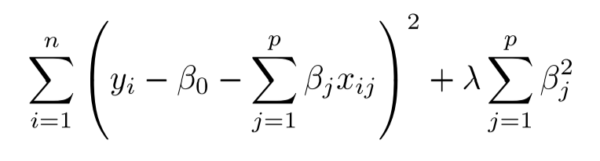
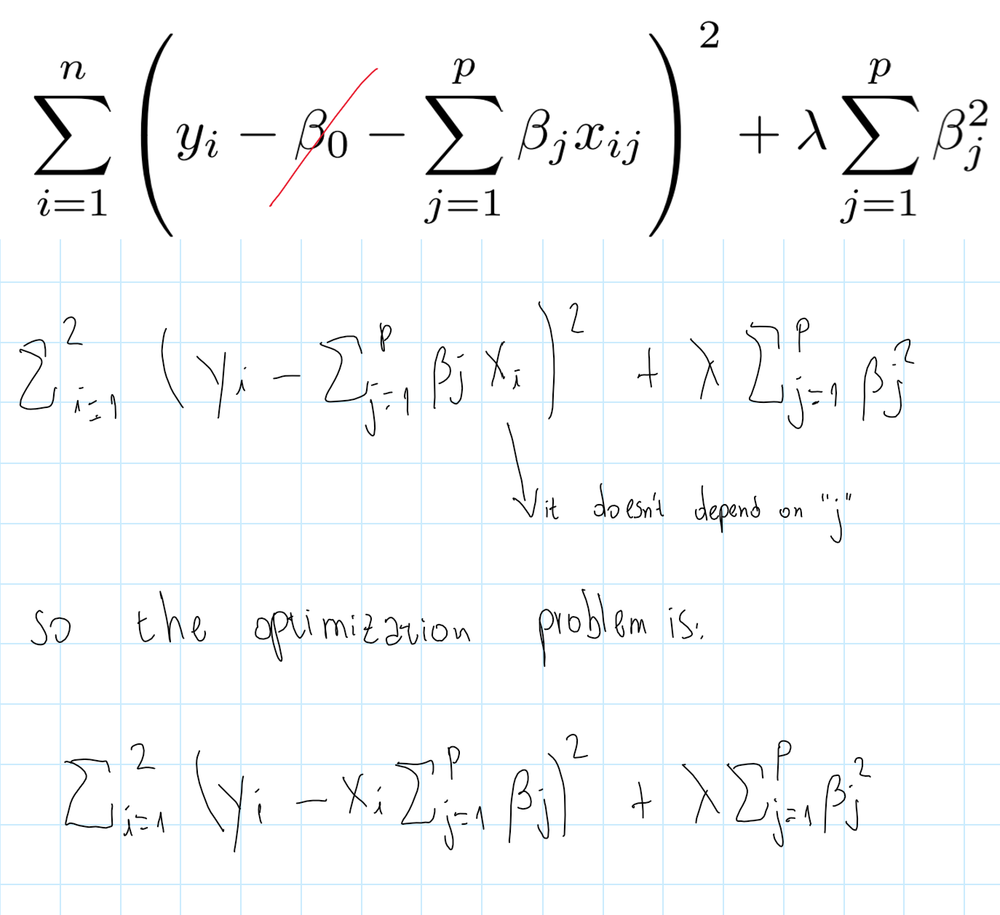

6.8 Exercises
================

``` r
knitr::opts_chunk$set(warning = FALSE, message = FALSE)
library(tidyverse)
library(leaps) # for feature selection
library(glmnet) # for lasso and ridge
library(ISLR) # for datasets
library(modelr) # for tidy manipulation of models
library(pls) # for Principal Components regression
```

## Conceptual

(1) We perform best subset, forward stepwise, and backward stepwise
selection on a single data set. For each approach, we obtain \(p + 1\)
models, containing \(0, 1, 2, ..., p\) predictors. Explain your answers:

(a) Which of the three models with k predictors has the smallest
training RSS?

A: Best subset selection should have the smallest training RSS (or at
least equal to others methods), because it will check all the
combinations with k predictors, that is \(\binom nk\) combinations.
Forward and backward stepwise, instead, will check only a subset of
those combinations (\(p-k+1\) in forward selection and \(k+1\) in
backward selection).

(b) Which of the three models with k predictors has the smallest test
RSS?

A: Again, best subset selection should provide the model with smallest
test RSS, simply because it checks more combinations of predictors.
However, since there is chance involved in the test RSS, stepwise could
provide a model with lower test RSS in some rare cases.

(c) True or False:

i. The predictors in the k-variable model identified by forward stepwise
are a subset of the predictors in the \((k+1)\)-variable model
identified by forward stepwise selection.

TRUE

ii. The predictors in the k-variable model identified by backward
stepwise are a subset of the predictors in the \((k +1)\)-variable model
identified by backward stepwise selection.

TRUE

iii. The predictors in the k-variable model identified by backward
stepwise are a subset of the predictors in the \((k +1)\)-variable model
identified by forward stepwise selection.

FALSE

iv. The predictors in the k-variable model identified by forward
stepwise are a subset of the predictors in the \((k+1)\)-variable model
identified by backward stepwise selection.

FALSE

v. The predictors in the k-variable model identified by best subset are
a subset of the predictors in the \((k +1)\)-variable model identified
by best subset selection.

FALSE

(2) For parts (a) through (c), indicate which of i. through iv. is
correct. Justify your answer.

(a) The lasso, relative to least squares, is:

i. More flexible and hence will give improved prediction accuracy when
its increase in bias is less than its decrease in variance.

ii. More flexible and hence will give improved prediction accuracy when
its increase in variance is less than its decrease in bias.

iii. Less flexible and hence will give improved prediction accuracy when
its increase in bias is less than its decrease in variance.

iv. Less flexible and hence will give improved prediction accuracy when
its increase in variance is less than its decrease in bias.

A: (iii) is correct. Lasso increases bias by introducing a “budget
restriction” on coefficients that shrinks their value (and even can set
some of them as zero). This leads to more bias, which is accepted to the
extent that there is a larger decrease in variance (due to less
overfitting to the training sample).

(b) Repeat (a) for ridge regression relative to least squares.

A: (iii) is correct. For the same reasons stated for the lasso
regression (the only difference between the lasso and ridge is the
“shape” of the constrain on the coefficients).

(c) Repeat (a) for non-linear methods relative to least squares.

A: (ii) is correct. Non-linear methods provide more flexibility than
least squares, hence they can reduce bias, at the expense of higher
variance. If the true relationship in the data is non linear, we can
expect an improvement in prediction accuracy (the reduction in bias will
be larger than the increase in variance).

(3) Suppose we estimate the regression coefficients in a linear
regression model by minimizing


for a particular value of s. For parts (a) through (e), indicate which
of i. through v. is correct. Justify your answer.

(a) As we increase s from 0, the training RSS will:

i. Increase initially, and then eventually start decreasing in an
inverted U shape.

ii. Decrease initially, and then eventually start increasing in a
Ushape.

iii. Steadily increase.

iv. Steadily decrease.

v. Remain constant

A: (iv) Steadily decrease. The flexibility of the model increses as
\(s\) increases, and higher flexibility is always associated with lower
training RSS.

(b) Repeat (a) for test RSS.

A: (ii) The test RSS will decrease as long as the increase in variance
(due to higher flexibility) is smaller than the reduction in bias. At
some point (which depends on the true relationships in the data) the
trend will invert, because the reduction in bias will no longer offset
the increase in variance.

(c) Repeat (a) for variance.

A: (iii) Variance always increases as there is more flexibility.

(d) Repeat (a) for (squared) bias.

A: (iv) Bias should decrease, or at least remain constant, as the
flexibility increases.

(e) Repeat (a) for the irreducible error.

A: (v). The irreducible error doesn’t depend on the flexibility of the
model.

(4) Suppose we estimate the regression coefficients in a linear
regression model by minimizing



for a particular value of λ. For parts (a) through (e), indicate which
of i. through v. is correct. Justify your answer.

(a) As we increase λ from 0, the training RSS will:

i. Increase initially, and then eventually start decreasing in an
inverted U shape.

ii. Decrease initially, and then eventually start increasing in a
Ushape.

iii. Steadily increase.

iv. Steadily decrease.

v. Remain constant.

A: (iii) An increase in \(\lambda\) implies a decrease in flexibility
(model with \(\lambda = 0\) has the same flexibility as OLS, and model
with \(\lambda = \infty\) is regression with just the intercept). So the
training RSS will increase as \(\lambda\) increases (and flexibility
decreases).

(b) Repeat (a) for test RSS.

A: (ii) Lower flexibility has the benefit of reducing variance, at the
expense of increasing bias. We should expect the reduction in variance
to offset the increase in bias for a range, reach a minimum in total
test RSS, and then see the trend reversed.

(c) Repeat (a) for variance.

A: (iv) Variance always decreases as flexibility decreases.

(d) Repeat (a) for (squared) bias.

A: (iii) As \(\lambda\) gets higher, the model is more constrained, so
the error due to bias increases.

(e) Repeat (a) for the irreducible error.

A: (v). The irreducible error doesn’t depend on the flexibility of the
model.

(5) It is well-known that ridge regression tends to give similar
coefficient values to correlated variables, whereas the lasso may give
quite different coefficient values to correlated variables. We will now
explore this property in a very simple setting.

Suppose that \(n =2\), \(p =2\), \(x_{11} = x_{12}\),
\(x_{21} = x_{22}\).Furthermore, suppose that \(y1+y2 = 0\) and
\(x_{11} +x_{21} =0\) and \(x_{12} + x_{22} = 0\), so that the estimate
for the intercept in a least squares, ridge regression, or lasso model
is zero: \(\hat{β}_0 = 0\).

(a) Write out the ridge regression optimization problem in this setting.



(b) Argue that in this setting, the ridge coefficient estimates satisfy
\(\hat{β}_1 = \hat{β}_2\).

A: We see that the RSS part of the expression depends only on the *sum*
of both coefficients (not on their individual values). For each value of
the sum, there are infinite pairs of coefficients that result on that
number. In this case, since there are two coefficients, those pairs form
a line on the plane, with slope of minus 45°.

The regularization part of the expression implies that we want the pair,
inside that line, in which the sum of the squares of the coefficients is
minimized. Geometrically, this happens in the point of the line which is
tangent to the smallest circle centered in (0,0). And in this point both
coefficients have equal value.


(c) Write out the lasso optimization problem in this setting.


(d) Argue that in this setting, the lasso coefficients are not unique —
in other words, there are many possible solutions to the optimization
problem in (c). Describe these solutions.

A: Similarly than in the previous case, here the RSS part of the
expression also imposses that the coefficents must be pairs inside a
line with slope of -45°. But the regularization part is different, it
implies that we want pairs in the line for which the sum of their
absolute values is minimized.

Geometrically, this is as having a square-shaped restriction, centered
in zero, and rotated in 45° degrees. In this setting, the intersection
of the line and the border of the restriction is not a point, but a
whole segment of the line (which contains infinite pairs or solutions).


6.  We will now explore (6.12) and (6.13) further.

(a) Consider (6.12) with \(p = 1\). For some choice of \(y_1\) and
\(λ > 0\), plot (6.12) as a function of \(β_1\). Your plot should
confirm that (6.12) is solved by (6.14).

A: Here is the plot for \(y_1 = 5\) and \(\lambda = 1\).


We see that in the minimum \(\beta_1\) is equal to 2.5, instead of 5.
This confirms the formula given in (6.14): the ridge coefficient is
equal to the OLS coefficient, divided by \((1 + \lambda)\) (which is 2,
in this particular case).

(b) Consider (6.13) with \(p = 1\). For some choice of \(y_1\) and
\(λ> 0\), plot (6.13) as a function of \(β_1\). Your plot should
confirm that (6.13) is solved by (6.15).


We see that in the minimum \(\beta_1\) is equal to 4.5, insted of 5 (the
actual value of \(y\)). This matches the formula given in (6.15), in
which if \(y_i\) is higher than \(\lambda/2\) (as is the case), then the
lasso coefficient is equal to \(y_i - \lambda/2\) (5 - 1/2, in this
particular case).

(7) We will now derive the Bayesian connection to the lasso and ridge
regression discussed in Section 6.2.2.

Skipped. Good solution here:
<https://blog.princehonest.com/stat-learning/ch6/7.html>

## Applied

(8) In this exercise, we will generate simulated data, and will then use
this data to perform best subset selection.

(a) Use the `rnorm()` function to generate a predictor \(X\) of length
\(n = 100\), as well as a noise vector \(\epsilon\) of length
\(n = 100\).

``` r
set.seed(42)

x <- rnorm(100)
noise <- rnorm(100)
```

(b) Generate a response vector \(Y\) of length \(n = 100\) according to
the model \(Y = β_0 + β_1X + β_2X^2 + β_3X^3 + \epsilon\), where
\(β_0\), \(β_1\), \(β_2\),and \(β_3\) are constants of your choice:

``` r
y <- 1 + 2*x + 0.4*x^2 + 0.17*x^3 + noise
```

(c) Use the `regsubsets()` function to perform best subset selection in
order to choose the best model containing the predictors
\(X,X^2,...,X^{10}\). What is the best model obtained according to Cp,
BIC,and adjusted \(R^2\)? Show some plots to provide evidence for your
answer, and report the coefficients of the best model obtained.

First we create the dataframe:

``` r
df <- tibble(
  y = y,
  x1 = x,
  x2 = x^2,
  x3 = x^3,
  x4 = x^4,
  x5 = x^5,
  x6 = x^6,
  x7 = x^7,
  x8 = x^8,
  x9 = x^9,
  x10 = x^10
)

df
```

    ## # A tibble: 100 x 11
    ##        y      x1      x2       x3      x4       x5      x6       x7
    ##    <dbl>   <dbl>   <dbl>    <dbl>   <dbl>    <dbl>   <dbl>    <dbl>
    ##  1 6.13   1.37   1.88     2.58e+0 3.53e+0  4.84e+0 6.64e+0  9.10e+0
    ##  2 1.01  -0.565  0.319   -1.80e-1 1.02e-1 -5.74e-2 3.24e-2 -1.83e-2
    ##  3 0.784  0.363  0.132    4.79e-2 1.74e-2  6.31e-3 2.29e-3  8.33e-4
    ##  4 4.32   0.633  0.401    2.53e-1 1.60e-1  1.02e-1 6.42e-2  4.07e-2
    ##  5 1.22   0.404  0.163    6.61e-2 2.67e-2  1.08e-2 4.37e-3  1.76e-3
    ##  6 0.898 -0.106  0.0113  -1.20e-3 1.27e-4 -1.35e-5 1.43e-6 -1.52e-7
    ##  7 5.10   1.51   2.28     3.45e+0 5.22e+0  7.89e+0 1.19e+1  1.80e+1
    ##  8 0.692 -0.0947 0.00896 -8.48e-4 8.03e-5 -7.60e-6 7.19e-7 -6.81e-8
    ##  9 8.25   2.02   4.07     8.22e+0 1.66e+1  3.35e+1 6.76e+1  1.36e+2
    ## 10 0.995 -0.0627 0.00393 -2.47e-4 1.55e-5 -9.70e-7 6.08e-8 -3.82e-9
    ## # ... with 90 more rows, and 3 more variables: x8 <dbl>, x9 <dbl>,
    ## #   x10 <dbl>

``` r
bestsubset <- regsubsets(x = as.matrix(select(df,-y)),
                         y = as.matrix(select(df, y))) 

summary(bestsubset)
```

    ## Subset selection object
    ## 10 Variables  (and intercept)
    ##     Forced in Forced out
    ## x1      FALSE      FALSE
    ## x2      FALSE      FALSE
    ## x3      FALSE      FALSE
    ## x4      FALSE      FALSE
    ## x5      FALSE      FALSE
    ## x6      FALSE      FALSE
    ## x7      FALSE      FALSE
    ## x8      FALSE      FALSE
    ## x9      FALSE      FALSE
    ## x10     FALSE      FALSE
    ## 1 subsets of each size up to 8
    ## Selection Algorithm: exhaustive
    ##          x1  x2  x3  x4  x5  x6  x7  x8  x9  x10
    ## 1  ( 1 ) "*" " " " " " " " " " " " " " " " " " "
    ## 2  ( 1 ) "*" "*" " " " " " " " " " " " " " " " "
    ## 3  ( 1 ) "*" "*" "*" " " " " " " " " " " " " " "
    ## 4  ( 1 ) "*" " " " " " " "*" " " "*" " " "*" " "
    ## 5  ( 1 ) "*" "*" " " " " "*" " " "*" " " "*" " "
    ## 6  ( 1 ) "*" " " "*" "*" " " "*" " " "*" " " "*"
    ## 7  ( 1 ) "*" " " " " "*" "*" "*" "*" "*" " " "*"
    ## 8  ( 1 ) "*" "*" " " "*" "*" "*" "*" "*" " " "*"

Now, for each number of predictors, we have the best model. Let’s
compare the models with different number of predictors:

``` r
summary(bestsubset)[["adjr2"]] %>% plot()
```

<!-- -->

``` r
summary(bestsubset)[["adjr2"]] %>% which.max()
```

    ## [1] 7

``` r
summary(bestsubset)[["cp"]] %>% plot()
```

<!-- -->

``` r
summary(bestsubset)[["cp"]] %>% which.min()
```

    ## [1] 7

``` r
summary(bestsubset)[["bic"]] %>% plot()
```

<!-- -->

``` r
summary(bestsubset)[["bic"]] %>% which.min()
```

    ## [1] 5

Based on Adj-R2 and Cp, the best model is the one with 7 variables.
Based on BIC, the best is the one with 5 (both conclusions are wrong,
because we generated the data using a model with 3 variables).

The coefficients for the “best” models:

``` r
bestsubset %>% coef(id = 5)
```

    ## (Intercept)          x1          x2          x5          x7          x9 
    ##   0.9989150   1.6245538   0.2707345   0.4130688  -0.1042546   0.0067443

``` r
bestsubset %>% coef(id = 7)
```

    ##  (Intercept)           x1           x4           x5           x6 
    ##  0.963118986  1.767180927  0.838646797  0.232534139 -0.492918480 
    ##           x7           x8          x10 
    ## -0.033074639  0.097426479 -0.006202833

(d) Repeat (c), using forward stepwise selection and also using
backwards stepwise selection. How does your answer compare to the
results in (c)?

First we do forward selection:

``` r
forwardselection <- regsubsets(x = as.matrix(select(df, -y)),
                               y = as.matrix(select(df, y)),
                               method = "forward") 

summary(forwardselection)
```

    ## Subset selection object
    ## 10 Variables  (and intercept)
    ##     Forced in Forced out
    ## x1      FALSE      FALSE
    ## x2      FALSE      FALSE
    ## x3      FALSE      FALSE
    ## x4      FALSE      FALSE
    ## x5      FALSE      FALSE
    ## x6      FALSE      FALSE
    ## x7      FALSE      FALSE
    ## x8      FALSE      FALSE
    ## x9      FALSE      FALSE
    ## x10     FALSE      FALSE
    ## 1 subsets of each size up to 8
    ## Selection Algorithm: forward
    ##          x1  x2  x3  x4  x5  x6  x7  x8  x9  x10
    ## 1  ( 1 ) "*" " " " " " " " " " " " " " " " " " "
    ## 2  ( 1 ) "*" "*" " " " " " " " " " " " " " " " "
    ## 3  ( 1 ) "*" "*" "*" " " " " " " " " " " " " " "
    ## 4  ( 1 ) "*" "*" "*" " " "*" " " " " " " " " " "
    ## 5  ( 1 ) "*" "*" "*" " " "*" " " " " " " "*" " "
    ## 6  ( 1 ) "*" "*" "*" " " "*" " " "*" " " "*" " "
    ## 7  ( 1 ) "*" "*" "*" "*" "*" " " "*" " " "*" " "
    ## 8  ( 1 ) "*" "*" "*" "*" "*" " " "*" " " "*" "*"

The best models, based on forward selection and chosen by Adj-R2, Cp,
and BIC, are as follows:

``` r
forwardmodels <- 
  tibble(
    metric = c("adjr2", "cp", "bic"),
    best_model = c(
      summary(forwardselection)[["adjr2"]]%>% which.max(),
      summary(forwardselection)[["cp"]] %>% which.min(),
      summary(forwardselection)[["bic"]] %>% which.min()
    )
  )

forwardmodels
```

    ## # A tibble: 3 x 2
    ##   metric best_model
    ##   <chr>       <int>
    ## 1 adjr2           8
    ## 2 cp              6
    ## 3 bic             6

Now with backward selection:

``` r
backwardselection <- regsubsets(x = as.matrix(select(df,-y)),
                                y = as.matrix(select(df, y)),
                                method = "backward")

summary(backwardselection)
```

    ## Subset selection object
    ## 10 Variables  (and intercept)
    ##     Forced in Forced out
    ## x1      FALSE      FALSE
    ## x2      FALSE      FALSE
    ## x3      FALSE      FALSE
    ## x4      FALSE      FALSE
    ## x5      FALSE      FALSE
    ## x6      FALSE      FALSE
    ## x7      FALSE      FALSE
    ## x8      FALSE      FALSE
    ## x9      FALSE      FALSE
    ## x10     FALSE      FALSE
    ## 1 subsets of each size up to 8
    ## Selection Algorithm: backward
    ##          x1  x2  x3  x4  x5  x6  x7  x8  x9  x10
    ## 1  ( 1 ) "*" " " " " " " " " " " " " " " " " " "
    ## 2  ( 1 ) "*" " " " " " " " " " " " " "*" " " " "
    ## 3  ( 1 ) "*" " " " " " " " " " " " " "*" " " "*"
    ## 4  ( 1 ) "*" " " " " " " "*" " " " " "*" " " "*"
    ## 5  ( 1 ) "*" " " " " "*" "*" " " " " "*" " " "*"
    ## 6  ( 1 ) "*" " " " " "*" "*" "*" " " "*" " " "*"
    ## 7  ( 1 ) "*" " " " " "*" "*" "*" "*" "*" " " "*"
    ## 8  ( 1 ) "*" " " " " "*" "*" "*" "*" "*" "*" "*"

The best models, based on forward selection and chosen by Adj-R2, Cp,
and BIC, are as follows:

``` r
backwardmodels <- 
  tibble(
    metric = c("adjr2", "cp", "bic"),
    best_model = c(
      summary(backwardselection)[["adjr2"]]%>% which.max(),
      summary(backwardselection)[["cp"]] %>% which.min(),
      summary(backwardselection)[["bic"]] %>% which.min()
    )
  )

backwardmodels
```

    ## # A tibble: 3 x 2
    ##   metric best_model
    ##   <chr>       <int>
    ## 1 adjr2           7
    ## 2 cp              7
    ## 3 bic             7

Unfortunately, none of the feature selection methods was able to find
the “true model” used to generate this data.

(e) Now fit a lasso model to the simulated data, again using
\(X,X^2, ...,X^{10}\) as predictors. Use cross-validation to select the
optimal value of λ. Create plots of the cross-validation error as a
function of λ. Report the resulting coefficient estimates, and discuss
the results obtained.

Using cross validation to select the optimal value of λ.

``` r
cv_lasso <-
  cv.glmnet(
    x = as.matrix(select(df, -y)),
    y = as.matrix(select(df, y)),
    alpha = 1,
    nfolds = 100
  )

cv_lasso[["lambda.min"]]
```

    ## [1] 0.169826

Plot of CV error as function of λ:

``` r
error_vs_lambda <- 
  tibble(
    cvm = cv_lasso[["cvm"]],
    lambdas = cv_lasso[["lambda"]]
  )

ggplot(data = error_vs_lambda) +
  geom_line(aes(lambdas, cvm)) +
  geom_vline(xintercept = cv_lasso[["lambda.min"]], color = "red") +
  geom_label(x = cv_lasso[["lambda.min"]], 
             y = 7, 
             label = round(cv_lasso[["lambda.min"]], 2),
             color = "red") +
  labs(y = "Mean of CV error",
       title = "Choosing lambda in lasso regression")
```

<!-- -->

Obtaining coefficients with the optimal lambda:

``` r
glmnet(
  x = as.matrix(select(df,-y)),
  y = as.matrix(select(df, y)),
  alpha = 1,
  lambda = cv_lasso[["lambda.min"]]
) %>% coef()
```

    ## 11 x 1 sparse Matrix of class "dgCMatrix"
    ##                     s0
    ## (Intercept) 1.12052603
    ## x1          2.06876550
    ## x2          0.16899888
    ## x3          0.08056645
    ## x4          .         
    ## x5          .         
    ## x6          .         
    ## x7          .         
    ## x8          .         
    ## x9          .         
    ## x10         .

We see that the lasso does a much better job in selecting the features
that are truly part of the data generating process. Also, the coeficient
estimates are very close to the true ones (2, 0.4 and 0.17).

(f) Now generate a response vector Y according to the model
\(Y = β_0 + β_7X^7 + \epsilon\), and perform best subset selection and
the lasso. Discuss the results obtained.

``` r
df2 <- df %>% 
  mutate(y = 1 + 2*x7 + noise)
```

``` r
bestsubset2 <- regsubsets(
  x = as.matrix(select(df2, -y)),
  y = as.matrix(select(df2, y))
)

bestmodels2 <- 
  tibble(
    metric = c("adjr2", "cp", "bic"),
    best_model = c(
      summary(bestsubset2)[["adjr2"]]%>% which.max(),
      summary(bestsubset2)[["cp"]] %>% which.min(),
      summary(bestsubset2)[["bic"]] %>% which.min()
    )
  )

bestmodels2
```

    ## # A tibble: 3 x 2
    ##   metric best_model
    ##   <chr>       <int>
    ## 1 adjr2           7
    ## 2 cp              6
    ## 3 bic             4

``` r
summary(bestsubset2)
```

    ## Subset selection object
    ## 10 Variables  (and intercept)
    ##     Forced in Forced out
    ## x1      FALSE      FALSE
    ## x2      FALSE      FALSE
    ## x3      FALSE      FALSE
    ## x4      FALSE      FALSE
    ## x5      FALSE      FALSE
    ## x6      FALSE      FALSE
    ## x7      FALSE      FALSE
    ## x8      FALSE      FALSE
    ## x9      FALSE      FALSE
    ## x10     FALSE      FALSE
    ## 1 subsets of each size up to 8
    ## Selection Algorithm: exhaustive
    ##          x1  x2  x3  x4  x5  x6  x7  x8  x9  x10
    ## 1  ( 1 ) " " " " " " " " " " " " "*" " " " " " "
    ## 2  ( 1 ) " " " " "*" " " " " " " "*" " " " " " "
    ## 3  ( 1 ) " " " " " " " " "*" " " "*" " " "*" " "
    ## 4  ( 1 ) " " " " "*" " " "*" " " "*" " " "*" " "
    ## 5  ( 1 ) " " " " "*" "*" "*" " " "*" " " "*" " "
    ## 6  ( 1 ) " " " " "*" " " "*" " " "*" "*" "*" "*"
    ## 7  ( 1 ) "*" " " " " "*" "*" "*" "*" "*" " " "*"
    ## 8  ( 1 ) " " " " "*" "*" "*" "*" "*" "*" "*" "*"

Now we do feature selection using the lasso:

``` r
cv_lasso2 <-
  cv.glmnet(
    x = as.matrix(select(df2, -y)),
    y = as.matrix(select(df2, y)),
    alpha = 1,
    nfolds = 100
  )

glmnet(
  x = as.matrix(select(df2,-y)),
  y = as.matrix(select(df2, y)),
  alpha = 1,
  lambda = cv_lasso2[["lambda.min"]]
) %>% coef()
```

    ## 11 x 1 sparse Matrix of class "dgCMatrix"
    ##                        s0
    ## (Intercept) -1.2020825945
    ## x1           .           
    ## x2           .           
    ## x3           .           
    ## x4           .           
    ## x5           .           
    ## x6           .           
    ## x7           1.9402560863
    ## x8           .           
    ## x9           0.0000963916
    ## x10          .

Again, the lasso comes closer to choosing the features that are part of
the true model. However, here it incorrectly picks \(X^9\) as predictor,
and also estimates an intercept a bit off the true one.

(9) In this exercise, we will predict the number of applications
received using the other variables in the `College` data set.

(a) Split the data set into a training set and a test set.

``` r
college_train <- ISLR::College %>% 
  as_tibble(rownames = "name") %>% 
  sample_frac(size = 0.5)

college_test <- ISLR::College %>% 
  as_tibble(rownames = "name") %>% 
  anti_join(college_train, by = "name")
```

(b) Fit a linear model using least squares on the training set, and
report the test error obtained.

``` r
lm_model <- college_train %>% 
  select(-name) %>% 
  lm(Apps ~ ., data = .)

college_test %>% 
  add_predictions(model = lm_model, var = "Apps_pred") %>% 
  select(Apps, Apps_pred, everything()) %>% 
  summarise(test_mse = mean((Apps_pred-Apps)^2))
```

    ## # A tibble: 1 x 1
    ##   test_mse
    ##      <dbl>
    ## 1 1587764.

(c) Fit a ridge regression model on the training set, with λ chosen by
cross-validation. Report the test error obtained.

``` r
grid <- c(10^seq(10, -10, length = 300),
          0)

best_lambda <-
  cv.glmnet(
    x = model.matrix(Apps ~ . - name, college_train),
    y = as.matrix(select(college_train, Apps)),
    nfold = 300,
    alpha = 0,
    lambda = grid
  )[["lambda.min"]]

ridge_college <-
  glmnet(
    x = model.matrix(Apps ~ . - name, college_train),
    y = college_train[["Apps"]],
    alpha = 0,
    lambda = best_lambda,
    thresh =1e-12
  )

pred_apps_ridge <-
  predict.glmnet(ridge_college,
                 newx = model.matrix(Apps ~ . - name, college_test),
                 s = best_lambda)

mean((pred_apps_ridge - college_test[["Apps"]])^2)
```

    ## [1] 1665032

I don’t understand why test MSE in ridge is higher than test MSE with
OLS :(

The coefficients

``` r
predict(ridge_college,
        type = 'coefficients',
        s = best_lambda)
```

    ## 19 x 1 sparse Matrix of class "dgCMatrix"
    ##                         1
    ## (Intercept) -1.790504e+02
    ## (Intercept)  .           
    ## PrivateYes  -7.024795e+02
    ## Accept       1.177791e+00
    ## Enroll       2.153749e-01
    ## Top10perc    4.369294e+01
    ## Top25perc   -1.254077e+01
    ## F.Undergrad  8.214997e-03
    ## P.Undergrad  5.503321e-02
    ## Outstate    -3.791214e-02
    ## Room.Board   1.311246e-01
    ## Books        2.293883e-01
    ## Personal    -3.775167e-02
    ## PhD         -2.879549e+00
    ## Terminal    -6.350415e+00
    ## S.F.Ratio   -1.341452e+01
    ## perc.alumni -1.006613e+01
    ## Expend       5.467449e-02
    ## Grad.Rate    1.328197e+01

(d) Fit a lasso model on the training set, with λ chosen by
cross-validation. Report the test error obtained, along with the number
of non-zero coefficient estimates.

``` r
best_lambda_lasso <-
  cv.glmnet(
    x = model.matrix(Apps ~ . - name, college_train),
    y = as.matrix(select(college_train, Apps)),
    nfold = 300,
    alpha = 1,
    lambda = grid
  )[["lambda.min"]]

lasso_college <-
  glmnet(
    x = model.matrix(Apps ~ . - name, college_train),
    y = as.matrix(select(college_train, Apps)),
    alpha = 1,
    lambda = best_lambda_lasso,
    thresh =1e-12
  )

pred_apps_lasso <-
  predict.glmnet(lasso_college,
                 newx = model.matrix(Apps ~ . - name, college_test),
                 s = best_lambda_lasso)

mean((pred_apps_lasso - college_test[["Apps"]])^2)
```

    ## [1] 1593073

It is lower than in OLS and ridge :)

The coefficients (using the whole dataset)

``` r
full_lasso_college <-
  glmnet(
    x = model.matrix(Apps ~ ., College),
    y = as.matrix(select(College, Apps)),
    alpha = 1,
    lambda = best_lambda_lasso,
    thresh =1e-12
  )

predict(full_lasso_college, type = "coefficients",
        s = best_lambda_lasso)
```

    ## 19 x 1 sparse Matrix of class "dgCMatrix"
    ##                         1
    ## (Intercept) -466.95068282
    ## (Intercept)    .         
    ## PrivateYes  -490.73391316
    ## Accept         1.56982671
    ## Enroll        -0.75097528
    ## Top10perc     47.90127665
    ## Top25perc    -12.66656470
    ## F.Undergrad    0.04019079
    ## P.Undergrad    0.04397529
    ## Outstate      -0.08280130
    ## Room.Board     0.14823823
    ## Books          0.01392577
    ## Personal       0.02843032
    ## PhD           -8.33819693
    ## Terminal      -3.22312381
    ## S.F.Ratio     14.20737792
    ## perc.alumni   -0.01905038
    ## Expend         0.07681364
    ## Grad.Rate      8.18927477

We see that `perc_alumni` was dropped by the lasso.

(e) Fit a PCR model on the training set, with M chosen by
cross-validation. Report the test error obtained, along with the value
of M selected by cross-validation.

``` r
pcr_college <-
  pcr(Apps ~ . - name,
      data = college_train,
      scale = TRUE,
      validation = "CV")

summary(pcr_college)
```

    ## Data:    X dimension: 388 17 
    ##  Y dimension: 388 1
    ## Fit method: svdpc
    ## Number of components considered: 17
    ## 
    ## VALIDATION: RMSEP
    ## Cross-validated using 10 random segments.
    ##        (Intercept)  1 comps  2 comps  3 comps  4 comps  5 comps  6 comps
    ## CV            3226     3182     1510     1500     1343     1342     1183
    ## adjCV         3226     3181     1508     1499     1335     1342     1178
    ##        7 comps  8 comps  9 comps  10 comps  11 comps  12 comps  13 comps
    ## CV        1163     1138     1103      1110      1104      1111      1117
    ## adjCV     1160     1131     1100      1108      1101      1108      1114
    ##        14 comps  15 comps  16 comps  17 comps
    ## CV         1117      1120     957.5     959.6
    ## adjCV      1114      1117     954.8     956.4
    ## 
    ## TRAINING: % variance explained
    ##       1 comps  2 comps  3 comps  4 comps  5 comps  6 comps  7 comps
    ## X      32.324    57.86    65.08    70.68    75.90    80.81    84.46
    ## Apps    3.809    78.86    79.16    83.81    84.15    87.34    87.94
    ##       8 comps  9 comps  10 comps  11 comps  12 comps  13 comps  14 comps
    ## X       87.90    91.01     93.45     95.46     97.15     98.19     98.93
    ## Apps    88.62    89.22     89.24     89.36     89.40     89.41     89.46
    ##       15 comps  16 comps  17 comps
    ## X        99.48     99.89    100.00
    ## Apps     89.46     92.10     92.18

We see that the lowest CV error is achieved when we use all the
available componentes (M = 17).

``` r
validationplot(pcr_college,val.type="MSEP")
```

<!-- -->

The lowest CV RMSE happens with M=17. I will pick M=16 since then RMSE
is very close to M=17.

Now let’s check the test MSE:

``` r
apps_pred_pcr <- 
  predict(pcr_college, newdata = college_test, ncomp = 16)

mean((apps_pred_pcr - college_test[["Apps"]])^2)
```

    ## [1] 1708708

The test MSE is lower than in Lasso, Ridge and linear regression.

(f) Fit a PLS model on the training set, with M chosen by
cross-validation. Report the test error obtained, along with the value
of M selected by cross-validation.

``` r
pls_college <-
  plsr(Apps ~ . - name,
      data = college_train,
      scale = TRUE,
      validation = "CV")

summary(pls_college)
```

    ## Data:    X dimension: 388 17 
    ##  Y dimension: 388 1
    ## Fit method: kernelpls
    ## Number of components considered: 17
    ## 
    ## VALIDATION: RMSEP
    ## Cross-validated using 10 random segments.
    ##        (Intercept)  1 comps  2 comps  3 comps  4 comps  5 comps  6 comps
    ## CV            3226     1391     1214     1088     1060     1023    982.0
    ## adjCV         3226     1388     1214     1085     1056     1019    977.1
    ##        7 comps  8 comps  9 comps  10 comps  11 comps  12 comps  13 comps
    ## CV       973.3    968.9    964.0     964.0     963.7     964.4     965.9
    ## adjCV    969.0    965.1    960.8     960.8     960.5     961.1     962.4
    ##        14 comps  15 comps  16 comps  17 comps
    ## CV        966.5     966.5     966.8     966.9
    ## adjCV     962.9     962.9     963.3     963.3
    ## 
    ## TRAINING: % variance explained
    ##       1 comps  2 comps  3 comps  4 comps  5 comps  6 comps  7 comps
    ## X       25.94    47.11    63.01    67.19    71.22    74.52    78.59
    ## Apps    82.37    86.67    89.76    90.57    91.41    92.03    92.12
    ##       8 comps  9 comps  10 comps  11 comps  12 comps  13 comps  14 comps
    ## X       81.38    83.90     86.24     90.00     91.58     93.52     95.93
    ## Apps    92.15    92.16     92.16     92.17     92.18     92.18     92.18
    ##       15 comps  16 comps  17 comps
    ## X        97.73     99.45    100.00
    ## Apps     92.18     92.18     92.18

``` r
validationplot(pls_college,val.type="MSEP")
```

<!-- -->

The lower CV error is achieved with M = 10.

``` r
apps_pred_pls <- 
  predict(pls_college, newdata = college_test, ncomp = 10)

mean((apps_pred_pls - college_test[["Apps"]])^2)
```

    ## [1] 1626467

(g) Comment on the results obtained. How accurately can we predict the
number of college applications received? Is there much difference among
the test errors resulting from these five approaches?

ANSWER: It seems that PCR is the method which can more accurately
predict the number of college applications in test data. However, most
of the test MSE obtained are roughly similar, and there are not big
improvements over the regular linear regression performance. This may
suggest that the error of model comes mostly from bias, and not from
variance (therefore, methods of dimensionality reduction cannot provide
big improvements in error reduction).

R-squared from test data: 93% (very high)

``` r
avg_apps <- mean(college_test[["Apps"]])

1 - mean((college_test[["Apps"]] - apps_pred_pcr)^2)/mean((college_test[["Apps"]] - avg_apps)^2)
```

    ## [1] 0.9123689

(10) We have seen that as the number of features used in a model
increases, the training error will necessarily decrease, but the test
error may not. We will now explore this in a simulated data set.

(a) Generate a data set with \(p =20\) features, \(n = 1000\)
observations, and an associated quantitative response vector generated
according to the model \(Y = Xβ + \epsilon\), where \(β\) has some
elements that are exactly equal to zero.

``` r
set.seed(42)
df_sim <- 
  tibble(.rows = 1000) 

for (i in 1:20) {
  varname <- str_c("X", i)
  df_sim[[varname]] <- rnorm(1000)
}

noise <- rnorm(1000)

m_sim <- as.matrix(df_sim)

# Declare coefficients
betas <- rep(c(1,2,3,0), length.out = 20) %>% as.matrix()

y <- 
  m_sim %*% betas + noise

df_sim <- df_sim %>% 
  mutate(y = y,
         id = row_number())
```

(b) Split your data set into a training set containing 100 observations
and a test set containing 900 observations

``` r
sim_training <- df_sim %>% 
  sample_n(size = 100)

sim_test <- df_sim %>% 
  anti_join(sim_training, by = "id")
```

(c) Perform best subset selection on the training set, and plot the
training set MSE associated with the best model of each size.

``` r
sim_bestsubset <- 
  regsubsets(y ~ . -id, data = sim_training, nvmax = 20)

summary(sim_bestsubset)
```

    ## Subset selection object
    ## Call: regsubsets.formula(y ~ . - id, data = sim_training, nvmax = 20)
    ## 20 Variables  (and intercept)
    ##     Forced in Forced out
    ## X1      FALSE      FALSE
    ## X2      FALSE      FALSE
    ## X3      FALSE      FALSE
    ## X4      FALSE      FALSE
    ## X5      FALSE      FALSE
    ## X6      FALSE      FALSE
    ## X7      FALSE      FALSE
    ## X8      FALSE      FALSE
    ## X9      FALSE      FALSE
    ## X10     FALSE      FALSE
    ## X11     FALSE      FALSE
    ## X12     FALSE      FALSE
    ## X13     FALSE      FALSE
    ## X14     FALSE      FALSE
    ## X15     FALSE      FALSE
    ## X16     FALSE      FALSE
    ## X17     FALSE      FALSE
    ## X18     FALSE      FALSE
    ## X19     FALSE      FALSE
    ## X20     FALSE      FALSE
    ## 1 subsets of each size up to 20
    ## Selection Algorithm: exhaustive
    ##           X1  X2  X3  X4  X5  X6  X7  X8  X9  X10 X11 X12 X13 X14 X15 X16
    ## 1  ( 1 )  " " " " " " " " " " " " "*" " " " " " " " " " " " " " " " " " "
    ## 2  ( 1 )  " " " " "*" " " " " " " " " " " " " " " " " " " " " " " "*" " "
    ## 3  ( 1 )  " " " " "*" " " " " " " "*" " " " " " " " " " " " " " " "*" " "
    ## 4  ( 1 )  " " " " "*" " " " " " " "*" " " " " " " "*" " " " " " " "*" " "
    ## 5  ( 1 )  " " " " "*" " " " " " " "*" " " " " " " "*" " " " " " " "*" " "
    ## 6  ( 1 )  " " " " "*" " " " " " " "*" " " " " "*" "*" " " " " " " "*" " "
    ## 7  ( 1 )  " " " " "*" " " " " "*" "*" " " " " "*" "*" " " " " " " "*" " "
    ## 8  ( 1 )  " " " " "*" " " " " "*" "*" " " " " "*" "*" " " " " "*" "*" " "
    ## 9  ( 1 )  " " "*" "*" " " " " " " "*" " " " " "*" "*" " " " " "*" "*" " "
    ## 10  ( 1 ) " " "*" "*" " " " " "*" "*" " " " " "*" "*" " " " " "*" "*" " "
    ## 11  ( 1 ) "*" "*" "*" " " " " "*" "*" " " " " "*" "*" " " " " "*" "*" " "
    ## 12  ( 1 ) "*" "*" "*" " " " " "*" "*" " " " " "*" "*" " " "*" "*" "*" " "
    ## 13  ( 1 ) "*" "*" "*" " " " " "*" "*" " " " " "*" "*" " " "*" "*" "*" " "
    ## 14  ( 1 ) "*" "*" "*" " " "*" "*" "*" " " " " "*" "*" " " "*" "*" "*" " "
    ## 15  ( 1 ) "*" "*" "*" " " "*" "*" "*" " " "*" "*" "*" " " "*" "*" "*" " "
    ## 16  ( 1 ) "*" "*" "*" "*" "*" "*" "*" " " "*" "*" "*" " " "*" "*" "*" " "
    ## 17  ( 1 ) "*" "*" "*" "*" "*" "*" "*" " " "*" "*" "*" "*" "*" "*" "*" " "
    ## 18  ( 1 ) "*" "*" "*" "*" "*" "*" "*" " " "*" "*" "*" "*" "*" "*" "*" " "
    ## 19  ( 1 ) "*" "*" "*" "*" "*" "*" "*" "*" "*" "*" "*" "*" "*" "*" "*" " "
    ## 20  ( 1 ) "*" "*" "*" "*" "*" "*" "*" "*" "*" "*" "*" "*" "*" "*" "*" "*"
    ##           X17 X18 X19 X20
    ## 1  ( 1 )  " " " " " " " "
    ## 2  ( 1 )  " " " " " " " "
    ## 3  ( 1 )  " " " " " " " "
    ## 4  ( 1 )  " " " " " " " "
    ## 5  ( 1 )  " " " " "*" " "
    ## 6  ( 1 )  " " " " "*" " "
    ## 7  ( 1 )  " " " " "*" " "
    ## 8  ( 1 )  " " " " "*" " "
    ## 9  ( 1 )  " " "*" "*" " "
    ## 10  ( 1 ) " " "*" "*" " "
    ## 11  ( 1 ) " " "*" "*" " "
    ## 12  ( 1 ) " " "*" "*" " "
    ## 13  ( 1 ) "*" "*" "*" " "
    ## 14  ( 1 ) "*" "*" "*" " "
    ## 15  ( 1 ) "*" "*" "*" " "
    ## 16  ( 1 ) "*" "*" "*" " "
    ## 17  ( 1 ) "*" "*" "*" " "
    ## 18  ( 1 ) "*" "*" "*" "*"
    ## 19  ( 1 ) "*" "*" "*" "*"
    ## 20  ( 1 ) "*" "*" "*" "*"

``` r
sim_best_rss <- summary(sim_bestsubset)[["rss"]]

sim_n_minus_m <- rep(1000, times = 20) - 2:21

sim_best_mse <- sim_best_rss/sim_n_minus_m

plot(sim_best_mse)
```

<!-- -->

``` r
which.min(sim_best_mse)
```

    ## [1] 20

The model with the lowest training MSE is the one with most variables (p
= 20).

(e) For which model size does the test set MSE take on its minimum
value? Comment on your results. If it takes on its minimum value for a
model containing only an intercept or a model containing all of the
features, then play around with the way that you are generating the data
in (a) until you come up with a scenario in which the test set MSE is
minimized for an intermediate model size.

``` r
# Model matrix for test data
sim_test_matrix <- 
  sim_test %>% model.matrix(y ~ . - id, data = .)

# Create function for obtaing test MSE for each best model
mse_for_bestsubset <- function(n_vars) {
  # Extract coefficients for each model size
  coefs_i <- sim_bestsubset %>% coef(id = n_vars)
  
  # Compute Y_predicted
  pred_i <- sim_test_matrix[, names(coefs_i)] %*% coefs_i
  
  # Obtain MSE
  mse_i <- mean((sim_test[["y"]] - pred_i) ^ 2)
  
  mse_i
}

# Iterate for 1:20 number of variables
test_mse_best <- 
  tibble(
    n_vars = 1:20,
    test_mse = map_dbl(n_vars, mse_for_bestsubset)
  )

#Plot
min_test_mse <- which.min(test_mse_best[["test_mse"]])

ggplot(test_mse_best,
       aes(n_vars, test_mse)) +
  geom_line() +
  geom_vline(xintercept = min_test_mse, color = "red")
```

<!-- -->

The minimum test MSE is achieved in the model with 15 variables (plus
the intercept).

(f) How does the model at which the test set MSE is minimized compare to
the true model used to generate the data? Comment on the coefficient
values.

ANSWER: In this case, the best subset algorithm correctly chooses a
model that includes all the true predictors, and only the true
predictors.

Also, the estimated coefficients are very close to the true ones (used
for generating the data).

``` r
coef(sim_bestsubset, id = 15)
```

    ##  (Intercept)           X1           X2           X3           X5 
    ## -0.004479095  1.161819419  2.081395606  2.906072038  1.018487285 
    ##           X6           X7           X9          X10          X11 
    ##  2.021007105  3.181340375  0.976473827  1.989182565  2.977967902 
    ##          X13          X14          X15          X17          X18 
    ##  1.127559103  2.025667829  2.942924646  1.090479329  1.920716921 
    ##          X19 
    ##  2.912211273

(g) Create a plot displaying of
\(\sqrt{\sum_{j=1}^p(\beta_j-\hat{\beta}_j^r)^2}\) for a range of values
of \(r\), where \(\hat{\beta}_j^r\) is the jth coefficient estimate for
the best model containing \(r\) coefficients. Comment on what you
observe. How does this compare to the test MSE plot from (d)?

``` r
# Names of all the variables
names_betas <- 
  coef(sim_bestsubset, id = 20) %>% names()

# Create vector with true coefficients + their names
betas_named <- c(0, as.vector(betas)) %>% 
  set_names(names_betas)

error_coeffs <- function(r) {
  zeros <- rep(0, times = 21) %>%
    set_names(names_betas)
  
  coefs_r <-
    coef(sim_bestsubset, id = r)
  
  zeros[names(coefs_r)] <- coefs_r
  
  ((betas_named - zeros) ^ 2) %>% sum() %>% sqrt()
  
}

test_mse_best <- test_mse_best %>% 
  mutate(error_coeffs = map_dbl(n_vars, error_coeffs)) 

ggplot(test_mse_best) +
  geom_line(aes(x = n_vars, y = error_coeffs)) +
  geom_vline(xintercept = which.min(test_mse_best[["error_coeffs"]]),
             color = "red")
```

<!-- -->

This result matches what we get in (d), the model that minimizes the MSE
in predictions, and also the error coefficient estimates, is the one
with r = 15 (i.e. the best model containing 15 coefficients).

(11) We will now try to predict per capita crime rate in the `Boston`
data set.

(a) Try out some of the regression methods explored in this chapter,
such as best subset selection, the lasso, ridge regression, and PCR.
Present and discuss results for the approaches that you consider.

(b) Propose a model (or set of models) that seem to perform well on this
data set, and justify your answer. Make sure that you are evaluating
model performance using validation set error, crossvalidation, or some
other reasonable alternative, as opposed to using training error.

(c) Does your chosen model involve all of the features in the data set?
Why or why not?

``` r
(boston <- MASS::Boston %>% as_tibble())
```

    ## # A tibble: 506 x 14
    ##       crim    zn indus  chas   nox    rm   age   dis   rad   tax ptratio
    ##      <dbl> <dbl> <dbl> <int> <dbl> <dbl> <dbl> <dbl> <int> <dbl>   <dbl>
    ##  1 0.00632  18    2.31     0 0.538  6.58  65.2  4.09     1   296    15.3
    ##  2 0.0273    0    7.07     0 0.469  6.42  78.9  4.97     2   242    17.8
    ##  3 0.0273    0    7.07     0 0.469  7.18  61.1  4.97     2   242    17.8
    ##  4 0.0324    0    2.18     0 0.458  7.00  45.8  6.06     3   222    18.7
    ##  5 0.0690    0    2.18     0 0.458  7.15  54.2  6.06     3   222    18.7
    ##  6 0.0298    0    2.18     0 0.458  6.43  58.7  6.06     3   222    18.7
    ##  7 0.0883   12.5  7.87     0 0.524  6.01  66.6  5.56     5   311    15.2
    ##  8 0.145    12.5  7.87     0 0.524  6.17  96.1  5.95     5   311    15.2
    ##  9 0.211    12.5  7.87     0 0.524  5.63 100    6.08     5   311    15.2
    ## 10 0.170    12.5  7.87     0 0.524  6.00  85.9  6.59     5   311    15.2
    ## # ... with 496 more rows, and 3 more variables: black <dbl>, lstat <dbl>,
    ## #   medv <dbl>

First lets split the data into training and test set.

``` r
boston_training <- boston %>% 
  sample_frac(size = 0.5)

boston_test <- boston %>% 
  anti_join(boston_training)
```

Best subset selection:

``` r
crim_mod_best <- 
  regsubsets(crim ~ ., data = boston_training, nvmax = 13)

summary(crim_mod_best)
```

    ## Subset selection object
    ## Call: regsubsets.formula(crim ~ ., data = boston_training, nvmax = 13)
    ## 13 Variables  (and intercept)
    ##         Forced in Forced out
    ## zn          FALSE      FALSE
    ## indus       FALSE      FALSE
    ## chas        FALSE      FALSE
    ## nox         FALSE      FALSE
    ## rm          FALSE      FALSE
    ## age         FALSE      FALSE
    ## dis         FALSE      FALSE
    ## rad         FALSE      FALSE
    ## tax         FALSE      FALSE
    ## ptratio     FALSE      FALSE
    ## black       FALSE      FALSE
    ## lstat       FALSE      FALSE
    ## medv        FALSE      FALSE
    ## 1 subsets of each size up to 13
    ## Selection Algorithm: exhaustive
    ##           zn  indus chas nox rm  age dis rad tax ptratio black lstat medv
    ## 1  ( 1 )  " " " "   " "  " " " " " " " " "*" " " " "     " "   " "   " " 
    ## 2  ( 1 )  " " " "   " "  " " " " " " " " "*" " " " "     "*"   " "   " " 
    ## 3  ( 1 )  " " " "   " "  " " "*" " " " " "*" " " " "     "*"   " "   " " 
    ## 4  ( 1 )  " " " "   " "  " " "*" "*" " " "*" " " " "     "*"   " "   " " 
    ## 5  ( 1 )  " " " "   " "  "*" "*" "*" " " "*" " " " "     "*"   " "   " " 
    ## 6  ( 1 )  "*" " "   " "  "*" "*" " " "*" "*" " " " "     "*"   " "   " " 
    ## 7  ( 1 )  "*" " "   " "  "*" "*" "*" "*" "*" " " " "     "*"   " "   " " 
    ## 8  ( 1 )  "*" " "   "*"  "*" "*" "*" "*" "*" " " " "     "*"   " "   " " 
    ## 9  ( 1 )  "*" "*"   "*"  "*" "*" "*" "*" "*" " " " "     "*"   " "   " " 
    ## 10  ( 1 ) "*" "*"   "*"  "*" "*" "*" "*" "*" " " " "     "*"   " "   "*" 
    ## 11  ( 1 ) "*" "*"   "*"  "*" "*" "*" "*" "*" " " "*"     "*"   " "   "*" 
    ## 12  ( 1 ) "*" "*"   "*"  "*" "*" "*" "*" "*" " " "*"     "*"   "*"   "*" 
    ## 13  ( 1 ) "*" "*"   "*"  "*" "*" "*" "*" "*" "*" "*"     "*"   "*"   "*"

Comparing “best subset” models for different number of variables:

``` r
best_sub_models <- 
  tibble(
    nvars = 1:13
  )

boston_test_matrix <- model.matrix(crim ~ ., data = boston_test)

# Function to compute test MSE
mse_for_bestsubset_boston <- function(n_vars) {
  # Extract coefficients for each model size
  coefs_i <- crim_mod_best %>% coef(id = n_vars)
  
  # Compute Y_predicted
  pred_i <- boston_test_matrix[, names(coefs_i)] %*% coefs_i
  
  # Obtain MSE
  mse_i <- mean((boston_test[["crim"]] - pred_i) ^ 2)
  
  mse_i
}

best_sub_models <- best_sub_models %>% 
  mutate(mse = map_dbl(nvars, mse_for_bestsubset_boston))

ggplot(best_sub_models, aes(nvars, mse)) +
  geom_line() +
  geom_vline(xintercept = which.min(best_sub_models[["mse"]]),
             color = "red")
```

<!-- -->

I’m obtaining weird results with test/training spliting, so I’m going to
use cross-validation to find the optimum model size:

``` r
set.seed(42)
# Split original dataset into 10 folds
boston_cv <- boston %>% 
  mutate(fold = sample(1:10, nrow(boston), replace = TRUE))

# Declaring function
mse_cv_bestsubsets_boston <- function(n_vars, fold_i) {
  # Split in train/test according to fold
  boston_cv_train <-
    boston_cv %>%
    filter(fold != fold_i)
  
  boston_cv_test <-
    boston_cv %>%
    filter(fold == fold_i)
  
  boston_cv_test_matrix <- model.matrix(crim ~ ., boston_cv_test)
  
  # Train best-subsets
  cv_bestsubset <- regsubsets(crim ~ ., data = boston_cv_train, nvmax = 13) 
  
  # Extract coefficients by model size
  coefs_i <- cv_bestsubset %>% coef(id = n_vars)
  
  # Compute Y_predicted
  pred_i <- boston_cv_test_matrix[, names(coefs_i)] %*% coefs_i
  
  # Obtain MSE
  mse_i <- mean((boston_cv_test[["crim"]] - pred_i) ^ 2)
  
  mse_i
}

cv_best_subsets <- 
  expand_grid(n_vars = 1:13, fold_i = 1:10) %>% 
  mutate(mse = map2_dbl(n_vars, fold_i, mse_cv_bestsubsets_boston)) %>% 
  group_by(n_vars) %>% 
  summarise(mse = mean(mse))

ggplot(cv_best_subsets, aes(n_vars, mse)) +
  geom_line() +
  geom_vline(xintercept = which.min(cv_best_subsets[["mse"]]),
             color = "red")
```

<!-- -->

Therefore, we conclude that the optimal model size is 9
variables/predictors. This is the Test MSE for a model of that size, in
`boston_test`.

``` r
best_subset_mse <- 
  mse_for_bestsubset_boston(9)

best_subset_mse
```

    ## [1] 62.15093

Now let’s try lasso (alpha = 1). First finding alpha through CV:

``` r
boston_train_m <- model.matrix(crim ~ ., data = boston_training)
lambda_seq <- 10^seq(10, -10, length.out = 400)

cv_lambda_boston <-
  cv.glmnet(
    x = boston_train_m,
    y = boston_training[["crim"]],
    lambda = lambda_seq,
    nfold = 10,
    alpha = 1
  )


best_lambda_boston <- cv_lambda_boston$lambda.min

boston_lasso <- 
  glmnet(
    x = boston_train_m,
    y = boston_training[["crim"]],
    lambda = best_lambda_boston,
    alpha = 1
  )
```

Now let’s estimate the Test MSE:

``` r
boston_test_m <- model.matrix(crim ~ ., data = boston_test)

crim_boston_lasso <- 
  predict.glmnet(boston_lasso, newx = boston_test_m, s = best_lambda_boston)

lasso_mse <- 
  mean((crim_boston_lasso - boston_test[["crim"]])^2)

lasso_mse
```

    ## [1] 63.25096

It’s slightly higher than the Best Subset MSE.

Now with ridge:

``` r
cv_lambda_boston_ridge <-
  cv.glmnet(
    x = boston_train_m,
    y = boston_training[["crim"]],
    lambda = lambda_seq,
    nfold = 10,
    alpha = 0
  )

best_lambda_boston_ridge <- cv_lambda_boston_ridge$lambda.min

boston_ridge <- 
  glmnet(
    x = boston_train_m,
    y = boston_training[["crim"]],
    lambda = best_lambda_boston_ridge,
    alpha = 0
  )

crim_boston_ridge <- 
  predict.glmnet(boston_ridge, newx = boston_test_m, 
                 s = best_lambda_boston_ridge)

ridge_mse <- 
  mean((crim_boston_ridge - boston_test[["crim"]])^2)

ridge_mse
```

    ## [1] 62.08171

Slightly higher than Lasso MSE.

Now with PCR:

``` r
boston_pcr <- 
  pcr(crim ~ .,
      data = boston_training,
      scale = TRUE,
      validation = "CV")

summary(boston_pcr)
```

    ## Data:    X dimension: 253 13 
    ##  Y dimension: 253 1
    ## Fit method: svdpc
    ## Number of components considered: 13
    ## 
    ## VALIDATION: RMSEP
    ## Cross-validated using 10 random segments.
    ##        (Intercept)  1 comps  2 comps  3 comps  4 comps  5 comps  6 comps
    ## CV           7.391    6.080    6.088    5.618    5.539    5.545    5.626
    ## adjCV        7.391    6.077    6.086    5.609    5.530    5.537    5.612
    ##        7 comps  8 comps  9 comps  10 comps  11 comps  12 comps  13 comps
    ## CV       5.633    5.606    5.526     5.516     5.556     5.540     5.523
    ## adjCV    5.618    5.590    5.507     5.499     5.539     5.522     5.504
    ## 
    ## TRAINING: % variance explained
    ##       1 comps  2 comps  3 comps  4 comps  5 comps  6 comps  7 comps
    ## X       47.14    60.38    69.74    77.06    83.32    87.74    90.97
    ## crim    32.85    32.85    44.36    46.23    46.23    47.26    47.28
    ##       8 comps  9 comps  10 comps  11 comps  12 comps  13 comps
    ## X       93.35    95.40     97.11     98.51     99.58    100.00
    ## crim    47.95    49.76     49.94     49.95     50.44     50.83

I will use 4 components, because the CV MSE barely moves when including
more components after that.

``` r
boston_pcr_train <- 
  pcr(crim ~ .,
      data = boston_training,
      scale = TRUE)

crim_pcr <- predict(boston_pcr_train, newx = boston_test, ncomp = 4)

pcr_mse <- mean((crim_pcr - boston_test[["crim"]])^2)

pcr_mse
```

    ## [1] 116.6164

Based on the previous results, I would choose the Ridge regression (the
model with the lowest test MSE). It uses all the variables in the data
(since ridge doesn’t perform feature selection), but shrinks the
coefficient values, based on the regularization term and the optimal
lambda value.

``` r
boston_ridge %>% predict.glmnet(type = "coefficients")
```

    ## 15 x 1 sparse Matrix of class "dgCMatrix"
    ##                        s0
    ## (Intercept) 12.8499861885
    ## (Intercept)  .           
    ## zn           0.0183085532
    ## indus       -0.0559996318
    ## chas        -0.8513896838
    ## nox         -3.7633496710
    ## rm          -0.5668912298
    ## age          0.0183114523
    ## dis         -0.3641533451
    ## rad          0.2884845641
    ## tax          0.0042841145
    ## ptratio      0.0004313002
    ## black       -0.0211597613
    ## lstat        0.0089363254
    ## medv        -0.0282168611
