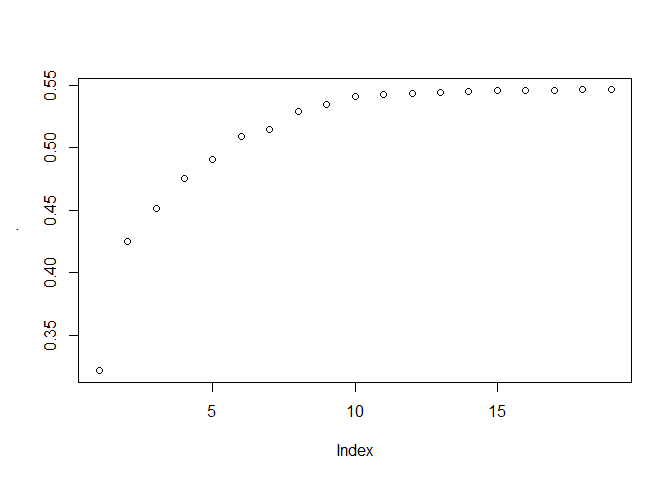
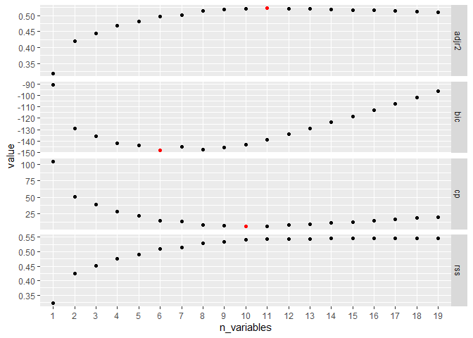
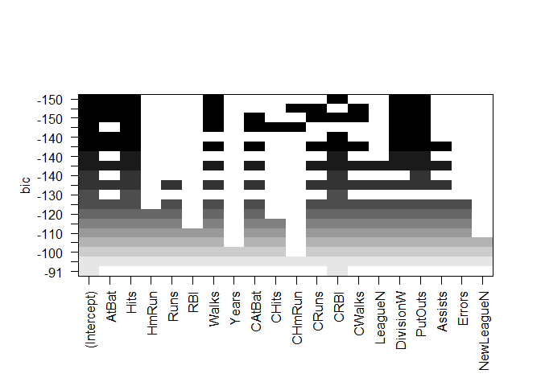
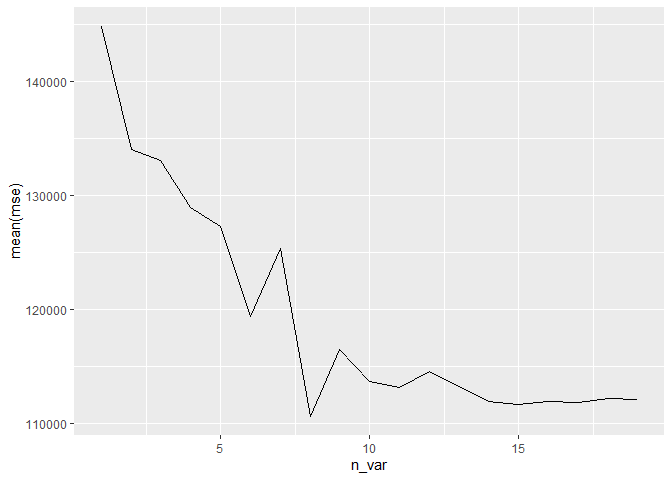

6.5 Lab 1: Subset Selection Methods
================

``` r
library(tidyverse)
library(ISLR)
library(leaps)
```

## 6.5.1 Best Subset Selection

Count missing values for `Salary`

``` r
hitters <- ISLR::Hitters
dim(hitters)
```

    ## [1] 322  20

``` r
hitters[["Salary"]] %>% is.na() %>% sum()
```

    ## [1] 59

Remove missing values:

``` r
hitters <- na.omit(hitters)
```

Performing best subset selection:

``` r
regfit_full <- 
  regsubsets(Salary ~ ., data = hitters)

summary(regfit_full)
```

    ## Subset selection object
    ## Call: regsubsets.formula(Salary ~ ., data = hitters)
    ## 19 Variables  (and intercept)
    ##            Forced in Forced out
    ## AtBat          FALSE      FALSE
    ## Hits           FALSE      FALSE
    ## HmRun          FALSE      FALSE
    ## Runs           FALSE      FALSE
    ## RBI            FALSE      FALSE
    ## Walks          FALSE      FALSE
    ## Years          FALSE      FALSE
    ## CAtBat         FALSE      FALSE
    ## CHits          FALSE      FALSE
    ## CHmRun         FALSE      FALSE
    ## CRuns          FALSE      FALSE
    ## CRBI           FALSE      FALSE
    ## CWalks         FALSE      FALSE
    ## LeagueN        FALSE      FALSE
    ## DivisionW      FALSE      FALSE
    ## PutOuts        FALSE      FALSE
    ## Assists        FALSE      FALSE
    ## Errors         FALSE      FALSE
    ## NewLeagueN     FALSE      FALSE
    ## 1 subsets of each size up to 8
    ## Selection Algorithm: exhaustive
    ##          AtBat Hits HmRun Runs RBI Walks Years CAtBat CHits CHmRun CRuns
    ## 1  ( 1 ) " "   " "  " "   " "  " " " "   " "   " "    " "   " "    " "  
    ## 2  ( 1 ) " "   "*"  " "   " "  " " " "   " "   " "    " "   " "    " "  
    ## 3  ( 1 ) " "   "*"  " "   " "  " " " "   " "   " "    " "   " "    " "  
    ## 4  ( 1 ) " "   "*"  " "   " "  " " " "   " "   " "    " "   " "    " "  
    ## 5  ( 1 ) "*"   "*"  " "   " "  " " " "   " "   " "    " "   " "    " "  
    ## 6  ( 1 ) "*"   "*"  " "   " "  " " "*"   " "   " "    " "   " "    " "  
    ## 7  ( 1 ) " "   "*"  " "   " "  " " "*"   " "   "*"    "*"   "*"    " "  
    ## 8  ( 1 ) "*"   "*"  " "   " "  " " "*"   " "   " "    " "   "*"    "*"  
    ##          CRBI CWalks LeagueN DivisionW PutOuts Assists Errors NewLeagueN
    ## 1  ( 1 ) "*"  " "    " "     " "       " "     " "     " "    " "       
    ## 2  ( 1 ) "*"  " "    " "     " "       " "     " "     " "    " "       
    ## 3  ( 1 ) "*"  " "    " "     " "       "*"     " "     " "    " "       
    ## 4  ( 1 ) "*"  " "    " "     "*"       "*"     " "     " "    " "       
    ## 5  ( 1 ) "*"  " "    " "     "*"       "*"     " "     " "    " "       
    ## 6  ( 1 ) "*"  " "    " "     "*"       "*"     " "     " "    " "       
    ## 7  ( 1 ) " "  " "    " "     "*"       "*"     " "     " "    " "       
    ## 8  ( 1 ) " "  "*"    " "     "*"       "*"     " "     " "    " "

The best two-variable model contains `CRBI` and `Hits`. By default the
functions reports only models up to eight variables, but we can change
that with the `nvmax` argument.

``` r
regfit_full <- 
  regsubsets(Salary ~ ., data = hitters, nvmax = 19)

summary_full <- summary(regfit_full)

summary_full
```

    ## Subset selection object
    ## Call: regsubsets.formula(Salary ~ ., data = hitters, nvmax = 19)
    ## 19 Variables  (and intercept)
    ##            Forced in Forced out
    ## AtBat          FALSE      FALSE
    ## Hits           FALSE      FALSE
    ## HmRun          FALSE      FALSE
    ## Runs           FALSE      FALSE
    ## RBI            FALSE      FALSE
    ## Walks          FALSE      FALSE
    ## Years          FALSE      FALSE
    ## CAtBat         FALSE      FALSE
    ## CHits          FALSE      FALSE
    ## CHmRun         FALSE      FALSE
    ## CRuns          FALSE      FALSE
    ## CRBI           FALSE      FALSE
    ## CWalks         FALSE      FALSE
    ## LeagueN        FALSE      FALSE
    ## DivisionW      FALSE      FALSE
    ## PutOuts        FALSE      FALSE
    ## Assists        FALSE      FALSE
    ## Errors         FALSE      FALSE
    ## NewLeagueN     FALSE      FALSE
    ## 1 subsets of each size up to 19
    ## Selection Algorithm: exhaustive
    ##           AtBat Hits HmRun Runs RBI Walks Years CAtBat CHits CHmRun CRuns
    ## 1  ( 1 )  " "   " "  " "   " "  " " " "   " "   " "    " "   " "    " "  
    ## 2  ( 1 )  " "   "*"  " "   " "  " " " "   " "   " "    " "   " "    " "  
    ## 3  ( 1 )  " "   "*"  " "   " "  " " " "   " "   " "    " "   " "    " "  
    ## 4  ( 1 )  " "   "*"  " "   " "  " " " "   " "   " "    " "   " "    " "  
    ## 5  ( 1 )  "*"   "*"  " "   " "  " " " "   " "   " "    " "   " "    " "  
    ## 6  ( 1 )  "*"   "*"  " "   " "  " " "*"   " "   " "    " "   " "    " "  
    ## 7  ( 1 )  " "   "*"  " "   " "  " " "*"   " "   "*"    "*"   "*"    " "  
    ## 8  ( 1 )  "*"   "*"  " "   " "  " " "*"   " "   " "    " "   "*"    "*"  
    ## 9  ( 1 )  "*"   "*"  " "   " "  " " "*"   " "   "*"    " "   " "    "*"  
    ## 10  ( 1 ) "*"   "*"  " "   " "  " " "*"   " "   "*"    " "   " "    "*"  
    ## 11  ( 1 ) "*"   "*"  " "   " "  " " "*"   " "   "*"    " "   " "    "*"  
    ## 12  ( 1 ) "*"   "*"  " "   "*"  " " "*"   " "   "*"    " "   " "    "*"  
    ## 13  ( 1 ) "*"   "*"  " "   "*"  " " "*"   " "   "*"    " "   " "    "*"  
    ## 14  ( 1 ) "*"   "*"  "*"   "*"  " " "*"   " "   "*"    " "   " "    "*"  
    ## 15  ( 1 ) "*"   "*"  "*"   "*"  " " "*"   " "   "*"    "*"   " "    "*"  
    ## 16  ( 1 ) "*"   "*"  "*"   "*"  "*" "*"   " "   "*"    "*"   " "    "*"  
    ## 17  ( 1 ) "*"   "*"  "*"   "*"  "*" "*"   " "   "*"    "*"   " "    "*"  
    ## 18  ( 1 ) "*"   "*"  "*"   "*"  "*" "*"   "*"   "*"    "*"   " "    "*"  
    ## 19  ( 1 ) "*"   "*"  "*"   "*"  "*" "*"   "*"   "*"    "*"   "*"    "*"  
    ##           CRBI CWalks LeagueN DivisionW PutOuts Assists Errors NewLeagueN
    ## 1  ( 1 )  "*"  " "    " "     " "       " "     " "     " "    " "       
    ## 2  ( 1 )  "*"  " "    " "     " "       " "     " "     " "    " "       
    ## 3  ( 1 )  "*"  " "    " "     " "       "*"     " "     " "    " "       
    ## 4  ( 1 )  "*"  " "    " "     "*"       "*"     " "     " "    " "       
    ## 5  ( 1 )  "*"  " "    " "     "*"       "*"     " "     " "    " "       
    ## 6  ( 1 )  "*"  " "    " "     "*"       "*"     " "     " "    " "       
    ## 7  ( 1 )  " "  " "    " "     "*"       "*"     " "     " "    " "       
    ## 8  ( 1 )  " "  "*"    " "     "*"       "*"     " "     " "    " "       
    ## 9  ( 1 )  "*"  "*"    " "     "*"       "*"     " "     " "    " "       
    ## 10  ( 1 ) "*"  "*"    " "     "*"       "*"     "*"     " "    " "       
    ## 11  ( 1 ) "*"  "*"    "*"     "*"       "*"     "*"     " "    " "       
    ## 12  ( 1 ) "*"  "*"    "*"     "*"       "*"     "*"     " "    " "       
    ## 13  ( 1 ) "*"  "*"    "*"     "*"       "*"     "*"     "*"    " "       
    ## 14  ( 1 ) "*"  "*"    "*"     "*"       "*"     "*"     "*"    " "       
    ## 15  ( 1 ) "*"  "*"    "*"     "*"       "*"     "*"     "*"    " "       
    ## 16  ( 1 ) "*"  "*"    "*"     "*"       "*"     "*"     "*"    " "       
    ## 17  ( 1 ) "*"  "*"    "*"     "*"       "*"     "*"     "*"    "*"       
    ## 18  ( 1 ) "*"  "*"    "*"     "*"       "*"     "*"     "*"    "*"       
    ## 19  ( 1 ) "*"  "*"    "*"     "*"       "*"     "*"     "*"    "*"

Examining the componentes of the `summary()`

``` r
names(summary_full)
```

    ## [1] "which"  "rsq"    "rss"    "adjr2"  "cp"     "bic"    "outmat" "obj"

R-squared increases monotonically as more variables are includes

``` r
summary_full[["rsq"]] %>% plot()
```

<!-- -->

Plotting RSS, adjusted R-suqared, Cp, and BIC for all the models:

``` r
metrics_models <- 
  tibble(
    n_variables = factor(1:19),
    rss = summary_full[["rsq"]],
    adjr2 = summary_full[["adjr2"]],
    cp = summary_full[["cp"]],
    bic = summary_full[["bic"]]
  )

metrics_models <- metrics_models %>% 
  pivot_longer(
    cols = -n_variables,
    names_to = "metric",
    values_to = "value"
  )

# Highlight min or max value for each metric
highlighted <- metrics_models %>%
  group_by(metric) %>% 
  mutate(highlight = case_when(
    metric == "adjr2" & value == max(value) ~ TRUE,
    metric == "bic" & value == min(value) ~ TRUE,
    metric == "cp" & value == min(value) ~ TRUE,
    TRUE ~ FALSE
  )) %>% 
  filter(highlight == TRUE)

plot_metrics <- 
  ggplot(metrics_models, aes(x = n_variables,
             y = value)) +
  geom_point() +
  facet_grid(metric~., scales = "free_y") +
  geom_point(data = highlighted, color = "red")

plot_metrics
```

<!-- -->

According to the plots above, the optimal model has between 6 and 11
variables.

The object created by `regsubsets` has its own `plot` method.

``` r
plot(regfit_full, scale = "bic")
```

<!-- -->

Also, we can access to the coefficients of the optimal model for a given
number of variables

``` r
coef(regfit_full, 6)
```

    ##  (Intercept)        AtBat         Hits        Walks         CRBI 
    ##   91.5117981   -1.8685892    7.6043976    3.6976468    0.6430169 
    ##    DivisionW      PutOuts 
    ## -122.9515338    0.2643076

## 6.5.2 Forward and Backward Stepwise Selection

To do forward and backward selection we just need to specify the
`method` argument inside `regsubsets`

``` r
regfit_fwd <- regsubsets(Salary ~ ., data = hitters, method = "forward")
regfit_bwd <- regsubsets(Salary ~ ., data = hitters, method = "backward")
```

We can see how the seven-variable models differ when using each method:

``` r
coef(regfit_full, 7)
```

    ##  (Intercept)         Hits        Walks       CAtBat        CHits 
    ##   79.4509472    1.2833513    3.2274264   -0.3752350    1.4957073 
    ##       CHmRun    DivisionW      PutOuts 
    ##    1.4420538 -129.9866432    0.2366813

``` r
coef(regfit_fwd, 7)
```

    ##  (Intercept)        AtBat         Hits        Walks         CRBI 
    ##  109.7873062   -1.9588851    7.4498772    4.9131401    0.8537622 
    ##       CWalks    DivisionW      PutOuts 
    ##   -0.3053070 -127.1223928    0.2533404

``` r
coef(regfit_bwd, 7)
```

    ##  (Intercept)        AtBat         Hits        Walks        CRuns 
    ##  105.6487488   -1.9762838    6.7574914    6.0558691    1.1293095 
    ##       CWalks    DivisionW      PutOuts 
    ##   -0.7163346 -116.1692169    0.3028847

## 6.5.3 Choosing Among Models Using the Validation Set Approach and Cross-Validation

First, split the data in train and test/validation

``` r
set.seed(2000)
train_hitters <- hitters %>% 
  sample_frac(size = 0.5)

test_hitters <- hitters %>% 
  anti_join(train_hitters)
```

    ## Joining, by = c("AtBat", "Hits", "HmRun", "Runs", "RBI", "Walks", "Years", "CAtBat", "CHits", "CHmRun", "CRuns", "CRBI", "CWalks", "League", "Division", "PutOuts", "Assists", "Errors", "Salary", "NewLeague")

And then train the models using best subset selection *on the train
data*

``` r
regfit_best <- regsubsets(Salary ~ .,
                          data = train_hitters,
                          nvmax = 19)
```

Creating the \(X\) matrix for the test data:

``` r
test_matrix <- model.matrix(Salary ~ .,
                            data = test_hitters)
```

Now we run a loop for each posible number of variables, and compute the
predictions using each best model, in order to obtain the test MSE in
each case:

``` r
mse_by_nvar <- function(nvar) {
  coefi <- coef(regfit_best, nvar)
  pred <-  test_matrix[, names(coefi)] %*% coefi
  mean((test_hitters[["Salary"]] - pred) ^ 2)
}
mse_models <- 
  map_dbl(1:19, mse_by_nvar)

plot(mse_models, type = "l")
```

<!-- -->

``` r
which.min(mse_models)
```

    ## [1] 6

This is kind of tedious because there is no `predict` method for
`regsubsets()`. But we can define our own `predict` function:

``` r
predict.regsubsets <- function (object, newdata, id, form, ...)
{
  
  # Obtain the X matrix of predictors asociated with that formula, but using new data
  mat <- model.matrix(form, newdata)
  
  # Get the coefficients associated with the best N-variable model
  coefi <- coef(object, id = id)
  
  # Names of the variables included in the best N-variable model
  xvars <- names(coefi)
  
  # Get the predictions
  mat[, xvars] %*% coefi
}
```

Finally, once we estimated the number of variables which minimizes the
Test MSE (6), we estimate the coefficients for a 6-variable model using
the full data.

``` r
final_model <- regsubsets(Salary ~ ., data = hitters)
coef(final_model, 6)
```

    ##  (Intercept)        AtBat         Hits        Walks         CRBI 
    ##   91.5117981   -1.8685892    7.6043976    3.6976468    0.6430169 
    ##    DivisionW      PutOuts 
    ## -122.9515338    0.2643076

### Choosing model size using cross validation

``` r
k <- 10
set.seed(1989)
hitters_cv <-
    hitters %>%
    mutate(fold = sample(1:k, n(), replace = TRUE))
```

Loop for performing cross validation:

``` r
test_error_by_fold <- function(this_fold) {
  folds_train <-
    hitters_cv %>%
    filter(fold != this_fold) %>%
    select(-fold)
  
  fold_test <-
    hitters_cv %>%
    filter(fold == this_fold) %>%
    select(-fold)
  
  best_fit <-
    regsubsets(Salary ~ ., data = folds_train, nvmax = 19)
  
  mse <-
    # Obtiene lista de largo 19 con las predicciones para cada uno de los modelos
    map(1:19,
        ~predict(best_fit, fold_test, id = ., form = Salary ~ .)) %>%
    # Calcula el MSE para los 19 modelos
    map_dbl( ~ mean((fold_test[["Salary"]] - .) ^ 2))
  
  mse
  
}

results <- 
  map(1:10, test_error_by_fold) %>% 
  enframe(name = "fold", value = "mse") %>% 
  # To add indices for each n-variable model
  mutate(mse = map(mse, ~tibble(mse = .x, n_var = seq_along(.x)))) 
```

``` r
(mean_mse_by_nvar <- 
  results %>% 
  unnest(cols = c(mse)) %>% 
  group_by(n_var) %>% 
  summarise(mean(mse)))
```

    ## # A tibble: 19 x 2
    ##    n_var `mean(mse)`
    ##    <int>       <dbl>
    ##  1     1     144841.
    ##  2     2     134053.
    ##  3     3     133057.
    ##  4     4     128961.
    ##  5     5     127266.
    ##  6     6     119434.
    ##  7     7     125391.
    ##  8     8     110652.
    ##  9     9     116496.
    ## 10    10     113707.
    ## 11    11     113140.
    ## 12    12     114592.
    ## 13    13     113204.
    ## 14    14     111910.
    ## 15    15     111663.
    ## 16    16     111953.
    ## 17    17     111795.
    ## 18    18     112174.
    ## 19    19     112117.

``` r
ggplot(mean_mse_by_nvar, aes(n_var, `mean(mse)`)) +
  geom_line() 
```

<!-- -->

Cross validation selects an 8-variable model in this case. Now we
perform best subset select on the full data, to get the coeficients for
a 8-variable model.

``` r
reg_best_8 <- 
  regsubsets(Salary ~ ., data = hitters, nvmax = 19)

coef(reg_best_8, 8)
```

    ##  (Intercept)        AtBat         Hits        Walks       CHmRun 
    ##  130.9691577   -2.1731903    7.3582935    6.0037597    1.2339718 
    ##        CRuns       CWalks    DivisionW      PutOuts 
    ##    0.9651349   -0.8323788 -117.9657795    0.2908431
