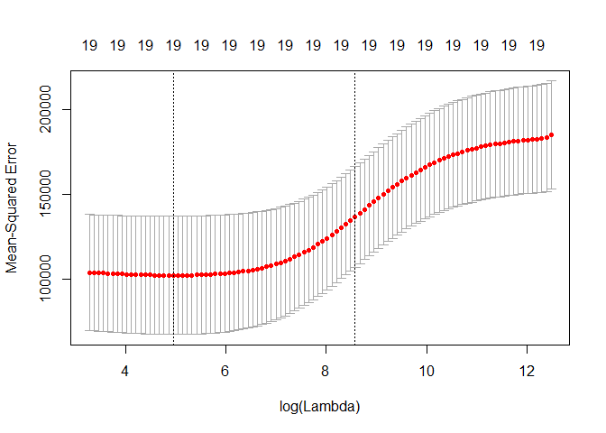
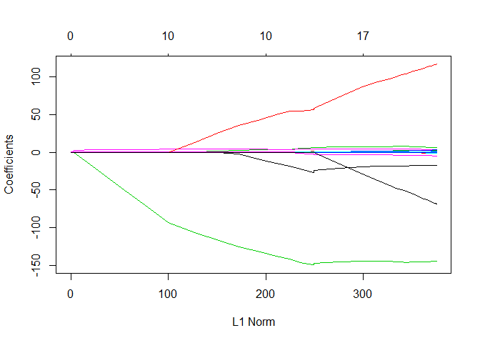
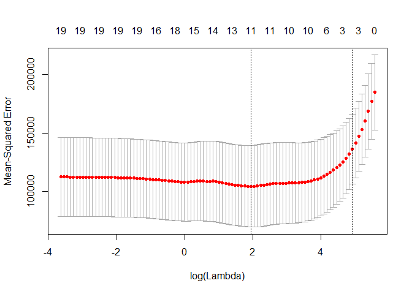

6.6 Lab 2: Ridge Regression and the Lasso
================

``` r
library(tidyverse)
library(glmnet)
library(ISLR)
```

Now we’re going to do ridge and lasso regression using
`glmnet::glmnet()`. First, let’s clean the missing values.

``` r
hitters <- ISLR::Hitters %>% na.omit()
```

Now assign the response variable and the predictors to matrices `y` and
`x`.

``` r
y <- hitters[["Salary"]]
x <- model.matrix(Salary∼., hitters )[,-1]
```

## 6.6.1 Ridge Regression

When `alpha` argument in `glmnet()` is equal to zero, the function
performs a ridge regression.

``` r
grid <- 10^seq(10, -2, length = 100)
ridge_mod <- glmnet(x, y, alpha = 0, lambda = grid)
```

We choose to compute the ridge regression using a range of lambda values
that goes from 10^10 (very close to the null model, including only the
intercept) to 10^(-2) (very close to the full OLS model).

`glmnet()` standarized the variables by default, but we can change that
with `standarize = FALSE`.

The output is a matrix of coeficients (rows) by each lambda (column).

``` r
dim(coef(ridge_mod))
```

    ## [1]  20 100

Checking differences in coeficients and \(\ell_2\) norm among different
values of lambda.

First with \(\lambda = 11498\)

``` r
ridge_mod[["lambda"]][50]
```

    ## [1] 11497.57

``` r
coef(ridge_mod, )[, 50]
```

    ##   (Intercept)         AtBat          Hits         HmRun          Runs 
    ## 407.356050200   0.036957182   0.138180344   0.524629976   0.230701523 
    ##           RBI         Walks         Years        CAtBat         CHits 
    ##   0.239841459   0.289618741   1.107702929   0.003131815   0.011653637 
    ##        CHmRun         CRuns          CRBI        CWalks       LeagueN 
    ##   0.087545670   0.023379882   0.024138320   0.025015421   0.085028114 
    ##     DivisionW       PutOuts       Assists        Errors    NewLeagueN 
    ##  -6.215440973   0.016482577   0.002612988  -0.020502690   0.301433531

``` r
coef(ridge_mod)[ -1 ,50]^2 %>% sum() %>% sqrt()
```

    ## [1] 6.360612

Now with \(\lambda = 705\):

``` r
ridge_mod[["lambda"]][60]
```

    ## [1] 705.4802

``` r
coef(ridge_mod)[, 60]
```

    ##  (Intercept)        AtBat         Hits        HmRun         Runs 
    ##  54.32519950   0.11211115   0.65622409   1.17980910   0.93769713 
    ##          RBI        Walks        Years       CAtBat        CHits 
    ##   0.84718546   1.31987948   2.59640425   0.01083413   0.04674557 
    ##       CHmRun        CRuns         CRBI       CWalks      LeagueN 
    ##   0.33777318   0.09355528   0.09780402   0.07189612  13.68370191 
    ##    DivisionW      PutOuts      Assists       Errors   NewLeagueN 
    ## -54.65877750   0.11852289   0.01606037  -0.70358655   8.61181213

``` r
coef(ridge_mod)[-1, 60]^2 %>% sum() %>% sqrt()
```

    ## [1] 57.11001

The coefficients tend to be larger with a lower value of lambda
(although some of them can increase their value).

With `predict()` we can recalculate the coefficients for new values of
lambda.

``` r
predict(ridge_mod, s = 50, type = "coefficients") %>% as_vector()
```

    ## 20 x 1 sparse Matrix of class "dgCMatrix"
    ##                         1
    ## (Intercept)  4.876610e+01
    ## AtBat       -3.580999e-01
    ## Hits         1.969359e+00
    ## HmRun       -1.278248e+00
    ## Runs         1.145892e+00
    ## RBI          8.038292e-01
    ## Walks        2.716186e+00
    ## Years       -6.218319e+00
    ## CAtBat       5.447837e-03
    ## CHits        1.064895e-01
    ## CHmRun       6.244860e-01
    ## CRuns        2.214985e-01
    ## CRBI         2.186914e-01
    ## CWalks      -1.500245e-01
    ## LeagueN      4.592589e+01
    ## DivisionW   -1.182011e+02
    ## PutOuts      2.502322e-01
    ## Assists      1.215665e-01
    ## Errors      -3.278600e+00
    ## NewLeagueN  -9.496680e+00

### Split between Train and Test

``` r
set.seed(1)
train_vec <- sample(1:nrow(x), nrow(x)/2)
test_vec <- -train_vec
y_test <- y[test_vec]
```

Fit ridge regression on training data, and evaluate MSE in test data,
with lambda = 4.

``` r
ridge_train_mod <- glmnet(x[train_vec, ], y[train_vec],
                          alpha = 0, lambda = grid,
                          thresh = 1e-12)

ridge_pred <- predict(ridge_train_mod, s = 4, newx = x[test_vec, ])

mean((ridge_pred-y_test)^2)
```

    ## [1] 142199.2

Exploring the MSE of the null model (just the intercept),
i.e. predicting the mean of the training data set

``` r
mean((mean(y[train_vec]) - y_test)^2)
```

    ## [1] 224669.9

It is very similar to fitting a ridge regression with very large lambda:

``` r
ridge_pred_large <- 
  predict(ridge_train_mod, s = 1e10, newx = x[test_vec, ])

mean((ridge_pred_large-y_test)^2)
```

    ## [1] 224669.8

Checking if performing ridge regression with lambda = 4 is better than
just doing OLS.

``` r
ridge_pred_zero <- 
  predict(ridge_train_mod, s = 0, newx = x[test_vec, ])

mean((ridge_pred_zero-y_test)^2)
```

    ## [1] 167789.8

Checking that the coefficients are the same between unpenalized LS and
ridge with lambda = 0.

``` r
lm(y ~ x, subset = train_vec)
```

    ## 
    ## Call:
    ## lm(formula = y ~ x, subset = train_vec)
    ## 
    ## Coefficients:
    ## (Intercept)       xAtBat        xHits       xHmRun        xRuns  
    ##    274.0145      -0.3521      -1.6377       5.8145       1.5424  
    ##        xRBI       xWalks       xYears      xCAtBat       xCHits  
    ##      1.1243       3.7287     -16.3773      -0.6412       3.1632  
    ##     xCHmRun       xCRuns        xCRBI      xCWalks     xLeagueN  
    ##      3.4008      -0.9739      -0.6005       0.3379     119.1486  
    ##  xDivisionW     xPutOuts     xAssists      xErrors  xNewLeagueN  
    ##   -144.0831       0.1976       0.6804      -4.7128     -71.0951

``` r
predict(ridge_train_mod, s = 0, exact = TRUE,
        type = "coefficients",
        x = x[train_vec, ], y = y[train_vec])[1:20, ]
```

    ##  (Intercept)        AtBat         Hits        HmRun         Runs 
    ##  274.0200994   -0.3521900   -1.6371383    5.8146692    1.5423361 
    ##          RBI        Walks        Years       CAtBat        CHits 
    ##    1.1241837    3.7288406  -16.3795195   -0.6411235    3.1629444 
    ##       CHmRun        CRuns         CRBI       CWalks      LeagueN 
    ##    3.4005281   -0.9739405   -0.6003976    0.3378422  119.1434637 
    ##    DivisionW      PutOuts      Assists       Errors   NewLeagueN 
    ## -144.0853061    0.1976300    0.6804200   -4.7127879  -71.0898914

(If we want to run an unpenalized LS model we’re better off using `lm()`
because it provides a more useful output).

### Cross-validation to choose lambda

``` r
set.seed(1989)

cv_out <- cv.glmnet(x[train_vec, ], y[train_vec],
                    alpha = 0, nfold = 10)

plot(cv_out)
```

<!-- -->

The output tell us which is the best value for lambda.

``` r
best_lambda <- cv_out[["lambda.min"]]
best_lambda
```

    ## [1] 141.1535

Now let’s use that value to predict `y_test` and check the MSE:

``` r
ridge_pred_min <- predict(ridge_mod, s = best_lambda, newx = x[test_vec, ])

mean((ridge_pred_min - y_test)^2)
```

    ## [1] 114783.7

This is a lower MSE than when we used lambda = 4.

Now let’s estimate the coefficients using lambda = 141 on the full
dataset.

``` r
out <- glmnet(x, y, alpha = 0)
predict(out, s = best_lambda, type = "coefficients")[1:20, ]
```

    ##   (Intercept)         AtBat          Hits         HmRun          Runs 
    ##  1.324373e+01 -3.585003e-02  1.190143e+00 -3.313109e-01  1.148155e+00 
    ##           RBI         Walks         Years        CAtBat         CHits 
    ##  8.610628e-01  1.997286e+00 -1.376600e+00  1.055566e-02  7.373432e-02 
    ##        CHmRun         CRuns          CRBI        CWalks       LeagueN 
    ##  4.997523e-01  1.461506e-01  1.555880e-01 -4.837991e-03  3.226350e+01 
    ##     DivisionW       PutOuts       Assists        Errors    NewLeagueN 
    ## -1.017207e+02  2.124730e-01  5.940509e-02 -2.258594e+00  3.845681e+00

None of the coefficients are zero because the ridge doesn´t perform
variable selection (it just shrinks the values).

## 6.6.2 The Lasso

It’s the same as the ridge regression, but using `alpha = 1`.

``` r
lasso_mod <- glmnet(x[train_vec, ], y[train_vec], alpha = 1,
                    lambda = grid)

plot(lasso_mod)
```

    ## Warning in regularize.values(x, y, ties, missing(ties)): collapsing to
    ## unique 'x' values

<!-- -->

Now we perform cross validation to find the best value of lambda.

``` r
set.seed(1989)
cv_out_lasso <- cv.glmnet(x[train_vec, ], y[train_vec],
                          alpha = 1, nfolds = 10)

plot(cv_out_lasso)
```

<!-- -->

``` r
best_lambda_lasso <- cv_out_lasso[["lambda.min"]]

lasso_pred <- predict(lasso_mod,
                      s = best_lambda_lasso,
                      newx = x[test_vec, ])

# MSE
mean((lasso_pred - y_test)^2)
```

    ## [1] 144038.1

This is a bit higher than the MSE obtained with the ridge regression and
its optimal lambda.

Now let’s estimate the coefficientes using the full data and the best
lambda for the lasso.

``` r
out_lasso <- glmnet(x, y, alpha = 1, lambda = best_lambda_lasso)
lasso_coef <- predict(out_lasso, 
                      type = "coefficient", 
                      s = best_lambda_lasso)[1:20, ]
lasso_coef
```

    ##   (Intercept)         AtBat          Hits         HmRun          Runs 
    ##   23.88292542   -0.37345358    3.04748875    0.00000000    0.00000000 
    ##           RBI         Walks         Years        CAtBat         CHits 
    ##    0.00000000    2.60753187   -2.72089210    0.00000000    0.00000000 
    ##        CHmRun         CRuns          CRBI        CWalks       LeagueN 
    ##    0.10202574    0.28159259    0.41024552   -0.05126403   25.02252335 
    ##     DivisionW       PutOuts       Assists        Errors    NewLeagueN 
    ## -117.93277672    0.24438150    0.00000000   -0.80069648    0.00000000

``` r
lasso_coef[lasso_coef != 0]
```

    ##   (Intercept)         AtBat          Hits         Walks         Years 
    ##   23.88292542   -0.37345358    3.04748875    2.60753187   -2.72089210 
    ##        CHmRun         CRuns          CRBI        CWalks       LeagueN 
    ##    0.10202574    0.28159259    0.41024552   -0.05126403   25.02252335 
    ##     DivisionW       PutOuts        Errors 
    ## -117.93277672    0.24438150   -0.80069648

The lasso, as expected, did perform feature selection by setting some
coefficients to zero.
