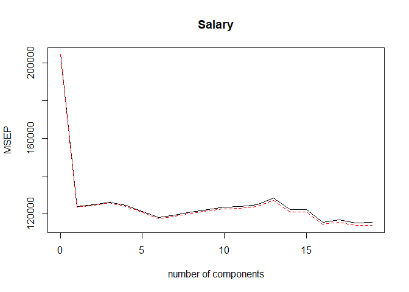
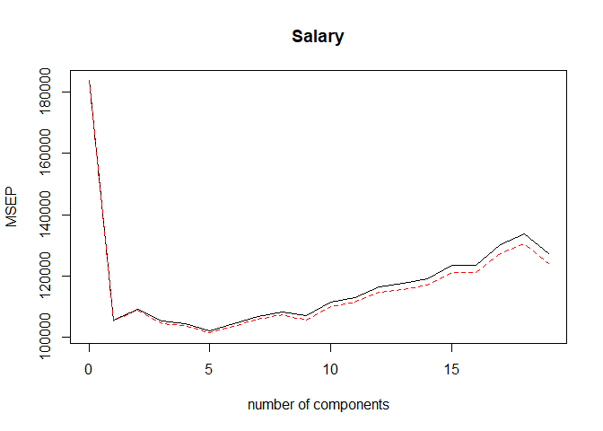

6.7 Lab 3: PCR and PLS Regression
================

``` r
library(tidyverse)
library(pls)
library(ISLR)

# Removing missing values from Hitters dataset
hitters <- ISLR::Hitters %>% na.omit()
```

## 6.7.1 Principal Components Regression

First we apply PCR to predict `Salary`

``` r
set.seed(2)
pcr_fit <- pcr(Salary ~ .,
  data = hitters, scale = TRUE,
  validation = "CV"
)

summary(pcr_fit)
```

    ## Data:    X dimension: 263 19 
    ##  Y dimension: 263 1
    ## Fit method: svdpc
    ## Number of components considered: 19
    ## 
    ## VALIDATION: RMSEP
    ## Cross-validated using 10 random segments.
    ##        (Intercept)  1 comps  2 comps  3 comps  4 comps  5 comps  6 comps
    ## CV             452    351.9    353.2    355.0    352.8    348.4    343.6
    ## adjCV          452    351.6    352.7    354.4    352.1    347.6    342.7
    ##        7 comps  8 comps  9 comps  10 comps  11 comps  12 comps  13 comps
    ## CV       345.5    347.7    349.6     351.4     352.1     353.5     358.2
    ## adjCV    344.7    346.7    348.5     350.1     350.7     352.0     356.5
    ##        14 comps  15 comps  16 comps  17 comps  18 comps  19 comps
    ## CV        349.7     349.4     339.9     341.6     339.2     339.6
    ## adjCV     348.0     347.7     338.2     339.7     337.2     337.6
    ## 
    ## TRAINING: % variance explained
    ##         1 comps  2 comps  3 comps  4 comps  5 comps  6 comps  7 comps
    ## X         38.31    60.16    70.84    79.03    84.29    88.63    92.26
    ## Salary    40.63    41.58    42.17    43.22    44.90    46.48    46.69
    ##         8 comps  9 comps  10 comps  11 comps  12 comps  13 comps  14 comps
    ## X         94.96    96.28     97.26     97.98     98.65     99.15     99.47
    ## Salary    46.75    46.86     47.76     47.82     47.85     48.10     50.40
    ##         15 comps  16 comps  17 comps  18 comps  19 comps
    ## X          99.75     99.89     99.97     99.99    100.00
    ## Salary     50.55     53.01     53.85     54.61     54.61

Also one can plot the cross-validation scores (MSE in this case):

``` r
validationplot(pcr_fit, val.type = "MSEP")
```

<!-- -->

The minimum MSE is obtained when we use M = 16 components. However, the
CV MSE is roughly equal from M = 1 and upwards, so a model with just one
component might suffice.

Now we can perform PCR on the training data and evaluate the test
performance:

``` r
set.seed(1)
hitters_train <- hitters %>% 
  sample_frac(size = 0.5)

hitters_test <- hitters %>% 
  anti_join(hitters_train)
```

    ## Joining, by = c("AtBat", "Hits", "HmRun", "Runs", "RBI", "Walks", "Years", "CAtBat", "CHits", "CHmRun", "CRuns", "CRBI", "CWalks", "League", "Division", "PutOuts", "Assists", "Errors", "Salary", "NewLeague")

``` r
pcr_fit_train <- pcr(Salary ~ ., data = hitters_train, scale = TRUE,
                     validation = "CV")

validationplot(pcr_fit_train, val.type = "MSEP")
```

<!-- -->

``` r
pcr_pred <- hitters_test %>% 
  select(-Salary) %>% 
  predict(pcr_fit_train, ., ncomp = 5)

y_test <- hitters_test %>% pull(Salary)

mean((pcr_pred - y_test)^2)
```

    ## [1] 145069.1

We finally fit PCR on the full data set, using M = 5 (selected from the
PCR on training data):

``` r
pcr_fit_full <- pcr(Salary ~ ., data = hitters, scale = TRUE, ncomp = 5)
summary(pcr_fit_full)
```

    ## Data:    X dimension: 263 19 
    ##  Y dimension: 263 1
    ## Fit method: svdpc
    ## Number of components considered: 5
    ## TRAINING: % variance explained
    ##         1 comps  2 comps  3 comps  4 comps  5 comps
    ## X         38.31    60.16    70.84    79.03    84.29
    ## Salary    40.63    41.58    42.17    43.22    44.90

## 6.7.2 Partial Least Squares

``` r
set.seed(1)
pls_fit <- plsr(Salary ~ ., data = hitters_train,
                scale = TRUE, validation = "CV")

summary(pls_fit)
```

    ## Data:    X dimension: 132 19 
    ##  Y dimension: 132 1
    ## Fit method: kernelpls
    ## Number of components considered: 19
    ## 
    ## VALIDATION: RMSEP
    ## Cross-validated using 10 random segments.
    ##        (Intercept)  1 comps  2 comps  3 comps  4 comps  5 comps  6 comps
    ## CV           428.6    327.8    334.5    340.1    347.6    350.7    353.2
    ## adjCV        428.6    327.1    332.8    338.0    344.8    347.6    349.5
    ##        7 comps  8 comps  9 comps  10 comps  11 comps  12 comps  13 comps
    ## CV       351.6    361.8    359.3     354.7     358.2     364.5     364.7
    ## adjCV    348.3    357.7    355.4     351.4     354.4     360.1     360.3
    ##        14 comps  15 comps  16 comps  17 comps  18 comps  19 comps
    ## CV        365.7     366.6     364.6     353.8     355.2     356.1
    ## adjCV     360.8     361.5     359.9     349.6     350.9     351.7
    ## 
    ## TRAINING: % variance explained
    ##         1 comps  2 comps  3 comps  4 comps  5 comps  6 comps  7 comps
    ## X         39.03    48.78    60.06    74.97    78.19    80.72    87.53
    ## Salary    46.53    50.52    51.81    52.52    53.61    54.20    54.47
    ##         8 comps  9 comps  10 comps  11 comps  12 comps  13 comps  14 comps
    ## X         90.46    93.29     95.72     97.11     97.77     98.51     98.80
    ## Salary    54.97    55.19     55.44     55.82     56.10     56.47     57.33
    ##         15 comps  16 comps  17 comps  18 comps  19 comps
    ## X          99.21     99.60     99.67     99.94    100.00
    ## Salary     57.58     57.72     58.27     58.36     58.43

In this case, the lowest CV error ocurrs with M = 1. Now we can evaluate
the test MSE:

``` r
pls_pred <- hitters_test %>% 
  select(-Salary) %>% 
  predict(pls_fit, ., ncomp = 1)

mean((pls_pred - y_test)^2)
```

    ## [1] 153443.7

Finally we perform PLS on the full data, with M = 1.

``` r
pls_fit_full <- plsr(Salary ~ ., data = hitters, scale = TRUE, ncomp = 1)
summary(pls_fit_full)
```

    ## Data:    X dimension: 263 19 
    ##  Y dimension: 263 1
    ## Fit method: kernelpls
    ## Number of components considered: 1
    ## TRAINING: % variance explained
    ##         1 comps
    ## X         38.08
    ## Salary    43.05
