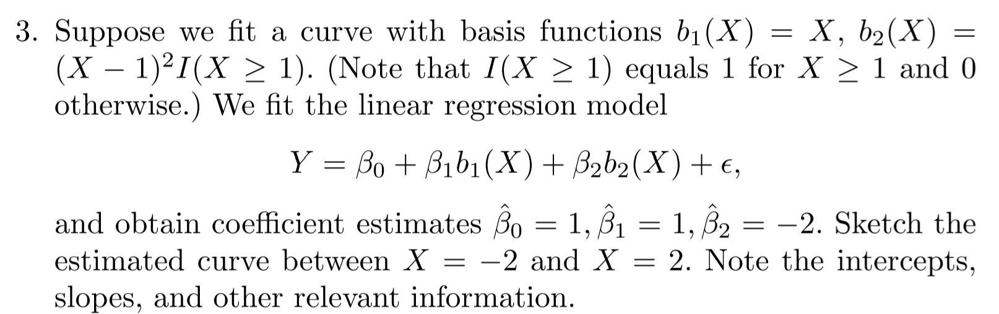
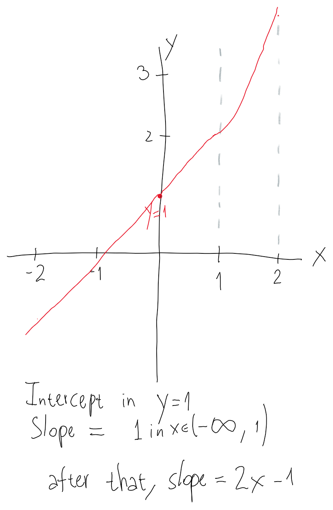
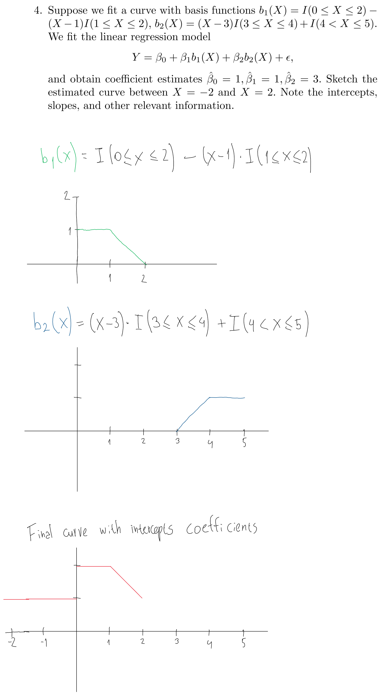
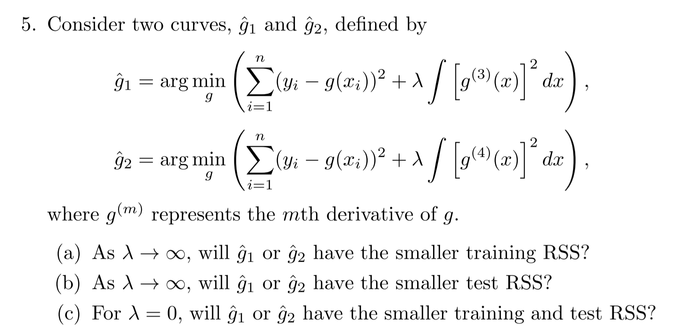

```{r setup, include=FALSE}
knitr::opts_chunk$set(echo = TRUE)
library(tidyverse)
library(modelr)
library(ISLR)
library(mgcv)
library(splines)
library(leaps)

wage <- ISLR::Wage %>% as_tibble()
```

## Conceptual

(1) 

 


 

(2) 

 

 

(3)

 

 


(4)


 

(5)

 

(a) g2 will have smaller training RSS, because the resulting function, with fourth derivative aproaching  constant zero, will be more flexible than g1, which will have its third derivative approaching constant zero. Another way to see it it's that when $\lambda = \infty$ then g1 could be a polynomial up to third degree (less flexible), and g2 a polynomial up to fourth degree (more flexible).

(b) Based on (a), which function will have the smaller test RSS will depend on the true relationship in the data. If the true relationship is more non-linear and "wiggly", then g2 will probably do a better job with the test data.

(c) If $\lambda = 0$ then the penalization term it's canceled in both functions, and the optimization problem it's the same in g1 and g2. Therefore, both functions should have similar test and training RSS.

## Applied

(6)

(a)

Using CV to get the optimal grade of the polynomial regression:
```{r}
wage_mse_by_poly_grade <- function(grade) {
  wage %>%
    crossv_kfold(k = 50) %>%
    mutate(model = map(train, ~ lm(wage ~ poly(age, grade), data = .))) %>%
    mutate(predicted =
             map2(model, test, ~ broom::augment(.x, newdata = .y))) %>%
    unnest(c(.id, predicted)) %>%
    group_by(.id) %>%
    summarise(mse = mean((.fitted - wage) ^ 2)) %>%
    summarise(mean(mse))
}

mse_by_grade <- 
  tibble(
  grades = 2:20,
  mse = map(grades, wage_mse_by_poly_grade)
) %>% 
  unnest(mse)

qplot(grades, `mean(mse)`, data = mse_by_grade, geom = "line")
```

From what we see on the MSE plot, it seems that a polynomial of grade 4 is enough.

Comparing to ANOVA results:
```{r}
polys <- 
  map(2:10, ~lm(wage ~ poly(age, .), data = wage))

do.call(anova, polys)
```

The hypothesis testing in ANOVA suggests that a polynomial of grade 3 it's enough to explain the variability in `wage`.

Let's plot the grade 3 and grade 4 polynomials.
```{r}
poly3 <- lm(wage ~ poly(age, 3), data = wage)
poly4 <- lm(wage ~ poly(age, 4), data = wage)

modelr::data_grid(wage, age) %>% 
  add_predictions(poly3, var = "grade 3") %>% 
  add_predictions(poly4, var = "grade 4") %>% 
  pivot_longer(
    cols = `grade 3`:`grade 4`,
    names_to = "model",
    values_to = "pred_wage"
  ) %>% 
  ggplot() +
  geom_point(data = wage, aes(age, wage), alpha = 0.15) +
  geom_line(aes(age, pred_wage, color = model), size = 1.1)

```

(b) Fit a step function to predict `wage` using `age`, and perform cross-validation to choose the optimal number of cuts. Make a plot of the fit obtained.
```{r}
wage_mse_by_step_cuts <- function(cuts) {
  wage %>%
    crossv_kfold(k = 20) %>%
    mutate(model = map(train, ~ lm(wage ~ cut(age, cuts), data = .))) %>%
    mutate(predicted =
             map2(model, test, ~ broom::augment(.x, newdata = .y))) %>%
    unnest(c(.id, predicted)) %>%
    group_by(.id) %>%
    summarise(mse = mean((.fitted - wage) ^ 2)) %>%
    summarise(mean(mse))
}

mse_by_cuts <- 
  tibble(
  cuts = 2:40,
  mse = map(cuts, wage_mse_by_step_cuts)
) %>% 
  unnest(mse)

qplot(cuts, `mean(mse)`, data = mse_by_cuts, geom = "line")
```

It seems that the optimal number of cuts is 2 (more cuts implies a higher test MSE).
```{r}
modelr::data_grid(wage, age) %>% 
  add_predictions(lm(wage ~ cut(age, 2), data = wage), var = "pred_wage") %>% 
  ggplot() +
  geom_point(data = wage, aes(age, wage), alpha = 0.15) +
  geom_line(aes(age, pred_wage), color = "blue", size = 1.1)
```

(7) The `Wage` data set contains a number of other features not explored in this chapter, such as marital status (`maritl`), job class (`jobclass`), and others. Explore the relationships between some of these other predictors and wage, and use non-linear fitting techniques in order to fit flexible models to the data. Create plots of the results obtained, and write a summary of your findings.

Predictors to explore: `maritl`, `race`, `jobclass`.
```{r}
ggplot(wage) +
  geom_boxplot(aes(maritl, wage))
```

```{r}
ggplot(wage) +
  geom_boxplot(aes(race, wage))
```


```{r}
ggplot(wage) +
  geom_boxplot(aes(jobclass, wage))
```

```{r}
ggplot(wage) +
  geom_boxplot(aes(health, wage))
```

Now let's put all this variables in a model:
```{r}
lm(wage ~ poly(age, 3) + year + maritl + race + education + health,
   data = wage) %>% 
  summary()
```

Let's consider some interactions:
```{r}
lm(wage ~ poly(age, 2)*race + year + maritl + education + jobclass + health,
   data = wage) %>% 
  summary()
```

```{r}
lm(wage ~ poly(age, 2) + year + maritl + education + race*jobclass + health,
   data = wage) %>% 
  summary()
```

```{r}
lm(wage ~ poly(age, 2) + year + maritl + education * jobclass + health + race,
   data = wage) %>% 
  summary()
```

Predictions and exploring results in model with interaction between jobclass and race:
```{r}
model_int_rac_jc <-
  lm(wage ~ poly(age, 2) + year + maritl + education + race * jobclass + health,
     data = wage) 

grid_race_jobclass <-
  data_grid(wage,
            race, jobclass,
            .model = model_int_rac_jc) %>% 
  add_predictions(model_int_rac_jc)

avg_by_job_class <- 
  grid_race_jobclass %>% 
  group_by(jobclass) %>% 
  summarise(mean_pred = mean(pred))

ggplot(grid_race_jobclass) +
  geom_col(aes(jobclass, pred, fill = race),
           position = position_dodge()) +
  geom_crossbar(data=avg_by_job_class, 
                aes(x = jobclass, y = mean_pred,
                    ymin = mean_pred, ymax = mean_pred),
                  size=0.7,col="red", width = 1)
```

We see than in both `jobclass`es, white peple have higher wages, even after controlling by other predictors (education, age, etc). However, asian people have higher wages than white people in Information jobs.

```{r}
grid_health_age <-
  data_grid(wage,
            health, age,
            .model = model_int_rac_jc) %>% 
  add_predictions(model_int_rac_jc)

avg_by_health <- 
  grid_health_age %>% 
  group_by(health) %>% 
  summarise(mean_pred = mean(pred))

ggplot(grid_health_age) +
  geom_jitter(aes(health, pred, color = health)) +
  geom_crossbar(
    data = avg_by_health,
    aes(
      x = health,
      y = mean_pred,
      ymin = mean_pred,
      ymax = mean_pred
    ),
    size = 0.5,
    col = "red",
    width = 1
  )
```

We see that even after controlling for other predictors, people with "Very Good" health have higher wages than people with worse health condition.

(8) Fit some of the non-linear models investigated in this chapter to the `Auto` data set. Is there evidence for non-linear relationships in this data set? Create some informative plots to justify your answer.

```{r}
plot(Auto)
```

Some of the non-linear relationships we can spot in the last plot:
* displacement - mpg
* horsepower - mpg
* weight - mpg
* acceleration - mpg
* year - mpg
* displacement - weight
* displacement - acceleration
* displacement - origin

Let's put some of them in a non-linear model:
```{r}
model_auto1 <-
  mgcv::gam(
    mpg ~ factor(cylinders) + s(displacement) + s(horsepower) + s(weight) +
      acceleration + year,
    data = Auto
  )

summary(model_auto1)
```

The low p-values in the F tests of the splines terms suggests that a non-linear fit for those predictors it's appropiate.

Now let's plot some of the non-linear relationships. 
First: `cylinders` (categorical variable). 
```{r}
auto_grid_cyl <- 
  Auto %>% 
  data_grid(cylinders,
            .model = model_auto1)

preds_grid_cyl <- predict(model_auto1, newdata = auto_grid_cyl, se.fit = TRUE)

auto_grid_cyl %>% 
  mutate(
    preds = preds_grid_cyl$fit,
    lower_bound = preds - 2*preds_grid_cyl$se.fit,
    upper_bound = preds + 2*preds_grid_cyl$se.fit
  ) %>% 
  ggplot(aes(factor(cylinders), preds, fill = factor(cylinders))) +
  geom_col() +
  geom_errorbar(aes(ymin=lower_bound, ymax=upper_bound), width=.2) +
  labs(y = "pred_mpg")
```


Now `weight` (a continuous variable)
```{r}
auto_grid_weight <- 
  Auto %>% 
  data_grid(weight,
            .model = model_auto1)

preds_grid_weight <- 
  predict(model_auto1, newdata = auto_grid_weight, se.fit = TRUE)

auto_grid_weight %>% 
  mutate(
    preds = preds_grid_weight$fit,
    lower_bound = preds - 2*preds_grid_weight$se.fit,
    upper_bound = preds + 2*preds_grid_weight$se.fit
  ) %>% 
  ggplot(aes(weight, preds)) +
  geom_line() +
  geom_ribbon(aes(ymin = lower_bound, ymax = upper_bound), alpha = 0.5,
              fill = "dodgerblue3") + 
  labs(y = "pred_mpg")
```

Finally `horsepower` vs `mpg`:
```{r}
auto_grid_horsepower <- 
  Auto %>% 
  data_grid(horsepower,
            .model = model_auto1)

preds_grid_horsepower <- 
  predict(model_auto1, newdata = auto_grid_horsepower, se.fit = TRUE)

auto_grid_horsepower %>% 
  mutate(
    preds = preds_grid_horsepower$fit,
    lower_bound = preds - 2*preds_grid_horsepower$se.fit,
    upper_bound = preds + 2*preds_grid_horsepower$se.fit
  ) %>% 
  ggplot(aes(horsepower, preds)) +
  geom_line() +
  geom_ribbon(aes(ymin = lower_bound, ymax = upper_bound), alpha = 0.5,
              fill = "dodgerblue3") + 
  labs(y = "pred_mpg")
```

(9) This question uses the variables `dis` (the weighted mean of distances to five Boston employment centers) and `nox` (nitrogen oxides concentration in parts per 10 million) from the Boston data. We will treat `dis` as the predictor and `nox` as the response.

(a) Use the `poly()` function to fit a cubic polynomial regression to predict `nox` using `dis`. Report the regression output, and plot the resulting data and polynomial fits.

```{r}
boston <- MASS::Boston %>% as_tibble()


nox_model1 <- 
  lm(nox ~ poly(dis, 3), data = boston)

summary(nox_model1)
```

```{r}
plot(nox_model1)
```

Removing a high leverage point
```{r}
boston %>% 
  filter(row_number() != 354) %>% 
  lm(nox ~ poly(dis, 3), data = .) %>% 
  plot()
```

There isn't much improvement.

Now let's plot the fit itself:

```{r}
boston_grid_dis <- 
  boston %>% 
  data_grid(
    dis,
    .model = nox_model1
  )

predicts_dis <- predict(nox_model1, newdata = boston_grid_dis, 
                        se.fit = TRUE)

boston_grid_dis %>% 
  mutate(
    pred_nox = predicts_dis$fit,
    se = predicts_dis$se.fit,
    lower = pred_nox - 2*se,
    upper = pred_nox + 2*se
  ) %>% 
  ggplot(aes(dis, pred_nox)) +
  geom_line(color = "deepskyblue4", size = 1.2) +
  geom_ribbon(aes(ymin = lower, ymax = upper),
              alpha = 0.2,
              fill = "deepskyblue4") +
  geom_point(data = boston,
             aes(dis, nox),
             alpha = 0.2)

```

(b) Plot the polynomial fits for a range of different polynomial degrees (say, from 1 to 10), and report the associated residual sum of squares.
```{r}
fits_nox <-
  tibble(
    degrees = 1:10,
    fits = map(degrees, ~ lm(nox ~ poly(dis, .), data = boston)),
    predicts = map(fits, ~ predict(., newdata = boston_grid_dis,
                                   se.fit = TRUE))
  )

plot_nox_fits <- function(predicts_dis) {
  boston_grid_dis %>%
    mutate(
      pred_nox = predicts_dis$fit,
      se = predicts_dis$se.fit,
      lower = pred_nox - 2 * se,
      upper = pred_nox + 2 * se
    ) %>%
    ggplot(aes(dis, pred_nox)) +
    geom_line(color = "deepskyblue4", size = 1.2) +
    geom_ribbon(aes(ymin = lower, ymax = upper),
                alpha = 0.2,
                fill = "deepskyblue4") +
    geom_point(data = boston,
               aes(dis, nox),
               alpha = 0.2)
}

map(fits_nox$predicts, plot_nox_fits)

```

Reporting the RSS:
```{r}
fits_nox %>%
  mutate(rss = map_dbl(fits,
                       ~ sum((broom::augment(
                         .
                       )[[".resid"]]) ^ 2))) %>% 
  ggplot(aes(degrees, rss)) +
  geom_line()
```

As expected, it always goes down as we increse the degrees, because we're computing the error on the training data.

(c) Perform cross-validation or another approach to select the optimal degree for the polynomial, and explain your results.
```{r}
dis_mse_by_grade <- function(grade) {
  boston %>%
    crossv_kfold(k = 20) %>%
    mutate(model = map(train, ~ lm(nox ~ poly(dis, grade), data = .))) %>%
    mutate(predicted =
             map2(model, test, ~ broom::augment(.x, newdata = .y))) %>%
    unnest(c(.id, predicted)) %>%
    group_by(.id) %>%
    summarise(mse = mean((.fitted - nox) ^ 2)) %>%
    summarise(mean(mse))
}

mse_by_grade <- 
  tibble(
  grade = 1:10,
  mse = map(grade, dis_mse_by_grade)
) %>% 
  unnest(mse)


ggplot(mse_by_grade,
       aes(factor(grade), `mean(mse)`,
           group = 1)) +
  geom_line() +
  geom_vline(xintercept = which.min(mse_by_grade$`mean(mse)`),
             color = "red")
```

Using a third degree polynomial minimizes the Test MSE, so it's probably the optimal degree for the polynomial. 

Also, the high fluctuation in MSE that appears as we use polynomils of grade higher than 6 it's striking.

(d) Use the `bs()` function to fit a regression spline to predict `nox` using `dis`. Report the output for the fit using four degrees of freedom. How did you choose the knots? Plot the resulting fit.
```{r}
fit_bs_nox <- lm(nox ~ bs(dis, df = 4), data = boston)

fit_bs_nox %>% summary()
```

When we use the `df` argument, the knot(s) are chosen automatically based on quantiles. In this case, it should be one knot, located in the 50th percentile (median) of `dis`.
```{r}
attr(bs(boston$dis, df = 4), "knots")
```

Plotting the fit (plus a vertical line indicating the knot)
```{r}
dis_lims <- range(boston$dis)

boston_range_dis <-
  tibble(dis = seq(from = dis_lims[1],
                   to = dis_lims[2],
                   by = 0.01))

predict_dis_bs <- predict(fit_bs_nox, newdata = boston_range_dis,
                          se.fit = TRUE)

boston_range_dis %>% 
  mutate(
    pred_nox = predict_dis_bs$fit,
    se = predict_dis_bs$se.fit,
    lower = pred_nox - 2*se,
    upper = pred_nox + 2*se
  ) %>% 
  ggplot(aes(dis, pred_nox)) +
  geom_line(color = "deepskyblue4", size = 1.2) +
  geom_ribbon(aes(ymin = lower, ymax = upper),
              alpha = 0.2,
              fill = "deepskyblue4") +
  geom_point(data = boston,
             aes(dis, nox),
             alpha = 0.2) +
  geom_vline(xintercept = 3.20745,
             color = "red1")
```

(e) Now fit a regression spline for a range of degrees of freedom, and plot the resulting fits and report the resulting RSS. Describe the results obtained.
```{r}
fits_nox_bs <- 
  tibble(
  dfs = 3:20,
  fits = map(dfs, ~lm(nox ~ bs(dis, df = .), data = boston)),
  predicts = map(fits, ~predict(., newdata = boston_range_dis,
                                se.fit = TRUE))
  )


plot_nox_fits <- function(predicts_dis) {
  boston_range_dis %>%
    mutate(
      pred_nox = predicts_dis$fit,
      se = predicts_dis$se.fit,
      lower = pred_nox - 2 * se,
      upper = pred_nox + 2 * se
    ) %>%
    ggplot(aes(dis, pred_nox)) +
    geom_line(color = "deepskyblue4", size = 1.2) +
    geom_ribbon(aes(ymin = lower, ymax = upper),
                alpha = 0.2,
                fill = "deepskyblue4") +
    geom_point(data = boston,
               aes(dis, nox),
               alpha = 0.2)
}

map(fits_nox_bs$predicts, plot_nox_fits)

# TODO: challenge, add the knots to the plots *programatically*
```


Resulting RSS (residual sum of squares)
```{r}
fits_nox_bs  <- fits_nox_bs %>% 
  mutate(rss = map_dbl(fits,
                       ~ sum((broom::augment(
                         .
                       )[[".resid"]]) ^ 2)))
  
fits_nox_bs %>% select(dfs, rss)
```

Plot of the RSS:
```{r}
ggplot(fits_nox_bs, aes(dfs, rss)) +
  geom_line()
```

As expected, RSS in trainging data goes down as degrees of freedom goes up.

(f) Perform cross-validation or another approach in order to select the best degrees of freedom for a regression spline on this data. Describe your results.
```{r}
dis_mse_by_df_bs <- function(df) {
  boston %>%
    crossv_kfold(k = 30) %>%
    mutate(model = map(train, ~ lm(nox ~ bs(dis, df = df), data = .))) %>%
    mutate(predicted =
             map2(model, test, ~ broom::augment(.x, newdata = .y))) %>%
    unnest(c(.id, predicted)) %>%
    group_by(.id) %>%
    summarise(mse = mean((.fitted - nox) ^ 2)) %>%
    summarise(mean(mse))
}

mse_by_df <- 
  tibble(
  df = 3:20,
  mse = map(df, dis_mse_by_df_bs)
) %>% 
  unnest(mse)


ggplot(mse_by_df,
       aes(factor(df), `mean(mse)`,
           group = 1)) +
  geom_line() +
  geom_vline(xintercept = which.min(mse_by_df$`mean(mse)`),
             color = "red")
```

Although the MSE is minimized with 10 degrees of freedom, we see very little variation above 5 degrees. Since less degrees is prefered when there is no clear advantage of adding more complexity, then I would use `df = 5`.

(10) This question relates to the `College` data set.

(a) Split the data into a training set and a test set. Using out-of-state tuition as the response and the other variables as the predictors, perform forward stepwise selection on the training set in order to identify a satisfactory model that uses just a subset of the predictors.

Train/test split:
```{r}
college_train <- 
  College %>% 
  as_tibble(rownames = "rowname") %>% 
  sample_frac(size = 0.5)

college_test <- 
  College %>% 
  as_tibble(rownames = "rowname") %>%
  anti_join(college_train, by = "rowname")
```

```{r}
forwardselection <- regsubsets(Outstate ~ .,
                               data = select(college_train, -rowname),
                               method = "forward") 

summary(forwardselection)


forwardmodels <- 
  tibble(
    metric = c("adjr2", "cp", "bic"),
    best_model = c(
      summary(forwardselection)[["adjr2"]] %>% which.max(),
      summary(forwardselection)[["cp"]] %>% which.min(),
      summary(forwardselection)[["bic"]] %>% which.min()
    )
  )

forwardmodels
```

I'm chosing the 6th model, which is the one with lower BIC.
```{r}
forwardselection %>% coef(id = 6)
```

(b) Fit a GAM on the training data, using out-of-state tuition as the response and the features selected in the previous step as the predictors. Plot the results, and explain your findings.

```{r}
gam_college <- 
  gam(Outstate ~ Private + s(Room.Board) + Terminal + s(perc.alumni) +
      s(Expend) + s(Grad.Rate),
    data = college_train)

summary(gam_college)
```

```{r}
plot(gam_college)
```

At first I tried to specify all continuous predictors as smoothing splines, but the results showed that for `Terminal` we can not reject the null hypothesis that its effect is linear, so in a second specification I left it as a linear variable.

But then, the coefficient for `Terminal` as a linear variable also showed to be non-significant (which is striking, since this variable was chosen by forward feature selection).

A possible explanation is that FFS chooses the variables in the context of a completely linear model, and now the smoothing splines of other variables have picked up some of the effect that was previously attributed to `Terminal` in FFS.

(c) Evaluate the model obtained on the test set, and explain the results obtained.

Computing the RSS:
```{r}
(college_test$Outstate - predict(gam_college, newdata = college_test))^2 %>% 
  sum()
```


Plotting the residuals:
```{r}
college_test %>% 
  add_predictions(gam_college) %>% 
  mutate(resid = Outstate - pred) %>% 
  ggplot(aes(Outstate, resid)) +
  geom_point() +
  geom_smooth() +
  geom_hline(yintercept = 0, color = "red", size = 1)
```

It seems to exist a pattern in the residuals plot, which signals the existence of patterns in the data that have not been captured by our model. 

(d) For which variables, if any, is there evidence of a non-linear relationship with the response?

There is evidence of non-linear relationships for all the continuous variables in the model, except for `Terminal`.