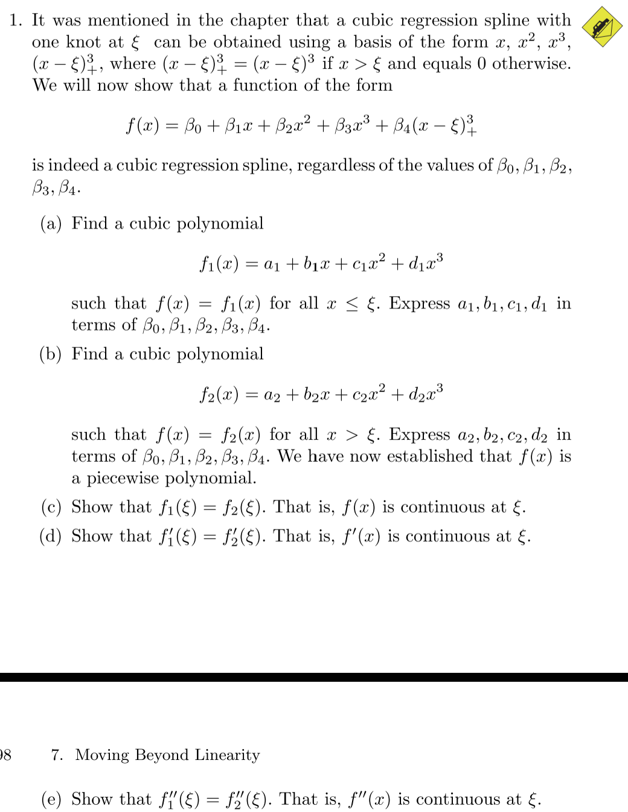
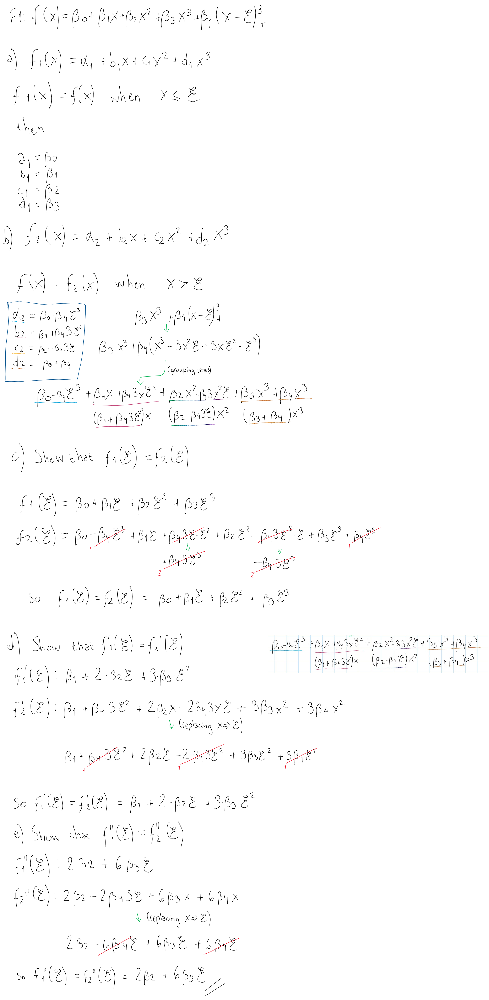
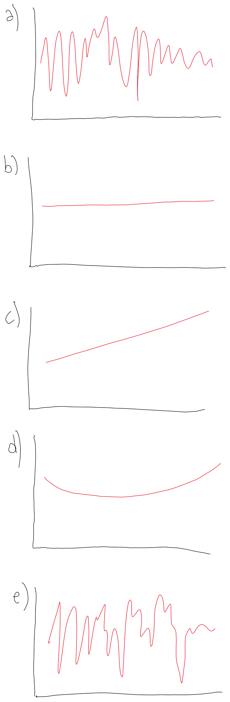
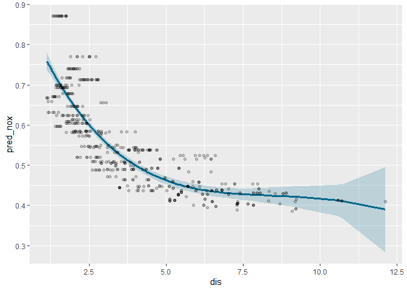
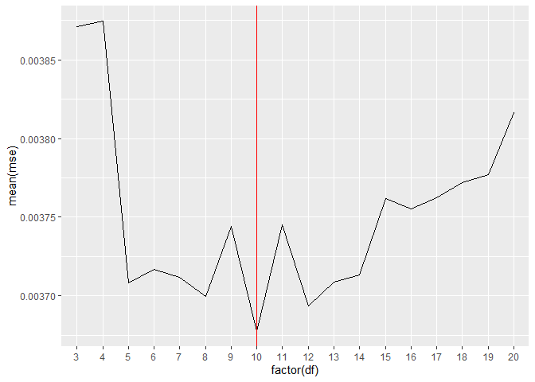
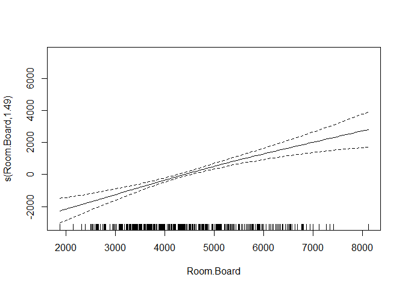
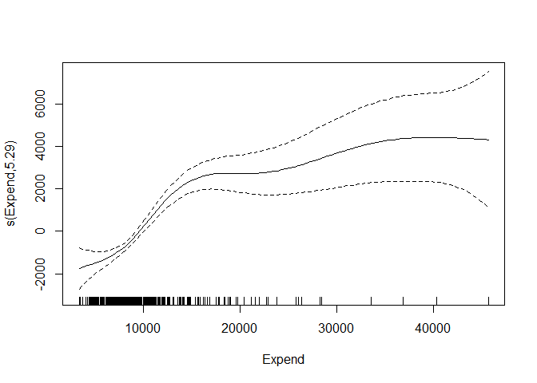

Chapter 7. Excercises
================

## Conceptual

(1)





(2)




(3)


(4)


(5)


(a) g2 will have smaller training RSS, because the resulting function,
with fourth derivative aproaching constant zero, will be more flexible
than g1, which will have its third derivative approaching constant zero.
Another way to see it it’s that when \(\lambda = \infty\) then g1 could
be a polynomial up to third degree (less flexible), and g2 a polynomial
up to fourth degree (more flexible).

(b) Based on (a), which function will have the smaller test RSS will
depend on the true relationship in the data. If the true relationship is
more non-linear and “wiggly”, then g2 will probably do a better job with
the test data.

(c) If \(\lambda = 0\) then the penalization term it’s canceled in both
functions, and the optimization problem it’s the same in g1 and g2.
Therefore, both functions should have similar test and training RSS.

## Applied

(6)

(a)

Using CV to get the optimal grade of the polynomial regression:

``` r
wage_mse_by_poly_grade <- function(grade) {
  wage %>%
    crossv_kfold(k = 50) %>%
    mutate(model = map(train, ~ lm(wage ~ poly(age, grade), data = .))) %>%
    mutate(predicted =
             map2(model, test, ~ broom::augment(.x, newdata = .y))) %>%
    unnest(c(.id, predicted)) %>%
    group_by(.id) %>%
    summarise(mse = mean((.fitted - wage) ^ 2)) %>%
    summarise(mean(mse))
}

mse_by_grade <- 
  tibble(
  grades = 2:20,
  mse = map(grades, wage_mse_by_poly_grade)
) %>% 
  unnest(mse)

qplot(grades, `mean(mse)`, data = mse_by_grade, geom = "line")
```

<!-- -->

From what we see on the MSE plot, it seems that a polynomial of grade 4
is enough.

Comparing to ANOVA results:

``` r
polys <- 
  map(2:10, ~lm(wage ~ poly(age, .), data = wage))

do.call(anova, polys)
```

    ## Analysis of Variance Table
    ## 
    ## Model 1: wage ~ poly(age, .)
    ## Model 2: wage ~ poly(age, .)
    ## Model 3: wage ~ poly(age, .)
    ## Model 4: wage ~ poly(age, .)
    ## Model 5: wage ~ poly(age, .)
    ## Model 6: wage ~ poly(age, .)
    ## Model 7: wage ~ poly(age, .)
    ## Model 8: wage ~ poly(age, .)
    ## Model 9: wage ~ poly(age, .)
    ##   Res.Df     RSS Df Sum of Sq      F   Pr(>F)   
    ## 1   2997 4793430                                
    ## 2   2996 4777674  1   15755.7 9.9005 0.001669 **
    ## 3   2995 4771604  1    6070.2 3.8143 0.050909 . 
    ## 4   2994 4770322  1    1282.6 0.8059 0.369398   
    ## 5   2993 4766389  1    3932.3 2.4709 0.116074   
    ## 6   2992 4763834  1    2555.3 1.6057 0.205199   
    ## 7   2991 4763707  1     126.7 0.0796 0.777865   
    ## 8   2990 4756703  1    7004.3 4.4014 0.035994 * 
    ## 9   2989 4756701  1       2.6 0.0017 0.967529   
    ## ---
    ## Signif. codes:  0 '***' 0.001 '**' 0.01 '*' 0.05 '.' 0.1 ' ' 1

The hypothesis testing in ANOVA suggests that a polynomial of grade 3
it’s enough to explain the variability in `wage`.

Let’s plot the grade 3 and grade 4 polynomials.

``` r
poly3 <- lm(wage ~ poly(age, 3), data = wage)
poly4 <- lm(wage ~ poly(age, 4), data = wage)

modelr::data_grid(wage, age) %>% 
  add_predictions(poly3, var = "grade 3") %>% 
  add_predictions(poly4, var = "grade 4") %>% 
  pivot_longer(
    cols = `grade 3`:`grade 4`,
    names_to = "model",
    values_to = "pred_wage"
  ) %>% 
  ggplot() +
  geom_point(data = wage, aes(age, wage), alpha = 0.15) +
  geom_line(aes(age, pred_wage, color = model), size = 1.1)
```

<!-- -->

(b) Fit a step function to predict `wage` using `age`, and perform
cross-validation to choose the optimal number of cuts. Make a plot of
the fit obtained.

``` r
wage_mse_by_step_cuts <- function(cuts) {
  wage %>%
    crossv_kfold(k = 20) %>%
    mutate(model = map(train, ~ lm(wage ~ cut(age, cuts), data = .))) %>%
    mutate(predicted =
             map2(model, test, ~ broom::augment(.x, newdata = .y))) %>%
    unnest(c(.id, predicted)) %>%
    group_by(.id) %>%
    summarise(mse = mean((.fitted - wage) ^ 2)) %>%
    summarise(mean(mse))
}

mse_by_cuts <- 
  tibble(
  cuts = 2:40,
  mse = map(cuts, wage_mse_by_step_cuts)
) %>% 
  unnest(mse)

qplot(cuts, `mean(mse)`, data = mse_by_cuts, geom = "line")
```

<!-- -->

It seems that the optimal number of cuts is 2 (more cuts implies a
higher test MSE).

``` r
modelr::data_grid(wage, age) %>% 
  add_predictions(lm(wage ~ cut(age, 2), data = wage), var = "pred_wage") %>% 
  ggplot() +
  geom_point(data = wage, aes(age, wage), alpha = 0.15) +
  geom_line(aes(age, pred_wage), color = "blue", size = 1.1)
```

<!-- -->

(7) The `Wage` data set contains a number of other features not explored
in this chapter, such as marital status (`maritl`), job class
(`jobclass`), and others. Explore the relationships between some of
these other predictors and wage, and use non-linear fitting techniques
in order to fit flexible models to the data. Create plots of the results
obtained, and write a summary of your findings.

Predictors to explore: `maritl`, `race`, `jobclass`.

``` r
ggplot(wage) +
  geom_boxplot(aes(maritl, wage))
```

<!-- -->

``` r
ggplot(wage) +
  geom_boxplot(aes(race, wage))
```

<!-- -->

``` r
ggplot(wage) +
  geom_boxplot(aes(jobclass, wage))
```

<!-- -->

``` r
ggplot(wage) +
  geom_boxplot(aes(health, wage))
```

<!-- -->

Now let’s put all this variables in a model:

``` r
lm(wage ~ poly(age, 3) + year + maritl + race + education + health,
   data = wage) %>% 
  summary()
```

    ## 
    ## Call:
    ## lm(formula = wage ~ poly(age, 3) + year + maritl + race + education + 
    ##     health, data = wage)
    ## 
    ## Residuals:
    ##      Min       1Q   Median       3Q      Max 
    ## -114.208  -19.219   -2.879   14.173  213.751 
    ## 
    ## Coefficients:
    ##                               Estimate Std. Error t value Pr(>|t|)    
    ## (Intercept)                 -2379.2398   627.3678  -3.792 0.000152 ***
    ## poly(age, 3)1                 280.8561    40.1759   6.991 3.36e-12 ***
    ## poly(age, 3)2                -292.7787    36.6917  -7.979 2.08e-15 ***
    ## poly(age, 3)3                  43.2209    35.0837   1.232 0.218069    
    ## year                            1.2226     0.3128   3.909 9.47e-05 ***
    ## maritl2. Married               13.0316     1.8546   7.027 2.61e-12 ***
    ## maritl3. Widowed                0.3702     8.1526   0.045 0.963785    
    ## maritl4. Divorced               0.1325     3.0003   0.044 0.964785    
    ## maritl5. Separated              6.9630     4.9700   1.401 0.161314    
    ## race2. Black                   -4.2132     2.1696  -1.942 0.052245 .  
    ## race3. Asian                   -4.0062     2.6476  -1.513 0.130348    
    ## race4. Other                   -6.5033     5.7632  -1.128 0.259229    
    ## education2. HS Grad            10.2927     2.3998   4.289 1.85e-05 ***
    ## education3. Some College       22.6369     2.5314   8.942  < 2e-16 ***
    ## education4. College Grad       36.2041     2.5337  14.289  < 2e-16 ***
    ## education5. Advanced Degree    59.9149     2.7643  21.675  < 2e-16 ***
    ## health2. >=Very Good            7.3182     1.4430   5.071 4.19e-07 ***
    ## ---
    ## Signif. codes:  0 '***' 0.001 '**' 0.01 '*' 0.05 '.' 0.1 ' ' 1
    ## 
    ## Residual standard error: 34.59 on 2983 degrees of freedom
    ## Multiple R-squared:  0.3167, Adjusted R-squared:  0.313 
    ## F-statistic: 86.42 on 16 and 2983 DF,  p-value: < 2.2e-16

Let’s consider some interactions:

``` r
lm(wage ~ poly(age, 2)*race + year + maritl + education + jobclass + health,
   data = wage) %>% 
  summary()
```

    ## 
    ## Call:
    ## lm(formula = wage ~ poly(age, 2) * race + year + maritl + education + 
    ##     jobclass + health, data = wage)
    ## 
    ## Residuals:
    ##      Min       1Q   Median       3Q      Max 
    ## -111.101  -19.325   -2.669   14.172  213.941 
    ## 
    ## Coefficients:
    ##                               Estimate Std. Error t value Pr(>|t|)    
    ## (Intercept)                 -2414.3848   627.0051  -3.851 0.000120 ***
    ## poly(age, 2)1                 283.5687    43.4191   6.531 7.66e-11 ***
    ## poly(age, 2)2                -316.7364    40.9443  -7.736 1.40e-14 ***
    ## race2. Black                   -5.5748     2.2049  -2.528 0.011510 *  
    ## race3. Asian                   -3.9652     2.6467  -1.498 0.134187    
    ## race4. Other                   -7.6120     6.2210  -1.224 0.221202    
    ## year                            1.2394     0.3126   3.965 7.51e-05 ***
    ## maritl2. Married               13.2872     1.8338   7.246 5.46e-13 ***
    ## maritl3. Widowed                0.4263     8.1693   0.052 0.958389    
    ## maritl4. Divorced               0.1333     2.9886   0.045 0.964429    
    ## maritl5. Separated              6.9069     4.9596   1.393 0.163834    
    ## education2. HS Grad            10.0807     2.4061   4.190 2.88e-05 ***
    ## education3. Some College       21.8343     2.5469   8.573  < 2e-16 ***
    ## education4. College Grad       34.7202     2.5771  13.472  < 2e-16 ***
    ## education5. Advanced Degree    57.7585     2.8356  20.369  < 2e-16 ***
    ## jobclass2. Information          4.6696     1.3418   3.480 0.000509 ***
    ## health2. >=Very Good            7.2114     1.4429   4.998 6.13e-07 ***
    ## poly(age, 2)1:race2. Black    -54.7723   107.4625  -0.510 0.610308    
    ## poly(age, 2)2:race2. Black    188.9733   100.1590   1.887 0.059294 .  
    ## poly(age, 2)1:race3. Asian   -177.7637   148.8912  -1.194 0.232605    
    ## poly(age, 2)2:race3. Asian     77.1613   162.2712   0.476 0.634460    
    ## poly(age, 2)1:race4. Other   -258.7626   371.3640  -0.697 0.485989    
    ## poly(age, 2)2:race4. Other   -290.9982   405.9271  -0.717 0.473509    
    ## ---
    ## Signif. codes:  0 '***' 0.001 '**' 0.01 '*' 0.05 '.' 0.1 ' ' 1
    ## 
    ## Residual standard error: 34.52 on 2977 degrees of freedom
    ## Multiple R-squared:  0.3207, Adjusted R-squared:  0.3156 
    ## F-statistic: 63.87 on 22 and 2977 DF,  p-value: < 2.2e-16

``` r
lm(wage ~ poly(age, 2) + year + maritl + education + race*jobclass + health,
   data = wage) %>% 
  summary()
```

    ## 
    ## Call:
    ## lm(formula = wage ~ poly(age, 2) + year + maritl + education + 
    ##     race * jobclass + health, data = wage)
    ## 
    ## Residuals:
    ##      Min       1Q   Median       3Q      Max 
    ## -111.058  -19.122   -2.786   14.139  211.526 
    ## 
    ## Coefficients:
    ##                                       Estimate Std. Error t value Pr(>|t|)
    ## (Intercept)                         -2412.8916   625.9040  -3.855 0.000118
    ## poly(age, 2)1                         268.7062    40.1033   6.700 2.48e-11
    ## poly(age, 2)2                        -289.7446    36.6132  -7.914 3.49e-15
    ## year                                    1.2389     0.3120   3.970 7.35e-05
    ## maritl2. Married                       13.4864     1.8301   7.369 2.21e-13
    ## maritl3. Widowed                        1.8545     8.1430   0.228 0.819866
    ## maritl4. Divorced                       0.4317     2.9857   0.145 0.885051
    ## maritl5. Separated                      6.5794     4.9607   1.326 0.184843
    ## education2. HS Grad                     9.9380     2.3956   4.149 3.44e-05
    ## education3. Some College               21.6887     2.5370   8.549  < 2e-16
    ## education4. College Grad               34.6716     2.5658  13.513  < 2e-16
    ## education5. Advanced Degree            57.6189     2.8307  20.355  < 2e-16
    ## race2. Black                           -6.6819     3.4263  -1.950 0.051246
    ## race3. Asian                          -10.8480     3.8665  -2.806 0.005055
    ## race4. Other                           -4.1417     7.4465  -0.556 0.578123
    ## jobclass2. Information                  3.8324     1.4624   2.621 0.008823
    ## health2. >=Very Good                    7.2133     1.4401   5.009 5.80e-07
    ## race2. Black:jobclass2. Information     2.9180     4.4123   0.661 0.508441
    ## race3. Asian:jobclass2. Information    12.8578     5.2229   2.462 0.013879
    ## race4. Other:jobclass2. Information    -6.6403    11.6543  -0.570 0.568877
    ##                                        
    ## (Intercept)                         ***
    ## poly(age, 2)1                       ***
    ## poly(age, 2)2                       ***
    ## year                                ***
    ## maritl2. Married                    ***
    ## maritl3. Widowed                       
    ## maritl4. Divorced                      
    ## maritl5. Separated                     
    ## education2. HS Grad                 ***
    ## education3. Some College            ***
    ## education4. College Grad            ***
    ## education5. Advanced Degree         ***
    ## race2. Black                        .  
    ## race3. Asian                        ** 
    ## race4. Other                           
    ## jobclass2. Information              ** 
    ## health2. >=Very Good                ***
    ## race2. Black:jobclass2. Information    
    ## race3. Asian:jobclass2. Information *  
    ## race4. Other:jobclass2. Information    
    ## ---
    ## Signif. codes:  0 '***' 0.001 '**' 0.01 '*' 0.05 '.' 0.1 ' ' 1
    ## 
    ## Residual standard error: 34.5 on 2980 degrees of freedom
    ## Multiple R-squared:  0.3209, Adjusted R-squared:  0.3165 
    ## F-statistic:  74.1 on 19 and 2980 DF,  p-value: < 2.2e-16

``` r
lm(wage ~ poly(age, 2) + year + maritl + education * jobclass + health + race,
   data = wage) %>% 
  summary()
```

    ## 
    ## Call:
    ## lm(formula = wage ~ poly(age, 2) + year + maritl + education * 
    ##     jobclass + health + race, data = wage)
    ## 
    ## Residuals:
    ##      Min       1Q   Median       3Q      Max 
    ## -101.119  -19.271   -2.897   14.446  213.829 
    ## 
    ## Coefficients:
    ##                                                      Estimate Std. Error
    ## (Intercept)                                        -2338.9339   625.3491
    ## poly(age, 2)1                                        274.1669    40.0876
    ## poly(age, 2)2                                       -286.7486    36.5112
    ## year                                                   1.2019     0.3118
    ## maritl2. Married                                      13.4534     1.8264
    ## maritl3. Widowed                                       0.8433     8.1173
    ## maritl4. Divorced                                      0.5233     2.9779
    ## maritl5. Separated                                     7.0790     4.9507
    ## education2. HS Grad                                   10.8374     2.8602
    ## education3. Some College                              22.5862     3.1390
    ## education4. College Grad                              33.8262     3.2855
    ## education5. Advanced Degree                           46.6686     4.2769
    ## jobclass2. Information                                 3.4784     4.6584
    ## health2. >=Very Good                                   7.1270     1.4383
    ## race2. Black                                          -4.6380     2.1834
    ## race3. Asian                                          -3.6351     2.6382
    ## race4. Other                                          -7.0645     5.7443
    ## education2. HS Grad:jobclass2. Information            -2.2155     5.1931
    ## education3. Some College:jobclass2. Information       -1.1569     5.3741
    ## education4. College Grad:jobclass2. Information        2.2369     5.3804
    ## education5. Advanced Degree:jobclass2. Information    15.3657     6.0795
    ##                                                    t value Pr(>|t|)    
    ## (Intercept)                                         -3.740 0.000187 ***
    ## poly(age, 2)1                                        6.839 9.63e-12 ***
    ## poly(age, 2)2                                       -7.854 5.59e-15 ***
    ## year                                                 3.855 0.000118 ***
    ## maritl2. Married                                     7.366 2.26e-13 ***
    ## maritl3. Widowed                                     0.104 0.917261    
    ## maritl4. Divorced                                    0.176 0.860525    
    ## maritl5. Separated                                   1.430 0.152845    
    ## education2. HS Grad                                  3.789 0.000154 ***
    ## education3. Some College                             7.195 7.85e-13 ***
    ## education4. College Grad                            10.296  < 2e-16 ***
    ## education5. Advanced Degree                         10.912  < 2e-16 ***
    ## jobclass2. Information                               0.747 0.455304    
    ## health2. >=Very Good                                 4.955 7.63e-07 ***
    ## race2. Black                                        -2.124 0.033731 *  
    ## race3. Asian                                        -1.378 0.168343    
    ## race4. Other                                        -1.230 0.218857    
    ## education2. HS Grad:jobclass2. Information          -0.427 0.669685    
    ## education3. Some College:jobclass2. Information     -0.215 0.829565    
    ## education4. College Grad:jobclass2. Information      0.416 0.677631    
    ## education5. Advanced Degree:jobclass2. Information   2.527 0.011540 *  
    ## ---
    ## Signif. codes:  0 '***' 0.001 '**' 0.01 '*' 0.05 '.' 0.1 ' ' 1
    ## 
    ## Residual standard error: 34.45 on 2979 degrees of freedom
    ## Multiple R-squared:  0.323,  Adjusted R-squared:  0.3185 
    ## F-statistic: 71.07 on 20 and 2979 DF,  p-value: < 2.2e-16

Predictions and exploring results in model with interaction between
jobclass and race:

``` r
model_int_rac_jc <-
  lm(wage ~ poly(age, 2) + year + maritl + education + race * jobclass + health,
     data = wage) 

grid_race_jobclass <-
  data_grid(wage,
            race, jobclass,
            .model = model_int_rac_jc) %>% 
  add_predictions(model_int_rac_jc)

avg_by_job_class <- 
  grid_race_jobclass %>% 
  group_by(jobclass) %>% 
  summarise(mean_pred = mean(pred))

ggplot(grid_race_jobclass) +
  geom_col(aes(jobclass, pred, fill = race),
           position = position_dodge()) +
  geom_crossbar(data=avg_by_job_class, 
                aes(x = jobclass, y = mean_pred,
                    ymin = mean_pred, ymax = mean_pred),
                  size=0.7,col="red", width = 1)
```

<!-- -->

We see than in both `jobclass`es, white peple have higher wages, even
after controlling by other predictors (education, age, etc). However,
asian people have higher wages than white people in Information jobs.

``` r
grid_health_age <-
  data_grid(wage,
            health, age,
            .model = model_int_rac_jc) %>% 
  add_predictions(model_int_rac_jc)

avg_by_health <- 
  grid_health_age %>% 
  group_by(health) %>% 
  summarise(mean_pred = mean(pred))

ggplot(grid_health_age) +
  geom_jitter(aes(health, pred, color = health)) +
  geom_crossbar(
    data = avg_by_health,
    aes(
      x = health,
      y = mean_pred,
      ymin = mean_pred,
      ymax = mean_pred
    ),
    size = 0.5,
    col = "red",
    width = 1
  )
```

<!-- -->

We see that even after controlling for other predictors, people with
“Very Good” health have higher wages than people with worse health
condition.

(8) Fit some of the non-linear models investigated in this chapter to
the `Auto` data set. Is there evidence for non-linear relationships in
this data set? Create some informative plots to justify your answer.

``` r
plot(Auto)
```

<!-- -->

Some of the non-linear relationships we can spot in the last plot: \*
displacement - mpg \* horsepower - mpg \* weight - mpg \* acceleration -
mpg \* year - mpg \* displacement - weight \* displacement -
acceleration \* displacement - origin

Let’s put some of them in a non-linear model:

``` r
model_auto1 <-
  mgcv::gam(
    mpg ~ factor(cylinders) + s(displacement) + s(horsepower) + s(weight) +
      acceleration + year,
    data = Auto
  )

summary(model_auto1)
```

    ## 
    ## Family: gaussian 
    ## Link function: identity 
    ## 
    ## Formula:
    ## mpg ~ factor(cylinders) + s(displacement) + s(horsepower) + s(weight) + 
    ##     acceleration + year
    ## 
    ## Parametric coefficients:
    ##                     Estimate Std. Error t value Pr(>|t|)    
    ## (Intercept)        -38.76596    4.05941  -9.550  < 2e-16 ***
    ## factor(cylinders)4   7.66834    1.58266   4.845 1.85e-06 ***
    ## factor(cylinders)5   9.69387    2.32379   4.172 3.76e-05 ***
    ## factor(cylinders)6   7.68511    1.85483   4.143 4.23e-05 ***
    ## factor(cylinders)8   8.62828    2.19135   3.937 9.81e-05 ***
    ## acceleration        -0.19196    0.09452  -2.031    0.043 *  
    ## year                 0.75460    0.04429  17.038  < 2e-16 ***
    ## ---
    ## Signif. codes:  0 '***' 0.001 '**' 0.01 '*' 0.05 '.' 0.1 ' ' 1
    ## 
    ## Approximate significance of smooth terms:
    ##                   edf Ref.df      F  p-value    
    ## s(displacement) 2.614  3.334  4.881  0.00211 ** 
    ## s(horsepower)   2.495  3.211  7.629 4.21e-05 ***
    ## s(weight)       1.738  2.198 13.839 8.67e-07 ***
    ## ---
    ## Signif. codes:  0 '***' 0.001 '**' 0.01 '*' 0.05 '.' 0.1 ' ' 1
    ## 
    ## R-sq.(adj) =  0.869   Deviance explained = 87.3%
    ## GCV = 8.2979  Scale est. = 8.0048    n = 392

The low p-values in the F tests of the splines terms suggests that a
non-linear fit for those predictors it’s appropiate.

Now let’s plot some of the non-linear relationships. First: `cylinders`
(categorical variable).

``` r
auto_grid_cyl <- 
  Auto %>% 
  data_grid(cylinders,
            .model = model_auto1)

preds_grid_cyl <- predict(model_auto1, newdata = auto_grid_cyl, se.fit = TRUE)

auto_grid_cyl %>% 
  mutate(
    preds = preds_grid_cyl$fit,
    lower_bound = preds - 2*preds_grid_cyl$se.fit,
    upper_bound = preds + 2*preds_grid_cyl$se.fit
  ) %>% 
  ggplot(aes(factor(cylinders), preds, fill = factor(cylinders))) +
  geom_col() +
  geom_errorbar(aes(ymin=lower_bound, ymax=upper_bound), width=.2) +
  labs(y = "pred_mpg")
```

<!-- -->

Now `weight` (a continuous variable)

``` r
auto_grid_weight <- 
  Auto %>% 
  data_grid(weight,
            .model = model_auto1)

preds_grid_weight <- 
  predict(model_auto1, newdata = auto_grid_weight, se.fit = TRUE)

auto_grid_weight %>% 
  mutate(
    preds = preds_grid_weight$fit,
    lower_bound = preds - 2*preds_grid_weight$se.fit,
    upper_bound = preds + 2*preds_grid_weight$se.fit
  ) %>% 
  ggplot(aes(weight, preds)) +
  geom_line() +
  geom_ribbon(aes(ymin = lower_bound, ymax = upper_bound), alpha = 0.5,
              fill = "dodgerblue3") + 
  labs(y = "pred_mpg")
```

<!-- -->

Finally `horsepower` vs `mpg`:

``` r
auto_grid_horsepower <- 
  Auto %>% 
  data_grid(horsepower,
            .model = model_auto1)

preds_grid_horsepower <- 
  predict(model_auto1, newdata = auto_grid_horsepower, se.fit = TRUE)

auto_grid_horsepower %>% 
  mutate(
    preds = preds_grid_horsepower$fit,
    lower_bound = preds - 2*preds_grid_horsepower$se.fit,
    upper_bound = preds + 2*preds_grid_horsepower$se.fit
  ) %>% 
  ggplot(aes(horsepower, preds)) +
  geom_line() +
  geom_ribbon(aes(ymin = lower_bound, ymax = upper_bound), alpha = 0.5,
              fill = "dodgerblue3") + 
  labs(y = "pred_mpg")
```

<!-- -->

(9) This question uses the variables `dis` (the weighted mean of
distances to five Boston employment centers) and `nox` (nitrogen oxides
concentration in parts per 10 million) from the Boston data. We will
treat `dis` as the predictor and `nox` as the response.

(a) Use the `poly()` function to fit a cubic polynomial regression to
predict `nox` using `dis`. Report the regression output, and plot the
resulting data and polynomial fits.

``` r
boston <- MASS::Boston %>% as_tibble()


nox_model1 <- 
  lm(nox ~ poly(dis, 3), data = boston)

summary(nox_model1)
```

    ## 
    ## Call:
    ## lm(formula = nox ~ poly(dis, 3), data = boston)
    ## 
    ## Residuals:
    ##       Min        1Q    Median        3Q       Max 
    ## -0.121130 -0.040619 -0.009738  0.023385  0.194904 
    ## 
    ## Coefficients:
    ##                Estimate Std. Error t value Pr(>|t|)    
    ## (Intercept)    0.554695   0.002759 201.021  < 2e-16 ***
    ## poly(dis, 3)1 -2.003096   0.062071 -32.271  < 2e-16 ***
    ## poly(dis, 3)2  0.856330   0.062071  13.796  < 2e-16 ***
    ## poly(dis, 3)3 -0.318049   0.062071  -5.124 4.27e-07 ***
    ## ---
    ## Signif. codes:  0 '***' 0.001 '**' 0.01 '*' 0.05 '.' 0.1 ' ' 1
    ## 
    ## Residual standard error: 0.06207 on 502 degrees of freedom
    ## Multiple R-squared:  0.7148, Adjusted R-squared:  0.7131 
    ## F-statistic: 419.3 on 3 and 502 DF,  p-value: < 2.2e-16

``` r
plot(nox_model1)
```

<!-- --><!-- --><!-- --><!-- -->

Removing a high leverage point

``` r
boston %>% 
  filter(row_number() != 354) %>% 
  lm(nox ~ poly(dis, 3), data = .) %>% 
  plot()
```

<!-- --><!-- --><!-- --><!-- -->

There isn’t much improvement.

Now let’s plot the fit itself:

``` r
boston_grid_dis <- 
  boston %>% 
  data_grid(
    dis,
    .model = nox_model1
  )

predicts_dis <- predict(nox_model1, newdata = boston_grid_dis, 
                        se.fit = TRUE)

boston_grid_dis %>% 
  mutate(
    pred_nox = predicts_dis$fit,
    se = predicts_dis$se.fit,
    lower = pred_nox - 2*se,
    upper = pred_nox + 2*se
  ) %>% 
  ggplot(aes(dis, pred_nox)) +
  geom_line(color = "deepskyblue4", size = 1.2) +
  geom_ribbon(aes(ymin = lower, ymax = upper),
              alpha = 0.2,
              fill = "deepskyblue4") +
  geom_point(data = boston,
             aes(dis, nox),
             alpha = 0.2)
```

<!-- -->

(b) Plot the polynomial fits for a range of different polynomial degrees
(say, from 1 to 10), and report the associated residual sum of squares.

``` r
fits_nox <-
  tibble(
    degrees = 1:10,
    fits = map(degrees, ~ lm(nox ~ poly(dis, .), data = boston)),
    predicts = map(fits, ~ predict(., newdata = boston_grid_dis,
                                   se.fit = TRUE))
  )

plot_nox_fits <- function(predicts_dis) {
  boston_grid_dis %>%
    mutate(
      pred_nox = predicts_dis$fit,
      se = predicts_dis$se.fit,
      lower = pred_nox - 2 * se,
      upper = pred_nox + 2 * se
    ) %>%
    ggplot(aes(dis, pred_nox)) +
    geom_line(color = "deepskyblue4", size = 1.2) +
    geom_ribbon(aes(ymin = lower, ymax = upper),
                alpha = 0.2,
                fill = "deepskyblue4") +
    geom_point(data = boston,
               aes(dis, nox),
               alpha = 0.2)
}

map(fits_nox$predicts, plot_nox_fits)
```

    ## [[1]]

<!-- -->

    ## 
    ## [[2]]

<!-- -->

    ## 
    ## [[3]]

<!-- -->

    ## 
    ## [[4]]

<!-- -->

    ## 
    ## [[5]]

<!-- -->

    ## 
    ## [[6]]

<!-- -->

    ## 
    ## [[7]]

<!-- -->

    ## 
    ## [[8]]

<!-- -->

    ## 
    ## [[9]]

<!-- -->

    ## 
    ## [[10]]

<!-- -->

Reporting the RSS:

``` r
fits_nox %>%
  mutate(rss = map_dbl(fits,
                       ~ sum((broom::augment(
                         .
                       )[[".resid"]]) ^ 2))) %>% 
  ggplot(aes(degrees, rss)) +
  geom_line()
```

<!-- -->

As expected, it always goes down as we increse the degrees, because
we’re computing the error on the training data.

(c) Perform cross-validation or another approach to select the optimal
degree for the polynomial, and explain your results.

``` r
dis_mse_by_grade <- function(grade) {
  boston %>%
    crossv_kfold(k = 20) %>%
    mutate(model = map(train, ~ lm(nox ~ poly(dis, grade), data = .))) %>%
    mutate(predicted =
             map2(model, test, ~ broom::augment(.x, newdata = .y))) %>%
    unnest(c(.id, predicted)) %>%
    group_by(.id) %>%
    summarise(mse = mean((.fitted - nox) ^ 2)) %>%
    summarise(mean(mse))
}

mse_by_grade <- 
  tibble(
  grade = 1:10,
  mse = map(grade, dis_mse_by_grade)
) %>% 
  unnest(mse)


ggplot(mse_by_grade,
       aes(factor(grade), `mean(mse)`,
           group = 1)) +
  geom_line() +
  geom_vline(xintercept = which.min(mse_by_grade$`mean(mse)`),
             color = "red")
```

<!-- -->

Using a third degree polynomial minimizes the Test MSE, so it’s probably
the optimal degree for the polynomial.

Also, the high fluctuation in MSE that appears as we use polynomils of
grade higher than 6 it’s striking.

(d) Use the `bs()` function to fit a regression spline to predict `nox`
using `dis`. Report the output for the fit using four degrees of
freedom. How did you choose the knots? Plot the resulting fit.

``` r
fit_bs_nox <- lm(nox ~ bs(dis, df = 4), data = boston)

fit_bs_nox %>% summary()
```

    ## 
    ## Call:
    ## lm(formula = nox ~ bs(dis, df = 4), data = boston)
    ## 
    ## Residuals:
    ##       Min        1Q    Median        3Q       Max 
    ## -0.124622 -0.039259 -0.008514  0.020850  0.193891 
    ## 
    ## Coefficients:
    ##                  Estimate Std. Error t value Pr(>|t|)    
    ## (Intercept)       0.73447    0.01460  50.306  < 2e-16 ***
    ## bs(dis, df = 4)1 -0.05810    0.02186  -2.658  0.00812 ** 
    ## bs(dis, df = 4)2 -0.46356    0.02366 -19.596  < 2e-16 ***
    ## bs(dis, df = 4)3 -0.19979    0.04311  -4.634 4.58e-06 ***
    ## bs(dis, df = 4)4 -0.38881    0.04551  -8.544  < 2e-16 ***
    ## ---
    ## Signif. codes:  0 '***' 0.001 '**' 0.01 '*' 0.05 '.' 0.1 ' ' 1
    ## 
    ## Residual standard error: 0.06195 on 501 degrees of freedom
    ## Multiple R-squared:  0.7164, Adjusted R-squared:  0.7142 
    ## F-statistic: 316.5 on 4 and 501 DF,  p-value: < 2.2e-16

When we use the `df` argument, the knot(s) are chosen automatically
based on quantiles. In this case, it should be one knot, located in the
50th percentile (median) of `dis`.

``` r
attr(bs(boston$dis, df = 4), "knots")
```

    ##     50% 
    ## 3.20745

Plotting the fit (plus a vertical line indicating the knot)

``` r
dis_lims <- range(boston$dis)

boston_range_dis <-
  tibble(dis = seq(from = dis_lims[1],
                   to = dis_lims[2],
                   by = 0.01))

predict_dis_bs <- predict(fit_bs_nox, newdata = boston_range_dis,
                          se.fit = TRUE)

boston_range_dis %>% 
  mutate(
    pred_nox = predict_dis_bs$fit,
    se = predict_dis_bs$se.fit,
    lower = pred_nox - 2*se,
    upper = pred_nox + 2*se
  ) %>% 
  ggplot(aes(dis, pred_nox)) +
  geom_line(color = "deepskyblue4", size = 1.2) +
  geom_ribbon(aes(ymin = lower, ymax = upper),
              alpha = 0.2,
              fill = "deepskyblue4") +
  geom_point(data = boston,
             aes(dis, nox),
             alpha = 0.2) +
  geom_vline(xintercept = 3.20745,
             color = "red1")
```

<!-- -->

(e) Now fit a regression spline for a range of degrees of freedom, and
plot the resulting fits and report the resulting RSS. Describe the
results obtained.

``` r
fits_nox_bs <- 
  tibble(
  dfs = 3:20,
  fits = map(dfs, ~lm(nox ~ bs(dis, df = .), data = boston)),
  predicts = map(fits, ~predict(., newdata = boston_range_dis,
                                se.fit = TRUE))
  )


plot_nox_fits <- function(predicts_dis) {
  boston_range_dis %>%
    mutate(
      pred_nox = predicts_dis$fit,
      se = predicts_dis$se.fit,
      lower = pred_nox - 2 * se,
      upper = pred_nox + 2 * se
    ) %>%
    ggplot(aes(dis, pred_nox)) +
    geom_line(color = "deepskyblue4", size = 1.2) +
    geom_ribbon(aes(ymin = lower, ymax = upper),
                alpha = 0.2,
                fill = "deepskyblue4") +
    geom_point(data = boston,
               aes(dis, nox),
               alpha = 0.2)
}

map(fits_nox_bs$predicts, plot_nox_fits)
```

    ## [[1]]

<!-- -->

    ## 
    ## [[2]]

<!-- -->

    ## 
    ## [[3]]

<!-- -->

    ## 
    ## [[4]]

<!-- -->

    ## 
    ## [[5]]

<!-- -->

    ## 
    ## [[6]]

<!-- -->

    ## 
    ## [[7]]

<!-- -->

    ## 
    ## [[8]]

<!-- -->

    ## 
    ## [[9]]

<!-- -->

    ## 
    ## [[10]]

<!-- -->

    ## 
    ## [[11]]

<!-- -->

    ## 
    ## [[12]]

<!-- -->

    ## 
    ## [[13]]

<!-- -->

    ## 
    ## [[14]]

<!-- -->

    ## 
    ## [[15]]

<!-- -->

    ## 
    ## [[16]]

<!-- -->

    ## 
    ## [[17]]

<!-- -->

    ## 
    ## [[18]]

<!-- -->

``` r
# TODO: challenge, add the knots to the plots *programatically*
```

Resulting RSS (residual sum of squares)

``` r
fits_nox_bs  <- fits_nox_bs %>% 
  mutate(rss = map_dbl(fits,
                       ~ sum((broom::augment(
                         .
                       )[[".resid"]]) ^ 2)))
  
fits_nox_bs %>% select(dfs, rss)
```

    ## # A tibble: 18 x 2
    ##      dfs   rss
    ##    <int> <dbl>
    ##  1     3  1.93
    ##  2     4  1.92
    ##  3     5  1.84
    ##  4     6  1.83
    ##  5     7  1.83
    ##  6     8  1.82
    ##  7     9  1.83
    ##  8    10  1.79
    ##  9    11  1.80
    ## 10    12  1.79
    ## 11    13  1.78
    ## 12    14  1.78
    ## 13    15  1.78
    ## 14    16  1.78
    ## 15    17  1.78
    ## 16    18  1.78
    ## 17    19  1.77
    ## 18    20  1.78

Plot of the RSS:

``` r
ggplot(fits_nox_bs, aes(dfs, rss)) +
  geom_line()
```

<!-- -->

As expected, RSS in trainging data goes down as degrees of freedom goes
up.

(f) Perform cross-validation or another approach in order to select the
best degrees of freedom for a regression spline on this data. Describe
your results.

``` r
dis_mse_by_df_bs <- function(df) {
  boston %>%
    crossv_kfold(k = 30) %>%
    mutate(model = map(train, ~ lm(nox ~ bs(dis, df = df), data = .))) %>%
    mutate(predicted =
             map2(model, test, ~ broom::augment(.x, newdata = .y))) %>%
    unnest(c(.id, predicted)) %>%
    group_by(.id) %>%
    summarise(mse = mean((.fitted - nox) ^ 2)) %>%
    summarise(mean(mse))
}

mse_by_df <- 
  tibble(
  df = 3:20,
  mse = map(df, dis_mse_by_df_bs)
) %>% 
  unnest(mse)


ggplot(mse_by_df,
       aes(factor(df), `mean(mse)`,
           group = 1)) +
  geom_line() +
  geom_vline(xintercept = which.min(mse_by_df$`mean(mse)`),
             color = "red")
```

<!-- -->

Although the MSE is minimized with 10 degrees of freedom, we see very
little variation above 5 degrees. Since less degrees is prefered when
there is no clear advantage of adding more complexity, then I would use
`df = 5`.

(10) This question relates to the `College` data set.

(a) Split the data into a training set and a test set. Using
out-of-state tuition as the response and the other variables as the
predictors, perform forward stepwise selection on the training set in
order to identify a satisfactory model that uses just a subset of the
predictors.

Train/test split:

``` r
college_train <- 
  College %>% 
  as_tibble(rownames = "rowname") %>% 
  sample_frac(size = 0.5)

college_test <- 
  College %>% 
  as_tibble(rownames = "rowname") %>%
  anti_join(college_train, by = "rowname")
```

``` r
forwardselection <- regsubsets(Outstate ~ .,
                               data = select(college_train, -rowname),
                               method = "forward") 

summary(forwardselection)
```

    ## Subset selection object
    ## Call: regsubsets.formula(Outstate ~ ., data = select(college_train, 
    ##     -rowname), method = "forward")
    ## 17 Variables  (and intercept)
    ##             Forced in Forced out
    ## PrivateYes      FALSE      FALSE
    ## Apps            FALSE      FALSE
    ## Accept          FALSE      FALSE
    ## Enroll          FALSE      FALSE
    ## Top10perc       FALSE      FALSE
    ## Top25perc       FALSE      FALSE
    ## F.Undergrad     FALSE      FALSE
    ## P.Undergrad     FALSE      FALSE
    ## Room.Board      FALSE      FALSE
    ## Books           FALSE      FALSE
    ## Personal        FALSE      FALSE
    ## PhD             FALSE      FALSE
    ## Terminal        FALSE      FALSE
    ## S.F.Ratio       FALSE      FALSE
    ## perc.alumni     FALSE      FALSE
    ## Expend          FALSE      FALSE
    ## Grad.Rate       FALSE      FALSE
    ## 1 subsets of each size up to 8
    ## Selection Algorithm: forward
    ##          PrivateYes Apps Accept Enroll Top10perc Top25perc F.Undergrad
    ## 1  ( 1 ) " "        " "  " "    " "    " "       " "       " "        
    ## 2  ( 1 ) "*"        " "  " "    " "    " "       " "       " "        
    ## 3  ( 1 ) "*"        " "  " "    " "    " "       " "       " "        
    ## 4  ( 1 ) "*"        " "  " "    " "    " "       " "       " "        
    ## 5  ( 1 ) "*"        " "  " "    " "    " "       " "       " "        
    ## 6  ( 1 ) "*"        " "  " "    " "    " "       " "       " "        
    ## 7  ( 1 ) "*"        " "  " "    " "    " "       " "       " "        
    ## 8  ( 1 ) "*"        " "  " "    " "    "*"       " "       " "        
    ##          P.Undergrad Room.Board Books Personal PhD Terminal S.F.Ratio
    ## 1  ( 1 ) " "         " "        " "   " "      " " " "      " "      
    ## 2  ( 1 ) " "         " "        " "   " "      " " " "      " "      
    ## 3  ( 1 ) " "         "*"        " "   " "      " " " "      " "      
    ## 4  ( 1 ) " "         "*"        " "   " "      " " " "      " "      
    ## 5  ( 1 ) " "         "*"        " "   " "      " " " "      " "      
    ## 6  ( 1 ) " "         "*"        " "   " "      " " "*"      " "      
    ## 7  ( 1 ) " "         "*"        " "   "*"      " " "*"      " "      
    ## 8  ( 1 ) " "         "*"        " "   "*"      " " "*"      " "      
    ##          perc.alumni Expend Grad.Rate
    ## 1  ( 1 ) " "         "*"    " "      
    ## 2  ( 1 ) " "         "*"    " "      
    ## 3  ( 1 ) " "         "*"    " "      
    ## 4  ( 1 ) "*"         "*"    " "      
    ## 5  ( 1 ) "*"         "*"    "*"      
    ## 6  ( 1 ) "*"         "*"    "*"      
    ## 7  ( 1 ) "*"         "*"    "*"      
    ## 8  ( 1 ) "*"         "*"    "*"

``` r
forwardmodels <- 
  tibble(
    metric = c("adjr2", "cp", "bic"),
    best_model = c(
      summary(forwardselection)[["adjr2"]] %>% which.max(),
      summary(forwardselection)[["cp"]] %>% which.min(),
      summary(forwardselection)[["bic"]] %>% which.min()
    )
  )

forwardmodels
```

    ## # A tibble: 3 x 2
    ##   metric best_model
    ##   <chr>       <int>
    ## 1 adjr2           8
    ## 2 cp              8
    ## 3 bic             7

I’m chosing the 6th model, which is the one with lower BIC.

``` r
forwardselection %>% coef(id = 6)
```

    ##   (Intercept)    PrivateYes    Room.Board      Terminal   perc.alumni 
    ## -4029.5577334  2593.1947885     0.9406566    38.8954274    56.3599679 
    ##        Expend     Grad.Rate 
    ##     0.1987092    35.3239751

(b) Fit a GAM on the training data, using out-of-state tuition as the
response and the features selected in the previous step as the
predictors. Plot the results, and explain your findings.

``` r
gam_college <- 
  gam(Outstate ~ Private + s(Room.Board) + Terminal + s(perc.alumni) +
      s(Expend) + s(Grad.Rate),
    data = college_train)

summary(gam_college)
```

    ## 
    ## Family: gaussian 
    ## Link function: identity 
    ## 
    ## Formula:
    ## Outstate ~ Private + s(Room.Board) + Terminal + s(perc.alumni) + 
    ##     s(Expend) + s(Grad.Rate)
    ## 
    ## Parametric coefficients:
    ##             Estimate Std. Error t value Pr(>|t|)    
    ## (Intercept) 7562.820    851.908   8.878  < 2e-16 ***
    ## PrivateYes  2269.331    278.580   8.146 5.66e-15 ***
    ## Terminal      16.648      9.169   1.816   0.0702 .  
    ## ---
    ## Signif. codes:  0 '***' 0.001 '**' 0.01 '*' 0.05 '.' 0.1 ' ' 1
    ## 
    ## Approximate significance of smooth terms:
    ##                  edf Ref.df     F  p-value    
    ## s(Room.Board)  1.954  2.489 15.12 7.68e-08 ***
    ## s(perc.alumni) 1.775  2.242 10.50 2.04e-05 ***
    ## s(Expend)      5.532  6.649 21.39  < 2e-16 ***
    ## s(Grad.Rate)   1.000  1.000 21.45 4.98e-06 ***
    ## ---
    ## Signif. codes:  0 '***' 0.001 '**' 0.01 '*' 0.05 '.' 0.1 ' ' 1
    ## 
    ## R-sq.(adj) =  0.785   Deviance explained = 79.2%
    ## GCV = 3.7187e+06  Scale est. = 3.5916e+06  n = 388

``` r
plot(gam_college)
```

<!-- --><!-- --><!-- --><!-- -->

At first I tried to specify all continuous predictors as smoothing
splines, but the results showed that for `Terminal` we can not reject
the null hypothesis that its effect is linear, so in a second
specification I left it as a linear variable.

But then, the coefficient for `Terminal` as a linear variable also
showed to be non-significant (which is striking, since this variable was
chosen by forward feature selection).

A possible explanation is that FFS chooses the variables in the context
of a completely linear model, and now the smoothing splines of other
variables have picked up some of the effect that was previously
attributed to `Terminal` in FFS.

(c) Evaluate the model obtained on the test set, and explain the results
obtained.

Computing the RSS:

``` r
(college_test$Outstate - predict(gam_college, newdata = college_test))^2 %>% 
  sum()
```

    ## [1] 1351784966

Plotting the residuals:

``` r
college_test %>% 
  add_predictions(gam_college) %>% 
  mutate(resid = Outstate - pred) %>% 
  ggplot(aes(Outstate, resid)) +
  geom_point() +
  geom_smooth() +
  geom_hline(yintercept = 0, color = "red", size = 1)
```

    ## `geom_smooth()` using method = 'loess' and formula 'y ~ x'

<!-- -->

It seems to exist a pattern in the residuals plot, which signals the
existence of patterns in the data that have not been captured by our
model.

(d) For which variables, if any, is there evidence of a non-linear
relationship with the response?

There is evidence of non-linear relationships for all the continuous
variables in the model, except for `Terminal`.
