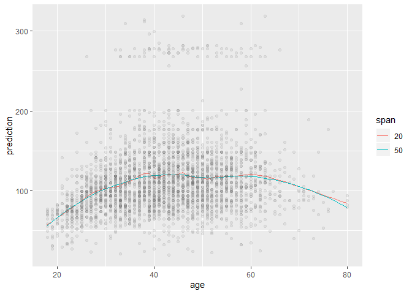
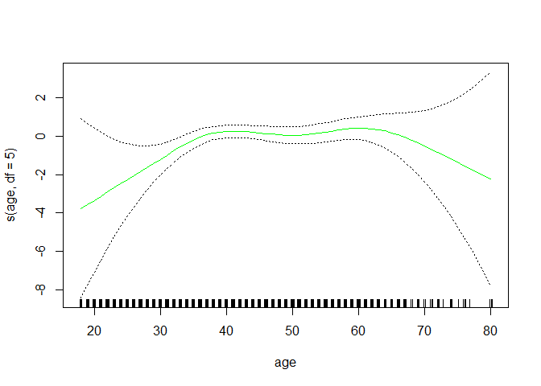

7.8 Lab: Non-linear Modeling
================

``` r
knitr::opts_chunk$set(warning = FALSE, message = FALSE)
library(tidyverse)
library(ISLR)
library(modelr)
library(splines)
library(gam)
library(akima)
wage <- ISLR::Wage
```

## 7.8.1 Polynomial Regression and Step Functions

``` r
fit <- lm(wage ~ poly(age, 4, raw = TRUE), data = wage)

coef(summary(fit))
```

    ##                                Estimate   Std. Error   t value
    ## (Intercept)               -1.841542e+02 6.004038e+01 -3.067172
    ## poly(age, 4, raw = TRUE)1  2.124552e+01 5.886748e+00  3.609042
    ## poly(age, 4, raw = TRUE)2 -5.638593e-01 2.061083e-01 -2.735743
    ## poly(age, 4, raw = TRUE)3  6.810688e-03 3.065931e-03  2.221409
    ## poly(age, 4, raw = TRUE)4 -3.203830e-05 1.641359e-05 -1.951938
    ##                               Pr(>|t|)
    ## (Intercept)               0.0021802539
    ## poly(age, 4, raw = TRUE)1 0.0003123618
    ## poly(age, 4, raw = TRUE)2 0.0062606446
    ## poly(age, 4, raw = TRUE)3 0.0263977518
    ## poly(age, 4, raw = TRUE)4 0.0510386498

Creating a grid of `age` values at which we want predictions:

``` r
agelims <- range(wage[["age"]])

age_grid <- seq(agelims[[1]], agelims[[2]])

predictions <- 
  tibble(
    age = seq(agelims[[1]], agelims[[2]])
  )
  
predictions %>% 
  add_predictions(model = fit)
```

    ## # A tibble: 63 x 2
    ##      age  pred
    ##    <int> <dbl>
    ##  1    18  51.9
    ##  2    19  58.5
    ##  3    20  64.6
    ##  4    21  70.2
    ##  5    22  75.4
    ##  6    23  80.1
    ##  7    24  84.5
    ##  8    25  88.5
    ##  9    26  92.1
    ## 10    27  95.4
    ## # ... with 53 more rows

Another way of computing predictions

``` r
predict_output <- 
  predict(fit, newdata = predictions, se = TRUE)

se_bands <- cbind(predict_output[["fit"]]+2*predict_output[["se.fit"]],
                  predict_output[["fit"]]+2*predict_output[["se.fit"]])
```

Creating a tibble for plotting:

``` r
predictions <- 
  tibble(
    age_value = age_grid,
    predictions = predict_output[["fit"]],
    low_band = predict_output[["fit"]]-2*predict_output[["se.fit"]],
    high_band = predict_output[["fit"]]+2*predict_output[["se.fit"]]
  )

predictions %>% 
  ggplot(aes(age_value, predictions)) +
  geom_point(data = wage, aes(age, wage), alpha = 0.1, color = "grey60") +
  geom_line(color = "red") +
  geom_line(aes(y = low_band), color = "blue") +
  geom_line(aes(y = high_band), color = "blue") +
  labs(y = "wage", x = "age")
```

<!-- -->

Another way (using base-plots):

``` r
par(
  mfrow = c(1, 2) ,
  mar = c(4.5, 4.5, 1, 1) ,
  oma = c(0, 0, 4, 0)
)

plot(wage$age ,
     wage$wage ,
     xlim = agelims ,
     cex = .5,
     col = " darkgrey")

title("Degree -4 Polynomial", outer = T)

lines(age_grid , predict_output$fit , lwd = 2, col = "blue")

matlines(age_grid ,
         cbind(predictions$low_band, predictions$high_band),
         lwd = 1,
         col = "blue",
         lty = 3)
```

<!-- -->

We can use ANOVA to choose the grade of the polynomial. ANOVA receives a
set of nested models as input, and for each pair it test wether the
simpler model is “enough”, or if we need the more complex model of the
pair to explain the response variable.

``` r
polynomials <- 
  tibble(
    grade = 1:5,
    models = map(grade, ~lm(wage ~ poly(age, .), data = wage))
  )

anova(polynomials[["models"]][[1]],
      polynomials[["models"]][[2]],
      polynomials[["models"]][[3]],
      polynomials[["models"]][[4]],
      polynomials[["models"]][[5]])
```

    ## Analysis of Variance Table
    ## 
    ## Model 1: wage ~ poly(age, .)
    ## Model 2: wage ~ poly(age, .)
    ## Model 3: wage ~ poly(age, .)
    ## Model 4: wage ~ poly(age, .)
    ## Model 5: wage ~ poly(age, .)
    ##   Res.Df     RSS Df Sum of Sq        F    Pr(>F)    
    ## 1   2998 5022216                                    
    ## 2   2997 4793430  1    228786 143.5931 < 2.2e-16 ***
    ## 3   2996 4777674  1     15756   9.8888  0.001679 ** 
    ## 4   2995 4771604  1      6070   3.8098  0.051046 .  
    ## 5   2994 4770322  1      1283   0.8050  0.369682    
    ## ---
    ## Signif. codes:  0 '***' 0.001 '**' 0.01 '*' 0.05 '.' 0.1 ' ' 1

Note that if the models contain only the polynomic variable, then we
could obtain the same p-values with a single regression of orthogonal
polynomials.

``` r
lm(wage ~ poly(age, 5), data = wage) %>% summary() %>% coef()
```

    ##                 Estimate Std. Error     t value     Pr(>|t|)
    ## (Intercept)    111.70361  0.7287647 153.2780243 0.000000e+00
    ## poly(age, 5)1  447.06785 39.9160847  11.2001930 1.491111e-28
    ## poly(age, 5)2 -478.31581 39.9160847 -11.9830341 2.367734e-32
    ## poly(age, 5)3  125.52169 39.9160847   3.1446392 1.679213e-03
    ## poly(age, 5)4  -77.91118 39.9160847  -1.9518743 5.104623e-02
    ## poly(age, 5)5  -35.81289 39.9160847  -0.8972045 3.696820e-01

(also, the t-statistics of the single regression correspond to the
square root of the F-values in the ANOVA).

However, we still want to use ANOVA if we are chosing between models
with more variables.

### Polynomial regression with binary variable

``` r
wage <- wage %>% 
  mutate(above_250 = wage > 250)

fit_binary <- 
  glm(above_250 ~ poly(age, 4), data = wage, family = "binomial")

preds_binary <- 
  predict(fit_binary, newdata = list(age = age_grid),
          se = TRUE)
```

Now we need to obtain the fitted values and confidence interval in terms
of the response, not the link function. For this we use the
transformation `exp(x)/(1 + exp(x))`

``` r
transformation <- function(x) exp(x)/(1 + exp(x))

predictions_binary <- 
  tibble(
    age_grid = age_grid,
    log_odds = preds_binary$fit,
    lower_logit = preds_binary$fit - 2*preds_binary$se.fit,
    upper_logit = preds_binary$fit + 2*preds_binary$se.fit,
    response = map_dbl(log_odds, transformation),
    lower_response = map_dbl(lower_logit, transformation),
    upper_response = map_dbl(upper_logit, transformation),

  )

ggplot(predictions_binary,
       aes(age_grid, response)) +
  geom_line() +
  geom_line(aes(y = lower_response), color = "blue") +
  geom_line(aes(y = upper_response), color = "blue") +
  geom_jitter(data = wage,
             aes(x = age,
                 y = (wage > 250)/5),
             height = 0, shape = "|") +
  coord_cartesian(ylim = c(0, 0.2))
```

<!-- -->

Using base R plots:

``` r
plot(wage[["age"]], 
     I(wage[["wage"]] > 250),
     xlim=agelims,
     type="n",
     ylim=c(0, .2))

points(jitter(wage[["age"]]), 
       I((wage[["wage"]] >250) /5), cex =.5,
       pch ="|",
       col ="darkgrey")

lines(age_grid, predictions_binary$response, lwd =2, col ="blue")

matlines(age_grid,
         cbind(predictions_binary$lower_response,
               predictions_binary$upper_response), 
         lwd=1, col="blue", lty =3)
```

<!-- -->

### Step function

``` r
lm(wage ~ cut(age, 4), data = wage) %>%
  summary() %>% 
  coef()
```

    ##                         Estimate Std. Error   t value     Pr(>|t|)
    ## (Intercept)            94.158392   1.476069 63.789970 0.000000e+00
    ## cut(age, 4)(33.5,49]   24.053491   1.829431 13.148074 1.982315e-38
    ## cut(age, 4)(49,64.5]   23.664559   2.067958 11.443444 1.040750e-29
    ## cut(age, 4)(64.5,80.1]  7.640592   4.987424  1.531972 1.256350e-01

### Splines

Fitting a cubic spline with knots at age of 25, 40, and 60 (we can use
the argument `knots`).

``` r
fit1_spline <- 
  lm(wage ~ bs(age, knots = c(25, 40, 60)), data = wage)

preds_spline <- predict(fit1_spline, newdata = list(age = age_grid),
                        se = TRUE)

predictions_spline1 <- 
  tibble(
    age = age_grid,
    pred_wage = preds_spline$fit,
    lower_interval = pred_wage - 2*preds_spline$se.fit,
    upper_interval = pred_wage + 2*preds_spline$se.fit
  )

ggplot(predictions_spline1,
       aes(age, pred_wage)) +
  geom_point(data = wage, aes(age, wage), alpha = 0.1, 
             color = "grey40") +
  geom_line(color = "red") +
  geom_line(aes(y = lower_interval), color = "blue") +
  geom_line(aes(y = upper_interval), color = "blue") 
```

<!-- -->

Seeing how the basis functions (for the splines) are created:

``` r
bs(wage[["age"]], knots = c(25, 40, 60)) %>% 
  dim()
```

    ## [1] 3000    6

The columns number indicates the degrees of freedom:

``` r
bs(wage[["age"]], df = 6) %>% 
  dim()
```

    ## [1] 3000    6

When `df` is specified (instead of `knots`), the `knots` are uniformly
distributed:

``` r
bs(wage[["age"]], df = 6) %>% 
  attr("knots")
```

    ##   25%   50%   75% 
    ## 33.75 42.00 51.00

We can also use natural splines, specifying the degrees of freedom or
the number of knots.

``` r
fit1_nspline <- 
  lm(wage ~ ns(age, df = 4), data = wage)

preds_nspline <- predict(fit1_nspline, newdata = list(age = age_grid),
                        se = TRUE)

predictions_nspline1 <- 
  tibble(
    age = age_grid,
    pred_wage = preds_nspline$fit,
    lower_interval = pred_wage - 2*preds_nspline$se.fit,
    upper_interval = pred_wage + 2*preds_nspline$se.fit
  )

ggplot(predictions_nspline1,
       aes(age, pred_wage)) +
  geom_point(data = wage, aes(age, wage), alpha = 0.1, 
             color = "grey40") +
  geom_line(color = "red") +
  geom_line(aes(y = lower_interval), color = "blue") +
  geom_line(aes(y = upper_interval), color = "blue") 
```

<!-- -->

To fit a smoothing spline we use the `smooth.spline()` function (instead
of `lm()`).

``` r
fit1_smooth_spline <- 
  smooth.spline(wage[["age"]], wage[["wage"]], df = 16)

fit2_smooth_spline <- 
  smooth.spline(wage[["age"]], wage[["wage"]], cv = TRUE)


fit2_smooth_spline$df
```

    ## [1] 6.794596

``` r
predictions_smoothing_splines <- 
  tibble(
    age = predict(fit1_smooth_spline, 
                          newdata = list(age = age_grid))$x,
    pred_wage_1 = predict(fit1_smooth_spline, 
                          newdata = age)$y,
    pred_wage_2 = predict(fit2_smooth_spline, 
                          newdata = age)$y)

predictions_smoothing_splines %>% 
  rename(`16 DF` = pred_wage_1,
         `6.8 DF` = pred_wage_2) %>% 
  pivot_longer(
    cols = -age,
    names_to = "model",
    values_to = "pred_value"
  ) %>% 
  ggplot(aes(age, pred_value)) +
  geom_line(aes(color = model, group = model)) +
  geom_point(data = wage, aes(age, wage), alpha = 0.1, 
             color = "grey40")
```

<!-- -->

### Local Regression

We use the `loess()` function. Here the key parameter is `span` (which
specifies the % of nearest observations to use for prediction). The
larger the span, the smoother the fit.

``` r
fit_loess_1 <- loess(wage ~ age, span = 0.2, data = wage)
fit_loess_2 <- loess(wage ~ age, span = 0.5, data = wage)


predictions_loess <- 
  tibble(
    age = age_grid,
    model1_span20 = 
      predict(fit_loess_1, newdata = tibble(age = age_grid)),
    model2_span50 = 
      predict(fit_loess_2, newdata = tibble(age = age_grid))
  )

predictions_loess %>% 
  pivot_longer(
    cols = -age,
    names_to = c("model", "span"),
    values_to = "prediction",
    names_sep = "_span"
  ) %>% 
  ggplot(aes(age, prediction)) +
  geom_line(aes(color = span, group = span)) +
  geom_point(data = wage, aes(age, wage), alpha = 0.1, 
             color = "grey40")
```

<!-- -->

### GAMs

If we only use components that can be represented through basis
functions, then `lm()` is enough for fitting a GAM. If we do a
`summary()` we get the coefficients of the basis functions:

``` r
gam_1 <- 
  lm(wage ~ ns(year, 4) + ns(age, 5) + education,
     data = wage)

summary(gam_1)
```

    ## 
    ## Call:
    ## lm(formula = wage ~ ns(year, 4) + ns(age, 5) + education, data = wage)
    ## 
    ## Residuals:
    ##      Min       1Q   Median       3Q      Max 
    ## -120.513  -19.608   -3.583   14.112  214.535 
    ## 
    ## Coefficients:
    ##                             Estimate Std. Error t value Pr(>|t|)    
    ## (Intercept)                   46.949      4.704   9.980  < 2e-16 ***
    ## ns(year, 4)1                   8.625      3.466   2.488  0.01289 *  
    ## ns(year, 4)2                   3.762      2.959   1.271  0.20369    
    ## ns(year, 4)3                   8.127      4.211   1.930  0.05375 .  
    ## ns(year, 4)4                   6.806      2.397   2.840  0.00455 ** 
    ## ns(age, 5)1                   45.170      4.193  10.771  < 2e-16 ***
    ## ns(age, 5)2                   38.450      5.076   7.575 4.78e-14 ***
    ## ns(age, 5)3                   34.239      4.383   7.813 7.69e-15 ***
    ## ns(age, 5)4                   48.678     10.572   4.605 4.31e-06 ***
    ## ns(age, 5)5                    6.557      8.367   0.784  0.43328    
    ## education2. HS Grad           10.983      2.430   4.520 6.43e-06 ***
    ## education3. Some College      23.473      2.562   9.163  < 2e-16 ***
    ## education4. College Grad      38.314      2.547  15.042  < 2e-16 ***
    ## education5. Advanced Degree   62.554      2.761  22.654  < 2e-16 ***
    ## ---
    ## Signif. codes:  0 '***' 0.001 '**' 0.01 '*' 0.05 '.' 0.1 ' ' 1
    ## 
    ## Residual standard error: 35.16 on 2986 degrees of freedom
    ## Multiple R-squared:  0.293,  Adjusted R-squared:  0.2899 
    ## F-statistic:  95.2 on 13 and 2986 DF,  p-value: < 2.2e-16

However, if we want to use smoothing splines or local regression, we
need the `gam` package, with the functions `gam()`, `s()` (for smoothing
splines) and `lo()` (for local regression).

We can use `plot()` directly on a `gam()` fit.

``` r
gam_2 <- gam(wage ~ s(year, 4) + s(age, 5) + education,
             data = wage)

par(mfrow=c(1,3))

plot(gam_2, se=TRUE ,col ="blue")
```

<!-- -->

Since the relationship between `year` and `wage` looks mostly linear, we
can use ANOVA to check if a GAM linear on `year` is enough. We can even
check if `year` should be included in the model (in any form):

``` r
gam_noyear <- gam(wage ~ s(age, 5) + education,
             data = wage)

gam_linearyear <- gam(wage ~ year + s(age, 5) + education,
             data = wage)

anova(gam_noyear, gam_linearyear, gam_2, test = "F")
```

    ## Analysis of Deviance Table
    ## 
    ## Model 1: wage ~ s(age, 5) + education
    ## Model 2: wage ~ year + s(age, 5) + education
    ## Model 3: wage ~ s(year, 4) + s(age, 5) + education
    ##   Resid. Df Resid. Dev Df Deviance       F    Pr(>F)    
    ## 1      2990    3711731                                  
    ## 2      2989    3693842  1  17889.2 14.4771 0.0001447 ***
    ## 3      2986    3689770  3   4071.1  1.0982 0.3485661    
    ## ---
    ## Signif. codes:  0 '***' 0.001 '**' 0.01 '*' 0.05 '.' 0.1 ' ' 1

The results show that it’s justified to include `year` in the model, but
as a linear term, not using a spline.

Another way of testing this is looking at the `Pr(F)` values in the GAM
`summary()`

``` r
summary(gam_2)
```

    ## 
    ## Call: gam(formula = wage ~ s(year, 4) + s(age, 5) + education, data = wage)
    ## Deviance Residuals:
    ##     Min      1Q  Median      3Q     Max 
    ## -119.43  -19.70   -3.33   14.17  213.48 
    ## 
    ## (Dispersion Parameter for gaussian family taken to be 1235.69)
    ## 
    ##     Null Deviance: 5222086 on 2999 degrees of freedom
    ## Residual Deviance: 3689770 on 2986 degrees of freedom
    ## AIC: 29887.75 
    ## 
    ## Number of Local Scoring Iterations: 2 
    ## 
    ## Anova for Parametric Effects
    ##              Df  Sum Sq Mean Sq F value    Pr(>F)    
    ## s(year, 4)    1   27162   27162  21.981 2.877e-06 ***
    ## s(age, 5)     1  195338  195338 158.081 < 2.2e-16 ***
    ## education     4 1069726  267432 216.423 < 2.2e-16 ***
    ## Residuals  2986 3689770    1236                      
    ## ---
    ## Signif. codes:  0 '***' 0.001 '**' 0.01 '*' 0.05 '.' 0.1 ' ' 1
    ## 
    ## Anova for Nonparametric Effects
    ##             Npar Df Npar F  Pr(F)    
    ## (Intercept)                          
    ## s(year, 4)        3  1.086 0.3537    
    ## s(age, 5)         4 32.380 <2e-16 ***
    ## education                            
    ## ---
    ## Signif. codes:  0 '***' 0.001 '**' 0.01 '*' 0.05 '.' 0.1 ' ' 1

These p-values are related to the null hypothesis that a linear
relationship for that term is “enough”. Here we can see that a
non-linear term is required for `age` (p-value is very close to 0), but
not for `year` (p-value = 0.35).

For a GAM with local regression, we should specify the `span` for each
term:

``` r
gam_lo <- gam(wage ~ s(year, 4) + lo(age, span = 0.7) + education,
    data = wage)

par(mfrow = c(1,3))
plot(gam_lo, se = TRUE, col = "green")
```

<!-- -->

We can also use `lo()` to include interactions between two terms (as a
bivariate local regression)

``` r
gam_int_lo <- gam(
  wage ~ lo(year, age, span = 0.5) + education, data = wage
)
```

To visualize the results with a bivariate local regression we need to
use the `akima` package:

``` r
plot(gam_int_lo)
```

<!-- --><!-- -->

To fit a logistic regression GAM we just need to provide a binary
response variable.

For this data, we’re going to filter out the bottom level of
`education`, because it contains zero positive cases (wage above
250.000).

``` r
gam_logistic <-
  wage %>%
  filter(education != "1. < HS Grad") %>%
  gam(I(wage > 250)∼year + s(age , df = 5) + education,
      data = .,
      family = "binomial")

plot(gam_logistic, se = TRUE, col = "green")
```

<!-- --><!-- --><!-- -->
