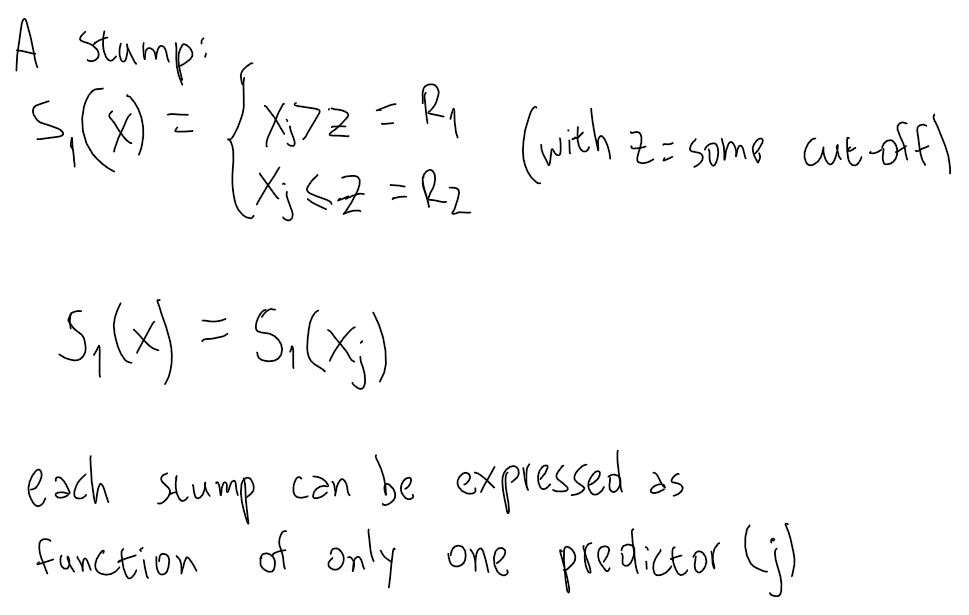
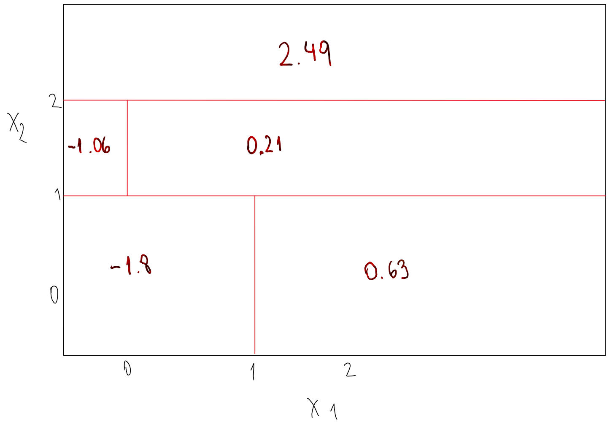

```{r setup, warning=FALSE}
knitr::opts_chunk$set(warning = FALSE, message = FALSE)
library(tidyverse)
library(MASS) # for Boston dataset
library(ISLR) # for Carseats dataset
library(randomForest)
library(modelr)
library(tree)
library(caret)
library(gbm)
library(glmnet)
library(here)
library(lubridate)
```


## Conceptual

(1) Draw an example (of your own invention) of a partition of two dimensional feature space that could result from recursive binary splitting. Your example should contain at least six regions. Draw a decision tree corresponding to this partition. Be sure to label all aspects of your figures, including the regions $R_1, R_2, ...$,the cutpoints $t_1,t_2, ...$, and so forth.


 

(2) It is mentioned in Section 8.2.3 that boosting using depth-one trees (or stumps) leads to an additive model: that is, a model of the form


Explain why this is the case. You can begin with (8.12) in Algorithm 8.2.

A: The key to understand why a boosting based on stumps can be expressed as an additive model is that in the original formula of boosting:


Each tree is a function of the whole vector of predictors ($X$) but in this case, each tree (stump) is a function of just one predictor:

 

So, we can classify all the $B$ stumps that are added in the original boosting formula into "sets" or "groups" based on the predictor which each of them uses:

 

And then we can "summarise" each of these groups as functions that are defined as summations of the stumps based on the same predictor. For each case, the resulting function also depends only on the single predictor.

 

After rewriting all the stumps as these functions, we can add them up to get the formula presented at the beginning of the exercise.

(3) Consider the Gini index, classification error, and cross-entropy in a simple classification setting with two classes. Create a single plot that displays each of these quantities as a function of $\hat{p}_{m1}$.The x-axis should display $\hat{p}_{m1}$, ranging from 0 to 1, and the y-axis should display the value of the Gini index, classification error, and entropy.

Hint: In a setting with two classes, $\hat{p}_{m1} = 1− \hat{p}_{m2}$

```{r}
gini_twoclasses <- function(x, y) {
  x*(1-x) + y*(1-y)
}

xentropy_twoclasses <- function(x, y) {
 -(x*log(x) + y*log(y))
}

c_error_two_classes <- function(x, y) {
  1 - max(x, y)
}


simulated_data <- 
  tibble(
    pm1 = seq(from = 0, to = 1, length.out = 1000),
    pm2 = 1 - pm1,
    gini = gini_twoclasses(pm1, pm2),
    xentropy = xentropy_twoclasses(pm1, pm2),
    clasif_error = map2_dbl(pm1, pm2, c_error_two_classes)
  )

simulated_data %>% 
  pivot_longer(
    cols = c(gini, xentropy, clasif_error),
    names_to = "metric",
    values_to = "value"
  ) %>% 
  ggplot(aes(pm1, value, color = metric)) +
  geom_line() +
  labs(x = "prop. of obs. in class 1")
```

(4) This question relates to the plots in Figure 8.12. 

(a) Sketch the tree corresponding to the partition of the predictor space illustrated in the left-hand panel of Figure 8.12. The numbers inside the boxes indicate the mean of Y within each region.


(b) Create a diagram similar to the left-hand panel of Figure 8.12, using the tree illustrated in the right-hand panel of the same figure. You should divide up the predictor space into the correct regions, and indicate the mean for each region.



(5) Suppose we produce ten bootstrapped samples from a data set containing red and green classes. We then apply a classification tree to each bootstrapped sample and, for a specific value of X, produce 10 estimates of P(Class is Red|X):

0.1, 0.15, 0.2, 0.2, 0.55, 0.6, 0.6, 0.65, 0.7, and 0.75.

There are two common ways to combine these results together into a single class prediction. One is the majority vote approach discussed in this chapter. The second approach is to classify based on the average probability. In this example, what is the final classification under each of these two approaches?

A: assuming a threshold in 0.5, using the majority vote the final classification would be "Red", but using the average probability the final classification would be "Green" (average probability is 0.45).

(6) Provide a detailed explanation of the algorithm that is used to fit a regression tree.

A: Let's consider $P$ predictors and a response variable Y. 

The algorithm sets the RSS formula as objective function and checks all the combinations of $p$ and $s$, where $p$ is an individual predictor, and $s$ a specific value in the domain of that predictor. 

Then chooses the combination for which, after doing a split on $s$ based on the predictor $p$, the RSS is reduced the most.

The process is repeated until a stopping criterion is achieved.

## Applied

(7) In the lab, we applied random forests to the `Boston` data using `mtry=6` and using `ntree=25` and `ntree=500`. Create a plot displaying the test error resulting from random forests on this data set for a more comprehensive range of values for `mtry` and `ntree` You can model your plot after Figure 8.10. Describe the results obtained.

Split into training and validation:
```{r}
set.seed(1989)

boston_train <- Boston %>% 
  as_tibble() %>% 
  sample_frac(0.5)

boston_test <- Boston %>% 
  as_tibble() %>% 
  anti_join(boston_train)
```

Train random forests using different values for `mtry` and `ntree`
```{r}
rf_with_params <- 
  crossing(
    m = c(2, 4, 6, 8, 10, 13),
    ntrees = seq(from = 1, to = 500, by = 3)
  )
```

Function to train RF on training data and obtain MSE in test data
```{r}
get_mse_rf_boston <- function(m, ntrees) {
  rf_trained <- randomForest(medv ~ ., data = boston_train,
                                  mtry = m, ntree = ntrees, importance = TRUE)
  
boston_test_pred <- boston_test %>% 
  add_predictions(rf_trained, var = "pred")

  mean((boston_test_pred$pred - boston_test$medv)^2)
  
}
```

Get test and plot
```{r, cache = TRUE}
rf_with_params <- rf_with_params %>% 
  mutate(test_mse = map2_dbl(m, ntrees, get_mse_rf_boston))
```


```{r, fig.asp=2}
rf_with_params %>%
#   group_by(m) %>% 
#   arrange(ntrees) %>% 
#   mutate(test_mse)
ggplot(aes(ntrees, test_mse, color = factor(m))) +
  geom_line(size = 0.2) +
  geom_smooth(se = FALSE, size = 1.7) +
  labs(x = "Number of trees",
       y = "Test MSE",
       color = "m (from p = 13)")
```

We see that `mtry=6` leads to lower Test MSE in most of the cases. Also, the Test MSE seems to "estabilize" after 150 trees (that is, we don't see substantial gains from increeasing the number of trees above that value).

(8) In the lab, a classification tree was applied to the `Carseats` data set after converting `Sales` into a qualitative response variable. Now we will seek to predict `Sales` using regression trees and related approaches, treating the response as a quantitative variable.

(a) Split the data set into a training set and a test set.

```{r}
set.seed(1989)

carseats_train <- ISLR::Carseats %>% 
  as_tibble() %>% 
  sample_frac(size = 0.5)

carseats_test <- ISLR::Carseats %>% 
  as_tibble() %>% 
  anti_join(carseats_train)
```

(b) Fit a regression tree to the training set. Plot the tree, and interpret the results. What test MSE do you obtain?

```{r, fig.asp=2, fig.width=13}
tree_carseats <- tree(Sales ~ . , data = carseats_train)

plot(tree_carseats)
text(tree_carseats, pretty = 0, srt=25)
```

Once again, the most important variable (top split) seems to be "Shelve Location". Then in both branches we see `Price` and `CompPrice` as important splitting variables: lower prices are asociated to more sales, as expected, but also lower prices of competitors imply lower sales of our own product.

Computing the Test MSE:
```{r}
carseats_test %>% 
  mutate(pred_sales = predict(tree_carseats, newdata = .),
         sq_error = (pred_sales - Sales)^2) %>% 
  summarise(test_mse = mean(sq_error))
```

(c) Use cross-validation in order to determine the optimal level of tree complexity. Does pruning the tree improve the test MSE?

```{r}
cv_carseats <- cv.tree(tree_carseats)

qplot(cv_carseats$size, cv_carseats$dev, geom = "line") +
  geom_vline(xintercept = cv_carseats$size[which.min(cv_carseats$dev)],
             color = "red")
```

The CV error decreases until as we add up to 12 nodes, then it barely changes. Therefore, we would not see significant gains in test MSE by pruning the tree, but we could reduce the complexity of the model without having to "pay a price" in terms of higher test MSE. I would prune the tree to leave it with 12 nodes.


(d) Use the bagging approach in order to analyze this data. What test MSE do you obtain? Use the `importance()` function to determine which variables are most important.

```{r}
bag_carseats <- randomForest(Sales ~ ., data = carseats_train,
                             mtry = 10, importance = TRUE)

carseats_test %>% 
  mutate(pred_sales = predict(bag_carseats, newdata = .),
         sq_error = (pred_sales - Sales)^2) %>% 
  summarise(mean(sq_error))
```

```{r}
importance(bag_carseats) %>% 
  as_tibble(rownames = "variable") %>% 
  arrange(desc(IncNodePurity))
```

(e) Use random forests to analyze this data. What test MSE do you obtain? Use the `importance()` function to determine which variables are most important. Describe the effect of $m$,the number of variables considered at each split, on the error rate obtained.

```{r}
get_mse_rf_carseats <- function(rf) {
  sales_pred <- 
    predict(rf, newdata = carseats_test)
  
  mean((sales_pred - carseats_test$Sales)^2)
}

rfs_carseats <- 
  tibble(
    m = seq(from = 1, to = 10, by = 1),
    rfs = map(m, ~randomForest(Sales ~ ., data = carseats_train,
                               mtry = .x, importance = TRUE)),
    mse = map_dbl(rfs, get_mse_rf_carseats)
  )

ggplot(rfs_carseats,
       aes(factor(m), mse, group = 1)) +
  geom_line() +
  geom_vline(xintercept = rfs_carseats$m[which.min(rfs_carseats$mse)],
             color = "red")

```

```{r}
rfs_carseats %>% 
  filter(m == 10) %>% 
  pull(rfs) %>% 
  magrittr::extract2(1) %>% 
  importance() %>% 
  as_tibble(rownames = "variable") %>% 
  arrange(desc(IncNodePurity))
```

When evaluating the Test MSE for different values of `mtry` we get that the lower Test MSE is achieved by using all the predictors at each split ($m = p$), which is equivalent to using bagging.

(9) This problem involves the `OJ` data set which is part of the `ISLR` package.

(a) Create a training set containing a random sample of 800 observations, and a test set containing the remaining observations.

```{r}
oj_train <- ISLR::OJ %>% 
  as_tibble() %>% 
  sample_n(size = 800)

oj_test <- ISLR::OJ %>% 
  as_tibble() %>% 
  anti_join(oj_train)
```

(b) Fit a tree to the training data, with `Purchase` as the response and the other variables as predictors. Use the `summary()` function to produce summary statistics about the tree, and describe the results obtained. What is the training error rate? How many terminal nodes does the tree have?

```{r}
oj_tree <- tree(Purchase ~ ., data = oj_train)

summary(oj_tree)
```

The tree has 8 terminal nodes.
The training error rate is 15.5%

(c) Type in the name of the tree object in order to get a detailed text output. Pick one of the terminal nodes, and interpret the information displayed.

```{r}
oj_tree
```

I'm picking Node 21. In this Node the prediction is Citrus Hill Orange Juice (although the purity of the node is relatively low, because the majority class only represents 53% of the observations in the node). In this node the customers have brand loyalty for Citrus Hill above 0.16, but below 0.508. Also, for the cases in this node the price difference of Minute Maid juice minus Citrus Hill is below 0.05.

(d) Create a plot of the tree, and interpret the results.

```{r, fig.asp=1.3, fig.width=10}
plot(oj_tree)
text(oj_tree, pretty = 0, srt=25)
```

The top split is based on the customer loyalty for the Citrus Hill brand. 
If it's more than 0.508, we go to the right branch, were 2/3 of the terminal nodes predict buying Citrus Hill. If it's less than that, we go to the left branch, which has only 2/5 terminal nodes predicting the purchase of Citrus Hill. 
Then we have more splits based on loyalty for Citrus Hill. Notice that for extreme values of `LoyalCH` (below 0.16, and above 0.73) the final prediction is based purely on this variable). For values in between, the tree considers other variables such as `PriceDiff`, `SpecialCH` and `WeekofPurchase`. 

(e) Predict the response on the test data, and produce a confusion matrix comparing the test labels to the predicted test labels. What is the test error rate?

```{r}
oj_test <- oj_test %>% 
  mutate(pred_purchase = predict(oj_tree, newdata = ., type = "class"))

caret::confusionMatrix(
  data = oj_test$pred_purchase,
  reference = oj_test$Purchase
)
```

The test error rate is `1 - Accuracy = 0.2748`.

(f) Apply the `cv.tree()` function to the training set in order to determine the optimal tree size.

```{r}
cv_oj <- cv.tree(oj_tree)

cv_oj
```

(g) Produce a plot with tree size on the x-axis and cross-validated classification error rate on the y-axis.

```{r}
qplot(cv_oj$size, cv_oj$dev, geom = "line") +
  geom_vline(xintercept = cv_oj$size[which.min(cv_oj$dev)],
             color = "red")
```

(h) Which tree size corresponds to the lowest cross-validated classification error rate?

The tree with 7 terminal nodes.

(i) Produce a pruned tree corresponding to the optimal tree size obtained using cross-validation. If cross-validation does not lead to selection of a pruned tree, then create a pruned tree with five terminal nodes.

```{r}
oj_pruned <- prune.tree(oj_tree, best = 7)
```

(j) Compare the training error rates between the pruned and unpruned trees. Which is higher?

```{r}
summary(oj_pruned)
```

The pruned tree has a slightly higher training error,

(k) Compare the test error rates between the pruned and unpruned trees. Which is higher?
```{r}
oj_test <- oj_test %>% 
  mutate(pred_purchase_pruned = predict(oj_pruned, newdata = ., type = "class"))

caret::confusionMatrix(
  data = oj_test$pred_purchase_pruned,
  reference = oj_test$Purchase
)
```

The test error rate of the unpruned tree is higher (0.2748 > 0.2672).

(10) We now use boosting to predict `Salary` in the `Hitters` data set. 

(a) Remove the observations for whom the salary information is unknown, and then log-transform the salaries.

```{r}
hitters <- Hitters %>% 
  as_tibble() %>% 
  filter(!is.na(Salary)) %>% 
  mutate(Salary = log(Salary))
```

(b) Create a training set consisting of the first 200 observations, and a test set consisting of the remaining observations.

```{r}
hitters_train <- hitters %>% 
  sample_n(size = 200)

hitters_test <- hitters %>% 
  anti_join(hitters_train)
```

(c) Perform boosting on the training set with 1000 trees for a range of values of the shrinkage parameter λ. Produce a plot with different shrinkage values on the x-axis and the corresponding training set MSE on the y-axis.

```{r}
boostings_hitters <- 
  tibble(
    lambda = c(0.001, 0.002, 0.005, 0.01, 0.02, 0.05, 0.08, 0.1, 0.2, 0.3, 0.4, 0.5, 0.8),
    gb = map(lambda, ~gbm(Salary ~ .,
                          data = hitters_train,
                          distribution = "gaussian", 
                          shrinkage = .x,
                          n.trees = 1000,
                          interaction.depth = 4))
    )

train_mse_boosting_hitters <- function(gb) {
  
  pred_salary <- predict(gb, newdata = hitters_train, n.trees = 1000)
  
  mean((pred_salary - hitters_train$Salary)^2)
  
}

boostings_hitters %>% 
  mutate(mse = map_dbl(gb, train_mse_boosting_hitters)) %>% 
  ggplot(aes(factor(lambda), mse, group = 1)) +
  geom_line()

```


(d) Produce a plot with different shrinkage values on the x-axis and the corresponding test set MSE on the y-axis.

```{r}
test_mse_boosting_hitters <- function(gb) {
  
  pred_salary <- predict(gb, newdata = hitters_test, n.trees = 1000)
  
  mean((pred_salary - hitters_test$Salary)^2)
  
}

boostings_hitters %>% 
  mutate(mse = map_dbl(gb, test_mse_boosting_hitters)) %>% 
  ggplot(aes(factor(lambda), mse, group = 1)) +
  geom_line()
```

(e) Compare the test MSE of boosting to the test MSE that results from applying two of the regression approaches seen in Chapters 3 and 6.

Test MSE on `Hitters` when using the optimal value for lambda:
```{r}
boostings_hitters <- boostings_hitters %>% 
  mutate(mse = map_dbl(gb, test_mse_boosting_hitters))

boostings_hitters %>% 
  summarise(min(mse))
```

Test MSE using multiple linear regression:
```{r}
lm_hitters <- 
  lm(Salary ~ ., data = hitters_train)

hitters_test %>% 
  add_predictions(lm_hitters, var = "pred_salary") %>% 
  mutate(sq_error = (pred_salary - Salary)^2) %>% 
  summarise(mean(sq_error))
```

Test MSE using Lasso with optimal parameters:

```{r}
cv_lasso_hitters <-
  cv.glmnet(
    x = model.matrix(Salary ~ ., data = hitters_train),
    y = as.matrix(dplyr::select(hitters_train, Salary)),
    alpha = 1,
    nfolds = 100,
    lambda = c(10^seq(10, -10, length = 300), 0)
  )

lasso_hitters <-
  glmnet(
    x = model.matrix(Salary ~ ., data = hitters_train),
    y = as.matrix(dplyr::select(hitters_train, Salary)),
    alpha = 1,
    lambda = cv_lasso_hitters[["lambda.min"]]
  ) 

pred_hitters_test_lasso <-
  predict(lasso_hitters, newx = model.matrix(Salary ~ ., data = hitters_test))
  
mean((pred_hitters_test_lasso - hitters_test[["Salary"]])^2)
```

Boosting has the lower Test MSE. Then comes linear regression, and then Lasso regression.

(f) Which variables appear to be the most important predictors in the boosted model?

```{r}
boostings_hitters %>% 
  filter(mse == min(mse)) %>% 
  pull(gb) %>% 
  magrittr::extract2(1) %>% 
  summary()
```

`CRuns`, `CHits` and `CAtBat` are the most important variables in the boosted model.

(g) Now apply bagging to the training set. What is the test set MSE
for this approach?

```{r}
bag_hitters <- 
  randomForest(Salary ~ ., data = hitters_train,
               ntrees = 500, mtry = 19)
```

```{r}
hitters_test %>% 
  mutate(pred_salary = predict(bag_hitters, newdata = .),
         se = (pred_salary - Salary)^2) %>% 
  summarise(mean(se))
```

Curiously, the bagging test MSE is lower than the boosting test MSE.

(11) This question uses the `Caravan` data set

(a) Create a training set consisting of the first 1,000 observations, and a test set consisting of the remaining observations.

```{r}
caravan <- Caravan %>%
  as_tibble() %>%
  mutate(Purchase = case_when(Purchase == "Yes" ~ 1,
                              TRUE ~ 0))

caravan_train <- 
  caravan %>% 
  sample_n(1000)

caravan_test <- 
  caravan %>% 
  anti_join(caravan_train)
```

(b) Fit a boosting model to the training set with Purchase as the response and the other variables as predictors. Use 1,000 trees, and a shrinkage value of 0.01. Which predictors appear to be the most important?

```{r}
boosting_caravan <-
  gbm(
    Purchase ~ .,
    data = caravan_train,
    distribution = "bernoulli",
    shrinkage = 0.01,
    n.trees = 1000,
    interaction.depth = 4
  )

summary(boosting_caravan)
```

`MOPLHOOG` seems to be the most important predictor.

(c) Use the boosting model to predict the response on the test data. Predict that a person will make a purchase if the estimated probability of purchase is greater than 20 %. 
Form a confusion matrix. What fraction of the people predicted to make a purchase do in fact make one? 
How does this compare with the results obtained from applying KNN or logistic regression to this data set?

```{r}
caravan_test <- caravan_test %>% 
  mutate(pred_prob_purchase = predict(boosting_caravan, 
                                      newdata = .,
                                      n.trees = 1000,
                                      type = "response"),
         pred_purchase = ifelse(pred_prob_purchase > 0.2,
                                yes = 1,
                                no = 0))


caret::confusionMatrix(
    data = factor(caravan_test$pred_purchase),
    reference = factor(caravan_test$Purchase)
  )
```

The 10.3% of people for which we predict a purchase makes one in reality.

It does worse than KNN, which was used on this same dataset in the Laboratory of Chapter 4, and obtained a precision of 11.6% with k=1, and 26.6% with k=5. Also it performs worse than logistic regression, which obtained a precision of 33% with a cutoff on 0.25.

(12) Apply boosting, bagging, and random forests to a data set of your choice. 
Be sure to fit the models on a training set and to evaluate their performance on a test set. 
How accurate are the results compared to simple methods like linear or logistic regression? Which of these approaches yields the best performance?


I'm going to use this dataset from Kaggle: https://www.kaggle.com/joniarroba/noshowappointments 
```{r}
missed_appointments_health <-
  read_csv(here::here("data", "missed_appointments_health.csv"),
           col_types = 
             cols(AppointmentDay = col_character(), 
                  AppointmentID = col_character(), 
                  PatientId = col_character(),
                  ScheduledDay = col_character()))
```

Pre-processing and wrangling:
```{r}
(
missed_appointments_health <- missed_appointments_health %>%
  rename(NoShow = `No-show`) %>% 
  mutate(
    Gender = ifelse(Gender == "F", 1, 0),
    NoShow = ifelse(NoShow == "Yes", 1, 0),
    ScheduledDay = ymd_hms(ScheduledDay),
    AppointmentDay = as_date(ymd_hms(AppointmentDay)),
    dif_sched_appoint =
      as.duration(AppointmentDay - as_date(ScheduledDay)) / ddays(1)
  )
)
```

Splitting into training and set:
```{r}
m_appoints_training <- 
  missed_appointments_health %>% 
  sample_frac(0.5)

m_appoints_test <- 
  missed_appointments_health %>% 
  anti_join(m_appoints_training)
```

Now using a Decision Tree:
```{r}
m_appoints_formula <- 
  as.formula("NoShow ~ Gender + Age + Scholarship + Hipertension + Diabetes + Alcoholism + Handcap + SMS_received + dif_sched_appoint")

tree_m_appoint <-
  tree(m_appoints_formula,
       data = m_appoints_training)

summary(tree_m_appoint)
```

```{r}
tree_m_appoint
```

The tree basically predicts that the pacient is going to show up for all the cases, but assigns a higher probability of not showing up when the appointment was scheduled with more than 1 day of anticipation.

Bagging:
```{r}
bag_m_appoint <- 
  randomForest(m_appoints_formula,
               data = m_appoints_training,
               mtry = 9,
               ntrees = 100)
```


```{r}
importance(bag_m_appoint)
```

Obtain Classification error and Precision:
```{r}
m_appoints_test <-
  m_appoints_test %>% 
  mutate(pred_bag_prob = predict(bag_m_appoint, newdata = .),
         pred_bag = ifelse(pred_bag_prob > 0.5, 1, 0))

caret::confusionMatrix(
    data = factor(m_appoints_test$pred_bag),
    reference = factor(m_appoints_test$NoShow)
  )
```

The Classification Error is 23.2% and the Precision is 36%. 

Now using Random Forest:
```{r}
# We need to convert the response variable to factor
m_appoints_training$NoShow <- m_appoints_training$NoShow %>% 
  as.character() %>% 
  as.factor()

rf_m_appoint <- 
  randomForest(m_appoints_formula,
               data = m_appoints_training,
               ntrees = 100)
```


```{r}
importance(rf_m_appoint)
```

Obtain Classification error and Precision:
```{r}
m_appoints_test <-
  m_appoints_test %>% 
  mutate(pred_rf = predict(rf_m_appoint, newdata = .))

caret::confusionMatrix(
    data = m_appoints_test$pred_rf,
    reference = factor(m_appoints_test$NoShow)
  )
```

With Random Forest, the classification error went down to 20.33%, and the precision rate went up to 56.3%. However, now there are much more "false negatives": cases where the model predicts a negative value for `NoShow`, but the person has a positive value (i.e. doesn't show up to their appointment).

Bagging:
```{r}
# Pre-processing 
m_appoints_training <- m_appoints_training %>% 
  mutate(NoShow = as.numeric(as.character(NoShow)))

boosting_m_appoints <-
  gbm(
    m_appoints_formula,
    data = m_appoints_training,
    distribution = "bernoulli",
    shrinkage = 0.01,
    n.trees = 500,
    interaction.depth = 4
  )
```

```{r}
summary(boosting_m_appoints)
```

```{r}
m_appoints_test <- 
  m_appoints_test %>%
  mutate(
    pred_boost_prob = predict(
      boosting_m_appoints,
      newdata = .,
      n.trees = 500,
      type = "response"
    ),
    pred_boost = ifelse(pred_boost_prob > 0.5, 1, 0)
  )

caret::confusionMatrix(
  data = factor(m_appoints_test$pred_boost),
  reference = factor(m_appoints_test$NoShow)
)
```

The results are no better than when we used Random Forests.

Now let's see how is the performance of logistic regression:
```{r}
log_reg_appoints <-
  glm(m_appoints_formula,
      data = m_appoints_training,
      family = "binomial") 

m_appoints_test <- m_appoints_test %>% 
  add_predictions(log_reg_appoints, 
                  var = "pred_log_reg_prob", 
                  type = "response") %>% 
  mutate(pred_log_reg = ifelse(pred_log_reg_prob > 0.5, 1, 0))

caret::confusionMatrix(
  data = factor(m_appoints_test$pred_log_reg),
  reference = factor(m_appoints_test$NoShow)
)
```

The Classification Error using logistic regression is pretty good (compared to the other methods used). The precision rate 31% (also good) and the recall is better than in Random Forests and Boosting.

Overall, Bagging seems to be the model which has the best results on test data, and logistic regression is the runner up. 