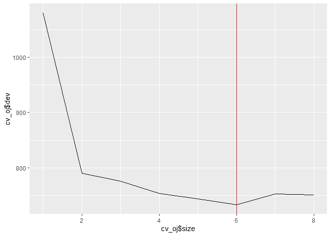

8.4 Exercises
================

``` r
knitr::opts_chunk$set(warning = FALSE, message = FALSE)
library(tidyverse)
```

    ## -- Attaching packages ----------------------- tidyverse 1.2.1 --

    ## v ggplot2 3.2.1     v purrr   0.3.3
    ## v tibble  2.1.3     v dplyr   0.8.3
    ## v tidyr   1.0.0     v stringr 1.4.0
    ## v readr   1.3.1     v forcats 0.4.0

    ## -- Conflicts -------------------------- tidyverse_conflicts() --
    ## x dplyr::filter() masks stats::filter()
    ## x dplyr::lag()    masks stats::lag()

``` r
library(MASS) # for Boston dataset
```

    ## 
    ## Attaching package: 'MASS'

    ## The following object is masked from 'package:dplyr':
    ## 
    ##     select

``` r
library(ISLR) # for Carseats dataset
library(randomForest)
```

    ## randomForest 4.6-14

    ## Type rfNews() to see new features/changes/bug fixes.

    ## 
    ## Attaching package: 'randomForest'

    ## The following object is masked from 'package:dplyr':
    ## 
    ##     combine

    ## The following object is masked from 'package:ggplot2':
    ## 
    ##     margin

``` r
library(modelr)
library(tree)
```

    ## Registered S3 method overwritten by 'tree':
    ##   method     from
    ##   print.tree cli

``` r
library(caret)
```

    ## Loading required package: lattice

    ## 
    ## Attaching package: 'caret'

    ## The following object is masked from 'package:purrr':
    ## 
    ##     lift

``` r
library(gbm)
```

    ## Loaded gbm 2.1.5

``` r
library(glmnet)
```

    ## Loading required package: Matrix

    ## 
    ## Attaching package: 'Matrix'

    ## The following objects are masked from 'package:tidyr':
    ## 
    ##     expand, pack, unpack

    ## Loading required package: foreach

    ## 
    ## Attaching package: 'foreach'

    ## The following objects are masked from 'package:purrr':
    ## 
    ##     accumulate, when

    ## Loaded glmnet 2.0-18

``` r
library(here)
```

    ## here() starts at C:/Users/franc/repos_github/islr-exercises

``` r
library(lubridate)
```

    ## 
    ## Attaching package: 'lubridate'

    ## The following object is masked from 'package:here':
    ## 
    ##     here

    ## The following object is masked from 'package:base':
    ## 
    ##     date

## Conceptual

(1) Draw an example (of your own invention) of a partition of two
dimensional feature space that could result from recursive binary
splitting. Your example should contain at least six regions. Draw a
decision tree corresponding to this partition. Be sure to label all
aspects of your figures, including the regions \(R_1, R_2, ...\),the
cutpoints \(t_1,t_2, ...\), and so forth.


(2) It is mentioned in Section 8.2.3 that boosting using depth-one trees
(or stumps) leads to an additive model: that is, a model of the form


Explain why this is the case. You can begin with (8.12) in Algorithm
8.2.

A: The key to understand why a boosting based on stumps can be expressed
as an additive model is that in the original formula of boosting:


Each tree is a function of the whole vector of predictors (\(X\)) but in
this case, each tree (stump) is a function of just one predictor:


So, we can classify all the \(B\) stumps that are added in the original
boosting formula into “sets” or “groups” based on the predictor which
each of them uses:


And then we can “summarise” each of these groups as functions that are
defined as summations of the stumps based on the same predictor. For
each case, the resulting function also depends only on the single
predictor.


After rewriting all the stumps as these functions, we can add them up to
get the formula presented at the beginning of the exercise.

(3) Consider the Gini index, classification error, and cross-entropy in
a simple classification setting with two classes. Create a single plot
that displays each of these quantities as a function of
\(\hat{p}_{m1}\).The x-axis should display \(\hat{p}_{m1}\), ranging
from 0 to 1, and the y-axis should display the value of the Gini index,
classification error, and entropy.

Hint: In a setting with two classes, \(\hat{p}_{m1} = 1− \hat{p}_{m2}\)

``` r
gini_twoclasses <- function(x, y) {
  x*(1-x) + y*(1-y)
}

xentropy_twoclasses <- function(x, y) {
 -(x*log(x) + y*log(y))
}

c_error_two_classes <- function(x, y) {
  1 - max(x, y)
}


simulated_data <- 
  tibble(
    pm1 = seq(from = 0, to = 1, length.out = 1000),
    pm2 = 1 - pm1,
    gini = gini_twoclasses(pm1, pm2),
    xentropy = xentropy_twoclasses(pm1, pm2),
    clasif_error = map2_dbl(pm1, pm2, c_error_two_classes)
  )

simulated_data %>% 
  pivot_longer(
    cols = c(gini, xentropy, clasif_error),
    names_to = "metric",
    values_to = "value"
  ) %>% 
  ggplot(aes(pm1, value, color = metric)) +
  geom_line() +
  labs(x = "prop. of obs. in class 1")
```

<!-- -->

(4) This question relates to the plots in Figure 8.12.

(a) Sketch the tree corresponding to the partition of the predictor
space illustrated in the left-hand panel of Figure 8.12. The numbers
inside the boxes indicate the mean of Y within each region.


(b) Create a diagram similar to the left-hand panel of Figure 8.12,
using the tree illustrated in the right-hand panel of the same figure.
You should divide up the predictor space into the correct regions, and
indicate the mean for each region.


(5) Suppose we produce ten bootstrapped samples from a data set
containing red and green classes. We then apply a classification tree to
each bootstrapped sample and, for a specific value of X, produce 10
estimates of P(Class is Red|X):

0.1, 0.15, 0.2, 0.2, 0.55, 0.6, 0.6, 0.65, 0.7, and 0.75.

There are two common ways to combine these results together into a
single class prediction. One is the majority vote approach discussed in
this chapter. The second approach is to classify based on the average
probability. In this example, what is the final classification under
each of these two approaches?

A: assuming a threshold in 0.5, using the majority vote the final
classification would be “Red”, but using the average probability the
final classification would be “Green” (average probability is 0.45).

(6) Provide a detailed explanation of the algorithm that is used to fit
a regression tree.

A: Let’s consider \(P\) predictors and a response variable Y.

The algorithm sets the RSS formula as objective function and checks all
the combinations of \(p\) and \(s\), where \(p\) is an individual
predictor, and \(s\) a specific value in the domain of that predictor.

Then chooses the combination for which, after doing a split on \(s\)
based on the predictor \(p\), the RSS is reduced the most.

The process is repeated until a stopping criterion is achieved.

## Applied

(7) In the lab, we applied random forests to the `Boston` data using
`mtry=6` and using `ntree=25` and `ntree=500`. Create a plot displaying
the test error resulting from random forests on this data set for a more
comprehensive range of values for `mtry` and `ntree` You can model your
plot after Figure 8.10. Describe the results obtained.

Split into training and validation:

``` r
set.seed(1989)

boston_train <- Boston %>% 
  as_tibble() %>% 
  sample_frac(0.5)

boston_test <- Boston %>% 
  as_tibble() %>% 
  anti_join(boston_train)
```

Train random forests using different values for `mtry` and `ntree`

``` r
rf_with_params <- 
  crossing(
    m = c(2, 4, 6, 8, 10, 13),
    ntrees = seq(from = 1, to = 500, by = 3)
  )
```

Function to train RF on training data and obtain MSE in test data

``` r
get_mse_rf_boston <- function(m, ntrees) {
  rf_trained <- randomForest(medv ~ ., data = boston_train,
                                  mtry = m, ntree = ntrees, importance = TRUE)
  
boston_test_pred <- boston_test %>% 
  add_predictions(rf_trained, var = "pred")

  mean((boston_test_pred$pred - boston_test$medv)^2)
  
}
```

Get test and plot

``` r
rf_with_params <- rf_with_params %>% 
  mutate(test_mse = map2_dbl(m, ntrees, get_mse_rf_boston))
```

``` r
rf_with_params %>%
#   group_by(m) %>% 
#   arrange(ntrees) %>% 
#   mutate(test_mse)
ggplot(aes(ntrees, test_mse, color = factor(m))) +
  geom_line(size = 0.2) +
  geom_smooth(se = FALSE, size = 1.7) +
  labs(x = "Number of trees",
       y = "Test MSE",
       color = "m (from p = 13)")
```

<!-- -->

We see that `mtry=6` leads to lower Test MSE in most of the cases. Also,
the Test MSE seems to “estabilize” after 150 trees (that is, we don’t
see substantial gains from increeasing the number of trees above that
value).

(8) In the lab, a classification tree was applied to the `Carseats` data
set after converting `Sales` into a qualitative response variable. Now
we will seek to predict `Sales` using regression trees and related
approaches, treating the response as a quantitative variable.

(a) Split the data set into a training set and a test set.

``` r
set.seed(1989)

carseats_train <- ISLR::Carseats %>% 
  as_tibble() %>% 
  sample_frac(size = 0.5)

carseats_test <- ISLR::Carseats %>% 
  as_tibble() %>% 
  anti_join(carseats_train)
```

(b) Fit a regression tree to the training set. Plot the tree, and
interpret the results. What test MSE do you obtain?

``` r
tree_carseats <- tree(Sales ~ . , data = carseats_train)

plot(tree_carseats)
text(tree_carseats, pretty = 0, srt=25)
```

<!-- -->

Once again, the most important variable (top split) seems to be “Shelve
Location”. Then in both branches we see `Price` and `CompPrice` as
important splitting variables: lower prices are asociated to more sales,
as expected, but also lower prices of competitors imply lower sales of
our own product.

Computing the Test MSE:

``` r
carseats_test %>% 
  mutate(pred_sales = predict(tree_carseats, newdata = .),
         sq_error = (pred_sales - Sales)^2) %>% 
  summarise(test_mse = mean(sq_error))
```

    ## # A tibble: 1 x 1
    ##   test_mse
    ##      <dbl>
    ## 1     5.82

(c) Use cross-validation in order to determine the optimal level of tree
complexity. Does pruning the tree improve the test MSE?

``` r
cv_carseats <- cv.tree(tree_carseats)

qplot(cv_carseats$size, cv_carseats$dev, geom = "line") +
  geom_vline(xintercept = cv_carseats$size[which.min(cv_carseats$dev)],
             color = "red")
```

<!-- -->

The CV error decreases until as we add up to 12 nodes, then it barely
changes. Therefore, we would not see significant gains in test MSE by
pruning the tree, but we could reduce the complexity of the model
without having to “pay a price” in terms of higher test MSE. I would
prune the tree to leave it with 12 nodes.

(d) Use the bagging approach in order to analyze this data. What test
MSE do you obtain? Use the `importance()` function to determine which
variables are most important.

``` r
bag_carseats <- randomForest(Sales ~ ., data = carseats_train,
                             mtry = 10, importance = TRUE)

carseats_test %>% 
  mutate(pred_sales = predict(bag_carseats, newdata = .),
         sq_error = (pred_sales - Sales)^2) %>% 
  summarise(mean(sq_error))
```

    ## # A tibble: 1 x 1
    ##   `mean(sq_error)`
    ##              <dbl>
    ## 1             3.25

``` r
importance(bag_carseats) %>% 
  as_tibble(rownames = "variable") %>% 
  arrange(desc(IncNodePurity))
```

    ## # A tibble: 10 x 3
    ##    variable    `%IncMSE` IncNodePurity
    ##    <chr>           <dbl>         <dbl>
    ##  1 ShelveLoc      56.9          483.  
    ##  2 Price          47.4          309.  
    ##  3 CompPrice      31.5          220.  
    ##  4 Advertising    20.7          143.  
    ##  5 Age            14.7          110.  
    ##  6 Income         10.8           92.6 
    ##  7 Population     -0.592         63.5 
    ##  8 Education       4.97          50.1 
    ##  9 US              0.813          9.90
    ## 10 Urban          -2.02           5.77

(e) Use random forests to analyze this data. What test MSE do you
obtain? Use the `importance()` function to determine which variables are
most important. Describe the effect of \(m\),the number of variables
considered at each split, on the error rate obtained.

``` r
get_mse_rf_carseats <- function(rf) {
  sales_pred <- 
    predict(rf, newdata = carseats_test)
  
  mean((sales_pred - carseats_test$Sales)^2)
}

rfs_carseats <- 
  tibble(
    m = seq(from = 1, to = 10, by = 1),
    rfs = map(m, ~randomForest(Sales ~ ., data = carseats_train,
                               mtry = .x, importance = TRUE)),
    mse = map_dbl(rfs, get_mse_rf_carseats)
  )

ggplot(rfs_carseats,
       aes(factor(m), mse, group = 1)) +
  geom_line() +
  geom_vline(xintercept = rfs_carseats$m[which.min(rfs_carseats$mse)],
             color = "red")
```

<!-- -->

``` r
rfs_carseats %>% 
  filter(m == 10) %>% 
  pull(rfs) %>% 
  magrittr::extract2(1) %>% 
  importance() %>% 
  as_tibble(rownames = "variable") %>% 
  arrange(desc(IncNodePurity))
```

    ## # A tibble: 10 x 3
    ##    variable    `%IncMSE` IncNodePurity
    ##    <chr>           <dbl>         <dbl>
    ##  1 ShelveLoc      57.1          474.  
    ##  2 Price          46.4          306.  
    ##  3 CompPrice      31.6          221.  
    ##  4 Advertising    19.7          143.  
    ##  5 Age            14.0          111.  
    ##  6 Income          9.41          92.3 
    ##  7 Population     -0.133         58.8 
    ##  8 Education       6.55          52.8 
    ##  9 US              1.06           9.13
    ## 10 Urban          -0.724          6.85

When evaluating the Test MSE for different values of `mtry` we get that
the lower Test MSE is achieved by using all the predictors at each split
(\(m = p\)), which is equivalent to using bagging.

(9) This problem involves the `OJ` data set which is part of the `ISLR`
package.

(a) Create a training set containing a random sample of 800
observations, and a test set containing the remaining observations.

``` r
oj_train <- ISLR::OJ %>% 
  as_tibble() %>% 
  sample_n(size = 800)

oj_test <- ISLR::OJ %>% 
  as_tibble() %>% 
  anti_join(oj_train)
```

(b) Fit a tree to the training data, with `Purchase` as the response and
the other variables as predictors. Use the `summary()` function to
produce summary statistics about the tree, and describe the results
obtained. What is the training error rate? How many terminal nodes does
the tree have?

``` r
oj_tree <- tree(Purchase ~ ., data = oj_train)

summary(oj_tree)
```

    ## 
    ## Classification tree:
    ## tree(formula = Purchase ~ ., data = oj_train)
    ## Variables actually used in tree construction:
    ## [1] "LoyalCH"   "PriceDiff" "StoreID"  
    ## Number of terminal nodes:  8 
    ## Residual mean deviance:  0.7661 = 606.7 / 792 
    ## Misclassification error rate: 0.165 = 132 / 800

The tree has 8 terminal nodes. The training error rate is 15.5%

(c) Type in the name of the tree object in order to get a detailed text
output. Pick one of the terminal nodes, and interpret the information
displayed.

``` r
oj_tree
```

    ## node), split, n, deviance, yval, (yprob)
    ##       * denotes terminal node
    ## 
    ##  1) root 800 1078.00 CH ( 0.59875 0.40125 )  
    ##    2) LoyalCH < 0.51 358  420.30 MM ( 0.27374 0.72626 )  
    ##      4) LoyalCH < 0.277189 177  132.90 MM ( 0.12429 0.87571 )  
    ##        8) LoyalCH < 0.0356415 64   10.30 MM ( 0.01562 0.98438 ) *
    ##        9) LoyalCH > 0.0356415 113  108.50 MM ( 0.18584 0.81416 ) *
    ##      5) LoyalCH > 0.277189 181  246.30 MM ( 0.41989 0.58011 )  
    ##       10) PriceDiff < 0.05 78   81.79 MM ( 0.21795 0.78205 )  
    ##         20) StoreID < 3.5 51   32.72 MM ( 0.09804 0.90196 ) *
    ##         21) StoreID > 3.5 27   37.10 MM ( 0.44444 0.55556 ) *
    ##       11) PriceDiff > 0.05 103  140.60 CH ( 0.57282 0.42718 ) *
    ##    3) LoyalCH > 0.51 442  354.80 CH ( 0.86199 0.13801 )  
    ##      6) LoyalCH < 0.764572 185  215.90 CH ( 0.72973 0.27027 )  
    ##       12) PriceDiff < -0.165 28   33.50 MM ( 0.28571 0.71429 ) *
    ##       13) PriceDiff > -0.165 157  153.20 CH ( 0.80892 0.19108 ) *
    ##      7) LoyalCH > 0.764572 257   90.85 CH ( 0.95720 0.04280 ) *

I’m picking Node 21. In this Node the prediction is Citrus Hill Orange
Juice (although the purity of the node is relatively low, because the
majority class only represents 53% of the observations in the node). In
this node the customers have brand loyalty for Citrus Hill above 0.16,
but below 0.508. Also, for the cases in this node the price difference
of Minute Maid juice minus Citrus Hill is below 0.05.

(d) Create a plot of the tree, and interpret the results.

``` r
plot(oj_tree)
text(oj_tree, pretty = 0, srt=25)
```

<!-- -->

The top split is based on the customer loyalty for the Citrus Hill
brand. If it’s more than 0.508, we go to the right branch, were 2/3 of
the terminal nodes predict buying Citrus Hill. If it’s less than that,
we go to the left branch, which has only 2/5 terminal nodes predicting
the purchase of Citrus Hill. Then we have more splits based on loyalty
for Citrus Hill. Notice that for extreme values of `LoyalCH` (below
0.16, and above 0.73) the final prediction is based purely on this
variable). For values in between, the tree considers other variables
such as `PriceDiff`, `SpecialCH` and `WeekofPurchase`.

(e) Predict the response on the test data, and produce a confusion
matrix comparing the test labels to the predicted test labels. What is
the test error rate?

``` r
oj_test <- oj_test %>% 
  mutate(pred_purchase = predict(oj_tree, newdata = ., type = "class"))

caret::confusionMatrix(
  data = oj_test$pred_purchase,
  reference = oj_test$Purchase
)
```

    ## Confusion Matrix and Statistics
    ## 
    ##           Reference
    ## Prediction  CH  MM
    ##         CH 156  29
    ##         MM  14  61
    ##                                           
    ##                Accuracy : 0.8346          
    ##                  95% CI : (0.7838, 0.8777)
    ##     No Information Rate : 0.6538          
    ##     P-Value [Acc > NIR] : 6.456e-11       
    ##                                           
    ##                   Kappa : 0.6197          
    ##                                           
    ##  Mcnemar's Test P-Value : 0.03276         
    ##                                           
    ##             Sensitivity : 0.9176          
    ##             Specificity : 0.6778          
    ##          Pos Pred Value : 0.8432          
    ##          Neg Pred Value : 0.8133          
    ##              Prevalence : 0.6538          
    ##          Detection Rate : 0.6000          
    ##    Detection Prevalence : 0.7115          
    ##       Balanced Accuracy : 0.7977          
    ##                                           
    ##        'Positive' Class : CH              
    ## 

The test error rate is `1 - Accuracy = 0.2748`.

(f) Apply the `cv.tree()` function to the training set in order to
determine the optimal tree size.

``` r
cv_oj <- cv.tree(oj_tree)

cv_oj
```

    ## $size
    ## [1] 8 7 6 5 4 3 2 1
    ## 
    ## $dev
    ## [1]  751.0993  752.5668  733.5298  743.8393  753.3754  776.1483  789.7821
    ## [8] 1079.9940
    ## 
    ## $k
    ## [1]      -Inf  11.97796  14.07669  23.86601  29.23625  41.11141  48.02474
    ## [8] 302.59265
    ## 
    ## $method
    ## [1] "deviance"
    ## 
    ## attr(,"class")
    ## [1] "prune"         "tree.sequence"

(g) Produce a plot with tree size on the x-axis and cross-validated
classification error rate on the y-axis.

``` r
qplot(cv_oj$size, cv_oj$dev, geom = "line") +
  geom_vline(xintercept = cv_oj$size[which.min(cv_oj$dev)],
             color = "red")
```

<!-- -->

(h) Which tree size corresponds to the lowest cross-validated
classification error rate?

The tree with 7 terminal nodes.

(i) Produce a pruned tree corresponding to the optimal tree size
obtained using cross-validation. If cross-validation does not lead to
selection of a pruned tree, then create a pruned tree with five terminal
nodes.

``` r
oj_pruned <- prune.tree(oj_tree, best = 7)
```

(j) Compare the training error rates between the pruned and unpruned
trees. Which is higher?

``` r
summary(oj_pruned)
```

    ## 
    ## Classification tree:
    ## snip.tree(tree = oj_tree, nodes = 10L)
    ## Variables actually used in tree construction:
    ## [1] "LoyalCH"   "PriceDiff"
    ## Number of terminal nodes:  7 
    ## Residual mean deviance:  0.7802 = 618.7 / 793 
    ## Misclassification error rate: 0.165 = 132 / 800

The pruned tree has a slightly higher training error,

(k) Compare the test error rates between the pruned and unpruned trees.
Which is higher?

``` r
oj_test <- oj_test %>% 
  mutate(pred_purchase_pruned = predict(oj_pruned, newdata = ., type = "class"))

caret::confusionMatrix(
  data = oj_test$pred_purchase_pruned,
  reference = oj_test$Purchase
)
```

    ## Confusion Matrix and Statistics
    ## 
    ##           Reference
    ## Prediction  CH  MM
    ##         CH 156  29
    ##         MM  14  61
    ##                                           
    ##                Accuracy : 0.8346          
    ##                  95% CI : (0.7838, 0.8777)
    ##     No Information Rate : 0.6538          
    ##     P-Value [Acc > NIR] : 6.456e-11       
    ##                                           
    ##                   Kappa : 0.6197          
    ##                                           
    ##  Mcnemar's Test P-Value : 0.03276         
    ##                                           
    ##             Sensitivity : 0.9176          
    ##             Specificity : 0.6778          
    ##          Pos Pred Value : 0.8432          
    ##          Neg Pred Value : 0.8133          
    ##              Prevalence : 0.6538          
    ##          Detection Rate : 0.6000          
    ##    Detection Prevalence : 0.7115          
    ##       Balanced Accuracy : 0.7977          
    ##                                           
    ##        'Positive' Class : CH              
    ## 

The test error rate of the unpruned tree is higher (0.2748 \> 0.2672).

(10) We now use boosting to predict `Salary` in the `Hitters` data set.

(a) Remove the observations for whom the salary information is unknown,
and then log-transform the salaries.

``` r
hitters <- Hitters %>% 
  as_tibble() %>% 
  filter(!is.na(Salary)) %>% 
  mutate(Salary = log(Salary))
```

(b) Create a training set consisting of the first 200 observations, and
a test set consisting of the remaining observations.

``` r
hitters_train <- hitters %>% 
  sample_n(size = 200)

hitters_test <- hitters %>% 
  anti_join(hitters_train)
```

(c) Perform boosting on the training set with 1000 trees for a range of
values of the shrinkage parameter λ. Produce a plot with different
shrinkage values on the x-axis and the corresponding training set MSE on
the y-axis.

``` r
boostings_hitters <- 
  tibble(
    lambda = c(0.001, 0.002, 0.005, 0.01, 0.02, 0.05, 0.08, 0.1, 0.2, 0.3, 0.4, 0.5, 0.8),
    gb = map(lambda, ~gbm(Salary ~ .,
                          data = hitters_train,
                          distribution = "gaussian", 
                          shrinkage = .x,
                          n.trees = 1000,
                          interaction.depth = 4))
    )

train_mse_boosting_hitters <- function(gb) {
  
  pred_salary <- predict(gb, newdata = hitters_train, n.trees = 1000)
  
  mean((pred_salary - hitters_train$Salary)^2)
  
}

boostings_hitters %>% 
  mutate(mse = map_dbl(gb, train_mse_boosting_hitters)) %>% 
  ggplot(aes(factor(lambda), mse, group = 1)) +
  geom_line()
```

<!-- -->

(d) Produce a plot with different shrinkage values on the x-axis and the
corresponding test set MSE on the y-axis.

``` r
test_mse_boosting_hitters <- function(gb) {
  
  pred_salary <- predict(gb, newdata = hitters_test, n.trees = 1000)
  
  mean((pred_salary - hitters_test$Salary)^2)
  
}

boostings_hitters %>% 
  mutate(mse = map_dbl(gb, test_mse_boosting_hitters)) %>% 
  ggplot(aes(factor(lambda), mse, group = 1)) +
  geom_line()
```

<!-- -->

(e) Compare the test MSE of boosting to the test MSE that results from
applying two of the regression approaches seen in Chapters 3 and 6.

Test MSE on `Hitters` when using the optimal value for lambda:

``` r
boostings_hitters <- boostings_hitters %>% 
  mutate(mse = map_dbl(gb, test_mse_boosting_hitters))

boostings_hitters %>% 
  summarise(min(mse))
```

    ## # A tibble: 1 x 1
    ##   `min(mse)`
    ##        <dbl>
    ## 1      0.126

Test MSE using multiple linear regression:

``` r
lm_hitters <- 
  lm(Salary ~ ., data = hitters_train)

hitters_test %>% 
  add_predictions(lm_hitters, var = "pred_salary") %>% 
  mutate(sq_error = (pred_salary - Salary)^2) %>% 
  summarise(mean(sq_error))
```

    ## # A tibble: 1 x 1
    ##   `mean(sq_error)`
    ##              <dbl>
    ## 1            0.242

Test MSE using Lasso with optimal parameters:

``` r
cv_lasso_hitters <-
  cv.glmnet(
    x = model.matrix(Salary ~ ., data = hitters_train),
    y = as.matrix(dplyr::select(hitters_train, Salary)),
    alpha = 1,
    nfolds = 100,
    lambda = c(10^seq(10, -10, length = 300), 0)
  )

lasso_hitters <-
  glmnet(
    x = model.matrix(Salary ~ ., data = hitters_train),
    y = as.matrix(dplyr::select(hitters_train, Salary)),
    alpha = 1,
    lambda = cv_lasso_hitters[["lambda.min"]]
  ) 

pred_hitters_test_lasso <-
  predict(lasso_hitters, newx = model.matrix(Salary ~ ., data = hitters_test))
  
mean((pred_hitters_test_lasso - hitters_test[["Salary"]])^2)
```

    ## [1] 0.274039

Boosting has the lower Test MSE. Then comes linear regression, and then
Lasso regression.

(f) Which variables appear to be the most important predictors in the
boosted model?

``` r
boostings_hitters %>% 
  filter(mse == min(mse)) %>% 
  pull(gb) %>% 
  magrittr::extract2(1) %>% 
  summary()
```

<!-- -->

    ##                 var    rel.inf
    ## CRuns         CRuns 20.3747734
    ## CHits         CHits 14.2954042
    ## CAtBat       CAtBat 13.7699837
    ## CWalks       CWalks  8.4769365
    ## CRBI           CRBI  6.9112994
    ## AtBat         AtBat  4.0315307
    ## PutOuts     PutOuts  3.8307523
    ## CHmRun       CHmRun  3.7831699
    ## Years         Years  3.7634672
    ## Walks         Walks  3.6028893
    ## Hits           Hits  3.4599280
    ## RBI             RBI  3.3805367
    ## HmRun         HmRun  3.0292183
    ## Errors       Errors  2.9018178
    ## Assists     Assists  2.0574270
    ## Runs           Runs  1.3220029
    ## NewLeague NewLeague  0.4184174
    ## Division   Division  0.3686538
    ## League       League  0.2217917

`CRuns`, `CHits` and `CAtBat` are the most important variables in the
boosted model.

(g) Now apply bagging to the training set. What is the test set MSE for
this approach?

``` r
bag_hitters <- 
  randomForest(Salary ~ ., data = hitters_train,
               ntrees = 500, mtry = 19)
```

``` r
hitters_test %>% 
  mutate(pred_salary = predict(bag_hitters, newdata = .),
         se = (pred_salary - Salary)^2) %>% 
  summarise(mean(se))
```

    ## # A tibble: 1 x 1
    ##   `mean(se)`
    ##        <dbl>
    ## 1      0.117

Curiously, the bagging test MSE is lower than the boosting test MSE.

(11) This question uses the `Caravan` data set

(a) Create a training set consisting of the first 1,000 observations,
and a test set consisting of the remaining observations.

``` r
caravan <- Caravan %>%
  as_tibble() %>%
  mutate(Purchase = case_when(Purchase == "Yes" ~ 1,
                              TRUE ~ 0))

caravan_train <- 
  caravan %>% 
  sample_n(1000)

caravan_test <- 
  caravan %>% 
  anti_join(caravan_train)
```

(b) Fit a boosting model to the training set with Purchase as the
response and the other variables as predictors. Use 1,000 trees, and a
shrinkage value of 0.01. Which predictors appear to be the most
important?

``` r
boosting_caravan <-
  gbm(
    Purchase ~ .,
    data = caravan_train,
    distribution = "bernoulli",
    shrinkage = 0.01,
    n.trees = 1000,
    interaction.depth = 4
  )

summary(boosting_caravan)
```

<!-- -->

    ##               var     rel.inf
    ## PBRAND     PBRAND 6.405384953
    ## MSKC         MSKC 5.914959484
    ## PPERSAUT PPERSAUT 5.473034688
    ## MBERMIDD MBERMIDD 5.118362592
    ## MOSTYPE   MOSTYPE 4.260243045
    ## MFWEKIND MFWEKIND 3.923991907
    ## MOPLHOOG MOPLHOOG 3.455070027
    ## MINK3045 MINK3045 3.419148725
    ## MAUT1       MAUT1 3.199850727
    ## MSKB1       MSKB1 3.006820662
    ## MKOOPKLA MKOOPKLA 2.967451988
    ## MOPLLAAG MOPLLAAG 2.806257824
    ## MFGEKIND MFGEKIND 2.774603586
    ## MBERARBG MBERARBG 2.689244692
    ## MBERHOOG MBERHOOG 2.435715772
    ## MHHUUR     MHHUUR 2.372709704
    ## MINKGEM   MINKGEM 2.368943825
    ## MOPLMIDD MOPLMIDD 2.206754697
    ## MINK7512 MINK7512 2.097790727
    ## MRELGE     MRELGE 2.015511491
    ## MGODPR     MGODPR 1.963108667
    ## MSKB2       MSKB2 1.927766780
    ## MHKOOP     MHKOOP 1.866932743
    ## MGODOV     MGODOV 1.840291837
    ## MGODGE     MGODGE 1.654562286
    ## MGEMOMV   MGEMOMV 1.651362104
    ## MBERARBO MBERARBO 1.633159586
    ## MAUT2       MAUT2 1.628137039
    ## MGEMLEEF MGEMLEEF 1.523859761
    ## MINK4575 MINK4575 1.466595926
    ## MINKM30   MINKM30 1.309374141
    ## MZFONDS   MZFONDS 1.219816409
    ## PWAPART   PWAPART 1.201957850
    ## MAUT0       MAUT0 1.179280501
    ## MRELOV     MRELOV 1.051975091
    ## MGODRK     MGODRK 0.992924384
    ## MRELSA     MRELSA 0.964598417
    ## MZPART     MZPART 0.962254063
    ## MAANTHUI MAANTHUI 0.847252333
    ## MSKA         MSKA 0.819379815
    ## MBERZELF MBERZELF 0.789871948
    ## MSKD         MSKD 0.734667928
    ## MFALLEEN MFALLEEN 0.715208683
    ## MBERBOER MBERBOER 0.551909706
    ## MOSHOOFD MOSHOOFD 0.128725789
    ## APERSAUT APERSAUT 0.118864582
    ## PMOTSCO   PMOTSCO 0.111648948
    ## PLEVEN     PLEVEN 0.107946753
    ## MINK123M MINK123M 0.082269977
    ## PBROM       PBROM 0.032690397
    ## ALEVEN     ALEVEN 0.005210725
    ## PWABEDR   PWABEDR 0.004543714
    ## PWALAND   PWALAND 0.000000000
    ## PBESAUT   PBESAUT 0.000000000
    ## PVRAAUT   PVRAAUT 0.000000000
    ## PAANHANG PAANHANG 0.000000000
    ## PTRACTOR PTRACTOR 0.000000000
    ## PWERKT     PWERKT 0.000000000
    ## PPERSONG PPERSONG 0.000000000
    ## PGEZONG   PGEZONG 0.000000000
    ## PWAOREG   PWAOREG 0.000000000
    ## PZEILPL   PZEILPL 0.000000000
    ## PPLEZIER PPLEZIER 0.000000000
    ## PFIETS     PFIETS 0.000000000
    ## PINBOED   PINBOED 0.000000000
    ## PBYSTAND PBYSTAND 0.000000000
    ## AWAPART   AWAPART 0.000000000
    ## AWABEDR   AWABEDR 0.000000000
    ## AWALAND   AWALAND 0.000000000
    ## ABESAUT   ABESAUT 0.000000000
    ## AMOTSCO   AMOTSCO 0.000000000
    ## AVRAAUT   AVRAAUT 0.000000000
    ## AAANHANG AAANHANG 0.000000000
    ## ATRACTOR ATRACTOR 0.000000000
    ## AWERKT     AWERKT 0.000000000
    ## ABROM       ABROM 0.000000000
    ## APERSONG APERSONG 0.000000000
    ## AGEZONG   AGEZONG 0.000000000
    ## AWAOREG   AWAOREG 0.000000000
    ## ABRAND     ABRAND 0.000000000
    ## AZEILPL   AZEILPL 0.000000000
    ## APLEZIER APLEZIER 0.000000000
    ## AFIETS     AFIETS 0.000000000
    ## AINBOED   AINBOED 0.000000000
    ## ABYSTAND ABYSTAND 0.000000000

`MOPLHOOG` seems to be the most important predictor.

(c) Use the boosting model to predict the response on the test data.
Predict that a person will make a purchase if the estimated probability
of purchase is greater than 20 %. Form a confusion matrix. What fraction
of the people predicted to make a purchase do in fact make one? How does
this compare with the results obtained from applying KNN or logistic
regression to this data set?

``` r
caravan_test <- caravan_test %>% 
  mutate(pred_prob_purchase = predict(boosting_caravan, 
                                      newdata = .,
                                      n.trees = 1000,
                                      type = "response"),
         pred_purchase = ifelse(pred_prob_purchase > 0.2,
                                yes = 1,
                                no = 0))


caret::confusionMatrix(
    data = factor(caravan_test$pred_purchase),
    reference = factor(caravan_test$Purchase)
  )
```

    ## Confusion Matrix and Statistics
    ## 
    ##           Reference
    ## Prediction    0    1
    ##          0 4094  240
    ##          1  239   39
    ##                                          
    ##                Accuracy : 0.8961         
    ##                  95% CI : (0.887, 0.9048)
    ##     No Information Rate : 0.9395         
    ##     P-Value [Acc > NIR] : 1              
    ##                                          
    ##                   Kappa : 0.0848         
    ##                                          
    ##  Mcnemar's Test P-Value : 1              
    ##                                          
    ##             Sensitivity : 0.9448         
    ##             Specificity : 0.1398         
    ##          Pos Pred Value : 0.9446         
    ##          Neg Pred Value : 0.1403         
    ##              Prevalence : 0.9395         
    ##          Detection Rate : 0.8877         
    ##    Detection Prevalence : 0.9397         
    ##       Balanced Accuracy : 0.5423         
    ##                                          
    ##        'Positive' Class : 0              
    ## 

The 10.3% of people for which we predict a purchase makes one in
reality.

It does worse than KNN, which was used on this same dataset in the
Laboratory of Chapter 4, and obtained a precision of 11.6% with k=1, and
26.6% with k=5. Also it performs worse than logistic regression, which
obtained a precision of 33% with a cutoff on 0.25.

(12) Apply boosting, bagging, and random forests to a data set of your
choice. Be sure to fit the models on a training set and to evaluate
their performance on a test set. How accurate are the results compared
to simple methods like linear or logistic regression? Which of these
approaches yields the best performance?

I’m going to use this dataset from Kaggle:
<https://www.kaggle.com/joniarroba/noshowappointments>

``` r
missed_appointments_health <-
  read_csv(here::here("data", "missed_appointments_health.csv"),
           col_types = 
             cols(AppointmentDay = col_character(), 
                  AppointmentID = col_character(), 
                  PatientId = col_character(),
                  ScheduledDay = col_character()))
```

Pre-processing and wrangling:

``` r
(
missed_appointments_health <- missed_appointments_health %>%
  rename(NoShow = `No-show`) %>% 
  mutate(
    Gender = ifelse(Gender == "F", 1, 0),
    NoShow = ifelse(NoShow == "Yes", 1, 0),
    ScheduledDay = ymd_hms(ScheduledDay),
    AppointmentDay = as_date(ymd_hms(AppointmentDay)),
    dif_sched_appoint =
      as.duration(AppointmentDay - as_date(ScheduledDay)) / ddays(1)
  )
)
```

    ## # A tibble: 110,527 x 15
    ##    PatientId AppointmentID Gender ScheduledDay        AppointmentDay   Age
    ##    <chr>     <chr>          <dbl> <dttm>              <date>         <dbl>
    ##  1 29872499~ 5642903            1 2016-04-29 18:38:08 2016-04-29        62
    ##  2 55899777~ 5642503            0 2016-04-29 16:08:27 2016-04-29        56
    ##  3 42629622~ 5642549            1 2016-04-29 16:19:04 2016-04-29        62
    ##  4 86795121~ 5642828            1 2016-04-29 17:29:31 2016-04-29         8
    ##  5 88411864~ 5642494            1 2016-04-29 16:07:23 2016-04-29        56
    ##  6 95985133~ 5626772            1 2016-04-27 08:36:51 2016-04-29        76
    ##  7 73368816~ 5630279            1 2016-04-27 15:05:12 2016-04-29        23
    ##  8 34498333~ 5630575            1 2016-04-27 15:39:58 2016-04-29        39
    ##  9 56394729~ 5638447            1 2016-04-29 08:02:16 2016-04-29        21
    ## 10 78124564~ 5629123            1 2016-04-27 12:48:25 2016-04-29        19
    ## # ... with 110,517 more rows, and 9 more variables: Neighbourhood <chr>,
    ## #   Scholarship <dbl>, Hipertension <dbl>, Diabetes <dbl>,
    ## #   Alcoholism <dbl>, Handcap <dbl>, SMS_received <dbl>, NoShow <dbl>,
    ## #   dif_sched_appoint <dbl>

Splitting into training and set:

``` r
m_appoints_training <- 
  missed_appointments_health %>% 
  sample_frac(0.5)

m_appoints_test <- 
  missed_appointments_health %>% 
  anti_join(m_appoints_training)
```

Now using a Decision Tree:

``` r
m_appoints_formula <- 
  as.formula("NoShow ~ Gender + Age + Scholarship + Hipertension + Diabetes + Alcoholism + Handcap + SMS_received + dif_sched_appoint")

tree_m_appoint <-
  tree(m_appoints_formula,
       data = m_appoints_training)

summary(tree_m_appoint)
```

    ## 
    ## Regression tree:
    ## tree(formula = m_appoints_formula, data = m_appoints_training)
    ## Variables actually used in tree construction:
    ## [1] "dif_sched_appoint" "Age"              
    ## Number of terminal nodes:  3 
    ## Residual mean deviance:  0.1464 = 8089 / 55260 
    ## Distribution of residuals:
    ##     Min.  1st Qu.   Median     Mean  3rd Qu.     Max. 
    ## -0.32410 -0.32410 -0.04401  0.00000 -0.04401  0.95600

``` r
tree_m_appoint
```

    ## node), split, n, deviance, yval
    ##       * denotes terminal node
    ## 
    ## 1) root 55264 8908 0.20200  
    ##   2) dif_sched_appoint < 0.5 19085  803 0.04401 *
    ##   3) dif_sched_appoint > 0.5 36179 7378 0.28530  
    ##     6) Age < 48.5 22736 4981 0.32410 *
    ##     7) Age > 48.5 13443 2305 0.21970 *

The tree basically predicts that the pacient is going to show up for all
the cases, but assigns a higher probability of not showing up when the
appointment was scheduled with more than 1 day of anticipation.

Bagging:

``` r
bag_m_appoint <- 
  randomForest(m_appoints_formula,
               data = m_appoints_training,
               mtry = 9,
               ntrees = 100)
```

``` r
importance(bag_m_appoint)
```

    ##                   IncNodePurity
    ## Gender                280.23848
    ## Age                  1712.25419
    ## Scholarship           141.29442
    ## Hipertension          169.77146
    ## Diabetes               93.73139
    ## Alcoholism             53.35948
    ## Handcap                75.39654
    ## SMS_received          113.01813
    ## dif_sched_appoint    2216.07465

Obtain Classification error and Precision:

``` r
m_appoints_test <-
  m_appoints_test %>% 
  mutate(pred_bag_prob = predict(bag_m_appoint, newdata = .),
         pred_bag = ifelse(pred_bag_prob > 0.5, 1, 0))

caret::confusionMatrix(
    data = factor(m_appoints_test$pred_bag),
    reference = factor(m_appoints_test$NoShow)
  )
```

    ## Confusion Matrix and Statistics
    ## 
    ##           Reference
    ## Prediction     0     1
    ##          0 40196  9101
    ##          1  3911  2055
    ##                                          
    ##                Accuracy : 0.7645         
    ##                  95% CI : (0.761, 0.7681)
    ##     No Information Rate : 0.7981         
    ##     P-Value [Acc > NIR] : 1              
    ##                                          
    ##                   Kappa : 0.1156         
    ##                                          
    ##  Mcnemar's Test P-Value : <2e-16         
    ##                                          
    ##             Sensitivity : 0.9113         
    ##             Specificity : 0.1842         
    ##          Pos Pred Value : 0.8154         
    ##          Neg Pred Value : 0.3445         
    ##              Prevalence : 0.7981         
    ##          Detection Rate : 0.7274         
    ##    Detection Prevalence : 0.8920         
    ##       Balanced Accuracy : 0.5478         
    ##                                          
    ##        'Positive' Class : 0              
    ## 

The Classification Error is 23.2% and the Precision is 36%.

Now using Random Forest:

``` r
# We need to convert the response variable to factor
m_appoints_training$NoShow <- m_appoints_training$NoShow %>% 
  as.character() %>% 
  as.factor()

rf_m_appoint <- 
  randomForest(m_appoints_formula,
               data = m_appoints_training,
               ntrees = 100)
```

``` r
importance(rf_m_appoint)
```

    ##                   MeanDecreaseGini
    ## Gender                    92.35681
    ## Age                      864.47027
    ## Scholarship               56.96659
    ## Hipertension              61.36923
    ## Diabetes                  55.32325
    ## Alcoholism                53.59579
    ## Handcap                   60.75465
    ## SMS_received             181.39124
    ## dif_sched_appoint       2057.00257

Obtain Classification error and Precision:

``` r
m_appoints_test <-
  m_appoints_test %>% 
  mutate(pred_rf = predict(rf_m_appoint, newdata = .))

caret::confusionMatrix(
    data = m_appoints_test$pred_rf,
    reference = factor(m_appoints_test$NoShow)
  )
```

    ## Confusion Matrix and Statistics
    ## 
    ##           Reference
    ## Prediction     0     1
    ##          0 44034 11067
    ##          1    73    89
    ##                                          
    ##                Accuracy : 0.7984         
    ##                  95% CI : (0.795, 0.8018)
    ##     No Information Rate : 0.7981         
    ##     P-Value [Acc > NIR] : 0.4352         
    ##                                          
    ##                   Kappa : 0.01           
    ##                                          
    ##  Mcnemar's Test P-Value : <2e-16         
    ##                                          
    ##             Sensitivity : 0.998345       
    ##             Specificity : 0.007978       
    ##          Pos Pred Value : 0.799151       
    ##          Neg Pred Value : 0.549383       
    ##              Prevalence : 0.798129       
    ##          Detection Rate : 0.796808       
    ##    Detection Prevalence : 0.997069       
    ##       Balanced Accuracy : 0.503161       
    ##                                          
    ##        'Positive' Class : 0              
    ## 

With Random Forest, the classification error went down to 20.33%, and
the precision rate went up to 56.3%. However, now there are much more
“false negatives”: cases where the model predicts a negative value for
`NoShow`, but the person has a positive value (i.e. doesn’t show up to
their appointment).

Bagging:

``` r
# Pre-processing 
m_appoints_training <- m_appoints_training %>% 
  mutate(NoShow = as.numeric(as.character(NoShow)))

boosting_m_appoints <-
  gbm(
    m_appoints_formula,
    data = m_appoints_training,
    distribution = "bernoulli",
    shrinkage = 0.01,
    n.trees = 500,
    interaction.depth = 4
  )
```

``` r
summary(boosting_m_appoints)
```

<!-- -->

    ##                                 var     rel.inf
    ## dif_sched_appoint dif_sched_appoint 81.35085893
    ## Age                             Age 13.24607819
    ## SMS_received           SMS_received  2.22354916
    ## Alcoholism               Alcoholism  1.44163122
    ## Scholarship             Scholarship  1.11790441
    ## Gender                       Gender  0.26986055
    ## Handcap                     Handcap  0.13650148
    ## Diabetes                   Diabetes  0.12665633
    ## Hipertension           Hipertension  0.08695973

``` r
m_appoints_test <- 
  m_appoints_test %>%
  mutate(
    pred_boost_prob = predict(
      boosting_m_appoints,
      newdata = .,
      n.trees = 500,
      type = "response"
    ),
    pred_boost = ifelse(pred_boost_prob > 0.5, 1, 0)
  )

caret::confusionMatrix(
  data = factor(m_appoints_test$pred_boost),
  reference = factor(m_appoints_test$NoShow)
)
```

    ## Confusion Matrix and Statistics
    ## 
    ##           Reference
    ## Prediction     0     1
    ##          0 44076 11123
    ##          1    31    33
    ##                                           
    ##                Accuracy : 0.7982          
    ##                  95% CI : (0.7948, 0.8015)
    ##     No Information Rate : 0.7981          
    ##     P-Value [Acc > NIR] : 0.4941          
    ##                                           
    ##                   Kappa : 0.0036          
    ##                                           
    ##  Mcnemar's Test P-Value : <2e-16          
    ##                                           
    ##             Sensitivity : 0.999297        
    ##             Specificity : 0.002958        
    ##          Pos Pred Value : 0.798493        
    ##          Neg Pred Value : 0.515625        
    ##              Prevalence : 0.798129        
    ##          Detection Rate : 0.797568        
    ##    Detection Prevalence : 0.998842        
    ##       Balanced Accuracy : 0.501128        
    ##                                           
    ##        'Positive' Class : 0               
    ## 

The results are no better than when we used Random Forests.

Now let’s see how is the performance of logistic regression:

``` r
log_reg_appoints <-
  glm(m_appoints_formula,
      data = m_appoints_training,
      family = "binomial") 

m_appoints_test <- m_appoints_test %>% 
  add_predictions(log_reg_appoints, 
                  var = "pred_log_reg_prob", 
                  type = "response") %>% 
  mutate(pred_log_reg = ifelse(pred_log_reg_prob > 0.5, 1, 0))

caret::confusionMatrix(
  data = factor(m_appoints_test$pred_log_reg),
  reference = factor(m_appoints_test$NoShow)
)
```

    ## Confusion Matrix and Statistics
    ## 
    ##           Reference
    ## Prediction     0     1
    ##          0 43769 10990
    ##          1   338   166
    ##                                           
    ##                Accuracy : 0.795           
    ##                  95% CI : (0.7916, 0.7984)
    ##     No Information Rate : 0.7981          
    ##     P-Value [Acc > NIR] : 0.966           
    ##                                           
    ##                   Kappa : 0.0112          
    ##                                           
    ##  Mcnemar's Test P-Value : <2e-16          
    ##                                           
    ##             Sensitivity : 0.99234         
    ##             Specificity : 0.01488         
    ##          Pos Pred Value : 0.79930         
    ##          Neg Pred Value : 0.32937         
    ##              Prevalence : 0.79813         
    ##          Detection Rate : 0.79201         
    ##    Detection Prevalence : 0.99088         
    ##       Balanced Accuracy : 0.50361         
    ##                                           
    ##        'Positive' Class : 0               
    ## 

The Classification Error using logistic regression is pretty good
(compared to the other methods used). The precision rate 31% (also good)
and the recall is better than in Random Forests and Boosting.

Overall, Bagging seems to be the model which has the best results on
test data, and logistic regression is the runner up.
