8.3 Lab: Decision Trees
================

``` r
knitr::opts_chunk$set(warning = FALSE, message = FALSE)
library(tidyverse)
library(tree)
library(ISLR)
library(modelr)
library(MASS) # for Boston dataset
library(randomForest)
library(gbm)
```

## 8.3.1 Fitting Classification Trees

We first analyze the `Carseats` data set. We first encode the continuous
variable `Sales` as a binary one.

``` r
( 
carseats <- ISLR::Carseats %>% 
  as_tibble() %>% 
  mutate(High = factor(ifelse(Sales <= 8, "No", "Yes")))
)
```

    ## # A tibble: 400 x 12
    ##    Sales CompPrice Income Advertising Population Price ShelveLoc   Age
    ##    <dbl>     <dbl>  <dbl>       <dbl>      <dbl> <dbl> <fct>     <dbl>
    ##  1  9.5        138     73          11        276   120 Bad          42
    ##  2 11.2        111     48          16        260    83 Good         65
    ##  3 10.1        113     35          10        269    80 Medium       59
    ##  4  7.4        117    100           4        466    97 Medium       55
    ##  5  4.15       141     64           3        340   128 Bad          38
    ##  6 10.8        124    113          13        501    72 Bad          78
    ##  7  6.63       115    105           0         45   108 Medium       71
    ##  8 11.8        136     81          15        425   120 Good         67
    ##  9  6.54       132    110           0        108   124 Medium       76
    ## 10  4.69       132    113           0        131   124 Medium       76
    ## # ... with 390 more rows, and 4 more variables: Education <dbl>,
    ## #   Urban <fct>, US <fct>, High <fct>

Now we try to predict `High` using all variables but `Sales`.

``` r
tree_carseats <- tree(High ~ . - Sales, data = carseats)
```

The `summary()` function lists the variables that are used as internal
nodes in the tree, the number of terminal nodes, and the (training)
error rate.

``` r
summary(tree_carseats)
```

    ## 
    ## Classification tree:
    ## tree(formula = High ~ . - Sales, data = carseats)
    ## Variables actually used in tree construction:
    ## [1] "ShelveLoc"   "Price"       "Income"      "CompPrice"   "Population" 
    ## [6] "Advertising" "Age"         "US"         
    ## Number of terminal nodes:  27 
    ## Residual mean deviance:  0.4575 = 170.7 / 373 
    ## Misclassification error rate: 0.09 = 36 / 400

Displaying the tree structure:

``` r
plot(tree_carseats)
text(tree_carseats, pretty = 0)
```

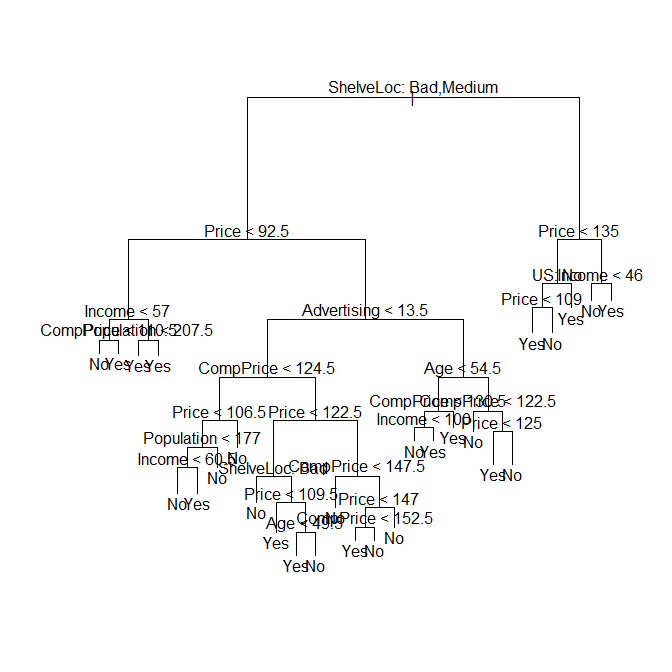

If we just type the name of the tree object, R prints output
corresponding to each branch of the tree. R displays:

  - the split criterion (e.g. `Price<92.5`)
  - the number of observations in that branch
  - the deviance, the overall prediction for the branch (Yes or No)
  - the fraction of observations in that branch that take on values of
    Yes and No

Branches that lead to terminal nodes are indicated using asterisks.

``` r
tree_carseats
```

    ## node), split, n, deviance, yval, (yprob)
    ##       * denotes terminal node
    ## 
    ##   1) root 400 541.500 No ( 0.59000 0.41000 )  
    ##     2) ShelveLoc: Bad,Medium 315 390.600 No ( 0.68889 0.31111 )  
    ##       4) Price < 92.5 46  56.530 Yes ( 0.30435 0.69565 )  
    ##         8) Income < 57 10  12.220 No ( 0.70000 0.30000 )  
    ##          16) CompPrice < 110.5 5   0.000 No ( 1.00000 0.00000 ) *
    ##          17) CompPrice > 110.5 5   6.730 Yes ( 0.40000 0.60000 ) *
    ##         9) Income > 57 36  35.470 Yes ( 0.19444 0.80556 )  
    ##          18) Population < 207.5 16  21.170 Yes ( 0.37500 0.62500 ) *
    ##          19) Population > 207.5 20   7.941 Yes ( 0.05000 0.95000 ) *
    ##       5) Price > 92.5 269 299.800 No ( 0.75465 0.24535 )  
    ##        10) Advertising < 13.5 224 213.200 No ( 0.81696 0.18304 )  
    ##          20) CompPrice < 124.5 96  44.890 No ( 0.93750 0.06250 )  
    ##            40) Price < 106.5 38  33.150 No ( 0.84211 0.15789 )  
    ##              80) Population < 177 12  16.300 No ( 0.58333 0.41667 )  
    ##               160) Income < 60.5 6   0.000 No ( 1.00000 0.00000 ) *
    ##               161) Income > 60.5 6   5.407 Yes ( 0.16667 0.83333 ) *
    ##              81) Population > 177 26   8.477 No ( 0.96154 0.03846 ) *
    ##            41) Price > 106.5 58   0.000 No ( 1.00000 0.00000 ) *
    ##          21) CompPrice > 124.5 128 150.200 No ( 0.72656 0.27344 )  
    ##            42) Price < 122.5 51  70.680 Yes ( 0.49020 0.50980 )  
    ##              84) ShelveLoc: Bad 11   6.702 No ( 0.90909 0.09091 ) *
    ##              85) ShelveLoc: Medium 40  52.930 Yes ( 0.37500 0.62500 )  
    ##               170) Price < 109.5 16   7.481 Yes ( 0.06250 0.93750 ) *
    ##               171) Price > 109.5 24  32.600 No ( 0.58333 0.41667 )  
    ##                 342) Age < 49.5 13  16.050 Yes ( 0.30769 0.69231 ) *
    ##                 343) Age > 49.5 11   6.702 No ( 0.90909 0.09091 ) *
    ##            43) Price > 122.5 77  55.540 No ( 0.88312 0.11688 )  
    ##              86) CompPrice < 147.5 58  17.400 No ( 0.96552 0.03448 ) *
    ##              87) CompPrice > 147.5 19  25.010 No ( 0.63158 0.36842 )  
    ##               174) Price < 147 12  16.300 Yes ( 0.41667 0.58333 )  
    ##                 348) CompPrice < 152.5 7   5.742 Yes ( 0.14286 0.85714 ) *
    ##                 349) CompPrice > 152.5 5   5.004 No ( 0.80000 0.20000 ) *
    ##               175) Price > 147 7   0.000 No ( 1.00000 0.00000 ) *
    ##        11) Advertising > 13.5 45  61.830 Yes ( 0.44444 0.55556 )  
    ##          22) Age < 54.5 25  25.020 Yes ( 0.20000 0.80000 )  
    ##            44) CompPrice < 130.5 14  18.250 Yes ( 0.35714 0.64286 )  
    ##              88) Income < 100 9  12.370 No ( 0.55556 0.44444 ) *
    ##              89) Income > 100 5   0.000 Yes ( 0.00000 1.00000 ) *
    ##            45) CompPrice > 130.5 11   0.000 Yes ( 0.00000 1.00000 ) *
    ##          23) Age > 54.5 20  22.490 No ( 0.75000 0.25000 )  
    ##            46) CompPrice < 122.5 10   0.000 No ( 1.00000 0.00000 ) *
    ##            47) CompPrice > 122.5 10  13.860 No ( 0.50000 0.50000 )  
    ##              94) Price < 125 5   0.000 Yes ( 0.00000 1.00000 ) *
    ##              95) Price > 125 5   0.000 No ( 1.00000 0.00000 ) *
    ##     3) ShelveLoc: Good 85  90.330 Yes ( 0.22353 0.77647 )  
    ##       6) Price < 135 68  49.260 Yes ( 0.11765 0.88235 )  
    ##        12) US: No 17  22.070 Yes ( 0.35294 0.64706 )  
    ##          24) Price < 109 8   0.000 Yes ( 0.00000 1.00000 ) *
    ##          25) Price > 109 9  11.460 No ( 0.66667 0.33333 ) *
    ##        13) US: Yes 51  16.880 Yes ( 0.03922 0.96078 ) *
    ##       7) Price > 135 17  22.070 No ( 0.64706 0.35294 )  
    ##        14) Income < 46 6   0.000 No ( 1.00000 0.00000 ) *
    ##        15) Income > 46 11  15.160 Yes ( 0.45455 0.54545 ) *

Obtaining the test error:

``` r
set.seed(1989)

carseats_train <- carseats %>% 
  sample_frac(0.5)

carseats_test <- carseats %>% 
  anti_join(carseats_train)
```

``` r
tree_carseats <- tree(High ~ . - Sales, data = carseats_train)

carseats_test <- carseats_test %>% 
  add_predictions(tree_carseats, type = "class")

caret::confusionMatrix(data = carseats_test$pred,
                       reference = carseats_test$High)
```

    ## Confusion Matrix and Statistics
    ## 
    ##           Reference
    ## Prediction No Yes
    ##        No  89  24
    ##        Yes 33  54
    ##                                           
    ##                Accuracy : 0.715           
    ##                  95% CI : (0.6471, 0.7764)
    ##     No Information Rate : 0.61            
    ##     P-Value [Acc > NIR] : 0.001237        
    ##                                           
    ##                   Kappa : 0.4132          
    ##                                           
    ##  Mcnemar's Test P-Value : 0.289315        
    ##                                           
    ##             Sensitivity : 0.7295          
    ##             Specificity : 0.6923          
    ##          Pos Pred Value : 0.7876          
    ##          Neg Pred Value : 0.6207          
    ##              Prevalence : 0.6100          
    ##          Detection Rate : 0.4450          
    ##    Detection Prevalence : 0.5650          
    ##       Balanced Accuracy : 0.7109          
    ##                                           
    ##        'Positive' Class : No              
    ## 

Now let’s consider whether pruning the tree might lead to improved
results.

``` r
set.seed(1989)
cv_carseats <- cv.tree(
  tree_carseats,
  FUN = prune.misclass
)
names(cv_carseats)
```

    ## [1] "size"   "dev"    "k"      "method"

``` r
cv_carseats
```

    ## $size
    ## [1] 19 15 13 12  7  5  4  2  1
    ## 
    ## $dev
    ## [1] 60 60 59 55 63 68 73 73 86
    ## 
    ## $k
    ## [1] -Inf  0.0  0.5  1.0  2.0  3.0  5.0  6.5 26.0
    ## 
    ## $method
    ## [1] "misclass"
    ## 
    ## attr(,"class")
    ## [1] "prune"         "tree.sequence"

`$dev` represents the CV classification error. We can plot it against
the number of nodes:

``` r
qplot(cv_carseats$size, cv_carseats$dev, geom = "line") +
  geom_vline(xintercept = cv_carseats$size[which.min(cv_carseats$dev)],
             color = "red")
```

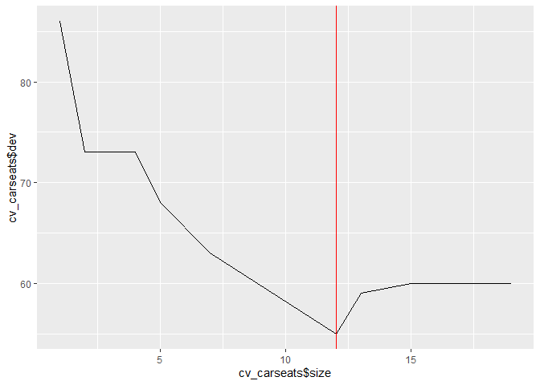<!-- -->

In this case, the tree with less CV error has 12 nodes. We can obtain
this pruned tree using `prune.misclass()`

``` r
prune_carseats <- prune.misclass(tree_carseats, best = 12)
plot(prune_carseats)
text(prune_carseats, pretty = 0)
```

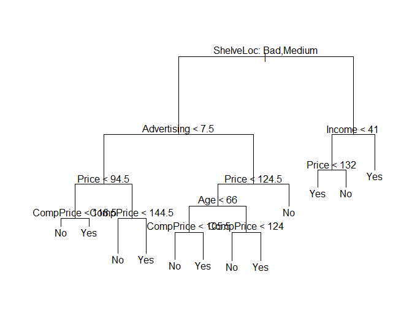

How does the pruned tree perform on the test data set?

``` r
carseats_test_pred_pruned <- 
  carseats_test %>% 
  add_predictions(prune_carseats, type = "class")

caret::confusionMatrix(
  data = carseats_test_pred_pruned$pred,
  reference = carseats_test_pred_pruned$High
)
```

    ## Confusion Matrix and Statistics
    ## 
    ##           Reference
    ## Prediction No Yes
    ##        No  98  23
    ##        Yes 24  55
    ##                                        
    ##                Accuracy : 0.765        
    ##                  95% CI : (0.7, 0.8219)
    ##     No Information Rate : 0.61         
    ##     P-Value [Acc > NIR] : 2.455e-06    
    ##                                        
    ##                   Kappa : 0.5072       
    ##                                        
    ##  Mcnemar's Test P-Value : 1            
    ##                                        
    ##             Sensitivity : 0.8033       
    ##             Specificity : 0.7051       
    ##          Pos Pred Value : 0.8099       
    ##          Neg Pred Value : 0.6962       
    ##              Prevalence : 0.6100       
    ##          Detection Rate : 0.4900       
    ##    Detection Prevalence : 0.6050       
    ##       Balanced Accuracy : 0.7542       
    ##                                        
    ##        'Positive' Class : No           
    ## 

Accuracy went up from 71% to 76.5%.

## 8.3.2 Fitting Regression Trees

``` r
set.seed(1989)

boston_train <- Boston %>% 
  as_tibble() %>% 
  sample_frac(0.5)

boston_test <- Boston %>% 
  as_tibble() %>% 
  anti_join(boston_train)
```

``` r
tree_boston <- tree(medv ~ . , data = boston_train)

summary(tree_boston)
```

    ## 
    ## Regression tree:
    ## tree(formula = medv ~ ., data = boston_train)
    ## Variables actually used in tree construction:
    ## [1] "lstat" "rm"    "rad"   "dis"  
    ## Number of terminal nodes:  8 
    ## Residual mean deviance:  13.75 = 3369 / 245 
    ## Distribution of residuals:
    ##      Min.   1st Qu.    Median      Mean   3rd Qu.      Max. 
    ## -14.77000  -2.02000  -0.03582   0.00000   1.71000  15.63000

Here “deviance” is just the sum of the squared errors (RSS)

``` r
plot(tree_boston)
text(tree_boston, pretty = 0)
```

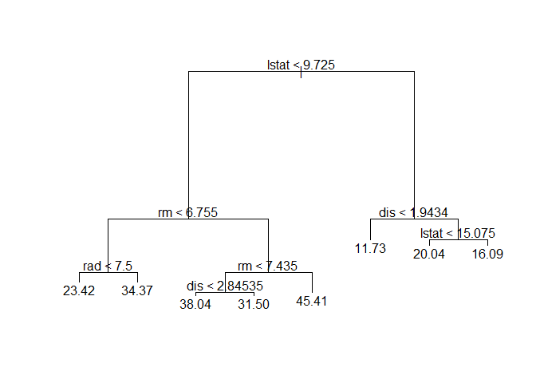<!-- -->

Checking if pruning the tree improves the performance:

``` r
cv_boston <- cv.tree(tree_boston)

qplot(cv_boston$size, cv_boston$dev, geom = "line") +
  geom_vline(xintercept = cv_boston$size[which.min(cv_boston$dev)],
             color = "red")
```

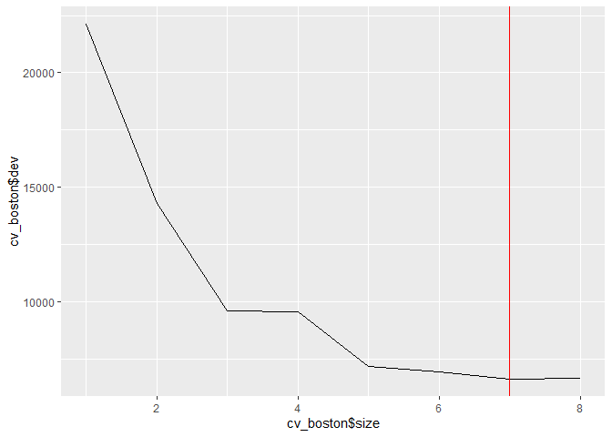<!-- -->

The tree selected by CV has 7 terminal nodes.

``` r
prune_boston <- prune.tree(tree_boston, best = 7)

plot(prune_boston)
text(prune_boston, pretty = 0)
```

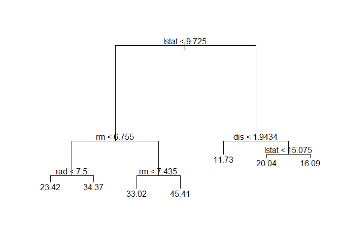<!-- -->

The tree lost the node that splits by `dis < 2.845`.

Now we can do prediction using the pruned tree, and see how the
predicted values relate to the actual values of `medv`.

``` r
boston_test <- boston_test %>% 
  add_predictions(prune_boston)

qplot(pred, medv, data = boston_test)
```

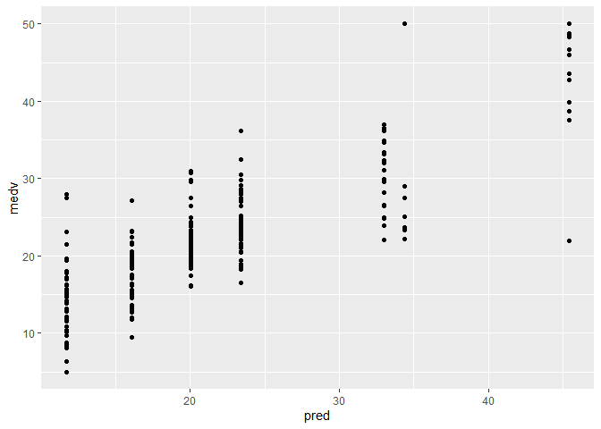<!-- -->

Measuring the test set MSE

``` r
(
  test_mse_boston <- 
  mean((boston_test$pred - boston_test$medv)^2)
)
```

    ## [1] 23.99471

``` r
sqrt(test_mse_boston)
```

    ## [1] 4.89844

This means that the model leads to test predictions that are within
around $4898 of the true median home value for the suburb.

## 8.3.3 Bagging and Random Forests

We now use the `randomForest` package. Note that bagging it’s just a
special case of random forest where \(m = p\), so the same package can
be used for bagging.

Performing bagging:

``` r
set.seed(1989)

bag_boston <- randomForest(medv ~ ., data = boston_train,
                           mtry = 13, importance = TRUE)

bag_boston
```

    ## 
    ## Call:
    ##  randomForest(formula = medv ~ ., data = boston_train, mtry = 13,      importance = TRUE) 
    ##                Type of random forest: regression
    ##                      Number of trees: 500
    ## No. of variables tried at each split: 13
    ## 
    ##           Mean of squared residuals: 12.79134
    ##                     % Var explained: 85.01

`mtry` indicates the number of predictors that should be considered at
each split (in this case, all the available predictors, since we’re
doing bagging).

Now let’s measure the test error:

``` r
boston_test <- boston_test %>% 
  add_predictions(bag_boston, var = "pred_bag")

qplot(pred_bag, medv, data = boston_test)
```

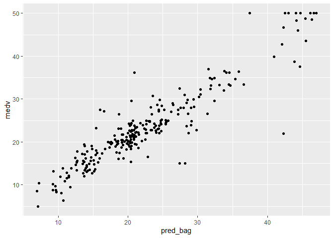<!-- -->

``` r
(
  test_mse_bag <- 
  mean((boston_test$pred_bag - boston_test$medv)^2)
)
```

    ## [1] 12.55916

``` r
sqrt(test_mse_bag)
```

    ## [1] 3.54389

The test MSE is much lower using bagging than using a single decision
tree. Let’s see if the test error further decreases when using random
forest instead.

``` r
set.seed(1989)

rf_boston <- randomForest(medv ~ ., data = boston_train,
                          mtry = 6, importance = TRUE)

rf_boston
```

    ## 
    ## Call:
    ##  randomForest(formula = medv ~ ., data = boston_train, mtry = 6,      importance = TRUE) 
    ##                Type of random forest: regression
    ##                      Number of trees: 500
    ## No. of variables tried at each split: 6
    ## 
    ##           Mean of squared residuals: 12.69343
    ##                     % Var explained: 85.12

``` r
boston_test <- boston_test %>% 
  add_predictions(rf_boston, var = "pred_rf")

(
  test_mse_rf <- 
  mean((boston_test$pred_rf - boston_test$medv)^2)
)
```

    ## [1] 11.01111

The test MSE in fact decreases from 12.55 to 11.

We can use the `importance()` function to see the importance of each
variable:

``` r
importance(rf_boston)
```

    ##            %IncMSE IncNodePurity
    ## crim    11.2720790    1182.17634
    ## zn       3.3289227     109.83811
    ## indus    7.0043412    1127.94279
    ## chas    -0.4887816      33.59821
    ## nox     12.5953526    1041.50094
    ## rm      30.9171363    6449.61448
    ## age     10.1827491     494.31674
    ## dis     15.5883421    1602.16737
    ## rad      4.3417389     114.07481
    ## tax      8.5316941     372.02994
    ## ptratio 11.8405532     815.07664
    ## black    6.7186529     298.28204
    ## lstat   32.4134256    7636.03498

Two measures of variable importance are reported. The former is based
upon the mean decrease of accuracy in predictions on the out of bag
samples when a given variable is excluded from the model. The latter is
a measure of the total decrease in node impurity that results from
splits over that variable, averaged over all trees.

Plotting variable importance ranking:

``` r
varImpPlot(rf_boston)
```

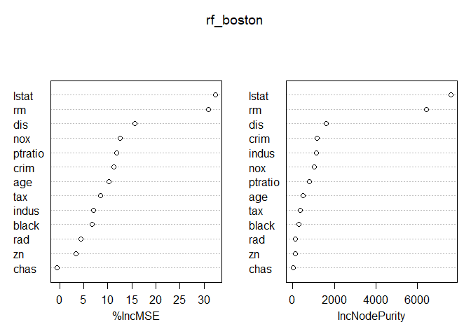<!-- -->

## 8.3.4 Boosting

Finally we use the `gbm::gbm()` function to fit boosted regression
trees.

To fit boosted regression trees we need to specify `distribution =
"gaussian"`. To use classification trees instead, we use `distribution =
"bernoulli`.

``` r
set.seed(1989)

boost_boston <- gbm(medv ~ .,
                    data = boston_train,
                    distribution = "gaussian",
                    n.trees = 5000,
                    interaction.depth = 4)

summary(boost_boston)
```

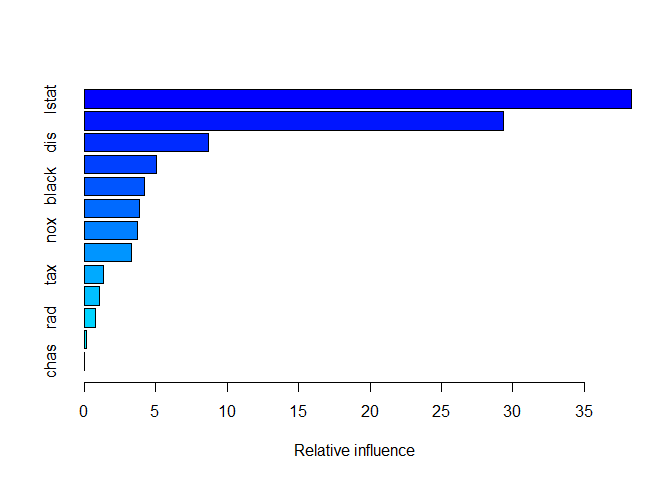<!-- -->

    ##             var      rel.inf
    ## lstat     lstat 3.830913e+01
    ## rm           rm 2.934658e+01
    ## dis         dis 8.710395e+00
    ## crim       crim 5.078138e+00
    ## black     black 4.228393e+00
    ## age         age 3.867162e+00
    ## nox         nox 3.712730e+00
    ## ptratio ptratio 3.318622e+00
    ## tax         tax 1.372788e+00
    ## indus     indus 1.092752e+00
    ## rad         rad 7.997583e-01
    ## zn           zn 1.632952e-01
    ## chas       chas 2.498127e-04

The function `summary()` provides a variable importance table and plot.
We see that `lstat` and `rm` are the most important variables by far.

We can produce partial dependence plots for certain variables,
i.e. illustrate the marginal effect of a given variable after
“integrating out” the other variables.

``` r
plot(boost_boston, i = "rm")
```

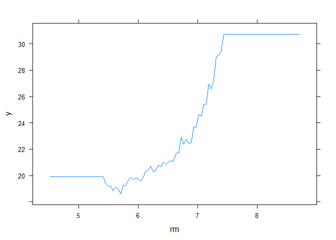<!-- -->

``` r
plot(boost_boston, i = "lstat")
```

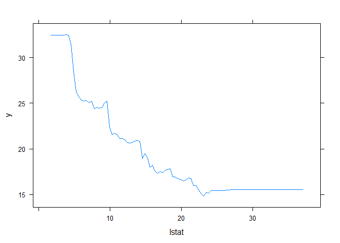<!-- -->

Using the model to predict on the test set:

``` r
predictions_boost <- 
  predict(boost_boston, new_data = boston_test, n.trees = 5000, type = "response")

mean((predictions_boost - boston_test$medv)^2)
```

    ## [1] 152.1125

For some reason, the test MSE is much higher than in boosting and random
forest. Let’s try with other tuning parameters:

``` r
boost_boston2 <- 
  gbm(medv ∼ .,
      data = boston_train, distribution = "gaussian", n.trees =5000 , interaction.depth = 4,
      shrinkage =0.2, verbose =F)

predictions_boost2 <- 
  predict(boost_boston2, new_data = boston_test, n.trees = 5000, type = "response")

mean((predictions_boost2 - boston_test$medv)^2)
```

    ## [1] 152.1153
