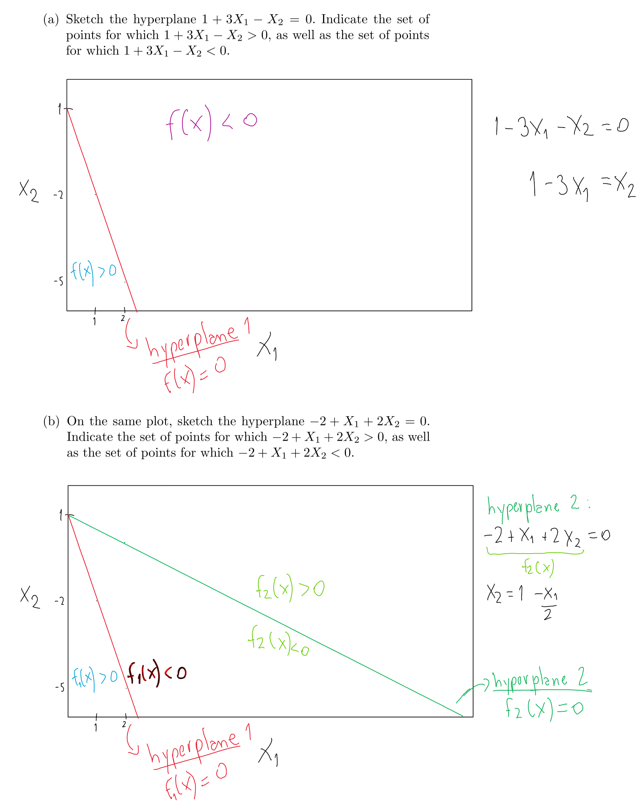
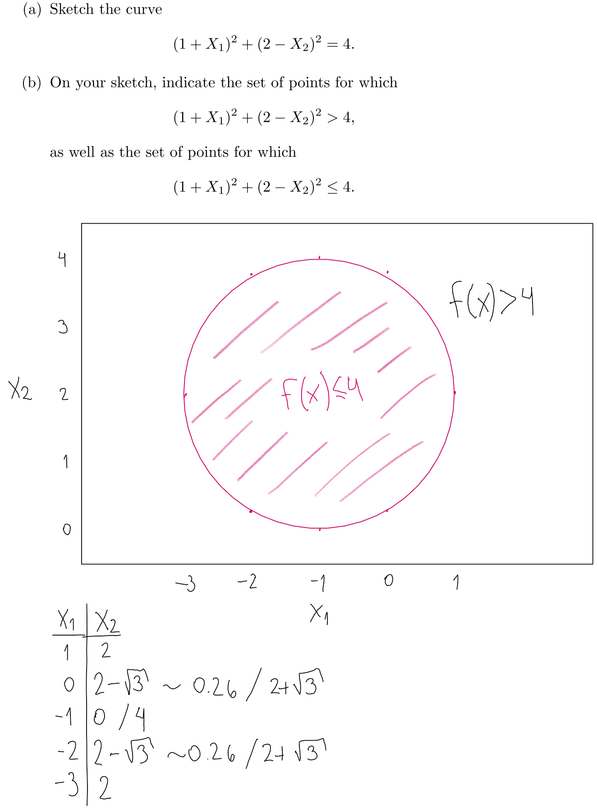
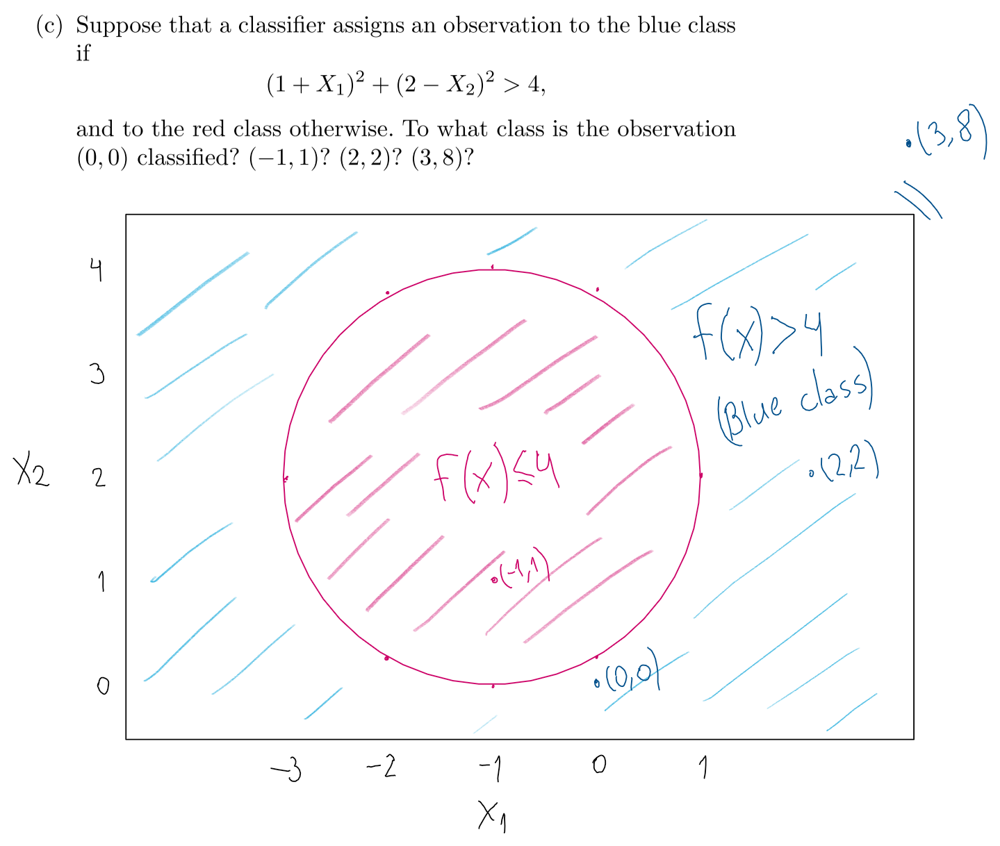
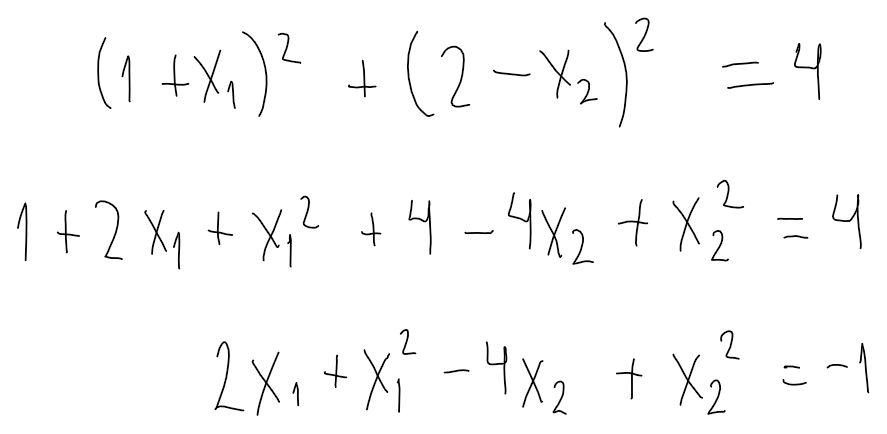
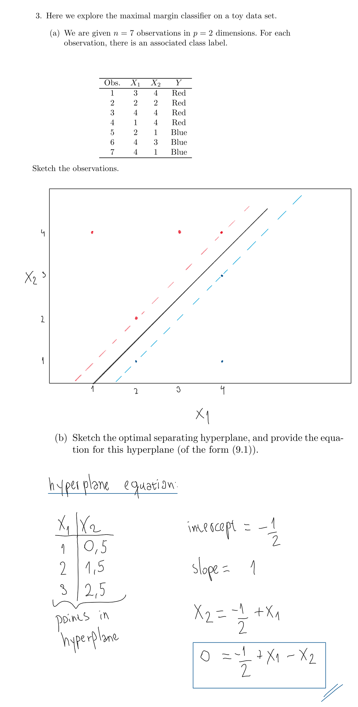
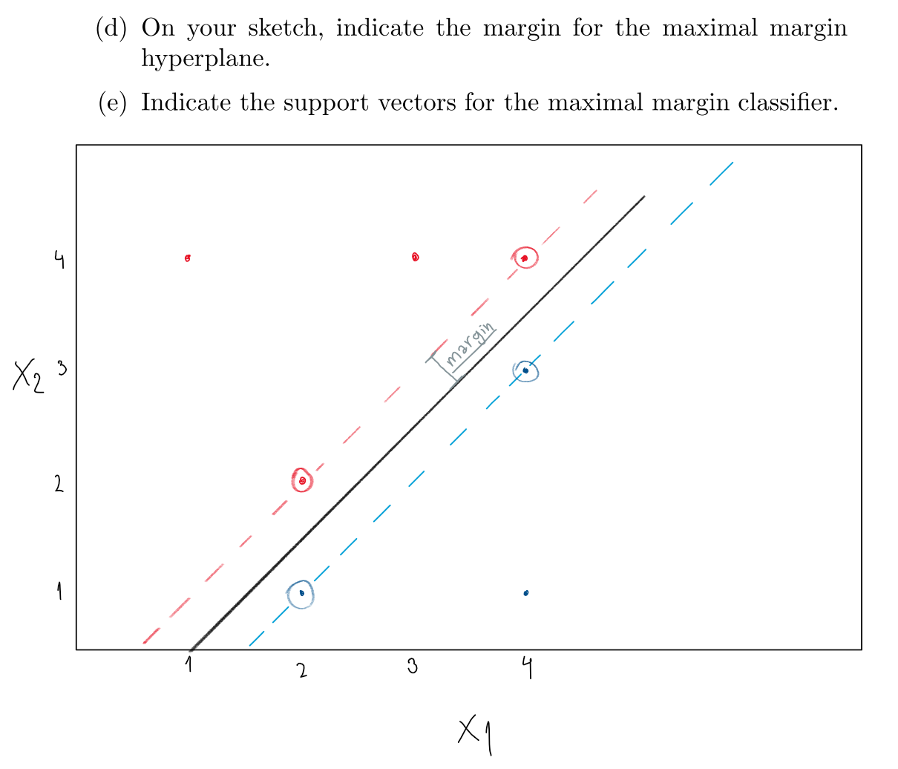
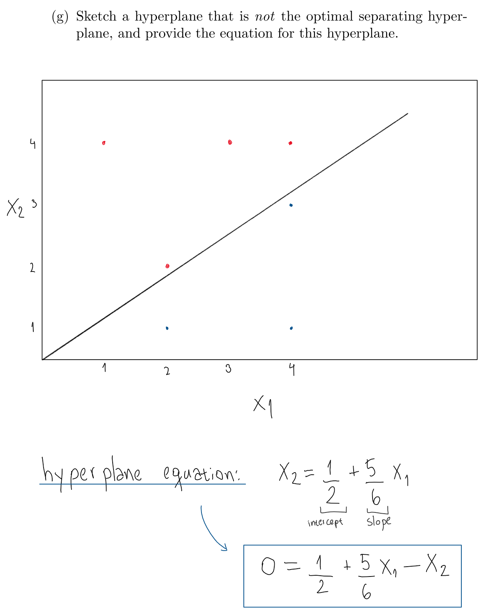
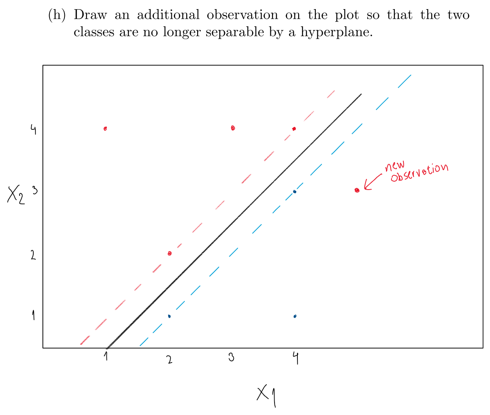

```{r setup, message=FALSE, warning=FALSE}
library(tidyverse)
library(e1071)
```


## Conceptual

(1) This problem involves hyperplanes in two dimensions.

 
(2) We have seen that in $p = 2$ dimensions, a linear decision boundary takes the form $β_0+β_1X_1+β_2X_2 = 0$. We now investigate a non-linear decision boundary.


  

All observations except (-1,1) are assigned to the blue class. 

(d) Argue that while the decision boundary in (c) is not linear in terms of $X_1$ and $X_2$, it is linear in terms of $X_1, X_1^2, X_2$ and $X_2^2$.

We can see this by expanding the equation of the boundary. Doing this we arrive get the following expression, which is clearly linear in terms of $X_1, X_1^2, X_2$ and $X_2^2$. 

 

(3)



(c) Describe the classification rule for the maximal margin classifier.

A: Classify to "Red" if $-(1/2) + X_1 - X_2 < 0$ and classify to "Blue" otherwise.


Support vectors are circled.

(f) Argue that a slight movement of the seventh observation would not affect the maximal margin hyperplane.

The seventh observation (4,1) is not a support vector and also is relatively far away of the margin (as can be seen in the figure above), so a small movement of it would not touch the margin, and thus would not move the maximal margin hyperplane.





## Applied

(4) Generate a simulated two-class data set with 100 observations and two features in which there is a visible but non-linear separation between the two classes. Show that in this setting, a support vector machine with a polynomial kernel (with degree greater than 1) or a radial kernel will outperform a support vector classifier on the training data. Which technique performs best on the test data? Make plots and report training and test error rates in order to back up your assertions.

```{r}
set.seed(1991)
sim_data <- 
  tibble(
    x1 = c(rnorm(30, mean = 1),
           rnorm(30, mean = 3),
           rnorm(40, mean = 2)),
    x2 = c(rnorm(30, mean = 2),
           rnorm(30, mean = -1),
           rnorm(40, mean = -4)),
    class = c(rep("red", 30), rep("blue", 30), rep("red", 40))
  ) %>%
  mutate(class = as.factor(class))

sim_data %>% 
  ggplot(aes(x1, x2, color = class)) +
  geom_point() +
  scale_color_identity()
```

Splitting between test and train:
```{r}
set.seed(1989)
sim_data_train <- 
  sim_data %>% 
  sample_frac(0.5)

sim_data_test <- 
  sim_data %>% 
  anti_join(sim_data_train)
```

Training 3 models: linear, polynomial, and radial.
```{r}
svm_lineal <- svm(class ~ .,
                  data = sim_data_train,
                  kernel = "linear",
                  cost = 10)

svm_polynomial <- svm(class ~ .,
                  data = sim_data_train,
                  kernel = "polynomial",
                  degree = 3,
                  cost = 10)

svm_radial <- svm(class ~ .,
                  data = sim_data_train,
                  kernel = "radial",
                  gamma = 1,
                  cost = 10)
```

```{r}
sim_data_test <- 
  sim_data_test %>% 
  modelr::add_predictions(svm_lineal, var = "pred_linear") %>% 
  modelr::add_predictions(svm_polynomial, var = "pred_poly") %>% 
  modelr::add_predictions(svm_radial, var = "pred_radial")

sim_data_test
```
Performance of linear kernel:
```{r}
sim_data_test %>% 
  select(class, pred_linear) %>% 
  table()
```
Performance of polynomial kernel:
```{r}
sim_data_test %>% 
  select(class, pred_poly) %>% 
  table()
```
Performance of radial kernel:
```{r}
sim_data_test %>% 
  select(class, pred_radial) %>% 
  table()
```
We see that the classifier with radial kernel has the best performance on test data (just 2 of 50 observations missclasified, versus 14 and 11 missclassifications when we use other kernels).

Plot of radial kernel:
```{r}
plot(svm_radial, data = sim_data_train)
```

```{r}
plot(svm_polynomial, data = sim_data_train)
```

```{r}
plot(svm_lineal, data = sim_data_train)

```

(5) We have seen that we can fit an SVM with a non-linear kernel in order to perform classification using a non-linear decision boundary. We will now see that we can also obtain a non-linear decision boundary by performing logistic regression using non-linear transformations of the features

(a) Generate a data set with $n = 500$ and $p = 2$, such that the observations belong to two classes with a quadratic decision boundary between them.
```{r}
sim_data2 <- 
  tibble(
    x1 = runif(500) - 0.5,
    x2 = runif(500) - 0.5,
    y = 1*(x1^2-x2^2 > 0)
  )

sim_data2
```
(b) Plot the observations
```{r}
ggplot(sim_data2,
       aes(x1, x2, color = factor(y))) +
  geom_point()
```

(c) Fit a logistic regression model to the data, using $X_1$ and $X_2$ as predictors. 

```{r}
lreg_sim2 <- glm(y ~ x1 + x2, data = sim_data2, family = "binomial")

summary(lreg_sim2)
```

(d) Apply this model to the training data in order to obtain a predicted class label for each training observation. Plot the observations, colored according to the predicted class labels. The decision boundary should be linear.

```{r}
sim_data2 %>% 
  modelr::add_predictions(lreg_sim2, var = "pred_lreg", 
                          type = "response") %>% 
  mutate(pred_lreg_class = ifelse(pred_lreg > 0.5, 1, 0)) %>% 
  ggplot(aes(x1, x2, color = factor(pred_lreg_class))) +
  geom_point() +
  labs(color = "predicted class")
```

(e) Now fit a logistic regression model to the data using non-linear functions of X1 and X2 as predictors (e.g. $X^2$, $X_1 \times X_2$, and so forth).
```{r}
lreg2_sim2 <- 
  glm(y ~ x1 * x2 + I(x1^2) * I(x2^2) + 
        x1:I(x1^2) + x2:I(x2^2), data = sim_data2, 
      family = "binomial")

summary(lreg2_sim2)
```

(f) Apply this model to the training data in order to obtain a predicted class label for each training observation. Plot the observations, colored according to the predicted class labels.

```{r}
sim_data2 %>% 
  modelr::add_predictions(lreg2_sim2, var = "pred_lreg", 
                          type = "response") %>% 
  mutate(pred_lreg_class = ifelse(pred_lreg > 0.5, 1, 0)) %>% 
  ggplot(aes(x1, x2, color = factor(pred_lreg_class))) +
  geom_point() +
  labs(color = "predicted class")
```

(g) Fit a support vector classifier to the data with X1 and X2 as predictors. Obtain a class prediction for each training observation. Plot the observations, colored according to the predicted class labels

```{r}
svm_sim2 <- 
  svm(factor(y) ~ ., data = sim_data2,
    kernel = "linear",
    cost = 1)

sim_data2 %>% 
  modelr::add_predictions(svm_sim2, var = "pred_svm") %>% 
  ggplot(aes(x1, x2, color = pred_svm)) +
  geom_point() +
  labs(color = "predicted class")
```

(h) Fit a SVM using a non-linear kernel to the data. Obtain a class prediction for each training observation. Plot the observations, colored according to the predicted class labels.
```{r}
svm_nl_sim2 <- 
  svm(factor(y) ~ ., data = sim_data2,
    kernel = "polynomial",
    degree = 2,
    cost = 1)

sim_data2 %>% 
  modelr::add_predictions(svm_nl_sim2, var = "pred_svm") %>% 
  ggplot(aes(x1, x2, color = pred_svm)) +
  geom_point() +
labs(color = "predicted class")
```

(i) Comment on your results.

A: We see that the linear support vector classifier and the regression with the original feature space yield to similar results: a decision border that is just a line (an hyperplane in $p=2$). Similarly, both the SVM with polynomial kernel and the regression with non-linear functions of the predictors succeed in learning the true data generating process (because both of them use an enlarged feature space that allows a non-linear boundary in $p=2$).