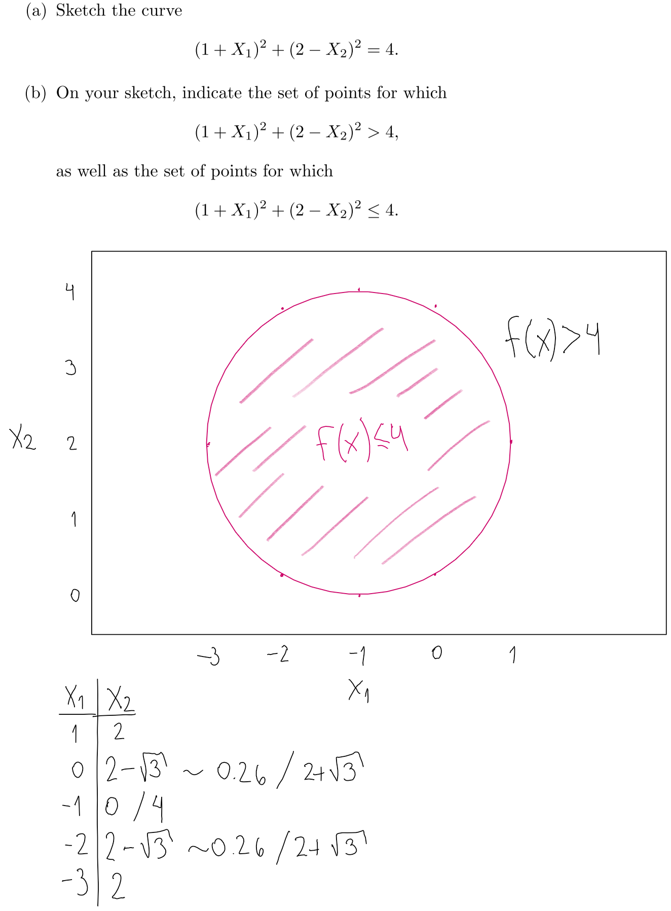
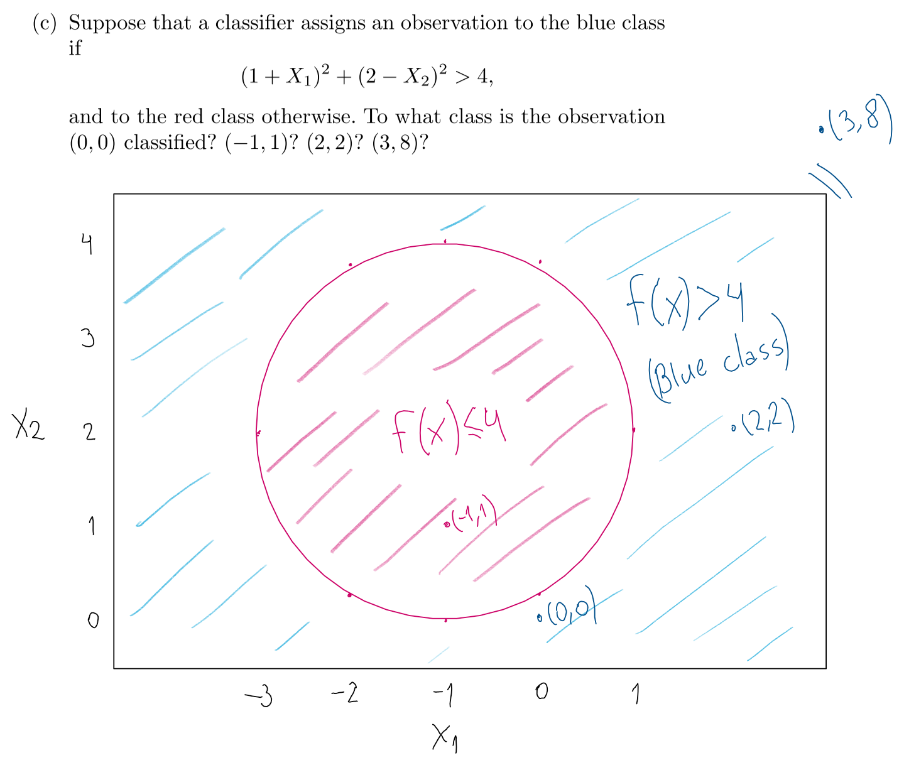
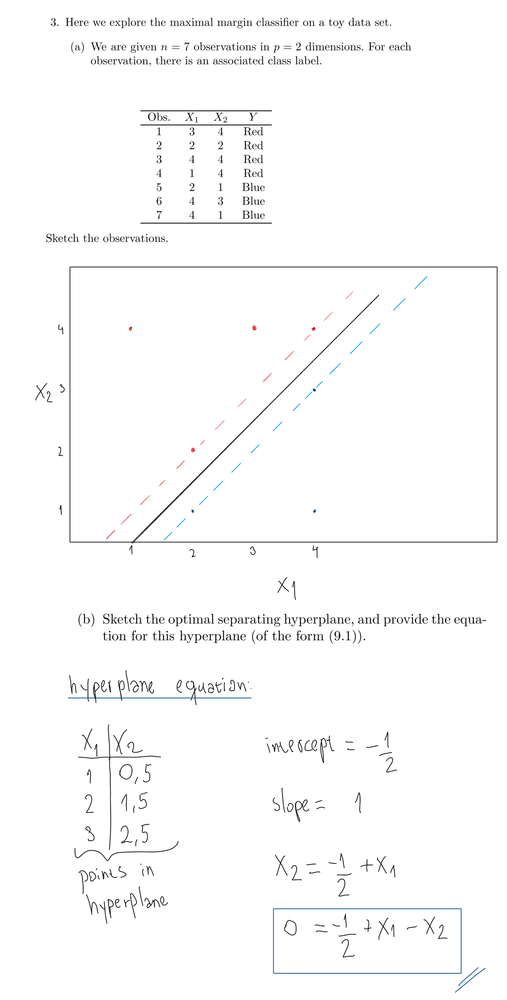
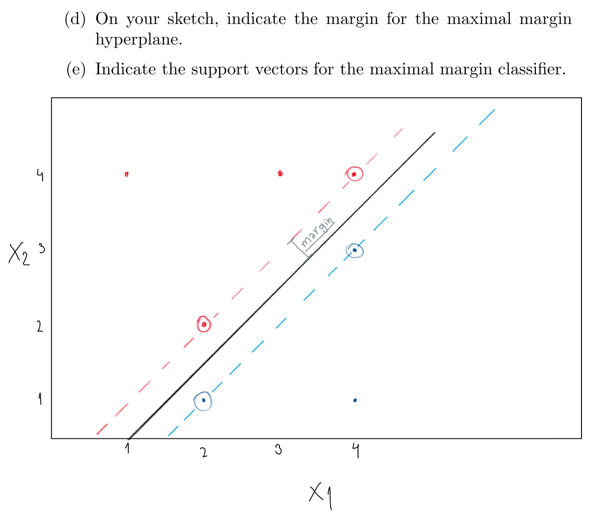
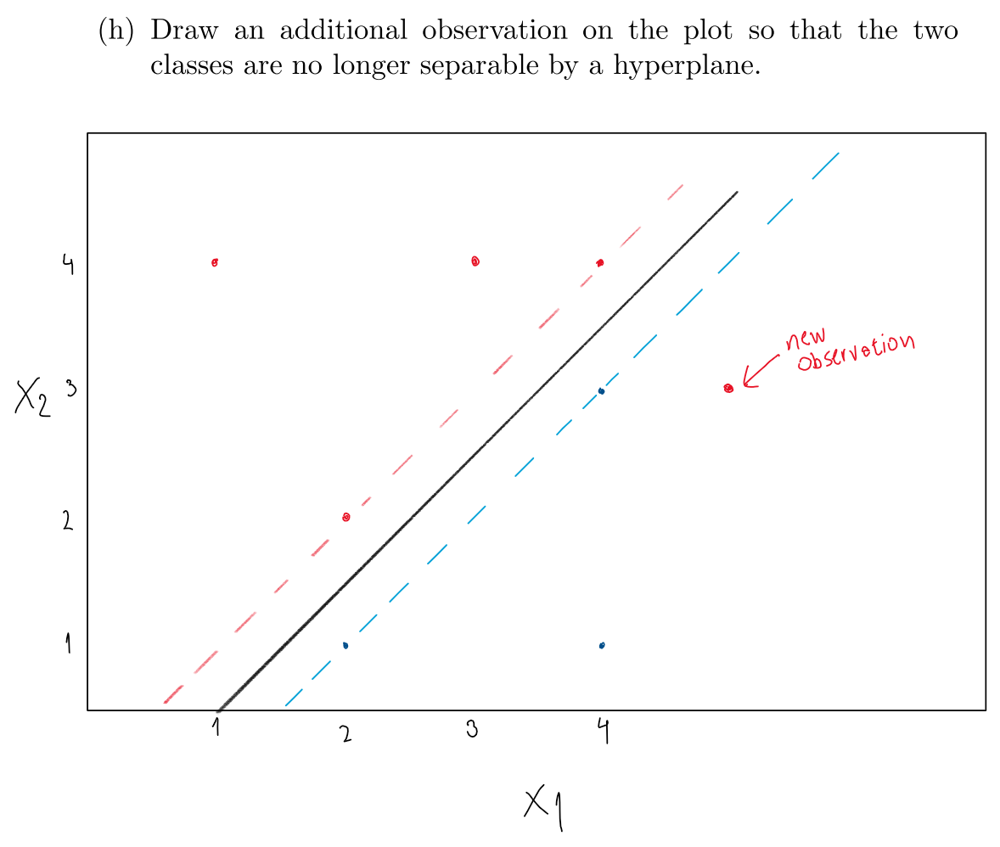
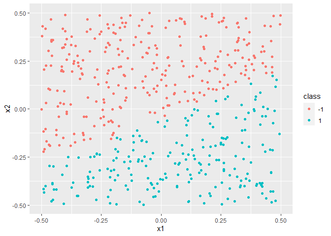

9.7 Exercises
================

``` r
library(tidyverse)
library(e1071)
```

## Conceptual

(1) This problem involves hyperplanes in two dimensions.

 (2) We have seen that in \(p = 2\) dimensions, a
linear decision boundary takes the form \(β_0+β_1X_1+β_2X_2 = 0\). We
now investigate a non-linear decision boundary.

 

All observations except (-1,1) are assigned to the blue class.

(d) Argue that while the decision boundary in (c) is not linear in terms
of \(X_1\) and \(X_2\), it is linear in terms of \(X_1, X_1^2, X_2\) and
\(X_2^2\).

We can see this by expanding the equation of the boundary. Doing this we
arrive get the following expression, which is clearly linear in terms of
\(X_1, X_1^2, X_2\) and \(X_2^2\).


(3)



(c) Describe the classification rule for the maximal margin classifier.

A: Classify to “Red” if \(-(1/2) + X_1 - X_2 < 0\) and classify to
“Blue” otherwise.

 Support vectors are circled.

(f) Argue that a slight movement of the seventh observation would not
affect the maximal margin hyperplane.

The seventh observation (4,1) is not a support vector and also is
relatively far away of the margin (as can be seen in the figure above),
so a small movement of it would not touch the margin, and thus would not
move the maximal margin hyperplane.




## Applied

(4) Generate a simulated two-class data set with 100 observations and
two features in which there is a visible but non-linear separation
between the two classes. Show that in this setting, a support vector
machine with a polynomial kernel (with degree greater than 1) or a
radial kernel will outperform a support vector classifier on the
training data. Which technique performs best on the test data? Make
plots and report training and test error rates in order to back up your
assertions.

``` r
set.seed(1991)
sim_data <- 
  tibble(
    x1 = c(rnorm(30, mean = 1),
           rnorm(30, mean = 3),
           rnorm(40, mean = 2)),
    x2 = c(rnorm(30, mean = 2),
           rnorm(30, mean = -1),
           rnorm(40, mean = -4)),
    class = c(rep("red", 30), rep("blue", 30), rep("red", 40))
  ) %>%
  mutate(class = as.factor(class))

sim_data %>% 
  ggplot(aes(x1, x2, color = class)) +
  geom_point() +
  scale_color_identity()
```

<!-- -->

Splitting between test and train:

``` r
set.seed(1989)
sim_data_train <- 
  sim_data %>% 
  sample_frac(0.5)

sim_data_test <- 
  sim_data %>% 
  anti_join(sim_data_train)
```

    ## Joining, by = c("x1", "x2", "class")

Training 3 models: linear, polynomial, and radial.

``` r
svm_lineal <- svm(class ~ .,
                  data = sim_data_train,
                  kernel = "linear",
                  cost = 10)

svm_polynomial <- svm(class ~ .,
                  data = sim_data_train,
                  kernel = "polynomial",
                  degree = 3,
                  cost = 10)

svm_radial <- svm(class ~ .,
                  data = sim_data_train,
                  kernel = "radial",
                  gamma = 1,
                  cost = 10)
```

``` r
sim_data_test <- 
  sim_data_test %>% 
  modelr::add_predictions(svm_lineal, var = "pred_linear") %>% 
  modelr::add_predictions(svm_polynomial, var = "pred_poly") %>% 
  modelr::add_predictions(svm_radial, var = "pred_radial")

sim_data_test
```

    ## # A tibble: 50 x 6
    ##         x1    x2 class pred_linear pred_poly pred_radial
    ##      <dbl> <dbl> <fct> <fct>       <fct>     <fct>      
    ##  1 -0.0338 3.16  red   red         red       red        
    ##  2  0.684  1.94  red   red         red       red        
    ##  3  0.775  1.05  red   red         red       red        
    ##  4  3.00   2.50  red   blue        red       red        
    ##  5  2.12   3.37  red   red         red       red        
    ##  6  1.86   3.91  red   red         red       red        
    ##  7  2.20   2.52  red   red         red       red        
    ##  8 -0.0100 3.06  red   red         red       red        
    ##  9  2.14   1.37  red   red         red       red        
    ## 10  0.0891 0.699 red   red         red       red        
    ## # ... with 40 more rows

Performance of linear kernel:

``` r
sim_data_test %>% 
  select(class, pred_linear) %>% 
  table()
```

    ##       pred_linear
    ## class  blue red
    ##   blue   10   8
    ##   red     3  29

Performance of polynomial kernel:

``` r
sim_data_test %>% 
  select(class, pred_poly) %>% 
  table()
```

    ##       pred_poly
    ## class  blue red
    ##   blue    4  14
    ##   red     0  32

Performance of radial kernel:

``` r
sim_data_test %>% 
  select(class, pred_radial) %>% 
  table()
```

    ##       pred_radial
    ## class  blue red
    ##   blue   16   2
    ##   red     0  32

We see that the classifier with radial kernel has the best performance
on test data (just 2 of 50 observations missclasified, versus 14 and 11
missclassifications when we use other kernels).

Plot of radial kernel:

``` r
plot(svm_radial, data = sim_data_train)
```

<!-- -->

``` r
plot(svm_polynomial, data = sim_data_train)
```

<!-- -->

``` r
plot(svm_lineal, data = sim_data_train)
```

<!-- -->

(5) We have seen that we can fit an SVM with a non-linear kernel in
order to perform classification using a non-linear decision boundary. We
will now see that we can also obtain a non-linear decision boundary by
performing logistic regression using non-linear transformations of the
features

(a) Generate a data set with \(n = 500\) and \(p = 2\), such that the
observations belong to two classes with a quadratic decision boundary
between them.

``` r
sim_data2 <- 
  tibble(
    x1 = runif(500) - 0.5,
    x2 = runif(500) - 0.5,
    y = 1*(x1^2-x2^2 > 0)
  )

sim_data2
```

    ## # A tibble: 500 x 3
    ##          x1      x2     y
    ##       <dbl>   <dbl> <dbl>
    ##  1  0.00394  0.180      0
    ##  2 -0.357    0.330      1
    ##  3 -0.384    0.285      1
    ##  4 -0.402    0.407      0
    ##  5  0.392    0.268      1
    ##  6 -0.379    0.0232     1
    ##  7 -0.323   -0.0401     1
    ##  8 -0.136   -0.248      0
    ##  9 -0.483   -0.103      1
    ## 10  0.394    0.0508     1
    ## # ... with 490 more rows

(b) Plot the observations

``` r
ggplot(sim_data2,
       aes(x1, x2, color = factor(y))) +
  geom_point()
```

<!-- -->

(c) Fit a logistic regression model to the data, using \(X_1\) and
\(X_2\) as predictors.

``` r
lreg_sim2 <- glm(y ~ x1 + x2, data = sim_data2, family = "binomial")

summary(lreg_sim2)
```

    ## 
    ## Call:
    ## glm(formula = y ~ x1 + x2, family = "binomial", data = sim_data2)
    ## 
    ## Deviance Residuals: 
    ##    Min      1Q  Median      3Q     Max  
    ## -1.337  -1.154  -1.004   1.185   1.364  
    ## 
    ## Coefficients:
    ##             Estimate Std. Error z value Pr(>|z|)
    ## (Intercept) -0.03084    0.08989  -0.343    0.731
    ## x1          -0.38978    0.31394  -1.242    0.214
    ## x2           0.47097    0.30620   1.538    0.124
    ## 
    ## (Dispersion parameter for binomial family taken to be 1)
    ## 
    ##     Null deviance: 693.08  on 499  degrees of freedom
    ## Residual deviance: 689.08  on 497  degrees of freedom
    ## AIC: 695.08
    ## 
    ## Number of Fisher Scoring iterations: 3

(d) Apply this model to the training data in order to obtain a predicted
class label for each training observation. Plot the observations,
colored according to the predicted class labels. The decision boundary
should be linear.

``` r
sim_data2 %>% 
  modelr::add_predictions(lreg_sim2, var = "pred_lreg", 
                          type = "response") %>% 
  mutate(pred_lreg_class = ifelse(pred_lreg > 0.5, 1, 0)) %>% 
  ggplot(aes(x1, x2, color = factor(pred_lreg_class))) +
  geom_point() +
  labs(color = "predicted class")
```

<!-- -->

(e) Now fit a logistic regression model to the data using non-linear
functions of X1 and X2 as predictors (e.g. \(X^2\), \(X_1 \times X_2\),
and so forth).

``` r
lreg2_sim2 <- 
  glm(y ~ x1 * x2 + I(x1^2) * I(x2^2) + 
        x1:I(x1^2) + x2:I(x2^2), data = sim_data2, 
      family = "binomial")
```

    ## Warning: glm.fit: fitted probabilities numerically 0 or 1 occurred

``` r
summary(lreg2_sim2)
```

    ## 
    ## Call:
    ## glm(formula = y ~ x1 * x2 + I(x1^2) * I(x2^2) + x1:I(x1^2) + 
    ##     x2:I(x2^2), family = "binomial", data = sim_data2)
    ## 
    ## Deviance Residuals: 
    ##    Min      1Q  Median      3Q     Max  
    ##  -8.49    0.00    0.00    0.00    8.49  
    ## 
    ## Coefficients:
    ##                   Estimate Std. Error    z value Pr(>|z|)    
    ## (Intercept)      1.296e+14  6.920e+06   18730154   <2e-16 ***
    ## x1               2.110e+14  2.556e+07    8254528   <2e-16 ***
    ## x2               4.028e+14  2.590e+07   15550562   <2e-16 ***
    ## I(x1^2)          3.467e+16  6.433e+07  538939764   <2e-16 ***
    ## I(x2^2)         -3.484e+16  6.031e+07 -577807352   <2e-16 ***
    ## x1:x2            1.274e+15  3.517e+07   36222247   <2e-16 ***
    ## I(x1^2):I(x2^2)  1.070e+15  5.222e+08    2049371   <2e-16 ***
    ## x1:I(x1^2)      -7.013e+14  1.581e+08   -4437109   <2e-16 ***
    ## x2:I(x2^2)      -1.768e+15  1.596e+08  -11078254   <2e-16 ***
    ## ---
    ## Signif. codes:  0 '***' 0.001 '**' 0.01 '*' 0.05 '.' 0.1 ' ' 1
    ## 
    ## (Dispersion parameter for binomial family taken to be 1)
    ## 
    ##     Null deviance: 693.08  on 499  degrees of freedom
    ## Residual deviance: 648.79  on 491  degrees of freedom
    ## AIC: 666.79
    ## 
    ## Number of Fisher Scoring iterations: 18

(f) Apply this model to the training data in order to obtain a predicted
class label for each training observation. Plot the observations,
colored according to the predicted class labels.

``` r
sim_data2 %>% 
  modelr::add_predictions(lreg2_sim2, var = "pred_lreg", 
                          type = "response") %>% 
  mutate(pred_lreg_class = ifelse(pred_lreg > 0.5, 1, 0)) %>% 
  ggplot(aes(x1, x2, color = factor(pred_lreg_class))) +
  geom_point() +
  labs(color = "predicted class")
```

<!-- -->

(g) Fit a support vector classifier to the data with X1 and X2 as
predictors. Obtain a class prediction for each training observation.
Plot the observations, colored according to the predicted class labels

``` r
svm_sim2 <- 
  svm(factor(y) ~ ., data = sim_data2,
    kernel = "linear",
    cost = 1)

sim_data2 %>% 
  modelr::add_predictions(svm_sim2, var = "pred_svm") %>% 
  ggplot(aes(x1, x2, color = pred_svm)) +
  geom_point() +
  labs(color = "predicted class")
```

<!-- -->

(h) Fit a SVM using a non-linear kernel to the data. Obtain a class
prediction for each training observation. Plot the observations, colored
according to the predicted class labels.

``` r
svm_nl_sim2 <- 
  svm(factor(y) ~ ., data = sim_data2,
    kernel = "polynomial",
    degree = 2,
    cost = 1)

sim_data2 %>% 
  modelr::add_predictions(svm_nl_sim2, var = "pred_svm") %>% 
  ggplot(aes(x1, x2, color = pred_svm)) +
  geom_point() +
labs(color = "predicted class")
```

<!-- -->

(i) Comment on your results.

A: We see that the linear support vector classifier and the regression
with the original feature space yield to similar results: a decision
border that is just a line (an hyperplane in \(p=2\)). Similarly, both
the SVM with polynomial kernel and the regression with non-linear
functions of the predictors succeed in learning the true data generating
process (because both of them use an enlarged feature space that allows
a non-linear boundary in \(p=2\)).

(6) At the end of Section 9.6.1, it is claimed that in the case of data
that is just barely linearly separable, a support vector classifier with
a small value of cost that misclassifies a couple of training
observations may perform better on test data than one with a huge value
of cost that does not misclassify any training observations. You will
now investigate this claim.

(a) Generate two-class data with \(p = 2\) in such a way that the
classes are just barely linearly separable.

``` r
set.seed(1989)
sim_data3 <- 
  tibble(
    x1 = runif(500, -0.5, 0.5),
    x2 = runif(500, -0.5, 0.5),
    class = factor(ifelse(x1-2*x2 > 0.1, 1, -1))
  )

sim_data3 %>% 
  ggplot(aes(x1,x2, color = class)) +
  geom_point()
```

<!-- -->

(b) Compute the cross-validation error rates for support vector
classifiers with a range of cost values. How many training errors are
misclassified for each value of cost considered, and how does this
relate to the cross-validation errors obtained?

``` r
cost_range <- c(0.01, 0.1, 1, 5, 10, 100, 
                       1000, 1e+04, 1e+05, 1e+09)

tune_out <- tune(svm,
                 class ~ .,
                 data = sim_data3,
                 kernel = "linear",
                 ranges = list(
                   cost = cost_range
                 ))

summary(tune_out)
```

    ## 
    ## Parameter tuning of 'svm':
    ## 
    ## - sampling method: 10-fold cross validation 
    ## 
    ## - best parameters:
    ##  cost
    ##    10
    ## 
    ## - best performance: 0.002 
    ## 
    ## - Detailed performance results:
    ##     cost error  dispersion
    ## 1  1e-02 0.048 0.025298221
    ## 2  1e-01 0.020 0.018856181
    ## 3  1e+00 0.006 0.013498971
    ## 4  5e+00 0.004 0.008432740
    ## 5  1e+01 0.002 0.006324555
    ## 6  1e+02 0.002 0.006324555
    ## 7  1e+03 0.002 0.006324555
    ## 8  1e+04 0.002 0.006324555
    ## 9  1e+05 0.002 0.006324555
    ## 10 1e+09 0.002 0.006324555

``` r
qplot(factor(cost), error, data = tune_out$performances, geom = "col")
```

<!-- -->

Looking for misclassified observations in training data:

``` r
train_svm <- function(cost) {
  svm(class ~ .,
      data = sim_data3,
      kernel = "linear",
      cost = cost)
}

count_train_errors <- function(model) {
  sim_data3 %>% 
  modelr::add_predictions(model) %>% 
  mutate(error = class != pred) %>% 
  pull(error) %>% 
  sum()
}


svm_by_cost <- 
  tibble(
  cost_range = cost_range,
  model = map(cost_range, train_svm),
  n_train_errors = map_dbl(model, count_train_errors)
)

svm_by_cost %>% 
  ggplot(aes(factor(cost_range), n_train_errors)) +
  geom_col() + 
  geom_label(aes(label = n_train_errors)) +
  labs(x = "cost", y = "N. of training errors")
```

<!-- -->

The number of training observations misclassified always goes downwards
as we increase the cost parameter, but the cross validation starts going
up after certain cost value.

(c) Generate an appropriate test data set, and compute the test errors
corresponding to each of the values of cost considered. Which value of
cost leads to the fewest test errors, and how does this compare to the
values of cost that yield the fewest training errors and the fewest
cross-validation errors?

``` r
#New dataset with the same data-generating process but another seed
set.seed(2020)
sim_data4 <- 
  tibble(
    x1 = runif(500, -0.5, 0.5),
    x2 = runif(500, -0.5, 0.5),
    class = factor(ifelse(x1-2*x2 > 0.1, 1, -1))
  )

count_test_errors <- function(model) {
  sim_data4 %>% 
  modelr::add_predictions(model) %>% 
  mutate(error = class != pred) %>% 
  pull(error) %>% 
  sum()
}

svm_by_cost %>% 
  mutate(n_test_errors = map_dbl(model, count_test_errors)) %>% 
  ggplot(aes(factor(cost_range), n_test_errors)) +
  geom_col() + 
  geom_label(aes(label = n_test_errors)) +
  labs(x = "cost", y = "N. of test errors")
```

<!-- -->

`cost = 1000` leads to the fewest test errors. This is close to what we
get with CV errors, where values 10, 100 and 1000 all minimized the CV
error.

(7) In this problem, you will use support vector approaches in order to
predict whether a given car gets high or low gas mileage based on the
`Auto` data set.

(a) Create a binary variable that takes on a 1 for cars with gas mileage
above the median, and a 0 for cars with gas mileage below the median.

``` r
auto <- ISLR::Auto %>% 
  as_tibble() %>% 
  mutate(high_mileage = factor(ifelse(mpg > median(mpg), 1, 0))) %>%
  select(-mpg)
```

(b) Fit a support vector classifier to the data with various values of
cost, in order to predict whether a car gets high or low gas mileage.
Report the cross-validation errors associated with different values of
this parameter. Comment on your results.

``` r
tune_out_auto <- 
  tune(
  svm,
  high_mileage ~ .,
  data = auto,
  kernel = "linear",
  ranges = list(cost = c(1e-09, 1e-06, 1e-04, cost_range))
)

tune_out_auto$performances
```

    ##     cost      error dispersion
    ## 1  1e-09 0.54429487 0.13530634
    ## 2  1e-06 0.54429487 0.13530634
    ## 3  1e-04 0.54429487 0.13530634
    ## 4  1e-02 0.08955128 0.04726431
    ## 5  1e-01 0.09467949 0.04539585
    ## 6  1e+00 0.10243590 0.04998520
    ## 7  5e+00 0.11275641 0.06428496
    ## 8  1e+01 0.11532051 0.06203242
    ## 9  1e+02 0.14326923 0.09003172
    ## 10 1e+03 0.11532051 0.10351255
    ## 11 1e+04 0.11269231 0.09391642
    ## 12 1e+05 0.11269231 0.09391642
    ## 13 1e+09 0.11269231 0.09391642

`cost = 1e-02` achieves the minimum CV error.

(c) Now repeat (b), this time using SVMs with radial and polynomial
basis kernels, with different values of gamma and degree and cost.
Comment on your results.

``` r
tune_out_auto_poly <- 
  tune(
  svm,
  high_mileage ~ .,
  data = auto,
  kernel = "polynomial",
  ranges = list(cost = c(1e-09, 1e-06, 1e-04, cost_range),
                degree = 2:10)
)

tune_out_auto_poly$performances %>% 
  arrange(error)
```

    ##      cost degree      error dispersion
    ## 1   1e+09      3 0.09429487 0.03796985
    ## 2   1e+05      3 0.09666667 0.05366763
    ## 3   1e+09      5 0.14019231 0.05963495
    ## 4   1e+04      3 0.16564103 0.08839814
    ## 5   1e+04      2 0.17076923 0.04451342
    ## 6   1e+05      2 0.20403846 0.06008800
    ## 7   1e+09      4 0.20929487 0.06278362
    ## 8   1e+03      3 0.26000000 0.08228921
    ## 9   1e+09      6 0.27532051 0.08216764
    ## 10  1e+03      2 0.28801282 0.09153486
    ## 11  1e+09      2 0.29057692 0.06135125
    ## 12  1e+02      2 0.31358974 0.09058861
    ## 13  1e+05      4 0.32660256 0.07839595
    ## 14  1e+09      7 0.36750000 0.08322261
    ## 15  1e+02      3 0.43794872 0.13540125
    ## 16  1e+05      5 0.47141026 0.08121187
    ## 17  1e+04      4 0.47378205 0.09869318
    ## 18  1e+09      8 0.50192308 0.09463135
    ## 19  1e+01      2 0.54807692 0.08778333
    ## 20  1e+09      9 0.56602564 0.06063935
    ## 21  1e+04      5 0.57878205 0.05604196
    ## 22  1e+03      4 0.58134615 0.05455915
    ## 23  1e-09      2 0.58391026 0.05688936
    ## 24  1e-06      2 0.58391026 0.05688936
    ## 25  1e-04      2 0.58391026 0.05688936
    ## 26  1e-02      2 0.58391026 0.05688936
    ## 27  1e-01      2 0.58391026 0.05688936
    ## 28  1e+00      2 0.58391026 0.05688936
    ## 29  5e+00      2 0.58391026 0.05688936
    ## 30  1e-09      3 0.58391026 0.05688936
    ## 31  1e-06      3 0.58391026 0.05688936
    ## 32  1e-04      3 0.58391026 0.05688936
    ## 33  1e-02      3 0.58391026 0.05688936
    ## 34  1e-01      3 0.58391026 0.05688936
    ## 35  1e+00      3 0.58391026 0.05688936
    ## 36  5e+00      3 0.58391026 0.05688936
    ## 37  1e+01      3 0.58391026 0.05688936
    ## 38  1e-09      4 0.58391026 0.05688936
    ## 39  1e-06      4 0.58391026 0.05688936
    ## 40  1e-04      4 0.58391026 0.05688936
    ## 41  1e-02      4 0.58391026 0.05688936
    ## 42  1e-01      4 0.58391026 0.05688936
    ## 43  1e+00      4 0.58391026 0.05688936
    ## 44  5e+00      4 0.58391026 0.05688936
    ## 45  1e+01      4 0.58391026 0.05688936
    ## 46  1e+02      4 0.58391026 0.05688936
    ## 47  1e-09      5 0.58391026 0.05688936
    ## 48  1e-06      5 0.58391026 0.05688936
    ## 49  1e-04      5 0.58391026 0.05688936
    ## 50  1e-02      5 0.58391026 0.05688936
    ## 51  1e-01      5 0.58391026 0.05688936
    ## 52  1e+00      5 0.58391026 0.05688936
    ## 53  5e+00      5 0.58391026 0.05688936
    ## 54  1e+01      5 0.58391026 0.05688936
    ## 55  1e+02      5 0.58391026 0.05688936
    ## 56  1e+03      5 0.58391026 0.05688936
    ## 57  1e-09      6 0.58391026 0.05688936
    ## 58  1e-06      6 0.58391026 0.05688936
    ## 59  1e-04      6 0.58391026 0.05688936
    ## 60  1e-02      6 0.58391026 0.05688936
    ## 61  1e-01      6 0.58391026 0.05688936
    ## 62  1e+00      6 0.58391026 0.05688936
    ## 63  5e+00      6 0.58391026 0.05688936
    ## 64  1e+01      6 0.58391026 0.05688936
    ## 65  1e+02      6 0.58391026 0.05688936
    ## 66  1e+03      6 0.58391026 0.05688936
    ## 67  1e+04      6 0.58391026 0.05688936
    ## 68  1e+05      6 0.58391026 0.05688936
    ## 69  1e-09      7 0.58391026 0.05688936
    ## 70  1e-06      7 0.58391026 0.05688936
    ## 71  1e-04      7 0.58391026 0.05688936
    ## 72  1e-02      7 0.58391026 0.05688936
    ## 73  1e-01      7 0.58391026 0.05688936
    ## 74  1e+00      7 0.58391026 0.05688936
    ## 75  5e+00      7 0.58391026 0.05688936
    ## 76  1e+01      7 0.58391026 0.05688936
    ## 77  1e+02      7 0.58391026 0.05688936
    ## 78  1e+03      7 0.58391026 0.05688936
    ## 79  1e+04      7 0.58391026 0.05688936
    ## 80  1e+05      7 0.58391026 0.05688936
    ## 81  1e-09      8 0.58391026 0.05688936
    ## 82  1e-06      8 0.58391026 0.05688936
    ## 83  1e-04      8 0.58391026 0.05688936
    ## 84  1e-02      8 0.58391026 0.05688936
    ## 85  1e-01      8 0.58391026 0.05688936
    ## 86  1e+00      8 0.58391026 0.05688936
    ## 87  5e+00      8 0.58391026 0.05688936
    ## 88  1e+01      8 0.58391026 0.05688936
    ## 89  1e+02      8 0.58391026 0.05688936
    ## 90  1e+03      8 0.58391026 0.05688936
    ## 91  1e+04      8 0.58391026 0.05688936
    ## 92  1e+05      8 0.58391026 0.05688936
    ## 93  1e-09      9 0.58391026 0.05688936
    ## 94  1e-06      9 0.58391026 0.05688936
    ## 95  1e-04      9 0.58391026 0.05688936
    ## 96  1e-02      9 0.58391026 0.05688936
    ## 97  1e-01      9 0.58391026 0.05688936
    ## 98  1e+00      9 0.58391026 0.05688936
    ## 99  5e+00      9 0.58391026 0.05688936
    ## 100 1e+01      9 0.58391026 0.05688936
    ## 101 1e+02      9 0.58391026 0.05688936
    ## 102 1e+03      9 0.58391026 0.05688936
    ## 103 1e+04      9 0.58391026 0.05688936
    ## 104 1e+05      9 0.58391026 0.05688936
    ## 105 1e-09     10 0.58391026 0.05688936
    ## 106 1e-06     10 0.58391026 0.05688936
    ## 107 1e-04     10 0.58391026 0.05688936
    ## 108 1e-02     10 0.58391026 0.05688936
    ## 109 1e-01     10 0.58391026 0.05688936
    ## 110 1e+00     10 0.58391026 0.05688936
    ## 111 5e+00     10 0.58391026 0.05688936
    ## 112 1e+01     10 0.58391026 0.05688936
    ## 113 1e+02     10 0.58391026 0.05688936
    ## 114 1e+03     10 0.58391026 0.05688936
    ## 115 1e+04     10 0.58391026 0.05688936
    ## 116 1e+05     10 0.58391026 0.05688936
    ## 117 1e+09     10 0.58391026 0.05688936

``` r
tune_out_auto_radial <- 
  tune(
  svm,
  high_mileage ~ .,
  data = auto,
  kernel = "radial",
  ranges = list(cost = c(1e-09, 1e-06, 1e-04, cost_range),
                gamma = c(0.001, 0.01, 0.1, 1, 10, 100, 1000))
)

tune_out_auto_radial$performances %>% 
  arrange(error)
```

    ##     cost gamma      error dispersion
    ## 1  5e+00 1e-01 0.08179487 0.04336733
    ## 2  1e+00 1e+00 0.08185897 0.04971433
    ## 3  1e+01 1e-01 0.08429487 0.05004313
    ## 4  1e+01 1e-03 0.08692308 0.05584017
    ## 5  1e+00 1e-01 0.08692308 0.05584017
    ## 6  1e+02 1e-02 0.08942308 0.04075011
    ## 7  1e-01 1e-01 0.08942308 0.05454811
    ## 8  5e+00 1e+00 0.08942308 0.04250499
    ## 9  1e+01 1e+00 0.08942308 0.04250499
    ## 10 1e+02 1e+00 0.08942308 0.04250499
    ## 11 1e+03 1e+00 0.08942308 0.04250499
    ## 12 1e+04 1e+00 0.08942308 0.04250499
    ## 13 1e+05 1e+00 0.08942308 0.04250499
    ## 14 1e+09 1e+00 0.08942308 0.04250499
    ## 15 5e+00 1e-02 0.08942308 0.06087700
    ## 16 5e+00 1e-03 0.08948718 0.05591860
    ## 17 1e+00 1e-02 0.08948718 0.05591860
    ## 18 1e+02 1e-03 0.09198718 0.05961902
    ## 19 1e+01 1e-02 0.09198718 0.05961902
    ## 20 1e+02 1e-01 0.09942308 0.05014994
    ## 21 1e+03 1e-03 0.10192308 0.03965388
    ## 22 1e+03 1e-01 0.10198718 0.04322206
    ## 23 1e+04 1e-01 0.10198718 0.04322206
    ## 24 1e+05 1e-01 0.10198718 0.04322206
    ## 25 1e+09 1e-01 0.10198718 0.04322206
    ## 26 1e+05 1e-02 0.10698718 0.05149391
    ## 27 1e+09 1e-02 0.10698718 0.05149391
    ## 28 1e+04 1e-02 0.10948718 0.05036284
    ## 29 1e+05 1e-03 0.11205128 0.03951755
    ## 30 1e+00 1e-03 0.11474359 0.05687134
    ## 31 1e-01 1e-02 0.11474359 0.05687134
    ## 32 1e+09 1e-03 0.11974359 0.03913093
    ## 33 1e+03 1e-02 0.11974359 0.03949791
    ## 34 1e+04 1e-03 0.12217949 0.05128935
    ## 35 1e-02 1e-01 0.24717949 0.07307018
    ## 36 5e+00 1e+01 0.50993590 0.07134145
    ## 37 1e+01 1e+01 0.50993590 0.07134145
    ## 38 1e+02 1e+01 0.50993590 0.07134145
    ## 39 1e+03 1e+01 0.50993590 0.07134145
    ## 40 1e+04 1e+01 0.50993590 0.07134145
    ## 41 1e+05 1e+01 0.50993590 0.07134145
    ## 42 1e+09 1e+01 0.50993590 0.07134145
    ## 43 1e+00 1e+01 0.51250000 0.07089205
    ## 44 1e-09 1e-03 0.56108974 0.04555649
    ## 45 1e-06 1e-03 0.56108974 0.04555649
    ## 46 1e-04 1e-03 0.56108974 0.04555649
    ## 47 1e-02 1e-03 0.56108974 0.04555649
    ## 48 1e-01 1e-03 0.56108974 0.04555649
    ## 49 1e-09 1e-02 0.56108974 0.04555649
    ## 50 1e-06 1e-02 0.56108974 0.04555649
    ## 51 1e-04 1e-02 0.56108974 0.04555649
    ## 52 1e-02 1e-02 0.56108974 0.04555649
    ## 53 1e-09 1e-01 0.56108974 0.04555649
    ## 54 1e-06 1e-01 0.56108974 0.04555649
    ## 55 1e-04 1e-01 0.56108974 0.04555649
    ## 56 1e-09 1e+00 0.56108974 0.04555649
    ## 57 1e-06 1e+00 0.56108974 0.04555649
    ## 58 1e-04 1e+00 0.56108974 0.04555649
    ## 59 1e-02 1e+00 0.56108974 0.04555649
    ## 60 1e-01 1e+00 0.56108974 0.04555649
    ## 61 1e-09 1e+01 0.56108974 0.04555649
    ## 62 1e-06 1e+01 0.56108974 0.04555649
    ## 63 1e-04 1e+01 0.56108974 0.04555649
    ## 64 1e-02 1e+01 0.56108974 0.04555649
    ## 65 1e-01 1e+01 0.56108974 0.04555649
    ## 66 1e-09 1e+02 0.56108974 0.04555649
    ## 67 1e-06 1e+02 0.56108974 0.04555649
    ## 68 1e-04 1e+02 0.56108974 0.04555649
    ## 69 1e-02 1e+02 0.56108974 0.04555649
    ## 70 1e-01 1e+02 0.56108974 0.04555649
    ## 71 1e+00 1e+02 0.56108974 0.04555649
    ## 72 5e+00 1e+02 0.56108974 0.04555649
    ## 73 1e+01 1e+02 0.56108974 0.04555649
    ## 74 1e+02 1e+02 0.56108974 0.04555649
    ## 75 1e+03 1e+02 0.56108974 0.04555649
    ## 76 1e+04 1e+02 0.56108974 0.04555649
    ## 77 1e+05 1e+02 0.56108974 0.04555649
    ## 78 1e+09 1e+02 0.56108974 0.04555649
    ## 79 1e-09 1e+03 0.56108974 0.04555649
    ## 80 1e-06 1e+03 0.56108974 0.04555649
    ## 81 1e-04 1e+03 0.56108974 0.04555649
    ## 82 1e-02 1e+03 0.56108974 0.04555649
    ## 83 1e-01 1e+03 0.56108974 0.04555649
    ## 84 1e+00 1e+03 0.56108974 0.04555649
    ## 85 5e+00 1e+03 0.56108974 0.04555649
    ## 86 1e+01 1e+03 0.56108974 0.04555649
    ## 87 1e+02 1e+03 0.56108974 0.04555649
    ## 88 1e+03 1e+03 0.56108974 0.04555649
    ## 89 1e+04 1e+03 0.56108974 0.04555649
    ## 90 1e+05 1e+03 0.56108974 0.04555649
    ## 91 1e+09 1e+03 0.56108974 0.04555649

Here the lowest CV error is achieved with `cost = 5` and `gamma
= 1e-01`. This error value is lower than the minimum errors obtained
with linear and polynomial kernels.

(d) Make some plots to back up your assertions in (b) and (c).

Linear kernel. CV error for different `cost` values:

``` r
tune_out_auto$performances %>% 
  ggplot(aes(factor(cost), error, group = 1)) +
  geom_line() +
  geom_point() +
  geom_vline(xintercept = which.min(tune_out_auto$performances$error),
             color = "red")
```

<!-- -->

Polynomial kernel. CV error for different `degree` and `cost` values:

``` r
tune_out_auto_poly$performances %>% 
  ggplot(aes(factor(cost), factor(degree), fill = error)) +
  geom_tile() +
  scale_fill_viridis_b(direction = -1) +
  labs(x = "cost",
       y = "degree") +
  theme(axis.text.x = element_text(angle = 45, hjust = 1))
```

<!-- -->

Radial kernel. CV error for different `gamma` and `cost` values:

``` r
tune_out_auto_radial$performances %>% 
  ggplot(aes(factor(cost), factor(gamma), fill = error)) +
  geom_tile() +
  scale_fill_viridis_b(direction = -1) +
  labs(x = "cost",
       y = "gamma") +
  theme(axis.text.x = element_text(angle = 45, hjust = 1))
```

<!-- -->

Comparing the minimum CV error for each kernel

``` r
get_minimum_error <- function(performances_df) {
  performances_df %>% 
    pull(error) %>% 
    min()
}

tibble(
  kernel = c("linear", "polynomial", "radial"),
  performances = list(tune_out_auto$performances,
                      tune_out_auto_poly$performances,
                      tune_out_auto_radial$performances),
  minimum_error = map_dbl(performances, get_minimum_error)
) %>% 
  ggplot(aes(kernel, minimum_error, fill = minimum_error)) +
  scale_fill_viridis_b(direction = -1) +
  geom_col()
```

<!-- -->

The radial kernel allows us to obtain the minimum cross-validation
error.

(8) This problem involves the OJ data set which is part of the ISLR
package.

(a) Create a training set containing a random sample of 800
observations, and a test set containing the remaining observations.

``` r
set.seed(1989)
oj_train <- ISLR::OJ %>% 
  as_tibble() %>% 
  sample_n(800)

oj_test <- ISLR::OJ %>% 
  as_tibble() %>% 
  anti_join(oj_train)
```

    ## Joining, by = c("Purchase", "WeekofPurchase", "StoreID", "PriceCH", "PriceMM", "DiscCH", "DiscMM", "SpecialCH", "SpecialMM", "LoyalCH", "SalePriceMM", "SalePriceCH", "PriceDiff", "Store7", "PctDiscMM", "PctDiscCH", "ListPriceDiff", "STORE")

(b) Fit a support vector classifier to the training data using
`cost=0.01`, with `Purchase` as the response and the other variables as
predictors. Use the `summary()` function to produce summary statistics,
and describe the results obtained.

``` r
svm_oj_linear <- 
  svm(Purchase ~ .,
    data = oj_train,
    kernel = "linear",
    cost = 0.01,
    scale = TRUE)

summary(svm_oj_linear)
```

    ## 
    ## Call:
    ## svm(formula = Purchase ~ ., data = oj_train, kernel = "linear", cost = 0.01, 
    ##     scale = TRUE)
    ## 
    ## 
    ## Parameters:
    ##    SVM-Type:  C-classification 
    ##  SVM-Kernel:  linear 
    ##        cost:  0.01 
    ## 
    ## Number of Support Vectors:  442
    ## 
    ##  ( 221 221 )
    ## 
    ## 
    ## Number of Classes:  2 
    ## 
    ## Levels: 
    ##  CH MM

About half the training observations ended up as support vectors.

(c) What are the training and test error rates?

``` r
oj_train_pred <- oj_train %>% 
  modelr::add_predictions(svm_oj_linear) %>% 
  mutate(error = pred != Purchase)

oj_test_pred <- oj_test %>% 
  modelr::add_predictions(svm_oj_linear) %>% 
  mutate(error = pred != Purchase)
```

Train error:

``` r
oj_train_pred$error %>% mean()
```

    ## [1] 0.17

Test error:

``` r
oj_test_pred$error %>% mean()
```

    ## [1] 0.1570881

(d) Use the `tune()` function to select an optimal `cost`. Consider
values in the range 0.01 to 10.

``` r
tune_linear_oj <- tune(
  svm,
  Purchase ~ .,
  data = oj_train,
  kernel = "linear",
  scale = TRUE,
  ranges = list(cost = c(0.01, 0.05, 0.1, 0.3, 0.5, 1, 3, 5, 7, 10))
)

tune_linear_oj$performances %>% 
  arrange(error)
```

    ##     cost   error dispersion
    ## 1   5.00 0.16750 0.03184162
    ## 2   7.00 0.16875 0.03186887
    ## 3  10.00 0.16875 0.03186887
    ## 4   0.01 0.17250 0.03425801
    ## 5   0.50 0.17250 0.03525699
    ## 6   3.00 0.17250 0.03574602
    ## 7   0.05 0.17375 0.03356689
    ## 8   1.00 0.17500 0.03535534
    ## 9   0.10 0.17625 0.03304563
    ## 10  0.30 0.17625 0.03356689

(e) Compute the training and test error rates using this new value for
cost.

``` r
oj_train_pred <- oj_train %>% 
  modelr::add_predictions(tune_linear_oj$best.model,
                          var = "pred_tune_linear") %>% 
  mutate(error_tune_linear = pred_tune_linear != Purchase)

oj_test_pred <- oj_test %>% 
  modelr::add_predictions(tune_linear_oj$best.model,
                          var = "pred_tune_linear") %>% 
  mutate(error_tune_linear = pred_tune_linear != Purchase)
```

Train error:

``` r
oj_train_pred$error_tune_linear %>% mean()
```

    ## [1] 0.1675

Test error:

``` r
oj_test_pred$error_tune_linear %>% mean()
```

    ## [1] 0.164751

(f) Repeat parts (b) through (e) using a support vector machine with a
radial kernel. Use the default value for `gamma`.

``` r
tune_radial_oj <- tune(
  svm,
  Purchase ~ .,
  data = oj_train,
  kernel = "radial",
  scale = TRUE,
  ranges = list(cost = c(0.01, 0.05, 0.1, 0.3, 0.5, 1, 3, 5, 7, 10))
)

tune_radial_oj$performances %>% 
  arrange(error)
```

    ##     cost   error dispersion
    ## 1   0.50 0.17250 0.04851976
    ## 2   0.30 0.17250 0.05197489
    ## 3   1.00 0.17625 0.04910660
    ## 4   3.00 0.17750 0.04851976
    ## 5   0.10 0.17750 0.04594683
    ## 6   5.00 0.17875 0.04966904
    ## 7   7.00 0.18125 0.05179085
    ## 8  10.00 0.18375 0.05304937
    ## 9   0.05 0.21250 0.06373774
    ## 10  0.01 0.39625 0.05138701

``` r
oj_train_pred <- oj_train %>% 
  modelr::add_predictions(tune_radial_oj$best.model,
                          var = "pred_tune_radial") %>% 
  mutate(error_tune_radial = pred_tune_radial != Purchase)

oj_test_pred <- oj_test %>% 
  modelr::add_predictions(tune_radial_oj$best.model,
                          var = "pred_tune_radial") %>% 
  mutate(error_tune_radial = pred_tune_radial != Purchase)
```

Train error:

``` r
oj_train_pred$error_tune_radial %>% mean()
```

    ## [1] 0.15125

Test error:

``` r
oj_test_pred$error_tune_radial %>% mean()
```

    ## [1] 0.1570881

(g) Repeat parts (b) through (e) using a support vector machine with a
polynomial kernel. Set `degree=2`.

``` r
tune_poly_oj <- tune(
  svm,
  Purchase ~ .,
  data = oj_train,
  kernel = "polynomial",
  scale = TRUE,
  degree = 2,
  ranges = list(cost = c(0.01, 0.05, 0.1, 0.3, 0.5, 1, 3, 5, 7, 10))
)

tune_poly_oj$performances %>% 
  arrange(error)
```

    ##     cost   error dispersion
    ## 1   7.00 0.16875 0.03784563
    ## 2  10.00 0.17375 0.03972562
    ## 3   5.00 0.17750 0.03987829
    ## 4   3.00 0.18500 0.02934469
    ## 5   1.00 0.19625 0.03007514
    ## 6   0.30 0.20500 0.03129164
    ## 7   0.50 0.20625 0.03186887
    ## 8   0.10 0.31625 0.03682259
    ## 9   0.05 0.32750 0.03670453
    ## 10  0.01 0.39500 0.04647281

``` r
oj_train_pred <- oj_train %>% 
  modelr::add_predictions(tune_poly_oj$best.model,
                          var = "pred_tune_poly") %>% 
  mutate(error_tune_poly = pred_tune_poly != Purchase)

oj_test_pred <- oj_test %>% 
  modelr::add_predictions(tune_poly_oj$best.model,
                          var = "pred_tune_poly") %>% 
  mutate(error_tune_poly = pred_tune_poly != Purchase)
```

Train error:

``` r
oj_train_pred$error_tune_poly %>% mean()
```

    ## [1] 0.1475

Test error:

``` r
oj_test_pred$error_tune_poly %>% mean()
```

    ## [1] 0.164751

(h) Overall, which approach seems to give the best results on this data?

SVM with radial kernel and `cost = 0.5` leads to the lower CV error
rate.
