9.6 Lab: Support Vector Machines
================

``` r
library(tidyverse)
library(e1071)
library(ROCR)
library(ISLR)
```

## 9.6.1 Support Vector Classifier

`e1071::svm` allows to fit a support vector classifier when using
`kernel="linear"`. Instead of setting a “budget” for violations of the
margins, it uses a `cost` parameter.

### Two-dimensions, not linearly separable

``` r
set.seed(1989)
x <- matrix(rnorm(20*2), ncol = 2)
y <- c(rep(-1, 10), rep(1, 10))

# mean shifting rows based on the assigned class
x[y==1,] <- x[y==1,] + 1

plot(x, col = (3-y))
```

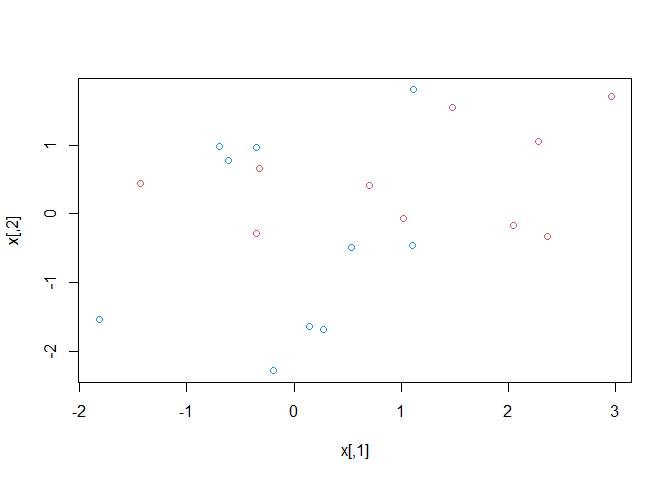<!-- -->

The classes are not linearly separable.

Fitting the support vector classifier. We must encode the response
variable as factor in order to do classification (and not regression).

``` r
data <- 
  tibble(
  x1 = x[,1],
  x2 = x[,2],
  y = as.factor(y)
)

svmfit <-
  svm(
    y ~ .,
    data = data,
    kernel = "linear",
    cost = 10,
    scale = FALSE
  )
```

`scale` argument is for scaling variables to have mean 0 and std.
deviation 1.

``` r
plot(svmfit, data)
```

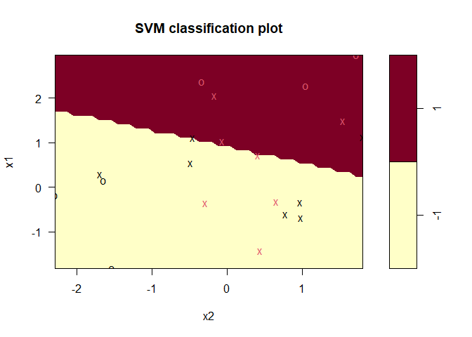<!-- -->

Support vectors are plotted as crosses and the remaining observations
are plotted as circles.

We can get the indexes of the support vectors:

``` r
svmfit$index
```

    ##  [1]  1  2  5  6  7  8 10 13 15 16 17 18 19 20

We can obtain some basic information about the support vector classifier
fit using the `summary()` command:

``` r
summary(svmfit)
```

    ## 
    ## Call:
    ## svm(formula = y ~ ., data = data, kernel = "linear", cost = 10, scale = FALSE)
    ## 
    ## 
    ## Parameters:
    ##    SVM-Type:  C-classification 
    ##  SVM-Kernel:  linear 
    ##        cost:  10 
    ## 
    ## Number of Support Vectors:  14
    ## 
    ##  ( 7 7 )
    ## 
    ## 
    ## Number of Classes:  2 
    ## 
    ## Levels: 
    ##  -1 1

This tells that there were 14 support vectors, 7 in each class.

Let’s check what happens when we use a smaller value in the cost
parameter.

``` r
svmfit2 <- svm(y ~ ., data = data, kernel = "linear", cost = 0.1,
               scale = FALSE)

plot(svmfit2, data)
```

<!-- -->

``` r
svmfit2$index
```

    ##  [1]  1  2  4  5  6  7  8  9 10 11 12 13 15 16 17 18 19 20

Now almost all the train observations are support vectors. This is
because lowering the cost parameter is equivalent to increasing the
violation budget C. We end up with model with higher bias, but lower
variance.

Unfortunately, the `svm()` function does not explicitly output the
coefficients of the linear decision boundary obtained when the support
vector classifier is fit, nor does it output the width of the margin.

We can use `tune()` for performing cross validation using a set of
parameters. By default it suses 10-fold CV

``` r
tune_out <- tune(svm,
                 y ~ .,
                 data = data,
                 kernel = "linear",
                 ranges = list(
                   cost = c(0.001, 0.01, 0.1, 1, 5, 10, 100)
                 ))

summary(tune_out)
```

    ## 
    ## Parameter tuning of 'svm':
    ## 
    ## - sampling method: 10-fold cross validation 
    ## 
    ## - best parameters:
    ##  cost
    ##    10
    ## 
    ## - best performance: 0.3 
    ## 
    ## - Detailed performance results:
    ##    cost error dispersion
    ## 1 1e-03  0.55  0.4377975
    ## 2 1e-02  0.55  0.4377975
    ## 3 1e-01  0.45  0.2838231
    ## 4 1e+00  0.35  0.3374743
    ## 5 5e+00  0.35  0.3374743
    ## 6 1e+01  0.30  0.3496029
    ## 7 1e+02  0.30  0.3496029

`cost = 100` results in the lowest CV error rate.

Accessing the best model obtained:

``` r
bestmod <- tune_out$best.model
summary(bestmod)
```

    ## 
    ## Call:
    ## best.tune(method = svm, train.x = y ~ ., data = data, ranges = list(cost = c(0.001, 
    ##     0.01, 0.1, 1, 5, 10, 100)), kernel = "linear")
    ## 
    ## 
    ## Parameters:
    ##    SVM-Type:  C-classification 
    ##  SVM-Kernel:  linear 
    ##        cost:  10 
    ## 
    ## Number of Support Vectors:  14
    ## 
    ##  ( 7 7 )
    ## 
    ## 
    ## Number of Classes:  2 
    ## 
    ## Levels: 
    ##  -1 1

We can use `predict()` to predict classes for test observations:

``` r
set.seed(2020)

xtest <- matrix(rnorm(20*2), ncol = 2)
ytest <- sample(c(-1, 1), 20, rep = TRUE)
xtest[ytest==1,] <- xtest[ytest==1,] + 1

testdat <- 
  tibble(
    x1 = xtest[,1],
    x2 = xtest[,2],
    y = ytest
  )

ypred <- predict(bestmod, testdat)

table(predict = ypred, truth = testdat$y)
```

    ##        truth
    ## predict -1 1
    ##      -1  8 3
    ##      1   0 9

Using the optimal value of `cost`, 17 of the 20 test observations are
correctly classified.

What if we used `cost = 0.01`?

``` r
svmfit3 <- svm(y ~ ., data = data, kernel = "linear",
               cost = .01, scale = FALSE)

ypred2 <- predict(svmfit3, testdat)

table(predict = ypred2, truth = testdat$y)
```

    ##        truth
    ## predict -1  1
    ##      -1  5  2
    ##      1   3 10

Now only 15 (out of 20) test observations are correctly classified.

### Two dimmensions, linearly separable

``` r
x_separable <- x
x_separable[y == 1,] <- x_separable[y == 1,] + 2.5

plot(x_separable, col = (y+5)/2, pch = 19)
```

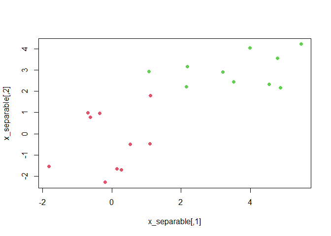<!-- -->

Now we fit the classifier using a very large value of `cost` so that no
observations are misclassified (even if we end up with few support
vectors and high variance)

``` r
data_separable <- 
  tibble(
    x1 = x_separable[,1],
    x2 = x_separable[,2],
    y = as.factor(y)
  )

svmfit4 <- svm(y ~ ., data = data_separable,
               kernel = "linear", cost = 1e5, scale = FALSE)

summary(svmfit4)
```

    ## 
    ## Call:
    ## svm(formula = y ~ ., data = data_separable, kernel = "linear", cost = 1e+05, 
    ##     scale = FALSE)
    ## 
    ## 
    ## Parameters:
    ##    SVM-Type:  C-classification 
    ##  SVM-Kernel:  linear 
    ##        cost:  1e+05 
    ## 
    ## Number of Support Vectors:  3
    ## 
    ##  ( 1 2 )
    ## 
    ## 
    ## Number of Classes:  2 
    ## 
    ## Levels: 
    ##  -1 1

``` r
plot(svmfit4, data_separable)
```

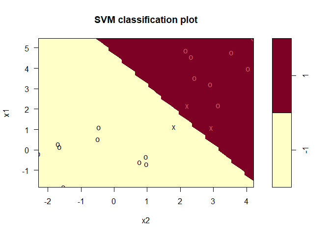<!-- -->

All the training observations are correctly classified, and we end up
with just 3 support vectors (Xs in the plot). It could be that this
model will perform poorly on test data.

Trying now with a smaller value of cost:

``` r
svmfit5 <- svm(y ~ ., data = data_separable,
               kernel = "linear", cost = 0.5, scale = FALSE)

summary(svmfit5)
```

    ## 
    ## Call:
    ## svm(formula = y ~ ., data = data_separable, kernel = "linear", cost = 0.5, 
    ##     scale = FALSE)
    ## 
    ## 
    ## Parameters:
    ##    SVM-Type:  C-classification 
    ##  SVM-Kernel:  linear 
    ##        cost:  0.5 
    ## 
    ## Number of Support Vectors:  4
    ## 
    ##  ( 2 2 )
    ## 
    ## 
    ## Number of Classes:  2 
    ## 
    ## Levels: 
    ##  -1 1

``` r
plot(svmfit5, data_separable)
```

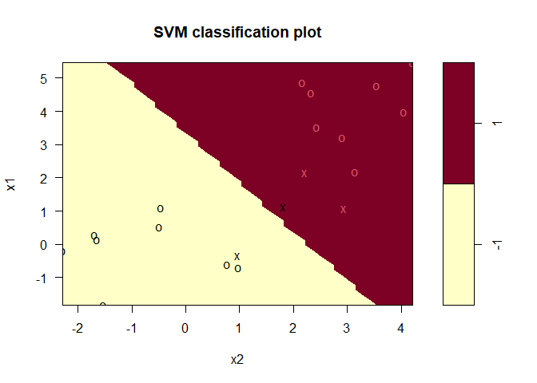<!-- -->

Now we misclassify one observations, but the margin is wider and we have
one additional support vector. This model would probably perform better
on test data.

## 9.6.2 Support Vector Machine

To use a non-linear kernel we just have to change the argument `kernel`
to `"polynomial"` or `"radial"`. In the former case we also have to
specify a `degree` and in the latter, a `gamma`.

``` r
set.seed(1989)

x_svm <- matrix(rnorm(200*2), ncol = 2)
x_svm[1:100,] <- x_svm[1:100,] + 2
x_svm[101:150,] <- x_svm[101:150,] - 2
y_svm <- c(rep(1, 150), rep(2, 50))

data_svm <- 
  tibble(
    x1 = x_svm[,1],
    x2 = x_svm[,2],
    y = as.factor(y_svm)
  )

plot(x_svm, col = y_svm)
```

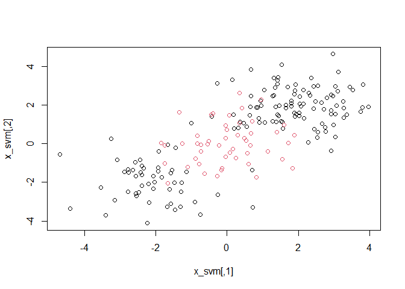<!-- -->

We see that the class boundary is indeed non-linear.

Splitting into test and train sets.

``` r
set.seed(1989)
data_svm_train <- data_svm %>% 
  sample_frac(0.5)

data_svm_test <- data_svm %>% 
  anti_join(data_svm_train)
```

    ## Joining, by = c("x1", "x2", "y")

``` r
svmfit6 <- svm(y ~ ., data = data_svm_train,
               kernel = "radial", gamma = 1,
               cost = 1)

plot(svmfit6, data_svm_train)
```

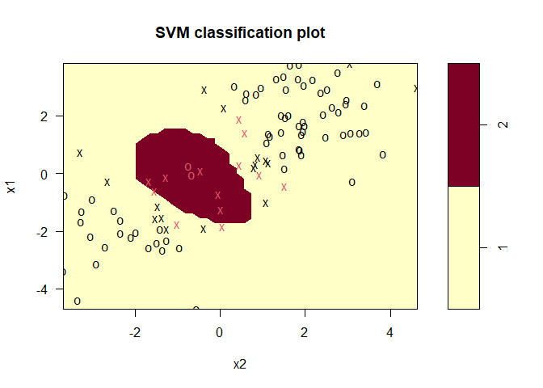<!-- -->

``` r
summary(svmfit6)
```

    ## 
    ## Call:
    ## svm(formula = y ~ ., data = data_svm_train, kernel = "radial", gamma = 1, 
    ##     cost = 1)
    ## 
    ## 
    ## Parameters:
    ##    SVM-Type:  C-classification 
    ##  SVM-Kernel:  radial 
    ##        cost:  1 
    ## 
    ## Number of Support Vectors:  30
    ## 
    ##  ( 17 13 )
    ## 
    ## 
    ## Number of Classes:  2 
    ## 
    ## Levels: 
    ##  1 2

If we increase the value of `cost`, we can reduce the number of training
errors. However, this comes at the price of a more irregular decision
boundary that seems to be at risk of overfitting the data.

``` r
svmfit7 <- svm(y ~ ., data = data_svm_train,
               kernel = "radial", gamma = 1,
               cost = 1e5)

plot(svmfit7, data_svm_train)
```

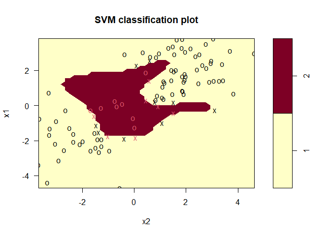<!-- -->

We can also increase `gamma` to add flexibility:

``` r
svmfit8 <- svm(y ~ ., data = data_svm_train,
               kernel = "radial", gamma = 20,
               cost = 1e5)

plot(svmfit8, data_svm_train)
```

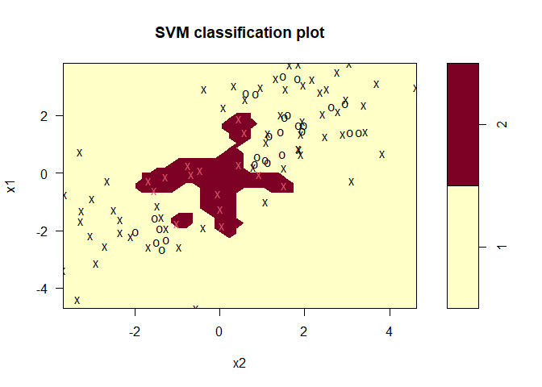<!-- -->

Using `tune()` for cross-validation of the parameters:

``` r
set.seed(1989)

tune_out_svm <- 
  tune(svm, y ~ .,
       data = data_svm_train, kernel = "radial",
       ranges = list(
         cost = c(0.1, 1, 10, 100, 1000),
         gamma = c(0.5, 1, 2, 3, 4)
       ))

summary(tune_out_svm)
```

    ## 
    ## Parameter tuning of 'svm':
    ## 
    ## - sampling method: 10-fold cross validation 
    ## 
    ## - best parameters:
    ##  cost gamma
    ##   100   0.5
    ## 
    ## - best performance: 0.07 
    ## 
    ## - Detailed performance results:
    ##     cost gamma error dispersion
    ## 1  1e-01   0.5  0.15 0.08498366
    ## 2  1e+00   0.5  0.09 0.09944289
    ## 3  1e+01   0.5  0.08 0.07888106
    ## 4  1e+02   0.5  0.07 0.08232726
    ## 5  1e+03   0.5  0.08 0.07888106
    ## 6  1e-01   1.0  0.15 0.08498366
    ## 7  1e+00   1.0  0.09 0.07378648
    ## 8  1e+01   1.0  0.10 0.08164966
    ## 9  1e+02   1.0  0.10 0.09428090
    ## 10 1e+03   1.0  0.09 0.07378648
    ## 11 1e-01   2.0  0.15 0.08498366
    ## 12 1e+00   2.0  0.10 0.10540926
    ## 13 1e+01   2.0  0.10 0.08164966
    ## 14 1e+02   2.0  0.11 0.07378648
    ## 15 1e+03   2.0  0.09 0.07378648
    ## 16 1e-01   3.0  0.15 0.08498366
    ## 17 1e+00   3.0  0.09 0.08755950
    ## 18 1e+01   3.0  0.08 0.09189366
    ## 19 1e+02   3.0  0.09 0.08755950
    ## 20 1e+03   3.0  0.09 0.08755950
    ## 21 1e-01   4.0  0.15 0.08498366
    ## 22 1e+00   4.0  0.09 0.08755950
    ## 23 1e+01   4.0  0.08 0.09189366
    ## 24 1e+02   4.0  0.09 0.08755950
    ## 25 1e+03   4.0  0.09 0.08755950

In this case, the best choice involves `cost = 100` and `gamma = 0.5`.
We can see how well it performs on test data:

``` r
table(
  true = data_svm_test$y,
  pred = predict(tune_out_svm$best.model, newdata = data_svm_test)
)
```

    ##     pred
    ## true  1  2
    ##    1 61  4
    ##    2 11 24

85% of test observations are correctly classified :)

## 9.6.3 ROC Curves

Creating function to plot ROC curve from vectors with predicted score
and actual values:

``` r
rocplot <- function(pred, truth, ...) {
  predob <- prediction(pred, truth)
  perf <- performance(predob, "tpr", "fpr")
  plot(perf, ...)
}
```

To get the fitted values for a given SVM model fit we use
`decision.values=TRUE` when fitting `svm()`. Then `predict()` will
output the fitted values:

``` r
svmfit_opt <- svm(
  y ~ .,
  data = data_svm_train,
  kernel = "radial",
  gamma = 0.5,
  cost = 100,
  decision.values = TRUE
)

fitted_svm <- attributes(
  predict(svmfit_opt, data_svm_train, decision.values = TRUE)
)$decision.values
```

Now we can produce the ROC plot:

``` r
rocplot(fitted_svm, data_svm_train$y, main = "Training Data")
```

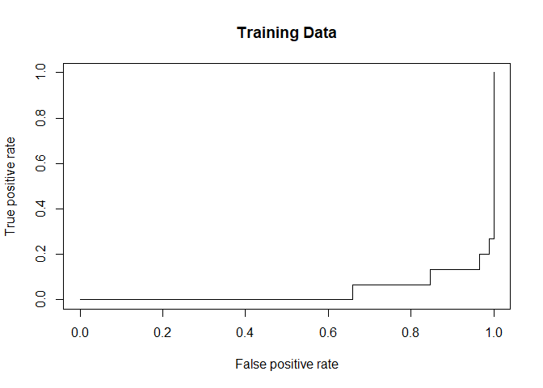<!-- -->

Trying to increase flexibility:

``` r
svmfit_flex <- svm(
  y ~ .,
  data = data_svm_train,
  kernel = "radial",
  gamma = 50,
  cost = 1,
  decision.values = TRUE
)

fitted_svm_flex <- 
  attributes(
    predict(svmfit_flex, data_svm_train, decision.values = TRUE)
  )$decision.values

rocplot(fitted_svm, data_svm_train$y, main = "Training Data")
rocplot(fitted_svm_flex, data_svm_train$y, add = TRUE, col = "red")
```

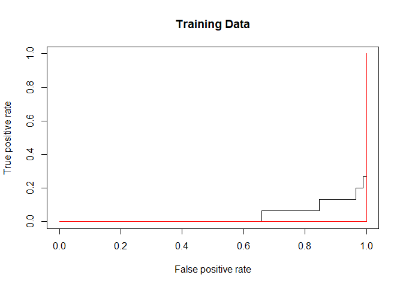<!-- -->

This looks like it has an overfitting problem. Let’s see what happens on
test data:

``` r
fitted_svm_test <- attributes(
  predict(svmfit_opt, data_svm_test, decision.values = TRUE)
)$decision.values

fitted_svm_flex_test <- attributes(
  predict(svmfit_flex, data_svm_test, decision.values = TRUE)
)$decision.values

rocplot(fitted_svm_test, data_svm_test$y, main = "Test Data")
rocplot(fitted_svm_flex_test, data_svm_test$y,
        add = TRUE, col="red")
```

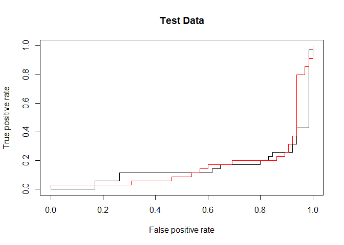<!-- -->

there are no big differences between the models.

### 9.6.4 SVM with Multiple Classes

If there are multiple classes, `svm()` will perform classification using
the one-vs-one approach.

``` r
set.seed(1989)
x_mc <- rbind(x, matrix(rnorm(50*2), ncol = 2)) #mc stands for multi-class
y_mc <- c(y, rep(0, 50))
x_mc[y==0,2] <- x_mc[y==0,2] + 2

data_mc <- 
  tibble(
    x1 = x_mc[,1],
    x2 = x_mc[,2],
    y = factor(y_mc)
  )

plot(x_mc, col = (y_mc+2))
```

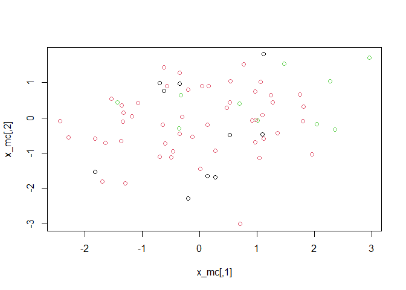<!-- -->

``` r
svmfit_mc <- 
  svm(
    y ~ .,
    data = data_mc,
    kernel = "radial",
    cost = 10,
    gamma = 5
  )

plot(svmfit_mc, data_mc)
```

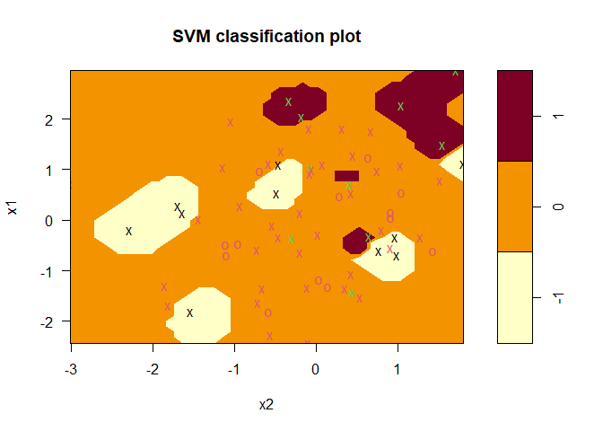<!-- --> \#\#\#
9.6.5 Application to Gene Expression Data

``` r
names(ISLR::Khan)
```

    ## [1] "xtrain" "xtest"  "ytrain" "ytest"

``` r
dim(Khan$xtrain)
```

    ## [1]   63 2308

``` r
length(Khan$ytrain)
```

    ## [1] 63

``` r
dim(Khan$xtest)
```

    ## [1]   20 2308

``` r
length(Khan$ytest)
```

    ## [1] 20

Values that the response variable can take:

``` r
table(Khan$ytrain)
```

    ## 
    ##  1  2  3  4 
    ##  8 23 12 20

There are 63 train and 20 test observations (tissue samples) with
expression measurements for 2308 genes.

We will use a support vector approach to predict cancer subtype using
gene expression measurements.

Since there are a very large number of features relative to the number
of observations we should use a linear kernel, because the additional
flexibility that will result from using a polynomial or radial kernel is
unnecessary.

``` r
data_genes <- 
  as_tibble(Khan$xtrain) %>% 
  mutate(
    y = as.factor(Khan$ytrain)
  )
```

    ## Warning: The `x` argument of `as_tibble.matrix()` must have unique column names if `.name_repair` is omitted as of tibble 2.0.0.
    ## Using compatibility `.name_repair`.
    ## This warning is displayed once every 8 hours.
    ## Call `lifecycle::last_warnings()` to see where this warning was generated.

``` r
data_genes
```

    ## # A tibble: 63 x 2,309
    ##         V1    V2     V3      V4     V5      V6    V7      V8      V9    V10
    ##      <dbl> <dbl>  <dbl>   <dbl>  <dbl>   <dbl> <dbl>   <dbl>   <dbl>  <dbl>
    ##  1  0.773  -2.44 -0.483 -2.72   -1.22   0.828   1.34  0.0570  0.134   0.565
    ##  2 -0.0782 -2.42  0.413 -2.83   -0.626  0.0545  1.43 -0.120   0.457   0.159
    ##  3 -0.0845 -1.65 -0.241 -2.88   -0.889 -0.0275  1.16  0.0157  0.192   0.497
    ##  4  0.966  -2.38  0.625 -1.74   -0.845  0.950   1.09  0.820  -0.285   0.995
    ##  5  0.0757 -1.73  0.853  0.273  -1.84   0.328   1.25  0.771   0.0309  0.278
    ##  6  0.459  -2.88  0.136  0.405  -2.08   0.138   1.73  0.396   0.0458  0.352
    ##  7  0.0671 -1.62  0.520  0.238  -1.40   0.139   1.83 -0.305  -0.0529 -1.24 
    ##  8  0.0941 -1.80  0.703  0.206  -1.87   0.288   1.41  0.760  -0.0391  0.136
    ##  9  0.108  -1.94  0.600 -0.0511 -1.98   0.119   1.85  0.238  -0.0503 -0.253
    ## 10 -0.971  -2.35 -0.392 -0.141  -1.82  -0.304   1.50 -0.206   0.145  -1.57 
    ## # ... with 53 more rows, and 2,299 more variables: V11 <dbl>, V12 <dbl>,
    ## #   V13 <dbl>, V14 <dbl>, V15 <dbl>, V16 <dbl>, V17 <dbl>, V18 <dbl>,
    ## #   V19 <dbl>, V20 <dbl>, V21 <dbl>, V22 <dbl>, V23 <dbl>, V24 <dbl>,
    ## #   V25 <dbl>, V26 <dbl>, V27 <dbl>, V28 <dbl>, V29 <dbl>, V30 <dbl>,
    ## #   V31 <dbl>, V32 <dbl>, V33 <dbl>, V34 <dbl>, V35 <dbl>, V36 <dbl>,
    ## #   V37 <dbl>, V38 <dbl>, V39 <dbl>, V40 <dbl>, V41 <dbl>, V42 <dbl>,
    ## #   V43 <dbl>, V44 <dbl>, V45 <dbl>, V46 <dbl>, V47 <dbl>, V48 <dbl>,
    ## #   V49 <dbl>, V50 <dbl>, V51 <dbl>, V52 <dbl>, V53 <dbl>, V54 <dbl>,
    ## #   V55 <dbl>, V56 <dbl>, V57 <dbl>, V58 <dbl>, V59 <dbl>, V60 <dbl>,
    ## #   V61 <dbl>, V62 <dbl>, V63 <dbl>, V64 <dbl>, V65 <dbl>, V66 <dbl>,
    ## #   V67 <dbl>, V68 <dbl>, V69 <dbl>, V70 <dbl>, V71 <dbl>, V72 <dbl>,
    ## #   V73 <dbl>, V74 <dbl>, V75 <dbl>, V76 <dbl>, V77 <dbl>, V78 <dbl>,
    ## #   V79 <dbl>, V80 <dbl>, V81 <dbl>, V82 <dbl>, V83 <dbl>, V84 <dbl>,
    ## #   V85 <dbl>, V86 <dbl>, V87 <dbl>, V88 <dbl>, V89 <dbl>, V90 <dbl>,
    ## #   V91 <dbl>, V92 <dbl>, V93 <dbl>, V94 <dbl>, V95 <dbl>, V96 <dbl>,
    ## #   V97 <dbl>, V98 <dbl>, V99 <dbl>, V100 <dbl>, V101 <dbl>, V102 <dbl>,
    ## #   V103 <dbl>, V104 <dbl>, V105 <dbl>, V106 <dbl>, V107 <dbl>, V108 <dbl>,
    ## #   V109 <dbl>, V110 <dbl>, ...

``` r
svm_genes <- 
  svm(
    y ~ ., 
    data = data_genes,
    kernel = "linear",
    cost = 10
  )

summary(svm_genes)
```

    ## 
    ## Call:
    ## svm(formula = y ~ ., data = data_genes, kernel = "linear", cost = 10)
    ## 
    ## 
    ## Parameters:
    ##    SVM-Type:  C-classification 
    ##  SVM-Kernel:  linear 
    ##        cost:  10 
    ## 
    ## Number of Support Vectors:  58
    ## 
    ##  ( 20 20 11 7 )
    ## 
    ## 
    ## Number of Classes:  4 
    ## 
    ## Levels: 
    ##  1 2 3 4

``` r
table(predicted = svm_genes$fitted, truth = data_genes$y)
```

    ##          truth
    ## predicted  1  2  3  4
    ##         1  8  0  0  0
    ##         2  0 23  0  0
    ##         3  0  0 12  0
    ##         4  0  0  0 20

There are no training errors, which is not surprising since there is
high dimensionality. Let’s check how the model performs on test data:

``` r
data_test_genes <- 
  as_tibble(Khan$xtest) %>% 
  mutate(y = as.factor(Khan$ytest))

pred_test_genes <- predict(svm_genes, data_test_genes)

table(predict = pred_test_genes, truth = data_test_genes$y)
```

    ##        truth
    ## predict 1 2 3 4
    ##       1 3 0 0 0
    ##       2 0 6 2 0
    ##       3 0 0 4 0
    ##       4 0 0 0 5

We see that using `cost=10` yields two test set errors on this data.
