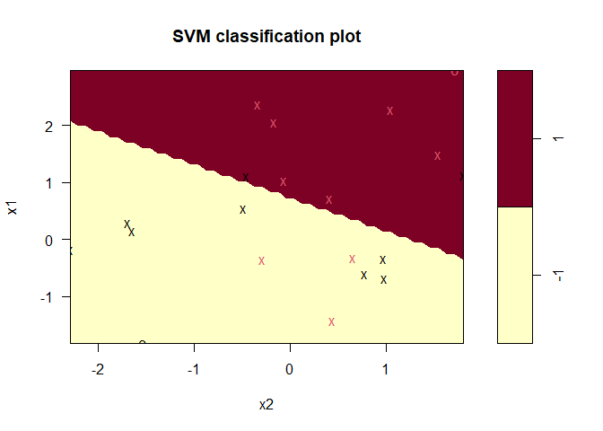

9.6 Lab: Support Vector Machines
================

``` r
library(tidyverse)
library(e1071)
```

## 9.6.1 Support Vector Classifier

`e1071::svm` allows to fit a support vector classifier when using
`kernel="linear"`. Instead of setting a “budget” for violations of the
margins, it uses a `cost` parameter.

### Two-dimensions, not linearly separable

``` r
set.seed(1989)
x <- matrix(rnorm(20*2), ncol = 2)
y <- c(rep(-1, 10), rep(1, 10))

# mean shifting rows based on the assigned class
x[y==1,] <- x[y==1,] + 1

plot(x, col = (3-y))
```

<!-- -->

The classes are not linearly separable.

Fitting the support vector classifier. We must encode the response
variable as factor in order to do classification (and not regression).

``` r
data <- 
  tibble(
  x1 = x[,1],
  x2 = x[,2],
  y = as.factor(y)
)

svmfit <-
  svm(
    y ~ .,
    data = data,
    kernel = "linear",
    cost = 10,
    scale = FALSE
  )
```

`scale` argument is for scaling variables to have mean 0 and std.
deviation 1.

``` r
plot(svmfit, data)
```

<!-- -->

Support vectors are plotted as crosses and the remaining observations
are plotted as circles.

We can get the indexes of the support vectors:

``` r
svmfit$index
```

    ##  [1]  1  2  5  6  7  8 10 13 15 16 17 18 19 20

We can obtain some basic information about the support vector classifier
fit using the `summary()` command:

``` r
summary(svmfit)
```

    ## 
    ## Call:
    ## svm(formula = y ~ ., data = data, kernel = "linear", cost = 10, scale = FALSE)
    ## 
    ## 
    ## Parameters:
    ##    SVM-Type:  C-classification 
    ##  SVM-Kernel:  linear 
    ##        cost:  10 
    ## 
    ## Number of Support Vectors:  14
    ## 
    ##  ( 7 7 )
    ## 
    ## 
    ## Number of Classes:  2 
    ## 
    ## Levels: 
    ##  -1 1

This tells that there were 14 support vectors, 7 in each class.

Let’s check what happens when we use a smaller value in the cost
parameter.

``` r
svmfit2 <- svm(y ~ ., data = data, kernel = "linear", cost = 0.1,
               scale = FALSE)

plot(svmfit2, data)
```

<!-- -->

``` r
svmfit2$index
```

    ##  [1]  1  2  4  5  6  7  8  9 10 11 12 13 15 16 17 18 19 20

Now almost all the train observations are support vectors. This is
because lowering the cost parameter is equivalent to increasing the
violation budget C. We end up with model with higher bias, but lower
variance.

Unfortunately, the `svm()` function does not explicitly output the
coefficients of the linear decision boundary obtained when the support
vector classifier is fit, nor does it output the width of the margin.

We can use `tune()` for performing cross validation using a set of
parameters. By default it suses 10-fold CV

``` r
tune_out <- tune(svm,
                 y ~ .,
                 data = data,
                 kernel = "linear",
                 ranges = list(
                   cost = c(0.001, 0.01, 0.1, 1, 5, 10, 100)
                 ))

summary(tune_out)
```

    ## 
    ## Parameter tuning of 'svm':
    ## 
    ## - sampling method: 10-fold cross validation 
    ## 
    ## - best parameters:
    ##  cost
    ##    10
    ## 
    ## - best performance: 0.3 
    ## 
    ## - Detailed performance results:
    ##    cost error dispersion
    ## 1 1e-03  0.55  0.4377975
    ## 2 1e-02  0.55  0.4377975
    ## 3 1e-01  0.45  0.2838231
    ## 4 1e+00  0.35  0.3374743
    ## 5 5e+00  0.35  0.3374743
    ## 6 1e+01  0.30  0.3496029
    ## 7 1e+02  0.30  0.3496029

`cost = 100` results in the lowest CV error rate.

Accessing the best model obtained:

``` r
bestmod <- tune_out$best.model
summary(bestmod)
```

    ## 
    ## Call:
    ## best.tune(method = svm, train.x = y ~ ., data = data, ranges = list(cost = c(0.001, 
    ##     0.01, 0.1, 1, 5, 10, 100)), kernel = "linear")
    ## 
    ## 
    ## Parameters:
    ##    SVM-Type:  C-classification 
    ##  SVM-Kernel:  linear 
    ##        cost:  10 
    ## 
    ## Number of Support Vectors:  14
    ## 
    ##  ( 7 7 )
    ## 
    ## 
    ## Number of Classes:  2 
    ## 
    ## Levels: 
    ##  -1 1

We can use `predict()` to predict classes for test observations:

``` r
set.seed(2020)

xtest <- matrix(rnorm(20*2), ncol = 2)
ytest <- sample(c(-1, 1), 20, rep = TRUE)
xtest[ytest==1,] <- xtest[ytest==1,] + 1

testdat <- 
  tibble(
    x1 = xtest[,1],
    x2 = xtest[,2],
    y = ytest
  )

ypred <- predict(bestmod, testdat)

table(predict = ypred, truth = testdat$y)
```

    ##        truth
    ## predict -1 1
    ##      -1  8 3
    ##      1   0 9

Using the optimal value of `cost`, 17 of the 20 test observations are
correctly classified.

What if we used `cost = 0.01`?

``` r
svmfit3 <- svm(y ~ ., data = data, kernel = "linear",
               cost = .01, scale = FALSE)

ypred2 <- predict(svmfit3, testdat)

table(predict = ypred2, truth = testdat$y)
```

    ##        truth
    ## predict -1  1
    ##      -1  5  2
    ##      1   3 10

Now only 15 (out of 20) test observations are correctly classified.

### Two dimmensions, linearly separable

``` r
x_separable <- x
x_separable[y == 1,] <- x_separable[y == 1,] + 2.5

plot(x_separable, col = (y+5)/2, pch = 19)
```

<!-- -->

Now we fit the classifier using a very large value of `cost` so that no
observations are misclassified (even if we end up with few support
vectors and high variance)

``` r
data_separable <- 
  tibble(
    x1 = x_separable[,1],
    x2 = x_separable[,2],
    y = as.factor(y)
  )

svmfit4 <- svm(y ~ ., data = data_separable,
               kernel = "linear", cost = 1e5, scale = FALSE)

summary(svmfit4)
```

    ## 
    ## Call:
    ## svm(formula = y ~ ., data = data_separable, kernel = "linear", cost = 1e+05, 
    ##     scale = FALSE)
    ## 
    ## 
    ## Parameters:
    ##    SVM-Type:  C-classification 
    ##  SVM-Kernel:  linear 
    ##        cost:  1e+05 
    ## 
    ## Number of Support Vectors:  3
    ## 
    ##  ( 1 2 )
    ## 
    ## 
    ## Number of Classes:  2 
    ## 
    ## Levels: 
    ##  -1 1

``` r
plot(svmfit4, data_separable)
```

<!-- -->

All the training observations are correctly classified, and we end up
with just 3 support vectors (Xs in the plot). It could be that this
model will perform poorly on test data.

Trying now with a smaller value of cost:

``` r
svmfit5 <- svm(y ~ ., data = data_separable,
               kernel = "linear", cost = 0.5, scale = FALSE)

summary(svmfit5)
```

    ## 
    ## Call:
    ## svm(formula = y ~ ., data = data_separable, kernel = "linear", cost = 0.5, 
    ##     scale = FALSE)
    ## 
    ## 
    ## Parameters:
    ##    SVM-Type:  C-classification 
    ##  SVM-Kernel:  linear 
    ##        cost:  0.5 
    ## 
    ## Number of Support Vectors:  4
    ## 
    ##  ( 2 2 )
    ## 
    ## 
    ## Number of Classes:  2 
    ## 
    ## Levels: 
    ##  -1 1

``` r
plot(svmfit5, data_separable)
```

<!-- -->

Now we misclassify one observations, but the margin is wider and we have
one additional support vector. This model would probably perform better
on test data.

## 9.6.2 Support Vector Machine

To use a non-linear kernel we just have to change the argument `kernel`
to `"polynomial"` or `"radial"`. In the former case we also have to
specify a `degree` and in the latter, a `gamma`.

``` r
set.seed(1989)

x_svm <- matrix(rnorm(200*2), ncol = 2)
x_svm[1:100,] <- x_svm[1:100,] + 2
x_svm[101:150,] <- x_svm[101:150,] - 2
y_svm <- c(rep(1, 150), rep(2, 50))

data_svm <- 
  tibble(
    x1 = x_svm[,1],
    x2 = x_svm[,2],
    y = y_svm
  )

plot(x_svm, col = y_svm)
```

<!-- -->

We see that the class boundary is indeed non-linear.

Splitting into test and train sets.

``` r
data_svm_train <- data_svm %>% 
  sample_frac(0.5)

data_svm_test <- data_svm %>% 
  anti_join(data_svm_train)
```

    ## Joining, by = c("x1", "x2", "y")

``` r
svmfit6 <- svm(y ~ ., data = data_svm_train,
               kernel = "radial", gamma = 1,
               cost = 1, scale = FALSE)

plot(svmfit6, data_svm_train)
```
